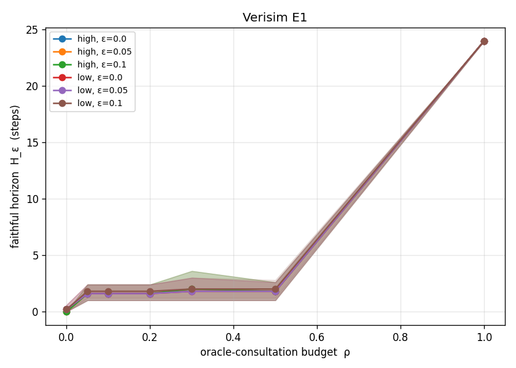

# Verisim

**Oracle-grounded, neuro-symbolic world models of computer environments.**

Generative world models (Genie 3, V-JEPA 2, Cosmos) all hit the same wall:
long-horizon error accumulation and faithfulness, with no cheap way to detect or
correct drift, because physical and visual worlds have no ground-truth oracle.
Verisim's claim is that **computer environments are the exception** — filesystems,
processes, networks, and APIs are digital, deterministic, and fully checkable, so
a deterministic oracle can be placed in the loop to bound a neural world model's
drift. Verisim builds that loop and measures the central tradeoff nobody else can
measure: **how much oracle consultation buys how much faithful horizon.**

- **The science:** [SPEC.md](./SPEC.md) — why the project exists, what it claims,
  and how we would know if we were wrong.
- **The build:** [SPEC-2.md](./SPEC-2.md) — the concrete v0 environment, oracle,
  model, metrics, baselines, repo layout, and milestones.
- **Semantics:** [docs/semantics.md](./docs/semantics.md) — the normative
  description of the v0 shell/filesystem command semantics (paired with the
  reference oracle, which is the executable truth).

## Status

Pre-experiment (v0). The deterministic foundation — milestones **M0–M3** of
SPEC-2 §13 — is implemented and tested:

| Milestone | What | Status |
|-----------|------|--------|
| **M0** | Env (state, command grammar, canonical serialization) + `ReferenceOracle` | ✅ |
| **M1** | `Delta` types, `apply(state, delta)`, delta↔serialization | ✅ |
| **M2** | Drivers, trajectory JSONL, versioned manifests/splits | ✅ |
| **M3** | Divergence `d(s,ŝ)`, faithful horizon `H_ε`, run-record schema | ✅ |
| **M5** | Propose–verify–correct loop: `fixed` policy + `hard_reset` operator + baselines (b2/b3) | ✅ |
| **M4** | Neural world model `M_θ`: tokenizer, from-scratch transformer, constrained decoder, supervised training | ✅ |
| **M6** | E1 — the `H_ε(ρ)` curve: sweep harness + bootstrap-CI aggregation + figure (curve plotted; tuning ongoing) | ◐ |
| M7 | Smart policies (`drift`/`uncertainty`) + operators (`residual`/`projection`) | ⬜ |

M0–M3 plus the M5 loop are the deterministic core; they have **no runtime
dependencies** and need no GPU. The propose–verify–correct loop is built
model-agnostically, so the learned model `M_θ` (M4) — a from-scratch decoder-only
transformer that predicts structured deltas under grammar-constrained decoding —
drops straight into the loop via `NeuralWorldModel`. PyTorch is an optional
`[model]` extra (see [docs/model-representation.md](./docs/model-representation.md)
for the tokenization/representation decisions).

### The headline result (E1)

The whole point of v0 is to plot `H_ε(ρ)` — faithful horizon vs. oracle-consultation
budget — once, cleanly (SPEC-2 §9). The reproducible pipeline is in place:

```bash
python -m verisim.experiments.e1 --config configs/e1.json --out runs/e1/records.jsonl
python figures/plot_e1.py --records runs/e1/records.jsonl   # -> figures/e1_curve.{png,csv}
```



The figure and its CSV are generated *only* from run-records (regenerable from the
config + seeds). **Honest status:** with the small, fast committed config the curve
shows `H_ε≈0` at ρ=0 and `H_ε=T` at ρ=1 with an interior near the floor — i.e. it
does **not** yet show H1's favorable knee. That is a reportable result, not a
failure (SPEC.md §9); making the interior informative is a model-capacity /
difficulty tuning problem ([SPEC-2 §17.5](./SPEC-2.md)) and is the continuing M6
work.

## Quickstart

```bash
python3.11 -m venv .venv && source .venv/bin/activate
pip install -e ".[dev,model]"   # ".[dev]" alone skips the torch-based M4 tests
pytest            # property tests, semantics goldens, metric/loop/model tests
ruff check .      # lint
mypy              # strict type-check
```

```python
from verisim.env import State, parse_action
from verisim.oracle import ReferenceOracle
from verisim.delta import apply

oracle = ReferenceOracle()
state = State.empty()
for cmd in ["mkdir /a", "write /a/f alpha", "mv /a /b", "cat /b/f"]:
    result = oracle.step(state, parse_action(cmd))
    # apply(state, result.delta) == result.state, by construction (the M1 invariant)
    assert apply(state, result.delta).fs == result.state.fs
    state = result.state
```

## Layout

See [SPEC-2.md §10](./SPEC-2.md). The implemented packages live under
[src/verisim/](src/verisim/): `env/`, `oracle/`, `delta/`, `data/`, `metrics/`,
`loop/` (the propose–verify–correct runner, policies, operators, baseline
models), `experiments/` (the baseline sweep and E1), `model/` (the learned model `M_θ`:
vocab, tokenizer, grammar, transformer, constrained decoder), and `train/`
(Stage-1 supervised training). The E1 config lives in [configs/](configs/) and the
plotting script + figure in [figures/](figures/).

## License & posture

MIT (see [LICENSE](./LICENSE)). This is a research repo: **no telemetry, no
network calls at runtime, no commercial path.** The framing and downstream agents
are defensive; see [SPEC.md §13](./SPEC.md) for the ethics and dual-use posture.

Author: Clay Good.
