# Verisim

> **The claim.** Every other domain trains world models against *proxies* for truth — a fixed
> corpus, a human annotator, a hackable reward. **Computer environments are the one exception:
> filesystems, processes, networks, and APIs are digital, deterministic, and fully checkable, so a
> deterministic *oracle* can return the exact next state for free, at every step.** Verisim is the
> research program built around that single asymmetry — putting an oracle *in the loop* to bound a
> neural world model's drift, and measuring the tradeoff nobody else can measure: **how much oracle
> consultation buys how much faithful horizon.** The world model is a pluggable proposer (transformer,
> JEPA/RSSM, or a frozen LLM), so the real bet is a *method*, not a model: **deterministic verification
> as a model-agnostic primitive for probabilistic ML** — the layer underneath the world-model race, not
> another entrant in it.

## Why this isn't RLVR — and why it isn't redundant

The obvious objection: *"deterministic verifiers grounding probabilistic models — isn't that just
RLVR (verifiable rewards)?"* No. RLVR and verisim use the **same kind of verifier at opposite ends
of one axis: how much of the oracle's signal you actually use.** A verifier always holds the *exact*
truth — it must, to grade (`expected 5, got 7`). RLVR reads **one bit** off it (right/wrong), as a
**terminal** reward, at **training** time, and throws the rest away.

| | RLVR (verifiable rewards) | Verisim |
|---|---|---|
| signal used | a **scalar** reward (right/wrong) | the **exact next state**, bit-for-bit |
| when consulted | terminal — the final output | **in the loop**, every step, on a budget `ρ` |
| what the oracle does | updates weights | **corrects drift at runtime** + labels training data + branches counterfactuals |
| consulted at | training time only | training **and** inference |

RLVR collapses to a scalar because in its native domains (math, code-as-text) the *intermediate*
states aren't oracle-defined — there is no unique "correct next reasoning token," so only the endpoint
is checkable. **Computer-state worlds remove exactly that limit:** the state after `mkdir /a` is one
thing, exactly checkable, and so is every step after it. That single asymmetry is what lets verisim do
what RLVR structurally cannot — teacher-force the exact next state, correct mid-rollout, partition the
decidable bits from the genuine residual, and re-run actions *not taken* for free. **RLVR is the
minimum-bandwidth point on an axis whose entire interior is unexplored and measurable.** Verisim draws
the curve.

## The gradient it predicts

If faithfulness scales with oracle bandwidth, then how reliably headless AI works in a domain should
track *how good a deterministic oracle that domain admits* — and it does:

| oracle character | domain | headless AI today |
|---|---|---|
| total · exact · free · every step | computer state (fs / proc / net), SQL, types, config, IaC | **works** — this is enterprise headless SDLC |
| endpoint-only · exact | math answer, "the tests pass" | works *at the endpoint* — RLVR's home |
| approximate · partial | physics, robotics, video dynamics | struggles |
| absent | image aesthetics, audio timbre, open prose | "looks plausible" is the ceiling |

Computer worlds are the **one** place you can turn the oracle up and down *continuously* (that is what
`ρ` and the tiered oracle are) and watch faithfulness move with everything else held fixed — the
dose-response no other domain can measure. So verisim is best read as an **instrument**: it measures
the dose-response of verification in the one laboratory clean enough to measure it, and reports what
the proxy metrics everyone else uses cannot see (a bigger, per-step-*more*-accurate model that is
*less* faithful over the horizon — [§2](#2-but-better-one-step-prediction-does-not-yet-buy-free-running-horizon-the-honest-negative),
[HS1.1](#results-at-a-glance)). The figures below are that instrument's readings.

## Results at a glance

Thirty-nine committed, oracle-grounded figures — the smoke-scale bet in one screen — each detailed below, each
with its honest negative, now joined by the **SPEC-11 system-oracle validation** ([§35](#35-the-oracle-is-faithful-to-a-real-computer--the-one-structural-bet-measured-spec-11--sy1--h27)) — *the figure that retires W1*: the program's load-bearing assumption (a free, exact oracle exists for computer worlds) measured against a **real `/bin/sh` on a real kernel**, bit-for-bit. **Two one-figure theses frame the rest: the cross-*world* synthesis ([§22](#22-the-thesis-in-one-figure-the-floorcliff-is-the-same-in-every-world-cross-world-synthesis)) — the floor+cliff `H_ε(ρ)` is the *same shape in all four worlds* — and the cross-*proposer* synthesis ([§34](#34-the-spec-10-capstone-the-floor-is-proposer-dependent-cross-proposer-synthesis)) — whether that floor is a *resourcing artifact* depends on the proposer.** **What survives scaling is the real verdict: see [§8](#8-which-wins-survive-scaling--the-honest-mixed-verdict-spec-9).** **The active-priority arc lands two headlines on *one real trained model*: the flagship `H_ε(ρ)` curve where smart scheduling nearly doubles the clock ([§43](#43-the-flagship-one-real-trained-model-the-whole-stack-one-headline-curve-spec-19--fl0fl6--h69h72)), and the usefulness proof — a defender trained *inside* the model, the boundary law (faithfulness is load-bearing exactly where control keys on the content the model drifts on), and the *useful knee* that buys that faithfulness at half the oracle calls ([§44](#44-the-usefulness-proof-the-boundary-law-and-the-useful-knee-spec-20--ua0ua12--h73h92)).** **And [§45](#45-scaling-the-boundary-into-a-law--the-cpu-proven-core-spec-21--cp0cp5--h87h91) scales that boundary into a *law*: a CPU-proven / GPU-ready pipeline sweeping it through the capacity ladder on a verifiable computer-use environment — the structure→content gap gradient holds at every rung, the cheap drift forecasts it at Spearman +0.965, the law is **anchor-invariant against a real `/bin/sh`** (the load-bearing gap is `gap_sys == gap_ref` bit-for-bit, CS3/H90), and the `verisim-cue` scorecard is **discriminative** (it stably ranks computer-use world-models by faithfulness, Kendall τ = +1.000, CL1/H91), and the wide-ladder headline is one GPU config-swap away.** Every number regenerates from
config + seeds (`bash figures/reproduce.sh`).

| | |
|---|---|
| [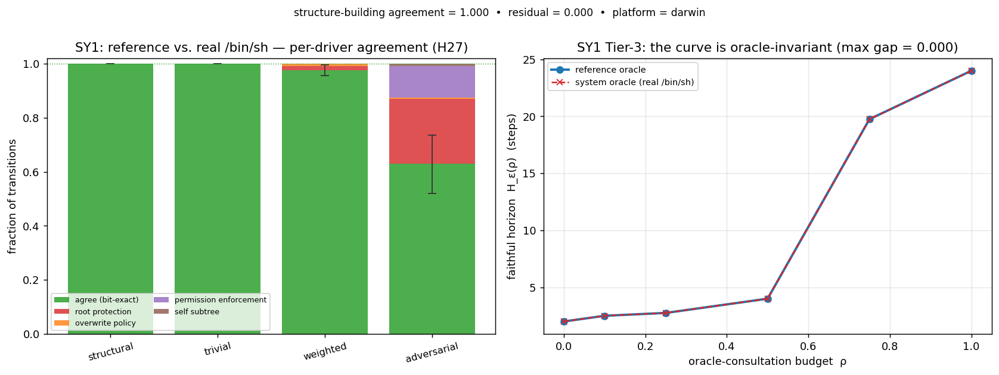](figures/sy1_agreement.png)<br>**The one structural bet, measured against reality (SPEC-11 / SY1 / H27).** Every figure here proves the loop against a *from-scratch reference model* of POSIX — the program's central exposure (W1: "the oracle is a model, not reality"). SY1 closes it: run the exact v0 grammar against a **real `/bin/sh` on a real kernel** in a hermetic sandbox and compare bit-for-bit. On the **structure-building grammar** the reference oracle's predicted next state equals the real kernel's at **agreement = 1.000** (left, the green bars; degenerate CI), and the head-to-head `H_ε(ρ)` curve is **oracle-invariant** (right, max gap = 0.000) — *the oracle substitution is transparent where v0 claims fidelity.* The disagreement branch is a gift (H28): the harness **caught a real reference bug** (subtree-move, now fixed) and every remaining divergence is one of **four named, intentional modeling boundaries** with **residual = 0**. Built macOS-first; the headline is pure POSIX, so it reproduces on Linux CI. "Computer worlds have a free, perfect oracle" stops being an argument and becomes a committed CSV. | [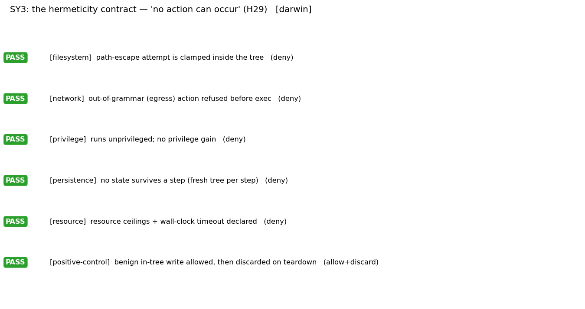](figures/sy3_hermeticity.png)<br>**Proven safe before any number is claimed (SPEC-11 / SY3 / H29).** The agreement figure is only meaningful if the sandbox is a *closed system*. SY3 is the negative-control battery with teeth: every prohibited action — filesystem escape, network egress, privilege gain, cross-step persistence — is **denied**, and the benign positive control is allowed-then-discarded. "No action can occur" made into a green table. With SY4 (the system oracle is bit-reproducible under its determinism seal), this is the gate *on* the agreement claim — prove the checks have teeth before reporting what they catch. |
| [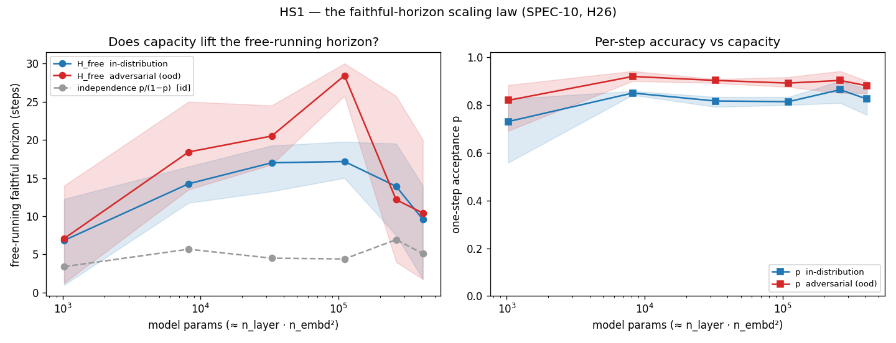](figures/horizon_scaling_xl.png)<br>**Faithful horizon is *non-monotone* in capacity — and the one-step metric can't see it (SPEC-10 / HS1.1 / H26).** Hold the world fixed, sweep model capacity ~400× with an adequate coverage set, and measure free-running faithful horizon `H_ε(ρ=0)` *exactly* against the oracle. It **rises to a compute-optimal peak at `l` (17 id / 28 ood steps)** then **declines** (xxl 9.6) — a Chinchilla-style frontier, but for long-horizon *faithfulness*, not test loss. The headline: across the whole top end the per-step accuracy `p` any normal world-model paper reports stays **flat and high** (0.81–0.90), while the *exact* horizon **falls ~45%** and ood efficiency `η` **crosses below 1** — **a bigger, per-step-more-accurate model that is *less faithful over the horizon*, a divergence only the free exact oracle reveals.** (And the floor itself lifts ~4× from *resourcing alone*: `xs` 1.75 → 6.83.) The data cross-axis (HS1.2) then shows that decline is **data starvation, not a wall** — at fixed `xl`, feeding 2× the data recovers `H_free` 13.9 → 16.2 and ood η from 0.97 back to 1.90, the Chinchilla prescription made exact: once capacity is adequate, the lever is data, and only the oracle could diagnose it (`p` stays flat while the horizon recovers). The joint push (HS1.3) then scales **both** levers together: it lifts the peak to a **program-best `l@9.6k` = 19.2 id / 28.75 ood** (tight, disjoint CIs) but returns vanish past `l` — so the floor+cliff resolves into a **resourcing story with a measurable compute-optimal frontier**, not a fundamental compounding wall, all measured exactly against the oracle. | [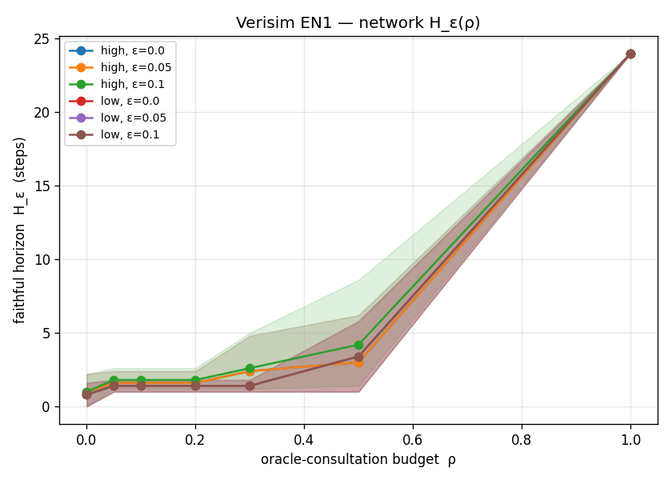](figures/en1_curve.png)<br>**The floor HS1 revises (EN1 / K4 / H8).** Faithful horizon vs consultation budget `H_ε(ρ)` was flat-then-cliff on every world at the committed (tiny) scale: the honest negative that drove every later design choice. HS1/HS1.1 show the *height* of that `ρ=0` floor is not fixed — it scales with capacity+data, then *declines* once capacity outruns the data — which sharpens what this curve does and does not show: a property of the *consultation* axis at fixed model, not a ceiling on what a larger model can free-run. |
| [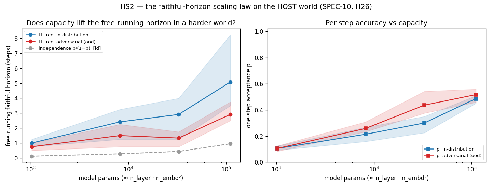](figures/horizon_host_scaling.png)<br>**The capacity lift is *universal* — and a harder world re-lowers the floor (SPEC-10 / HS2 / H26).** Re-run the *identical* HS1 capacity axis on the harder **host** world (SPEC-6: the composed process/fd/filesystem/exit bundle) and the verdict survives the world swap: free-running `H_free` scales **monotonically** with capacity (id **1.00 → 5.08** over 108× params, **disjoint CIs** xs vs l). So "capacity buys horizon" is a property of the oracle *loop*, not the easy network world. But the richer host dynamics do exactly what HS1 predicted: they **re-lower the floor ~3–5×** (host `l` 5.08 vs network `l` 15.7) and the curve **has not saturated by `l`** (the network saturated by `m`) — a harder world both lowers the floor and re-opens the headroom. The host one-step `p` is far lower (0.11 → 0.49 vs network's 0.47 → 0.79) — a genuinely harder per-step target — and `η`, though > 1 throughout, **declines toward 1 with capacity** here (the mirror of the network's rising `η`). **World difficulty sets the floor height and the peak location; the capacity-buys-horizon verdict is cross-world.** | [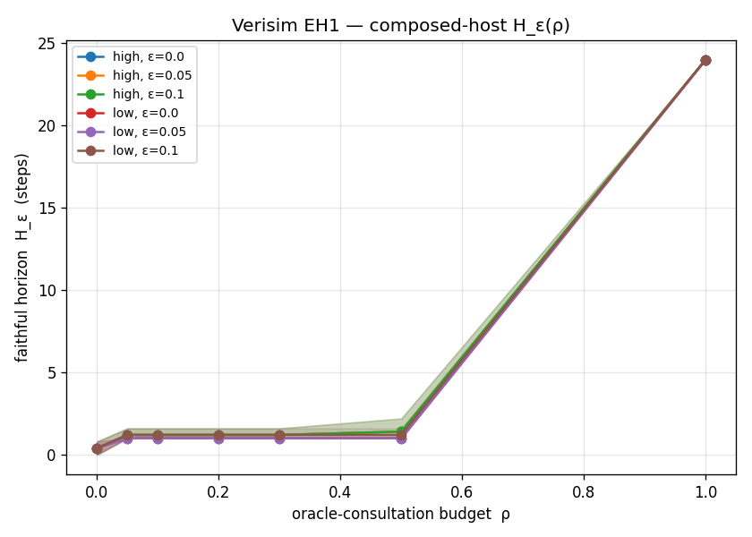](figures/eh1_curve.png)<br>**The host floor HS2 scales (EH1 / HC6).** The composed-host `H_ε(ρ)` is the same flat-then-cliff as the filesystem and network worlds — `ρ=0` drifts in <1 step at the committed tiny scale. HS2 shows the *height* of that host `ρ=0` floor lifts with capacity (xs 1.0 → l 5.1 free-running steps), just as HS1 showed for the network — but stays well below the network's, because the composed bundle is the harder world. |
| [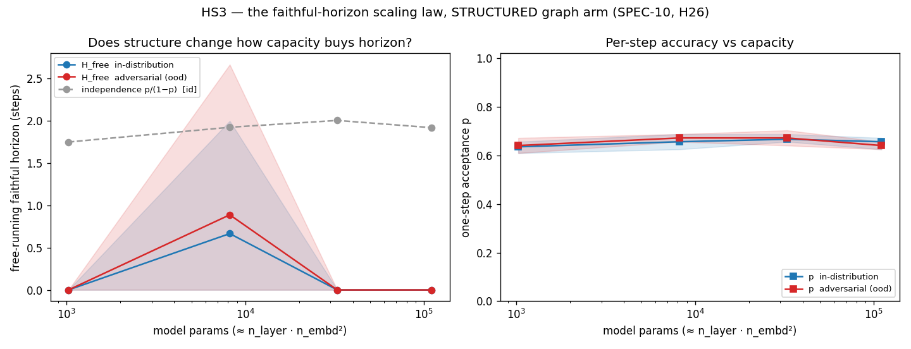](figures/horizon_graph_scaling.png)<br>**The capacity lift is *proposer-dependent* — it does NOT reproduce for the structured arm (SPEC-10 / HS3 / H26).** Re-run the *identical* HS1 axis with the **GNN+RSSM graph arm** — the proposer that *beats* the flat arm ~6.6× on one-step delta-exact (EN4/H11) — and the verdict flips: for the graph arm capacity buys **neither** per-step accuracy **nor** horizon. `p` is **flat** (0.64 → 0.66, vs the flat arm's 0.47 → 0.82 climb) and `H_free` is **≈ 0 at every capacity** (η ≈ 0) — the floor+cliff in its purest, capacity-invariant form. So **HS1's lift was the flat arm's specific p-vs-capacity climb crossing the self-stabilization threshold, not a universal loop property.** The graph arm makes *near-but-not-exact* predictions (an ε-sweep gives `H_free`=0 up to ε=0.1, only 4–6 steps at ε=0.2) — small but ubiquitous errors the flat arm's self-stabilizing rollout avoided. Honest caveat: the graph trainer plateaus at p≈0.66 < the flat arm's 0.82, and the arm's *flat* p says it is **data-limited, not capacity-limited** (its lever is data, the HS1.2 reading). Consistent with EN7/H22: the loop governs the shape, the proposer's competence sets whether it escapes the floor. | [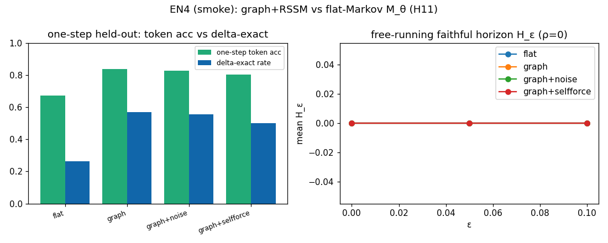](figures/en4_graph_vs_flat.png)<br>**Why HS3 is the sharp foil (EN4 / H11).** The graph arm *wins* on the one-step metric a normal paper reports — +16.5 pts token accuracy, +30.6 pts delta-exact over the flat arm. HS3 is the catch the oracle exposes: that per-step win **does not** convert to free-running horizon (`H_free`≈0), and capacity doesn't fix it. The metric that wins (delta-exact) and the metric that matters (exact free-running horizon) come apart — exactly the proxy/truth divergence the whole program is built to measure. |
| [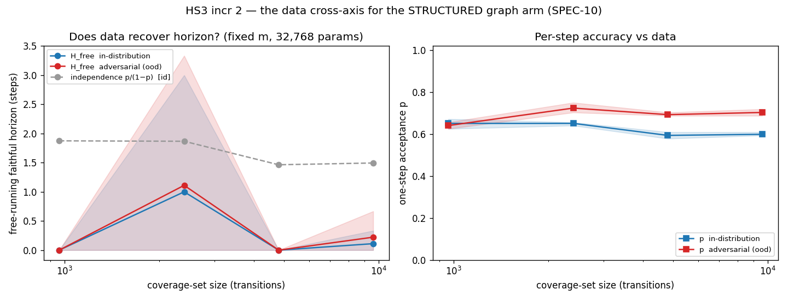](figures/horizon_graph_data_scaling.png)<br>**The structured floor is *not* data starvation — a genuine ceiling (SPEC-10 / HS3 incr 2 / H26).** HS3 left a confound: the graph arm's flat `p` looks *data*-limited, so — exactly as HS1.2 was for the flat arm — hold graph capacity fixed and sweep the coverage set 960 → 9,600 transitions. A **10× data increase does NOT lift `H_free`** (≈0 throughout) or `p` (flat ~0.6) — the *opposite* of the flat arm, whose HS1.2 floor *recovered* with data (7.7 → 16.2). And **η stays below 1** (0.00–0.52): unlike the flat arm (η>1, self-stabilizing), the graph arm free-runs **shorter** than its i.i.d. prediction — its near-but-not-exact errors **compound**, the genuine compounding wall H26 pre-registered. **Net across HS3: the structured floor moves with *neither* capacity nor data — the first floor in the program that does not dissolve into resourcing.** So "the floor+cliff is a resourcing story" is itself proposer-dependent (under-resourcing for the flat arm; a genuine ceiling for the structured one). Honest caveat: the graph trainer plateaus at p≈0.6 and p doesn't climb with data, so the binding constraint is plausibly the trainer/representation, not data per se. | [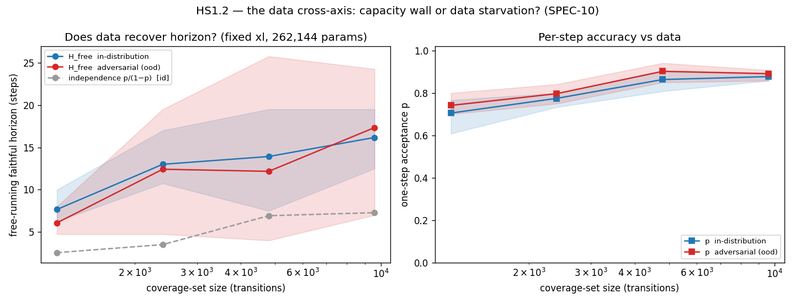](figures/horizon_data_scaling.png)<br>**The contrast that makes HS3 incr 2 sharp (HS1.2 / H26).** For the **flat** arm, the same data cross-axis was a *recovery*: at fixed `xl` capacity, feeding 2× the data lifted `H_free` 13.9 → 16.2 and ood η from 0.97 back to 1.90 — the floor *was* data starvation (Chinchilla). The structured arm (left) shows the opposite on the identical axis: data buys nothing. Same experiment, two proposers, opposite verdicts — which is exactly why "is the floor a resourcing artifact?" has no single answer: it depends on the proposer. |
| [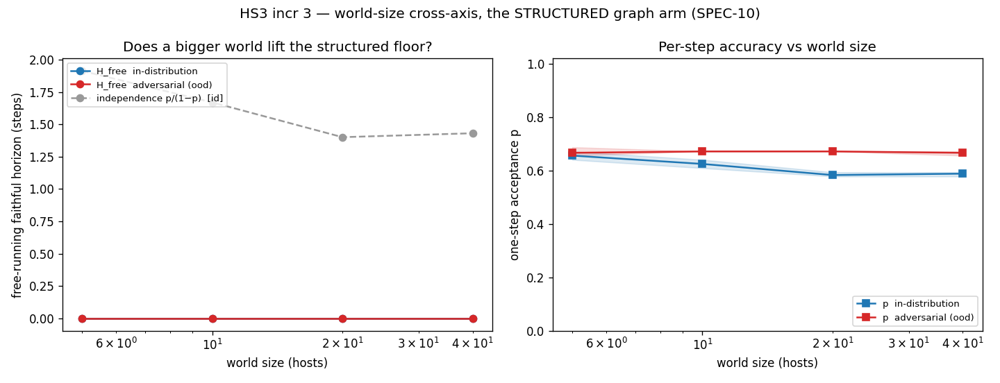](figures/horizon_graph_world_scaling.png)<br>**The structured ceiling is *world-size-invariant* — it survives the last axis too (SPEC-10 / HS3 incr 3 / H26).** The graph arm exists *for* its inductive bias over network structure, which has **more** to exploit as the world grows — so a bigger world is where it could finally pull off the floor. Hold graph capacity fixed and sweep the world over SPEC-9's `O(N²)` host-count axis (5 → 40 hosts): `H_free` stays **0 at every world size** (8× range, tight zero CIs), η = 0 throughout, and `p` actually **degrades** (0.66 → 0.59) as the world gets harder per step. **This completes the HS3 sweep: the structured arm's exact free-running floor is pinned at 0 across *all three* axes — capacity, data, AND world size** — a genuine compounding ceiling, not an artifact of any single axis. Where the flat arm's floor dissolved into a resourcing story on every axis (HS1/HS1.2/HS2), the structured arm's moves on **none** of them. Honest caveat: the graph trainer plateaus at p≈0.6 and p falls with world size, so the binding constraint is plausibly the trainer/representation; this is the strict ε≤0.1 tolerance. | [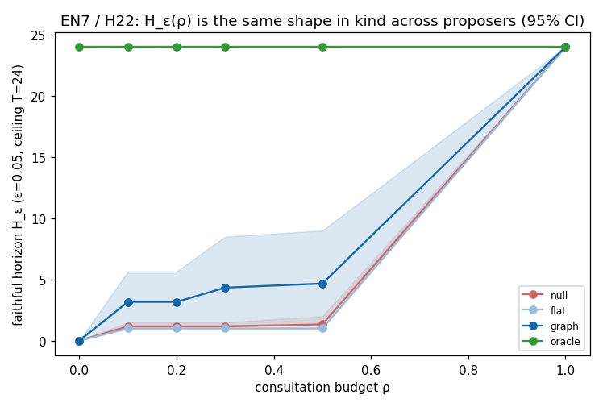](figures/en7_invariance.png)<br>**Why the two verdicts coexist (EN7 / H22).** The loop governs the *shape* of `H_ε(ρ)` (floor + cliff, no knee) across proposers; what differs is the *floor height* and whether a given proposer ever escapes it. The flat arm's per-step accuracy climbs high enough (with resourcing) that its rollout self-stabilizes off the floor; the graph arm's plateaus at ~0.6 and never does — so HS1's resourcing story and HS3's genuine ceiling are two faces of the same H22 fact: verification is the invariant, the proposer's competence sets the floor it lives on. |
| [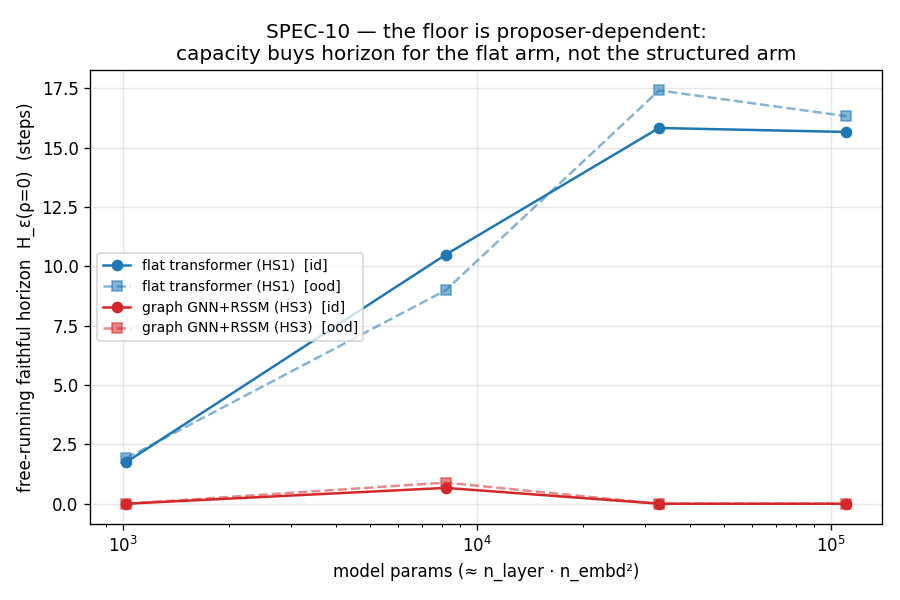](figures/horizon_synthesis.png)<br>**The SPEC-10 capstone — the floor is *proposer-dependent* (cross-proposer synthesis).** One figure for the whole scaling arc, read straight off the two committed capacity sweeps (figures-from-records — it re-runs nothing). On the **same** capacity axis the **flat** transformer's free-running horizon **lifts ~9×** (1.75 → 15.8 steps) and its floor dissolves into a resourcing story across capacity, data, and world size (HS1/HS1.2/HS2); the **structured** GNN+RSSM graph arm — which *beats* the flat arm on one-step delta-exact (EN4) — stays **pinned at ≈ 0** across all three axes (HS3). So the program's standing question, *"is the floor+cliff a resourcing artifact?"*, has **no single answer: it depends on the proposer** — under-resourcing for one, a genuine compounding ceiling for the other. A per-step *winner* that is the long-horizon *loser*, and vice versa — the proxy/truth divergence only the exact free oracle can expose. | [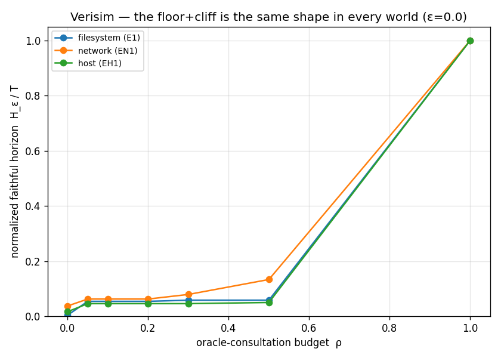](figures/synthesis_floor_cliff.png)<br>**Its sibling thesis (cross-world synthesis, [§22](#22-the-thesis-in-one-figure-the-floorcliff-is-the-same-in-every-world-cross-world-synthesis)).** The other one-figure claim: normalize each world's `H_ε(ρ)` by its ceiling and the filesystem, network, host, and distributed worlds trace **the same floor+cliff** — even the one (distributed) whose oracle is intractable. Read together, the two syntheses bracket the program's generality: the curve's *shape* is world- and model-invariant (the loop's), while whether its `ρ=0` *floor height* is a resourcing artifact is proposer-dependent (the model's). Verification is the invariant; the proposer sets the floor it lives on. |

| | |
|---|---|
| [](figures/synthesis_floor_cliff.png)<br>**The thesis in one figure (cross-world synthesis).** Normalize each world's faithful horizon by its own ceiling and overlay: the filesystem (a tree), the network (a graph), the host (a coupled bundle), and the distributed cluster (replicated services under faults) trace **the same floor+cliff** — a near-zero floor across the `ρ` interior, then a cliff to full horizon only at `ρ=1`. Four different state types, oracles, and models; one curve — and the fourth's oracle is only *tiered*, not exact, so the shape isn't an artifact of a cheap exact oracle. "A little consultation doesn't buy a lot of horizon; you pay near-linearly for faithfulness" is a property of the *oracle-loop method*, not any one world. | [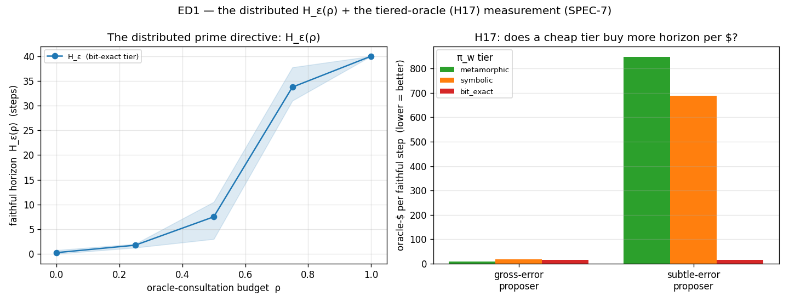](figures/ed1_dist.png)<br>**The distributed world debuts — and the tiered oracle is a *conditional* lever (SPEC-7 / ED1 / H17).** The fourth world (replicated services across machines) is the first where the bit-exact global oracle is **intractable**, so it can't be spent every step — the payload is a *tiered* oracle (metamorphic ↔ cycle ↔ symbolic ↔ bit-exact) and the loop chooses *which tier* (`π_w`) to pay. **Left:** the distributed `H_ε(ρ)` is the *same floor→cliff* as every prior world (0.2 → 40). **Right (H17):** **oracle-$ per faithful step** by tier × error class — and the answer is sharper than "cheap wins": it **depends where the model's errors fall**. For **gross** (out-of-vocab) errors the cheap metamorphic tier buys faithful horizon at **$9.4/step vs bit-exact's $16**; for **subtle** (in-flight) errors the cheap tiers miss the drift entirely (H≈0, **$848/step**) and only full bit-exact truth is efficient. A real, conditional lever — the measurement the oracle-free distributed-systems field cannot make. (Apparatus on a controlled-noise proposer; the learned `M_θ` now supplies the real distribution — [ed1_learned.png](figures/ed1_learned.png) — where the constrained decoder removes gross errors, so the cheap tiers catch nothing and bit-exact is the efficient choice: the honest inverse.) |
| [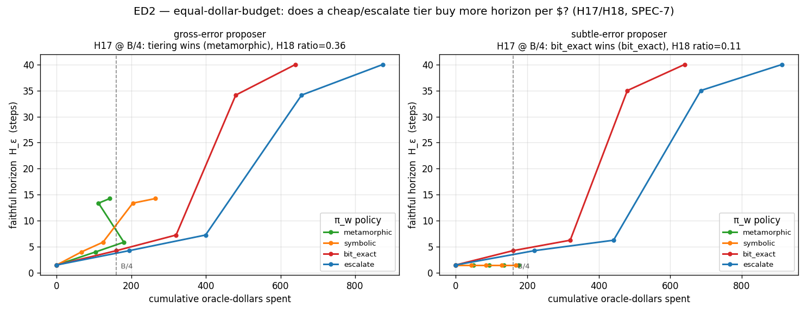](figures/ed2.png)<br>**H17 in its sharpest form: the equal-*dollar*-budget frontier (SPEC-7 / ED2 / H17 + H18).** ED1 asked "which tier is cheaper per faithful step?"; ED2 asks the question the hypothesis is really about — *at an equal oracle-dollar budget, does a cheap or cheapest-refutation (`escalate`) tier policy buy more faithful horizon than spending the same dollars on bit-exact truth?* It sweeps `ρ` and plots, per tier policy, the **faithful-horizon-vs-oracle-dollar frontier** (the Pareto front), comparing policies at a matched budget by interpolating each one's horizon along its envelope — a true equal-*dollar*, not equal-`ρ`, comparison. At the sub-linear **quarter budget** `B/4`: for **gross** (cheaply-catchable) errors the metamorphic tier reaches **H=14.2 vs bit-exact's 4.2** (tiering wins per dollar — H17 holds, a **0.36** competitive ratio of the full-truth ceiling at ¼ the cost, the **H18** readout); for **subtle** (bit-exact-only) errors the cheap tiers sit flat at the floor (1.5) and even `escalate` *loses* to single-tier bit-exact — H17's honest negative, in the form the spec poses it. (The learned `M_θ` now supplies the real distribution — [ed2_learned.png](figures/ed2_learned.png) — where the constrained decoder's subtle-only errors put a real model entirely in the right-hand regime: at `B/4` only bit-exact buys horizon and `escalate` loses, the H18 ratio just 0.06 — the budget-form honest inverse.) | [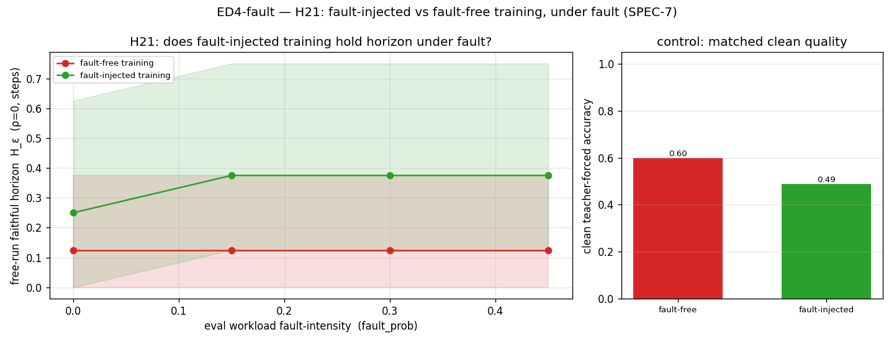](figures/ed4_fault.png)<br>**The DST/BUGGIFY data-factory lesson, made measurable (SPEC-7 / ED4 / H21).** Train two equal-volume `M_θ` — one fault-free (`fault_prob=0`), one fault-injected — then sweep the eval workload's fault-intensity **free-running** (`ρ=0`, so it exposes the *model*, not the loop). **H21 confirmed with the sharpest control:** at zero eval-fault the two coincide, but as faults intensify the fault-injected model holds **~3× more** free-run horizon (0.375 vs 0.125 steps) — *even though the fault-free model is the **better** clean predictor* (teacher-forced accuracy 0.60 vs 0.49). The fault-free model never saw a partition/crash/heal, so under fault it derails immediately. Fault injection buys robustness factual data cannot — DST as a *data factory*, not just a test harness; and a bonus proxy/truth-divergence instance (higher clean accuracy, lower compounding horizon). |
| [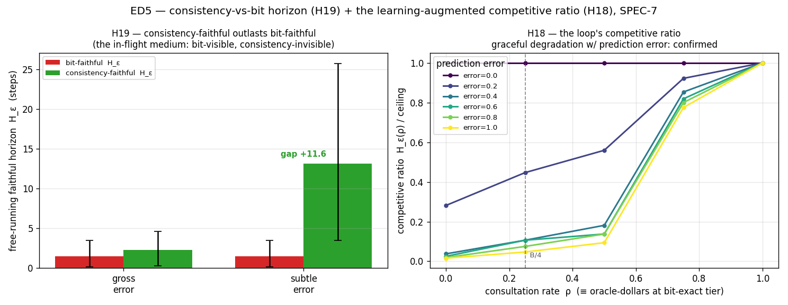](figures/ed5.png)<br>**Consistency-faithful horizon *outlasts* bit-faithful, and the loop is learning-augmented (SPEC-7 / ED5 / H19 + H18).** Two findings on the dependency-free synthetic proposer. **Left (H19):** free-running, the **consistency-faithful** horizon (does the model predict each object's converged/split state, §9.1?) **outlasts the bit-faithful one for `subtle` (in-flight) errors — H=13.1 vs 1.5, gap +11.6 (disjoint CI)** — because a corrupted in-flight replication message is immediately *bit*-visible but **consistency-invisible** until `advance` delivers it and writes a replica; for `gross` (durable-replica) errors the two coincide (the control). So W7's "no global state" *does* buy the model forgiveness — but only where the error hides in the consistency-invisible medium. **Right (H18):** the **competitive ratio** `H_ε(ρ)/ceiling` fit across `ρ × prediction error` — the loop is "algorithms with predictions" (model = predictor, bit-exact oracle = worst-case-safe fallback). The fan of lines is the learning-augmented signature: the ratio **degrades gracefully with prediction error** (quarter-budget ratio monotone 1.00 → 0.05, recovering the trivial bound for a perfect model) — *confirmed*. But the cliff to the ceiling only appears at ρ→1: at the sub-linear `B/4` budget a noisy model's ratio sits near the floor — the same **floor→cliff / no-knee** negative as every prior world, now in competitive-ratio form. Learning-augmented in the *error* axis; no free lunch in the *budget* axis. | [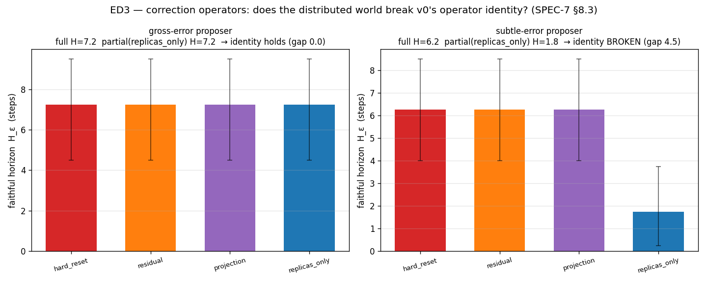](figures/ed3.png)<br>**The distributed world breaks v0's correction-operator identity (SPEC-7 / ED3 / RQ3).** v0 proved an *identity*: a full-truth consult makes `hard_reset`/`residual`/`projection` behaviorally identical on `H_ε` (they all snap to the same truth). ED3 shows the distributed world breaks it, **mode-dependently**, with a *partial* operator: `ReplicasOnlyCorrection` snaps the durable replicas to truth but **trusts the model's predicted in-flight** — the stale-read medium, the `subtle` error class. For **gross** (replica-write) errors all four operators recover the same horizon (H=7.2, identity holds); for **subtle** (in-flight) errors the three full-correction operators hold (H=6.2) but `ReplicasOnlyCorrection` **collapses to H=1.8** (gap 4.5) — the in-flight medium is the distributed world's hidden state a partial correction cannot see, the same gross/subtle structure H17/H19 turn on. |
| [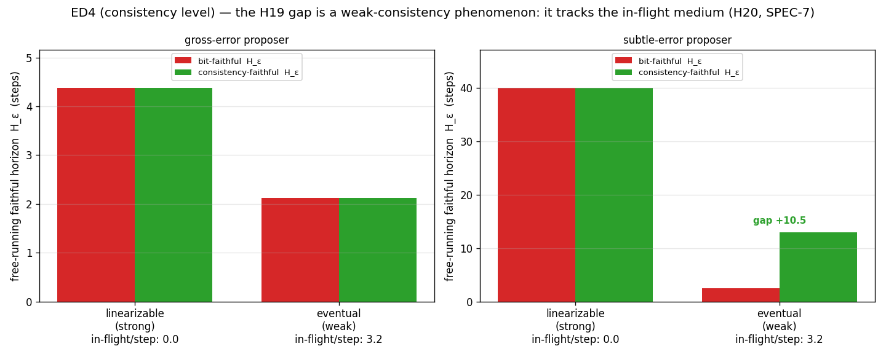](figures/ed4_consistency.png)<br>**The H19 gap is a *weak-consistency* phenomenon — it tracks the in-flight medium (SPEC-7 / ED4 / H20).** The `CONSISTENCY_MODELS` curriculum dial (§3.4) gains its first strong end: **`linearizable`** — synchronous all-replica writes, CP write-rejection under partition (CAP, HW-5), so no replica is ever stale and there is **no in-flight medium**. Sweeping the declared model resolves H20 *through* H19. The **subtle** (in-flight) panel is the headline: under **`eventual`** (in-flight rate **3.2/step**) the consistency-faithful horizon outlasts the bit-faithful one by **+10.5 steps** (the H19 gap — errors hide in flight); under **`linearizable`** (in-flight rate **0**) the gap is **exactly 0** — the consistency-invisible medium is gone, so the subtle error class is structurally empty and there is nothing for consistency-faithfulness to forgive. The **gross** (durable-replica) panel is the control: a durable error is consistency-visible at once, so bit and consistency horizons coincide (gap 0) at both levels. Strong consistency buys the model no forgiveness because there is no hidden state to forgive — the H20 mechanism made concrete and exact (dependency-free). (The learned `M_θ` now supplies the *absolute*-predictability form — [ed4_consistency_learned.png](figures/ed4_consistency_learned.png) — training one model per level: it free-runs **~2.4× further under `linearizable` (1.4) than `eventual` (0.6)**, confirming H20 in direction, but the H19 gap is **positive at both levels** on the real model, because its errors land on consistency-invisible *bookkeeping* — clocks/log/partition — not only the in-flight medium the dialed synthetic error targets: the honest difference between the dialed and the real error distribution.) | [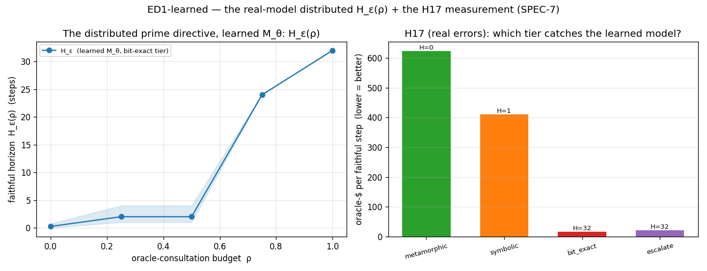](figures/ed1_learned.png)<br>**The real learned `M_θ` makes the tiered oracle's value model-dependent (SPEC-7 / ED1-learned / H17).** The flat DS4 `M_θ` trained on seeded rollouts, then run through the *same* tiered loop, so the curve and H17 are measured on a **real** error distribution. **Left:** the same **floor→cliff** (0.2 → 32). **Right:** the **honest inverse** of the synthetic H17 — the LL(1)-constrained decoder removes the *gross* (out-of-vocab) error class *by construction*, so a real model's residual errors are all *subtle*: the cheap **metamorphic** tier catches none (H=0.2, **$624/faithful-step**), **symbolic** few ($411), and only **bit_exact** is efficient (H=32, **$16**); cheapest-refutation **escalate** reaches full horizon but pays *more* ($21.6) because a real model's errors need the bit-exact correction anyway. A cheap tier helps exactly when a model makes cheaply-catchable errors — and a grammar-constrained learned model, by design, does not. |
| [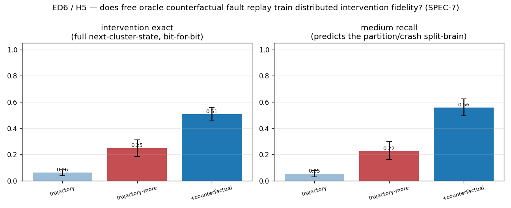](figures/ed6.png)<br>**The distributed world is where counterfactual replay finally pays (SPEC-7 / ED6 / H5).** The deterministic DES is *total*, so from any visited cluster state it returns the true next state of an **alternative fault** the trajectory never took — a free counterfactual branch (re-run from `(seed, t)` with one fault flipped). Three matched-count arms train the same flat `M_θ`: `trajectory` (base light-fault on-policy), `trajectory-more` (5× more on-policy data — the **volume control**), and `+counterfactual` (base + free oracle **fault**-flip branches — the near-miss partitions/crashes). Scored on **held-out fault interventions**: `+counterfactual` beats **both** the base **and** the volume control on **both** readouts with disjoint CIs — **intervention-exact 0.51 vs 0.25 vs 0.06**, and **medium-recall 0.56 vs 0.22 vs 0.05** (does it predict the partition/crash split-brain?). This is the **honest inverse** of the network (EN6) and host (EH6/H16) supervision *null*, where counterfactual data did **not** beat volume. The mechanism: the distributed **medium** (partition/crash/in-flight) is a hidden state the light-fault on-policy distribution structurally underrepresents — so on-policy *volume* buys little (0.06→0.25) while off-policy oracle **fault branches** buy a lot (0.25→0.51). The held-out-intervention analogue of the H21 data-factory result. *(Honest caveat: the branches are fault-heavier than the on-policy control, so the lift conflates counterfactual branching with the fault coverage it carries — but EN6/EH6 found null under the identical design, so the distributed positive is the result; the disentanglement is future work.)* | [](figures/ed1_dist.png)<br>**The distributed prime directive: the `H_ε(ρ)` curve + the first tiered-oracle verdict (SPEC-7 / ED1 / H8 + H17).** The first world where the bit-exact global oracle is *intractable*, so the payload is the **tiered oracle** (metamorphic ¢1 → cycle ¢2 → symbolic ¢4 → bit-exact ¢16). **Left:** the same **floor→cliff** `H_ε(ρ)` (floor 0.2 free-running → ceiling 40 fully-consulted, bootstrap-CI over seeds) — the distributed knee is the no-knee negative again (H8). **Right (H17):** oracle-**dollar** *per faithful step* per tier × error class — *whether a cheap tier buys more horizon per dollar depends where the model's errors fall*: for **gross** (out-of-vocab) errors the metamorphic tier is cheaper per faithful step ($9.4 vs bit-exact's $16); for **subtle** (in-flight) errors the cheap tiers miss the drift entirely and bit-exact is the only efficient choice. The central SPEC-7 tradeoff, made exact on a controlled error distribution. |
| [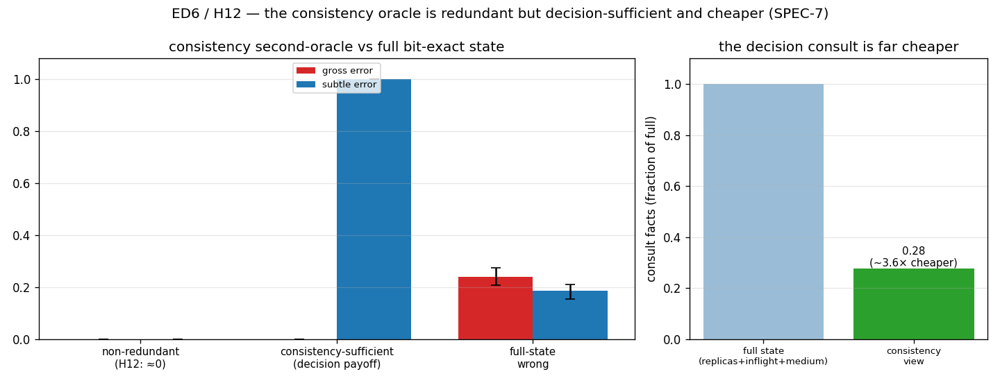](figures/ed6_two_oracle.png)<br>**A cheap consistency oracle is redundant but decision-sufficient and cheaper (SPEC-7 / ED6 / H12).** The distributed analogue of the host's privilege second-oracle (EH6) and network's control-plane oracle (EN10). The full **bit-exact** oracle verifies the predicted cluster bit-for-bit; the cheap **consistency oracle** answers only the one operationally-decisive question an SRE asks under partition — *is each object converged or split (a split-brain)?* (the §9.1 metric). Teacher-forced over the fault-heavy `adversarial` workload: **non-redundant rate 0** by construction (the consistency view is a pure function of the replicas, so a bit-exact-correct prediction is always consistency-correct — it catches *nothing* the full oracle misses); but **consistency-sufficient** — of the steps where the model's *full* prediction is wrong, the split-brain verdict is still right **1.00 for `subtle` (in-flight) errors vs 0.00 for `gross` (durable-replica) errors** (the per-step form of ED5's H19 horizon gap, tracking the in-flight medium) — at a **consult-fact ratio of 0.28** (~3.6× cheaper, the gap widening under fault because the medium inflates the full state but never the consistency view). *Redundant for verification, but a cheaper, decision-sufficient consult for the question that matters* — the tiered-oracle premise made concrete, dependency-free. (The learned `M_θ` now supplies the real distribution — [ed6_two_oracle_learned.png](figures/ed6_two_oracle_learned.png) — where the constrained decoder's mixed-but-mostly-`subtle` errors land the consistency oracle's decision-sufficiency at **0.57** *between* the synthetic poles, still at the ~3.6× cheaper consult: the same model loses as a *verifier* (ED2-learned's cheap tiers catch nothing) yet is decision-sufficient on the majority of errors as a *decision oracle* — the tiered oracle's value turns on *which question you ask it*.) | [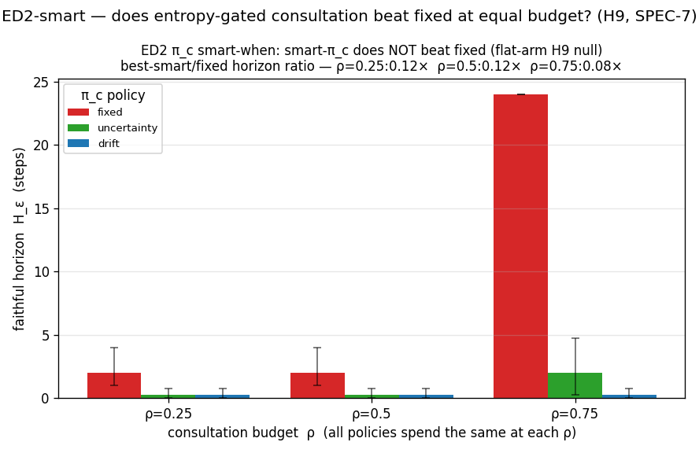](figures/ed2_smart.png)<br>**The flat model's decode-entropy is not a calibrated consult trigger (SPEC-7 / ED2-smart / H9).** The missing *when* axis of ED2: at a fixed interior budget `ρ`, does spending the consults on the steps the flat `M_θ` is least sure about (its constrained-decode entropy) beat spreading them evenly? **No — it is strictly *worse* than `fixed` (lift 0.08–0.12× at every budget).** Faithful horizon is a *prefix* property: `fixed` consults at step 0 to protect the prefix, while the entropy signal spends late and lets the model derail early. The flat decode-entropy is a decode-time artifact, not a calibrated belief — the standing H2/H9 negative carried into the distributed world, sharper than a tie. This localizes the smart-`π_c` lever to the (deferred) structured `M_θ`'s RSSM belief variance — the EH2 lesson, where the host's factored belief-variance *did* beat fixed ~2.2× where flat entropy could not. |
| [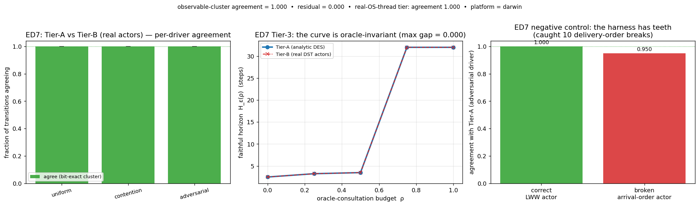](figures/ed7.png)<br>**The analytic oracle is faithful to a real distributed execution (SPEC-7 / ED7 / Tier-B — the distributed W1 retirement).** Every distributed result is measured against **Tier-A**, a *single-threaded analytic discrete-event simulator*. ED7 closes W1 ("the oracle is a model, not reality") for this world exactly as SY1 did for the host's `/bin/sh`. **Tier-B** runs the replicated-KV protocol as a *real distributed system*: autonomous **node actors** holding only their own replicas + an inbox, **no global state** (the cluster is emergent — W7 made operational), driven by a **seeded scheduler** whose delivery order is *seed-shuffled* (not Tier-A's sorted order, so agreement is no tautology) — the madsim/turmoil **DST** model, plus a `threaded` tier on **real OS threads + queues**. **Left:** bit-exact **1.000** observable-cluster agreement across all three drivers including the fault-heavy adversarial one (residual 0). **Middle:** the `H_ε(ρ)` curve is **oracle-invariant** (max gap 0.000) — substituting a real execution for the analytic model leaves the curve unchanged. **Right (teeth, the SY3 analog):** a deliberately-broken **arrival-order** actor (order-*dependent*) is **caught** by the differential, proving the harness detects a faithfulness break, not just rubber-stamps the reimplementation. Agreement certifies the property the DES quietly assumes: eventual-consistency convergence is **delivery-order-independent** (LWW is a commutative join). | [](figures/sy1_agreement.png)<br>**The host twin of ED7 (SPEC-11 / SY1 / H27).** The two W1 retirements are the same move in two worlds: validate a from-scratch reference oracle against a genuine execution, bit-for-bit. SY1 runs the v0 grammar against a **real `/bin/sh` on a real kernel** in a hermetic sandbox — structure-building agreement **1.000**, residual **0**, an oracle-invariant `H_ε(ρ)` curve (gap 0.000); the disagreement branch even **caught a real reference bug** (subtree-move, fixed) and every remaining divergence is a named, intentional modeling boundary. ED7 is the distributed-world analogue: where SY1 uses real OS kernel primitives, ED7 uses real autonomous message-passing actors under a seeded DST scheduler. Together they convert the program's one structural bet — *for computer worlds a deterministic ground-truth oracle is free, exact, and faithful to reality* — from an argument into two committed CSVs. |
| [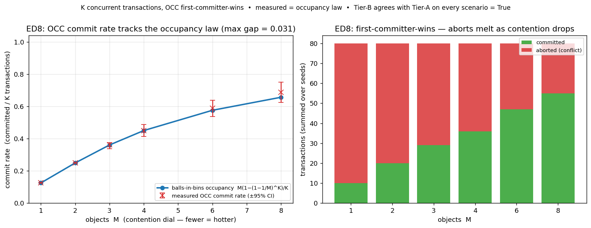](figures/ed8.png)<br>**Multi-key transactions, and the OCC commit rate tracks the occupancy law exactly (SPEC-7 / ED8 / DS0 incr 2).** The deterministic core grows a **transaction** layer (`begin`/`tget`/`tput`/`commit`/`abort`) under **optimistic concurrency control** (first-committer-wins; OCC is chosen over 2PL because it is *deterministic and deadlock-free* — no lock table / acquisition order / victim selection, DD-D3). A coordinator buffers a txn's read-set (pinning each key's read version) and writes; `commit` validates the read-set and applies all writes atomically or **aborts** on `conflict`. ED8 verifies the semantics are *exactly right*: `K` concurrent transactions each read-then-write one of `M` objects, so per object the first committer wins and the rest abort — committed = distinct objects touched, whose expectation is the **balls-in-bins occupancy law** `M·(1−(1−1/M)^K)/K`. **Left:** the measured commit rate sits on that closed-form curve (max gap **0.03**) as the contention dial `M` sweeps. **Right:** at `M=1` (one hot object) exactly **1/8** of each batch commits and the rest abort; the aborts melt away as contention drops. And it **composes with Tier-B** — the autonomous-actor system oracle agrees on every scenario, so transactions inherit the ED7 W1 retirement for free. The substrate the serializable/snapshot consistency models will build on. | [](figures/ed7.png)<br>**Why ED8's "Tier-B agrees" line matters (the composition thesis).** ED8's transactions are not a special case bolted onto the oracle — a committed transaction's writes flow through the *same* in-flight replication medium as a plain `put`, so they inherit the consistency model (async under `eventual`, synchronous-or-`unavailable` under `linearizable`) and the Tier-B reality check unchanged. The transaction *bookkeeping* is coordinator-local and deterministic (shared by both oracles, nothing distributed to re-validate); the *distributed* part — replicating the committed writes — is delivered by Tier-B's autonomous actors on `advance`, exactly where ED7's independence does its work. So every ED8 scenario re-runs the full Tier-A↔Tier-B differential and agrees bit-for-bit: a new capability that lands *without* widening the trusted core or weakening the W1 result. This is the program's compositional discipline — each increment is a deterministic, oracle-checked function the next layer reuses, not a rewrite. |
| [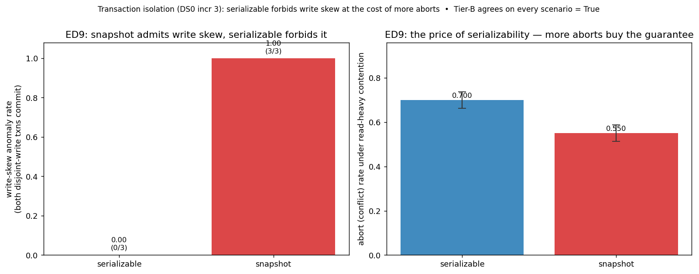](figures/ed9.png)<br>**Two isolation levels, and the write-skew anomaly that separates them (SPEC-7 / ED9 / DS0 incr 3).** A transaction runs at one of two OCC isolation levels (the `txn_isolation` dial, DD-D4), differing only in *what `commit` validates*: **serializable** checks the **read-set** (every read key's version unchanged — OCC backward validation), **snapshot** checks only **write-write** conflicts (the write-set, first-committer-wins). The textbook consequence is **write skew**: two transactions both read `{x, y}`, then `A` writes `x` and `B` writes `y`. **Left:** under snapshot their write-sets `{x}`/`{y}` are disjoint, so both commit (anomaly rate **1.0**) — a pair of outcomes no serial schedule produces, silently breaking the cross-object invariant they each checked; under serializable `A`'s commit invalidates `B`'s pinned read of `x`, so `B` aborts and the anomaly is **forbidden (0.0)**. **Right — the price of serializability:** under read-heavy contention serializable's read-set validation aborts strictly more than snapshot's (**0.70 vs 0.55**, disjoint CIs) — the extra aborts are exactly what buys the guarantee. Both levels stay deterministic + deadlock-free (OCC, no locks) and **compose with Tier-B** (the system oracle agrees on every scenario). | [](figures/ed8.png)<br>**The compositional ladder: isolation is a one-field refinement of the transaction core.** ED9 added nothing to the trusted core's *shape* — the same `begin`/`tget`/`tput`/`commit`/`abort` grammar, the same OCC commit, the same replication medium. The only new state is one field on the transaction (`write_versions`, the version pinned at first write, mirroring the read version pinned at first read), and the only new logic is a one-line branch in `commit`: validate the read-set (serializable) or the write-set (snapshot). That is the program's discipline made visible — a genuinely new database guarantee (write-skew prevention, the classic SI/serializable distinction) lands as a *purely additive* change that leaves every prior golden, hash, and experiment untouched (empty transaction state is omitted from the canonical form) and re-runs the full Tier-A↔Tier-B differential unchanged. Each layer is a deterministic, oracle-checked function the next one reuses, never a rewrite — transactions (ED8) → isolation (ED9), and consensus next on the same substrate. |
| [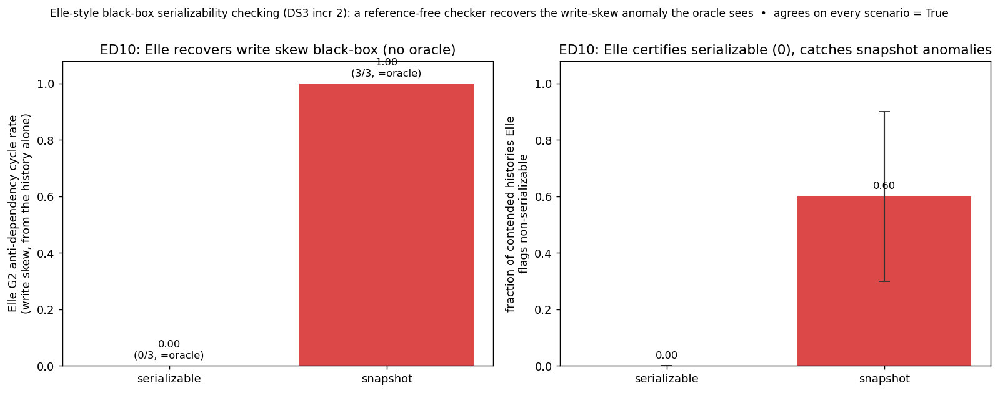](figures/ed10.png)<br>**A reference-free checker recovers the write-skew anomaly the oracle sees (SPEC-7 / ED10 / DS3 incr 2).** ED9 caught write skew the omniscient way — by counting which transactions the oracle let commit. ED10 asks the operator's question: can a checker that sees **only the client-visible history** (what each committed transaction read and wrote — no oracle, no cluster state) recover the same verdict? **Elle** ([`distoracle/elle.py`](src/verisim/distoracle/elle.py), the distributed analogue of Jepsen's Elle, Kingsbury & Alvaro VLDB 2020, and the stronger-consistency over-a-history sibling of the per-step `cycle` oracle tier) reconstructs Adya's **Direct Serialization Graph** (`ww`/`wr`/`rw` edges from the MVCC version order) and reports a violation iff it has a cycle. **Left:** Elle's **G2 anti-dependency-cycle** rate (`A →rw B →rw A`, the canonical write skew) is **1.0 under snapshot, 0.0 under serializable** — *identical* to ED9's oracle-side anomaly rate, agreeing with the oracle on every scenario. **Right:** under contention Elle flags **0.60 [0.30, 0.90]** of snapshot histories non-serializable and **0.0** of serializable histories — it **certifies the serializable level reference-free**. The H17 lesson from the other side: where a grammar-constrained learned model made the cheap verification tiers refute *nothing* (ED2-learned), a cheap *black-box* tier refutes *exactly the right thing* for the question it answers. | [](figures/ed9.png)<br>**Why Elle is the right closing move for the transaction layer (the verifier thesis).** ED8→ED9 built the transaction core and its two isolation levels; ED10 adds the *independent verifier* the program's whole thesis demands — and it adds **zero** to the trusted core (Elle reads only the history ED9 already produces, consults nothing). It is the DS3-deferred "Elle-style cross-object cycle detection" shipped: the per-step `cycle` tier is the eventual-consistency form, and Elle is its serializable-consistency form over a whole history. The payoff is the cleanest statement of the tiered-oracle premise yet — verification value is a function of *which question you ask*: the same cheap tier that is useless against a grammar-constrained model's subtle byte errors (ED2-learned) is *exactly sufficient* for the serializability question a defender actually asks, and it answers it for free, against the history alone, with the omniscient oracle's verdict reproduced bit-for-bit. |
| [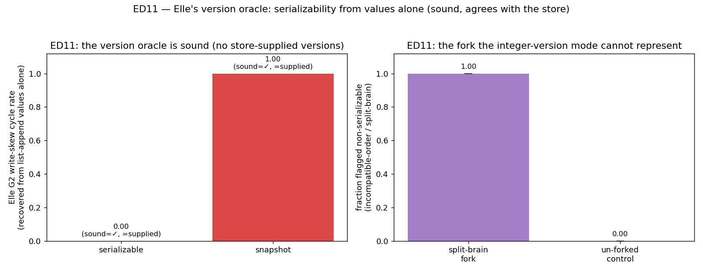](figures/ed11.png)<br>**Elle's version oracle: serializability recovered from values alone, and the split-brain fork (SPEC-7 / ED11 / DS3 incr 3).** ED10 was black-box about *reads and writes* but still let the store hand Elle the integer MVCC version each transaction read and installed. That is the one cooperation Jepsen's Elle removes — over a **list-append** register (every write appends a globally-unique value, every read returns the whole list) the per-key version order is **recoverable from the read values themselves** (Kingsbury & Alvaro 2020, the "version oracle"): a read returning `[x, y, z]` is direct testimony that the append of `x` preceded `y` preceded `z`, with no question put to the store. [`recover_versions`](src/verisim/distoracle/elle.py) merges each key's read-lists (every one a *prefix* of the single growing append log) into one total order; `check_serializable_appends` assigns each value its recovered version and reuses the *unchanged* DSG/cycle machinery. **Left:** the version oracle is **sound** — recovering versions from values reproduces the store's *exact* version history on every scenario, so the G2 write-skew rate is ED10's (**1.0 snapshot / 0.0 serializable**) with **zero** store cooperation. **Right:** the **split-brain fork only value-recovery can represent** — when a partition lets two sides extend one key divergently (a later read sees `[a, b]`, another `[a, c]`, neither a prefix of the other) the version oracle reports an **`incompatible-order`** anomaly (rate **1.0**, clean control **0.0**): the §9.1 split-brain consistency anomaly, caught reference-free from the client history, that ED10's single-integer-sequence mode is *structurally unable* to express. | [](figures/ed10.png)<br>**Why the version oracle is the real Elle, not just a refactor (the black-box thesis).** ED10's `collect_history` peeked at `state.replicas[(k, node)].version` — the store *telling* Elle the version order. That is exactly the assumption a defender watching a cluster they do not control cannot make. ED11 removes it: the order is reconstructed from the append-read values, the signal a true black box actually emits, and the reconstruction is proven *sound* against the store's own versions before it is trusted. The payoff is not just methodological purity — it unlocks two anomaly classes the integer-version mode cannot even *name*: the **fork** (`incompatible-order`, the black-box signature of split-brain — two divergent histories of one key) and the **dirty-read** (Adya G1a, a read of a value no committed transaction wrote). The same DSG machinery, a strictly stronger front-end: Elle now checks the cluster the way an operator must — from the outside, trusting nothing it is handed. |
| [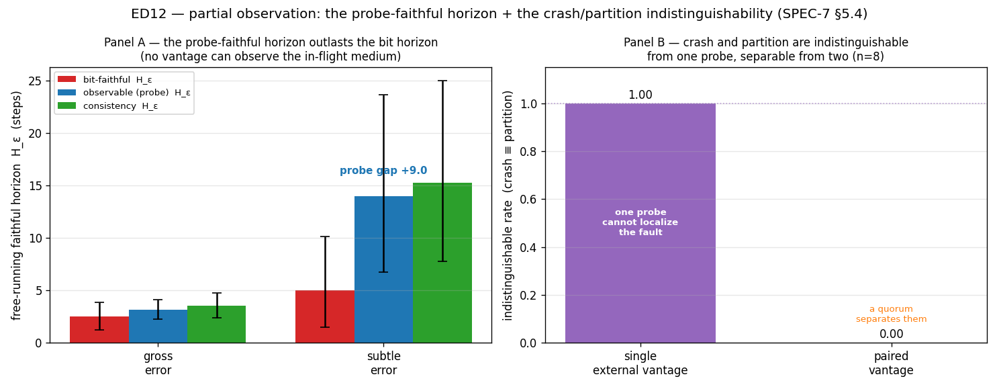](figures/ed12.png)<br>**Partial observation: the probe-faithful horizon, and a single probe cannot tell a crash from a partition (SPEC-7 / ED12 / DS3 incr 4).** Every prior metric compared the *full* cluster state — but W7 says no observer ever holds one. [`observe(state, vantage)`](src/verisim/dist/observe.py) projects the cluster onto what a probe connected to a set of `vantage` nodes can see: replicas on *reachable* (up + co-partitioned) nodes only, **never the in-flight replication medium**, and every dark node labelled `unreachable` *with no reason* — so a crashed node and a partitioned-away node look identical. **Left (Panel A):** the **observable**-faithful horizon (what a perfect monitoring probe sees) *outlasts* the **bit**-faithful one for `subtle` (in-flight) errors — free-running **probe gap +9.0 steps** (disjoint CI [4.0, 16.1]) — because no vantage can read a corrupted message until `advance` delivers it; for `gross` (durable-replica) errors the probe sees the corruption at once and the two coincide (control). This is the partial-observation form of H19/ED5, read through *physical observability* rather than the consistency-view abstraction — and it is structurally guaranteed (a bit-faithful step is necessarily observably faithful, so `H_ε^bit ≤ H_ε^obs` on every rollout). **Right (Panel B):** the **failure-detector limit behind FLP** — from a *single* external vantage a crashed node and a partitioned-away node are byte-identical (`observe()` equal, indistinguishable rate **1.0**: one probe cannot localize the fault); a *paired* vantage that reaches the node's side exposes the live isolated replica in the partition case but nothing in the crash case (rate **0.0**). One probe cannot tell a crash from a partition; a quorum can — the operational reason distributed failure detection needs more than one observer. The probe is the §5.4 cheap-localized oracle mode and the deterministic substrate the deferred RSSM belief (§6.2) must roll forward under partition. | [](figures/ed5.png)<br>**Two metrics, one hidden state (the medium, ED5 → ED12).** ED5's consistency-faithfulness and ED12's observable-faithfulness are different projections of the same cluster, and they open the *same* gap for the *same* reason: the in-flight replication medium. ED5 forgives the medium by **abstraction** (the consistency view reads only converged/split per object, not byte placement); ED12 forgives it by **physical unobservability** (no probe, at any vantage, can read a message in transit). The ordering is `H_ε^bit ≤ H_ε^observable ≤ H_ε^consistency`: bytes are strictest, the probe drops the unseeable medium, the consistency view additionally drops node placement. So a defender watching a cluster they do not control is right about its *observable consistency behavior* far longer than about its exact bytes — and ED12 adds the epistemic twist ED5 cannot: even a *perfect* monitoring probe is blind to the medium and to the crash-vs-partition distinction, the limits that make distributed observation fundamentally harder than the single-machine worlds before it. |
| [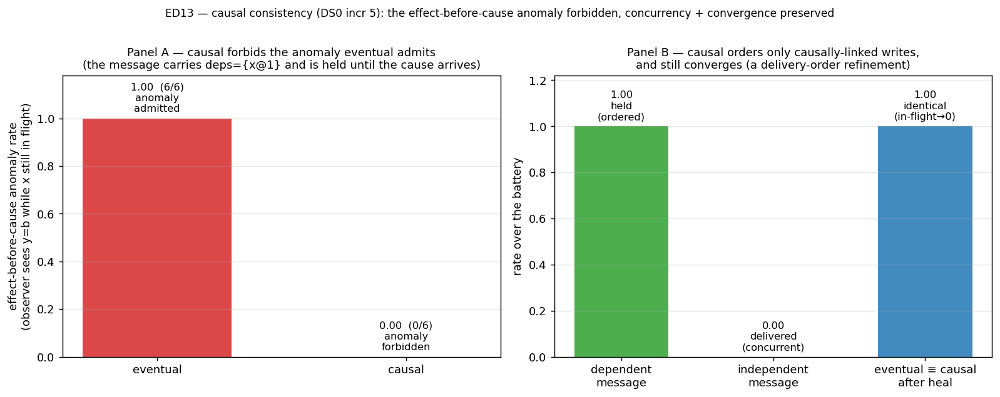](figures/ed13.png)<br>**Causal consistency: the effect-before-cause anomaly, forbidden without losing concurrency or convergence (SPEC-7 / ED13 / DS0 incr 5).** The third `CONSISTENCY_MODELS` end, **`causal`**, lands between `eventual` (weakest) and `linearizable` (strongest): `eventual`'s async, available-under-partition replication plus **one guarantee** — *if write B causally depends on write A, no replica ever observes B before A*. It is a **delivery-order refinement**, not a new write path: each replication [`Message`](src/verisim/dist/state.py) carries a `deps` slice of the writing node's version vector (the `(object, version)` it had observed), and `advance` **defers** a message until the destination has applied those dependencies (held, not lost). The additive `deps` field is omitted from the canonical form when empty, so every prior golden/hash/tokenization is byte-for-byte unchanged. **Left (Panel A):** a partition toggle routes the *effect* `y` to observer `n2` while its *cause* `x` is still blocked. Under **eventual**, n2 reads `y=b, x=nil` — an effect before its cause (anomaly rate **1.0**); under **causal**, the `y` message carries `deps={x@1}`, unmet at n2, so it is held (rate **0.0**). **Right (Panel B):** causal is a *minimal* refinement — it holds the **dependent** message (rate 1.0) but **never the independent one** (0.0, written before its writer saw `x`), so concurrent writes stay free; and after `heal`+`advance` the eventual and causal clusters reach the **identical durable state** (rate 1.0, in-flight drained to 0). Causal forbids the anomaly that matters to a defender — seeing an effect whose cause is still invisible — at the cost of bounded delivery latency, not availability or convergence. **And it is faithful to a real execution:** the autonomous-actor **Tier-B reproduces causal delivery bit-for-bit** under the seed-shuffled scheduler (DS0 incr 6) — a stronger W1 test than eventual's, since the shuffle may try a message before its cause, so Tier-B holds it via a fixed-point that delivers exactly the causally-ready closure. | [](figures/ed9.png)<br>**The consistency curriculum, now three-ended (eventual → causal → linearizable).** SPEC-7's §3.4 difficulty dial sweeps the *declared consistency model* — "weaker is harder to predict because more histories are legal." Two ends shipped first: `eventual` (the default, an in-flight medium and stale reads) and `linearizable` (synchronous, CP-under-partition, no in-flight medium — the H20 strong end). ED13 fills the **middle**: `causal` keeps `eventual`'s async medium and partition-availability but orders causally-linked delivery, so it sits strictly between them — more predictable than eventual (the effect-before-cause anomaly is gone), still weaker than linearizable (the in-flight medium and its H19 slack remain). The whole increment is **purely additive** — one defaulted `deps` field, omitted-when-empty in the canonical form — the program's compositional discipline again: a genuinely new consistency guarantee that leaves every prior golden, hash, and the Tier-B differential untouched, then **validated against the real autonomous-actor execution** (the causal Tier-B, incr 6) under a 1080-step seed-shuffled battery with the broken-arrival control still caught. |
| [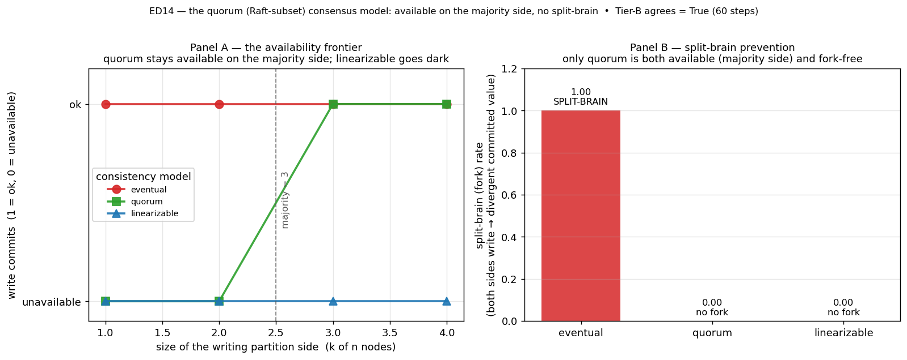](figures/ed14.png)<br>**Quorum (Raft-subset) consensus: available on the majority side, never split-brain (SPEC-7 / ED14 / DS0 incr 7).** The fourth replication model, **`quorum`**, is the realistic CP middle real consensus protocols occupy — a write commits **synchronously to a reachable majority** and is rejected only when a majority is *not* reachable, the minority catching up async. **Left (Panel A — the availability frontier):** sweeping the writing partition side's size `k` (of 5, majority = 3), a write commits at all `k` under **eventual** (it never coordinates), iff **`k≥3`** under **quorum** (the step at the majority threshold), and at *no* `k<5` under **linearizable** (it needs every replica). So quorum stays available on the majority side *exactly where linearizable goes completely dark* — the reason real systems commit on quorums, not all-replica synchrony. **Right (Panel B — split-brain prevention):** when *both* partition sides write the same key, **eventual forks every time** (rate 1.0 — both commit, the object diverges, the split-brain ED11's version oracle catches black-box), while **quorum and linearizable never fork** (0.0). But only **quorum** is in the available-*and*-fork-free corner: linearizable buys safety with total unavailability, eventual buys availability with divergence, quorum gets both (on the majority side). The `quorum` value is purely additive — no new state, every prior golden/hash unchanged — and **Tier-A ≡ Tier-B bit-for-bit** (the autonomous-actor system oracle reproduces the quorum decision, the W1 retirement). | [](figures/ed13.png)<br>**The replication-consistency curriculum, now four-ended (eventual → causal → quorum → linearizable).** SPEC-7's §3.4 dial sweeps the declared model from weakest to strongest: **eventual** (async, always available, split-brain-prone), **causal** (async + happens-before ordering, ED13), **quorum** (majority-commit, available on the majority side, divergence-free), **linearizable** (all-replica sync, no divergence but unavailable under any partition). Each is a *purely additive* increment over the DS0-incr-1 core — `causal` adds an omitted-when-empty `deps` field, `quorum` adds only an enum value and a reachability check — so a genuinely new distributed-systems guarantee lands without touching a single prior golden, hash, or the Tier-B differential, then is validated against the real autonomous-actor execution. The compositional discipline that has carried the distributed world from a single replicated key to the full CAP design space, one oracle-checked function at a time. |
| [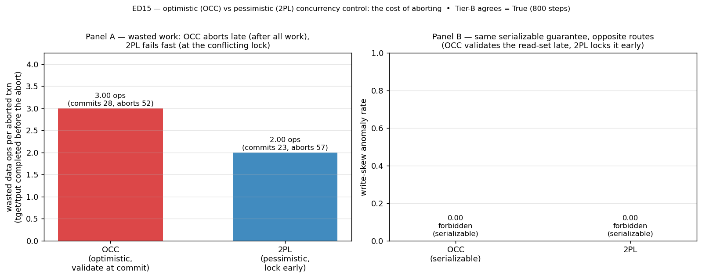](figures/ed15.png)<br>**Optimistic (OCC) vs pessimistic (2PL) concurrency control: the cost of aborting (SPEC-7 / ED15 / DS0 incr 8).** The `concurrency_control` dial adds the DD-D3 alternative to OCC: **`2pl`**, strict two-phase locking. `tget`/`tput` take shared/exclusive locks held to commit; a conflict is resolved by **deterministic wound-wait** — the *older* transaction (lexicographically smaller id, a proxy for start order) preempts the younger, and a younger requester aborts rather than waiting, so it is **deadlock-free and deterministic without a scheduler** (the 2PL the core *can* pin — DD-D3 deferred the *blocking* 2PL whose victim selection injects nondeterminism). Both reach the *same* serializable guarantee by opposite routes, so the interesting axis is *when each pays for a conflict*. **Left (Panel A — wasted work):** an aborted transaction's mean data ops completed before it aborts. **OCC** validates at commit, so an aborted txn did **all 3.0** of its operations (maximal waste); **2PL** detects the conflict at lock-acquisition and fails fast at **2.0** — the classic optimistic-wastes-work / pessimistic-pays-upfront tradeoff, made measurable. **Right (Panel B — same guarantee):** both `occ` (serializable) and `2pl` **forbid write skew** (rate 0.0) — OCC by validating the read-set late, 2PL by S-locking it early. The lock table is purely additive (omitted-when-empty in the canonical form, so every prior golden/hash is unchanged), and **Tier-B reproduces 2PL bit-for-bit** (transaction bookkeeping is coordinator-local, so it delegates to the same `txn_step`). | [](figures/ed9.png)<br>**The transaction layer now has two concurrency-control disciplines (optimistic + pessimistic).** ED8/ED9 built OCC (buffer + validate at commit) and its two isolation levels; ED15 adds **2PL** (lock + hold to commit), the pessimistic counterpart. Both are deterministic and deadlock-free — OCC by construction, 2PL by wound-wait — and both reach serializability, so the program now spans the textbook concurrency-control design space the same way its consistency dial spans CAP. The whole increment is **purely additive**: one config value (`concurrency_control`), one omitted-when-empty state field (`locks`), one delta edit (`LockSet`) — a genuinely new database mechanism that leaves every prior golden, hash, and the Tier-B differential untouched. Building it also surfaced and fixed a latent bug: the transaction *commit* only replicated under `eventual`/`linearizable`, so a `quorum` txn commit (added in incr 7) silently fell through to eventual-style async; the commit now replicates under the same discipline as a plain `put` across all four models. |
| [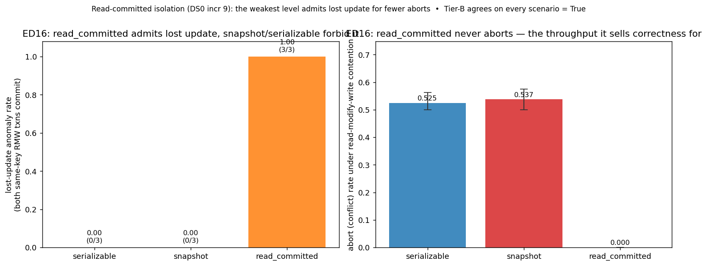](figures/ed16.png)<br>**Read-committed isolation: the lost-update anomaly, and the throughput it sells correctness for (SPEC-7 / ED16 / DS0 incr 9).** The `txn_isolation` dial gains its **weak end — `read_committed`**, the real-world default of Postgres, Oracle, and SQL-Server. It does **no** commit-time concurrency validation at all (`validation_set = ()`): reads still see only committed data (the MVCC `tget` gives no dirty reads — the one guarantee the level keeps), but with no write-write check two same-key **read-modify-write** transactions both commit and the later silently overwrites the earlier — the classic **lost-update** anomaly. **Left (Panel A — the anomaly):** two txns both read `x` at the same version then both write it back; the lost-update rate (both commit, the earlier write gone) is **1.0 under `read_committed`, 0.0 under `snapshot` and `serializable`** (their write-set validation aborts the second committer on the same-key conflict). **Right (Panel B — the price it sells correctness for):** under read-modify-write contention `read_committed` **never aborts** (`0.00` vs `~0.53` for both validating levels) — the apparent throughput it buys by admitting the lost updates of Panel A. Purely additive (the default config still serializes `txn_isolation="serializable"`, so every prior golden/hash is unchanged), and **Tier-B reproduces all three levels bit-for-bit**. The black-box **Elle** checker (ED10) even recovers lost update with no oracle as a `{ww, rw}` G2 cycle — the same-key overwrite (`ww`) plus the stale read (`rw`), structurally distinct from write-skew's pure `{rw}` cycle. | [](figures/ed9.png)<br>**The transaction-isolation curriculum, now three-ended (serializable → snapshot → read-committed).** SPEC-7's §3.4 thesis — *weaker is harder to predict, because more histories are legal* — now spans the textbook isolation hierarchy in full: `serializable` forbids write skew (read-set validation, ED9), `snapshot` admits write skew but forbids lost update (write-set validation, ED9), and `read_committed` admits even lost update (no validation, ED16). Each weaker level legalizes a strictly larger set of histories, so a faithful `M_θ` must reproduce an anomaly the stronger levels make structurally impossible — the cleanest realization of the curriculum dial as a *difficulty* axis. The whole increment is **purely additive** (one new `txn_isolation` enum value, an empty validation set), a genuinely new database guarantee that leaves every prior golden, hash, and the Tier-B differential untouched — the compositional discipline that has carried the transaction layer from a single OCC commit to the full isolation + concurrency-control design space, one oracle-checked function at a time. |
| [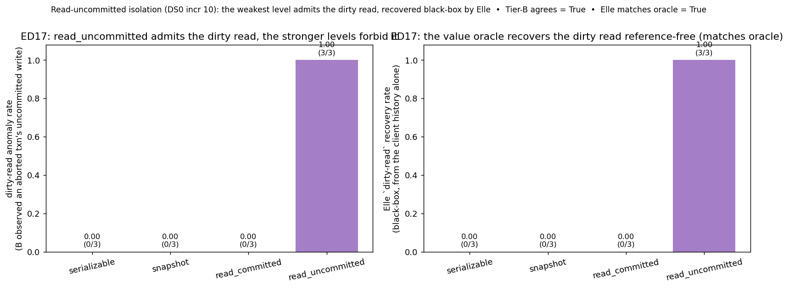](figures/ed17.png)<br>**Read-uncommitted isolation: the dirty-read anomaly, recovered black-box (SPEC-7 / ED17 / DS0 incr 10).** The `txn_isolation` dial gains its **weakest end — `read_uncommitted`**, the bottom rung of the standard SQL hierarchy (`read_uncommitted ⊂ read_committed ⊂ snapshot ⊂ serializable`). It drops even read-committed's last guarantee: where every stronger level's MVCC `tget` returns only committed data, `read_uncommitted`'s `tget` may observe another active transaction's **uncommitted** buffered write — so if that writer aborts, the reader saw a value that never committed (the classic **dirty read**, Adya G1a). It applies **only under OCC** — 2PL's exclusive lock blocks any reader from ever seeing an uncommitted write (locking gives serializability regardless of the declared level). **Left (oracle side):** the scenario is `A` writes `x` (uncommitted), `B` reads `x`, then `A` **aborts**; the dirty-read rate (B observed A's rolled-back value) is **1.0 under `read_uncommitted`, 0.0 under the three stronger levels**, and Tier-B agrees on every scenario. **Right (reference-free side):** Elle's **value oracle** (ED11) recovers the *same* dirty read from the client-visible history alone — the aborted writer contributes no committed append, so B's read of a value no committed txn installed surfaces as a **`dirty-read`** recovery anomaly, at exactly the oracle's rate, matching it on every scenario. The dirty-read echo of ED10's write-skew and ED16's lost-update recovery — and the completion of the **four-ended isolation curriculum**. | [](figures/ed16.png)<br>**The transaction-isolation curriculum is now complete (serializable → snapshot → read-committed → read-uncommitted).** SPEC-7's §3.4 thesis — *weaker is harder to predict, because more histories are legal* — now spans the **full standard SQL hierarchy**, one textbook anomaly per rung: `serializable` forbids write skew (ED9), `snapshot` admits write skew but forbids lost update (ED9), `read_committed` admits lost update but forbids the dirty read (ED16), and `read_uncommitted` admits even the dirty read (ED17). Each weaker level legalizes a strictly larger set of histories — and each anomaly is **recovered black-box by the same Elle checker** (write skew as a G2 `{rw}` cycle, lost update as `{ww, rw}`, the dirty read as a value-oracle `dirty-read` recovery), the reference-free verifier reproducing the omniscient oracle's verdict for free. The whole increment is **purely additive** (one new `txn_isolation` enum value; the commit path is identical to read-committed, only the read path changes), leaving every prior golden, hash, and the Tier-B differential untouched — the compositional discipline that carried the transaction layer from a single OCC commit to the complete isolation + concurrency-control design space, one oracle-checked function at a time. |
| [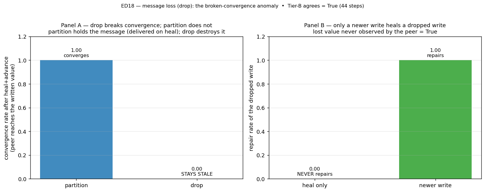](figures/ed18.png)<br>**Message loss: the broken-convergence anomaly, and the lost write only a newer write heals (SPEC-7 / ED18 / DS0 incr 11).** The fault grammar gains the **`drop`** op — `drop src dst` loses every in-flight replication message from `src` to `dst`, the unreliable-network `BUGGIFY` primitive of deterministic simulation testing. The delta vocabulary had *anticipated* it since incr 1 (`MsgDrop`, with `apply` + serialization + the `<msg_drop>` token) but **no action produced it**; ED18 wires it up — the §3.2 fault op named-but-deferred, now real. The point is the contrast with `partition`: where partition *holds* a message (delivered once the link `heal`s), `drop` **destroys** it. **Left (Panel A — drop breaks convergence; partition does not):** cut a write off from one peer, then `advance`+`heal`+`advance`. Under **partition** the held message is delivered on heal, so the peer reconverges (rate **1.0**); under **drop** the destroyed message never is, so the peer stays **permanently stale** (rate **0.0**). Same observable symptom — a stale replica — from two media: a *recoverable delay* and an *unrecoverable loss*, the eventual-consistency convergence guarantee's hidden premise (reliable-if-delayed delivery) made visible. **Right (Panel B — only a newer write heals it):** after the drop, `heal`+`advance` alone never repairs the replica (rate **0.0**), but a subsequent write to the same key (a higher MVCC version) does (rate **1.0**) — and the dropped value is **never observed** by the peer (a lost update at the network layer, recoverable only by being superseded). `drop` adds **no new state field**, so every prior golden/hash/tokenization is byte-for-byte unchanged and it composes with all four consistency models; **Tier-A ≡ Tier-B bit-for-bit** over the drop + broken/repaired-convergence battery. | [](figures/ed13.png)<br>**The fault grammar now spans both medium faults: delay and loss (`partition` vs `drop`).** The distributed world's two network faults are now a matched pair, and the contrast is the whole lesson. `partition` (incr 1) is a **recoverable delay**: messages are *held*, blocked at the split, and delivered the moment the link `heal`s — the dynamic behind every stale-read-then-converge story (ED13's causal delivery is a refinement of *which* held message goes first). `drop` (incr 11) is an **unrecoverable loss**: the message is *gone*, so `heal`+`advance` has nothing to deliver and the convergence guarantee — which silently assumes delivery is reliable-if-delayed — is broken until a newer write supersedes the lost one. Together they give the `BUGGIFY` data factory (SPEC-7 §2.1, the H21 fault-injection axis) both halves of the unreliable network DST exercises — a network that *delays* and a network that *loses* — each a deterministic, seed-replayable, Tier-B-verified function, and each purely additive over the DS0-incr-1 core. The same compositional discipline, now carrying the fault medium from partition-only to the full delay-or-lose design space. |
| [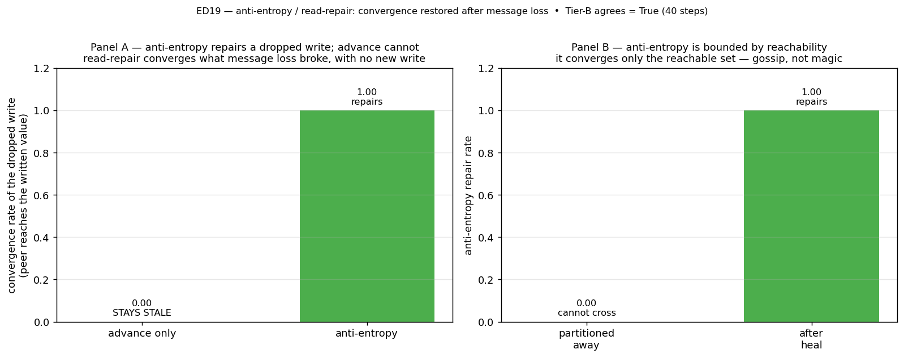](figures/ed19.png)<br>**Anti-entropy / read-repair: convergence restored after message loss (SPEC-7 / ED19 / DS0 incr 12).** The counterpart to ED18, and the first **protocol** op: **`anti_entropy node`** is the read-repair mechanism real eventually-consistent stores (Dynamo, Cassandra) use to converge *despite* lost messages — the SPEC-7 §4 `ReplicaConverge` op the spec named but had never implemented. It pulls each object to the winning `(version, value)` among the node's **reachable** replicas. Where `drop` (ED18) *breaks* the convergence guarantee, anti-entropy *restores* it — and needs **no in-flight message**, because it reads the peers' *current* replicas directly. **Left (Panel A — repairs what advance cannot):** after a write is dropped to a peer and the link heals, the stale replica is unrecoverable by `advance` (rate **0.0** — no message remains to deliver) but `anti_entropy` pulls the latest and repairs it (rate **1.0**), with no new write. **Right (Panel B — bounded by reachability):** the *same* op repairs nothing while the peer is partitioned away (rate **0.0**, it cannot cross the split) and repairs once the partition heals (rate **1.0**) — anti-entropy converges only the reachable set, gossip not magic, so full convergence still needs the network back. It reuses the `ReplicaWrite` edit (no new state field), so every prior golden/hash/tokenization is unchanged; **Tier-A ≡ Tier-B bit-for-bit**; and the tiered oracle was taught to accept its multi-version read-repair jump (the `cycle`/`symbolic` tiers defer `anti_entropy` to bit-exact rather than applying the "version moves by ≤1" rule). | [](figures/ed18.png)<br>**The eventual-consistency convergence story, now complete (replicate → lose → repair).** The DS0-incr-1 core had async replication that converged *on the assumption messages eventually arrive*. ED18 broke that assumption (`drop`); ED19 supplies what real systems actually rely on to converge anyway: **anti-entropy**. The three ops now compose into the full Dynamo-style lifecycle — `put` replicates asynchronously, `drop` loses a message (the convergence guarantee fails), and `anti_entropy` read-repairs the stale replica from its reachable peers (convergence restored, no new write). And the pair teaches *why* eventual consistency needs anti-entropy: `advance` (message delivery) and `anti_entropy` (state reconciliation) are different convergence paths — delivery needs a surviving message, reconciliation needs only a reachable copy — so under message loss only the second works, and under partition neither crosses the split. Each op is deterministic, seed-replayable, Tier-B-verified, and purely additive over the core; together they carry the distributed world from "replication that converges if you're lucky" to "replication that converges because it repairs." |
| [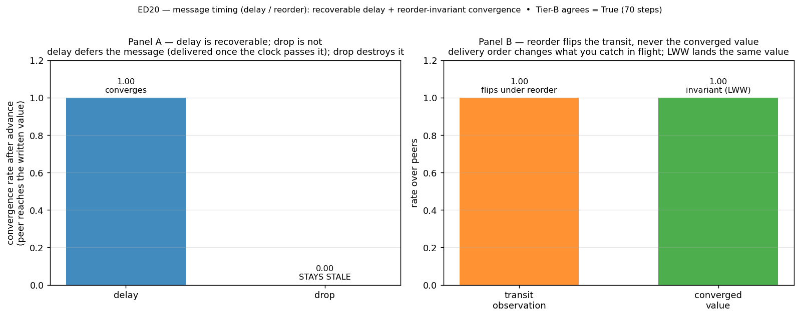](figures/ed20.png)<br>**Message timing: the recoverable delay and the reorder-invariant convergence (SPEC-7 / ED20 / DS0 incr 13).** The fault grammar gains its **message-timing** faults — **`delay`** and **`reorder`** (two of the §3.4 "partition, crash, message loss, **reorder**, clock skew" set; `clock_skew` completes it in ED21). Both edit only the existing `Message.deliver_after` via one new `MsgReschedule` edit, so they add **no state** and compose with every consistency model. **Left (Panel A — delay is recoverable; drop is not):** a write cut off from a peer by `delay` is deferred but still arrives once the clock passes the deferral (convergence rate **1.0**), where the same write under `drop` is destroyed (rate **0.0**) — completing ED18's two-media contrast: the eventual-consistency convergence guarantee assumes delivery is *reliable if delayed*, and `delay` exercises exactly the "if delayed" half it leans on. **Right (Panel B — reorder flips the transit, never the converged value):** with two writes staggered so the newer is scheduled first, a peer transiently shows the newer value; after `reorder` it transiently shows the *older* one — a genuinely different in-transit observation (flip rate **1.0**) — yet **both converge to the newer write** (invariance rate **1.0**). Last-writer-wins by `(version, value)` is a commutative join, so delivery order changes what you can catch in flight but never where the cluster lands: the §5.2 order-independence Tier-B's shuffled scheduler *certifies*, here made a **controllable input**. Pure medium change, so Tier-A and Tier-B compute byte-identical deltas through a shared helper and agree **bit-for-bit**; delay + reorder goldens pin it. | [](figures/ed18.png)<br>**The fault medium nears completion: a network that delays, loses, and reorders.** ED18 gave the `BUGGIFY` data factory message *loss*; ED20 gives it two more timing faults real deterministic-simulation testing injects — *delay* and *reorder* — so the unreliable-network grammar (`partition`/`crash`/`drop`/`delay`/`reorder`) now spans nearly every way a message can misbehave: held (partition), lost (drop), deferred (delay), or out-of-order (reorder) — with *clock skew* the final piece (ED21). The set sharpens the convergence lesson into a clean taxonomy: `partition` and `delay` are **recoverable** (the message survives, convergence is only postponed), `drop` is **unrecoverable** (the message is gone, convergence needs a newer write or anti-entropy), and `reorder` is **observationally inert on the converged state** (last-writer-wins absorbs it) while still perturbing the transit. Each is a deterministic, seed-replayable, Tier-B-verified, purely-additive function over the DS0-incr-1 core — the same compositional discipline carrying the medium from partition-only to the full timing-fault design space. |
| [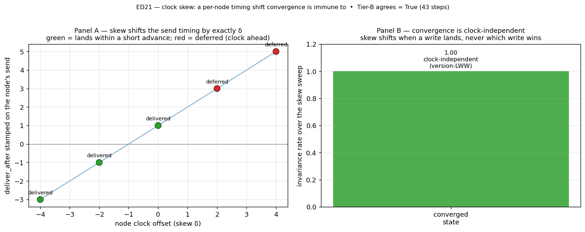](figures/ed21.png)<br>**Clock skew: a per-node timing shift convergence is immune to (SPEC-7 / ED21 / DS0 incr 14).** The **last** of the §3.4 medium faults — the fault grammar is now complete. **`clock_skew node δ`** offsets a node's local clock by a signed `δ`, which shifts the `deliver_after` it stamps on **every** message it sends (via `DistributedState.sender_clock`), with one omitted-when-empty `skew` map and no per-message state. **Left (Panel A — skew shifts the send timing by exactly δ):** a node's `deliver_after` moves on a slope-1 line with its offset — a *persistent* per-node property (every send shifted, unlike the one-shot `delay`), so a positively-skewed (ahead) node's write is deferred past a short `advance` while a behind/synced one lands within it. **Right (Panel B — convergence is clock-independent):** sweep the writer's skew and the converged state is **byte-identical** at every offset (invariance rate **1.0**). Because the protocol resolves conflicts by last-writer-wins on `(version, value)` — never on a wall-clock timestamp — skew shifts *when* a write is delivered but never *which* write wins. This is exactly the property deterministic-simulation testing (FoundationDB, madsim) injects clock skew to verify: a correct replicated store does not secretly depend on synchronized clocks (a timestamp-LWW store would diverge here; version-LWW cannot be fooled). Pure medium change, so Tier-A and Tier-B agree **bit-for-bit**; two clock-skew goldens pin it. | [](figures/ed20.png)<br>**The §3.4 fault medium, now complete (partition · crash · drop · delay · reorder · clock_skew).** With clock skew the unreliable-network grammar spans the full taxonomy SPEC-7 §3.4 named — every way a message or a clock can misbehave, each a deterministic, seed-replayable, Tier-B-verified, purely-additive function over the DS0-incr-1 core. The three timing faults form a coherent triple: `delay` defers *one channel's* messages (one-shot, recoverable), `reorder` permutes *one channel's* delivery order (observationally inert on convergence), and `clock_skew` is the *persistent per-node* analogue — it defers *everything a node sends*, for as long as its clock is wrong. And all three land on the same deep verdict the program's thesis predicts: under last-writer-wins by `(version, value)`, the medium can change *what you observe in flight and when*, but never *where the cluster converges*. Verification by the oracle is the invariant; the timing of the medium is not. The fault grammar is closed; the remaining DS0 work is the consensus/embedding layer (full Raft, host/net inside each node), not the network medium. |
| [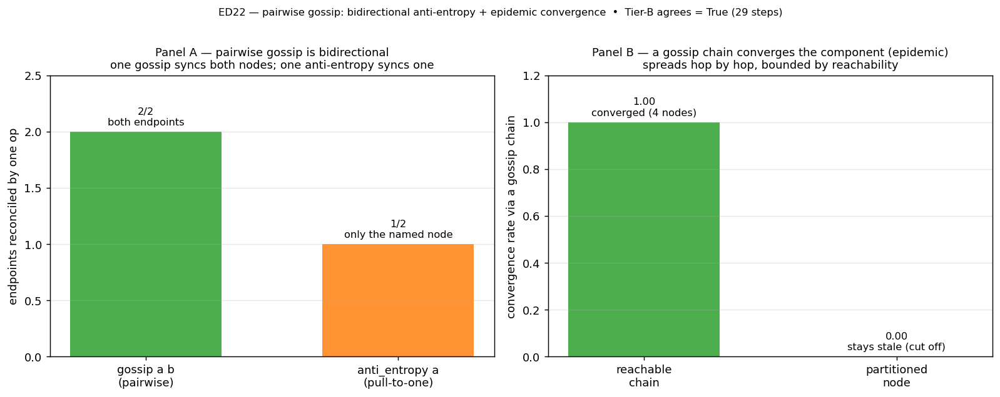](figures/ed22.png)<br>**Pairwise gossip: bidirectional anti-entropy and epidemic convergence (SPEC-7 / ED22 / DS0 incr 15).** The protocol layer gains the **pairwise** anti-entropy the §4 `ReplicaConverge` named — **`gossip a b`** reconciles *both* `a` and `b` to the per-object winner of their two replicas, the Merkle-tree sync real eventually-consistent stores (Dynamo, Cassandra) run between *pairs* of nodes, vs ED19's `anti_entropy` which pulls *one* node from its peers. It reuses the `ReplicaWrite` edit (no new state field) and is a pure coordinator-level reconciliation. **Left (Panel A — one gossip reconciles BOTH; one anti-entropy fixes one):** with `a` stale on object `x` and `b` stale on `y` (complementary holes), a single `gossip a b` fills *both* (2/2 endpoints synced), while a single `anti_entropy a` fills only `a`'s (1/2) — the one-directional vs bidirectional distinction, the reason real systems run pairwise anti-entropy, not just read-repair. **Right (Panel B — epidemic convergence, bounded by reachability):** a write dropped to *every* peer spreads hop by hop along a chain of pairwise gossips until the **entire reachable component** holds it (rate **1.0**), where `anti_entropy` would need every node to pull — and a node partitioned off the chain stays stale (gossip across a cut link is `unavailable`). Tier-A ≡ Tier-B bit-for-bit, the `cycle`/`symbolic` tiers deferring its multi-version jump to bit-exact like `anti_entropy`. | [](figures/ed19.png)<br>**Two convergence mechanisms, now both present (pull and pairwise-sync).** Real eventually-consistent stores run *two* anti-entropy mechanisms, and the distributed world now has both. ED19's **`anti_entropy node`** is **read-repair**: a one-directional *pull* that brings a single node up to the latest among its reachable peers — the on-read reconciliation that repairs a stale replica the moment it is queried. ED22's **`gossip a b`** is the **Merkle-tree background sync**: a pairwise *push-pull* that reconciles both endpoints at once, so a sweep of pairwise gossips converges the whole cluster epidemically without any reads. The pair completes the Dynamo/Cassandra convergence story: a write replicates asynchronously (`advance`), a `drop` breaks it, and either read-repair (one node, on query) or pairwise gossip (both nodes, in the background) restores it — each a deterministic, seed-replayable, Tier-B-verified, purely-additive `ReplicaWrite`-only function over the core, differing only in *who* reconciles *whom* and *when*. |
| [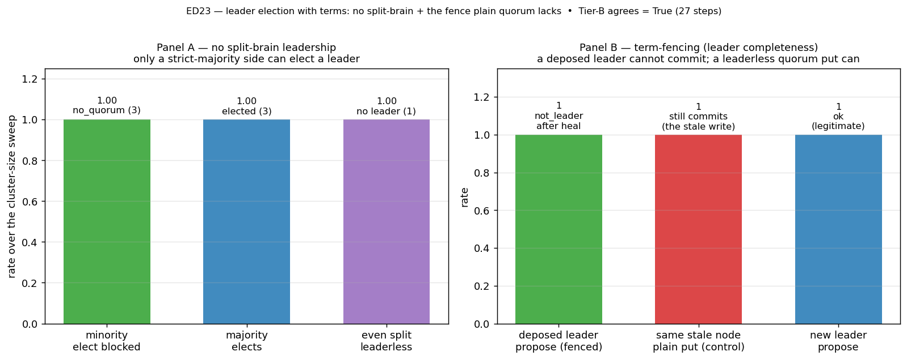](figures/ed23.png)<br>**Leader election with terms: no split-brain, and the fence a leaderless quorum write lacks (SPEC-7 / ED23 / DS0 incr 16).** The **third action family** ships — the Raft-subset consensus core, the `ProtocolStep`/`ProtocolState` the spec named since increment 1. **`elect node`** makes a node the cluster leader **iff its partition side holds a strict majority of the *live* nodes**, bumping a monotone `term`; **`propose node key val`** is a **leader-fenced** majority write. It adds the one safety property a leaderless `quorum` write cannot give — a single, fenced writer — and the oracle verifies it bit-exact. **Left (Panel A — no split-brain leadership):** across a cluster-size sweep, only a strict-majority side can `elect` (minority blocked, rate **1.0**; majority elects, **1.0**), and an even `2 | 2` split is **leaderless rather than forked** (neither side elects, **1.0**) — two leaders are structurally impossible, not merely improbable. **Right (Panel B — term-fencing / leader-completeness):** a leader deposed by a higher-term election on the majority side is rejected (`not_leader`) **even after the partition heals** (fenced, rate **1.0**), whereas a plain `put` by that same stale coordinator *still commits* (the control, **1.0**) — the stale write the fence exists to stop; the legitimate new leader commits (**1.0**). Two omitted-when-default state fields (`term`/`leader`), one `ProtocolStep` edit, shared `elect_edits`/`propose_edits` so **Tier-A ≡ Tier-B bit-for-bit**, and two reference-free metamorphic invariants (term-monotone, known-leader) — purely additive, every prior golden/hash/tokenization unchanged. | [](figures/ed14.png)<br>**Two layers of no-split-brain, now both present (the data fork and the writer fork).** ED14's **`quorum`** model already prevented a *data* fork — only a majority side can commit a write, so a key never diverges — but it is **leaderless**: *any* coordinator that reaches a majority may write, so two coordinators on the same majority (across time, around a partition) can both think they are in charge. ED23 adds the missing layer: a single elected **leader** with a monotone **term**, so there is one fenced writer and a deposed leader is locked out by the higher term — the Raft *leader-completeness* guarantee `quorum`-alone cannot express. Together they are the full consensus safety story: `quorum` keeps the *data* single-valued, `elect`/`propose` keep the *writer* single — each a deterministic, seed-replayable, Tier-B-verified, purely-additive function over the core, the compositional discipline carrying the distributed world from replicated KV to a leader-elected, term-fenced consensus group. |
| [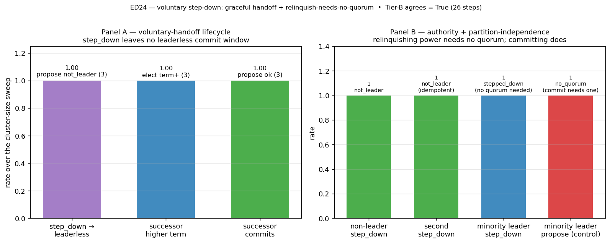](figures/ed24.png)<br>**Voluntary step-down: the graceful handoff, and relinquish-needs-no-quorum (SPEC-7 / ED24 / DS0 incr 17).** The consensus family's **leadership lifecycle closes**: **`step_down node`** lets the *current* leader hand back power on its own, leaving the cluster **leaderless at the same `term`** — the voluntary counterpart to ED23's *involuntary*, higher-term deposition. **Left (Panel A — the handoff lifecycle):** across a cluster-size sweep, after `step_down` the same node's `propose` is rejected (`not_leader`, rate **1.0**) — the term machinery admits **no leaderless commit window** — and a fresh `elect` of a successor lands at a strictly higher term (**1.0**) and commits (**1.0**); a clean handoff is exactly `step_down` then `elect <successor>`. **Right (Panel B — authority + partition-independence):** only the current leader may step down (a non-leader is rejected, **1.0**; a second `step_down` is a no-op reject, **1.0** — idempotently safe), and the sharp case — a leader **stranded in a minority can still step down** (**1.0**) where its `propose` there is `no_quorum` (the control, **1.0**). Relinquishing power reads only the node's own leadership, never the medium, so it is always safe; *exercising* it needs a quorum — the asymmetry consensus rests on. Reuses the `ProtocolStep` edit (`leader → None`, no new state field), so every prior golden/hash is unchanged; **Tier-A ≡ Tier-B bit-for-bit** via the shared `step_down_edits`. | [](figures/ed23.png)<br>**The leadership lifecycle, now whole (deposition and voluntary handoff).** ED23 gave the *involuntary* half: a leader **deposed** by a higher-term `elect` is fenced even after heal (leader-completeness). ED24 gives the *voluntary* half: a leader that **steps down** relinquishes at the same term, and the same term machinery refuses any `propose` until a successor is elected — so the leaderless gap a graceful handoff opens is closed by exactly the mechanism that fences a deposed one. Together `elect`/`propose`/`step_down` are the full Raft-subset leadership story — election, leader-fenced commits, deposition, and graceful handoff — each a deterministic, seed-replayable, Tier-B-verified, purely-additive `ProtocolStep` over the core, and each pinned by a golden. What remains deferred is Raft *log-matching* (the replicated commit-index log); the safety properties that distinguish consensus from a leaderless `quorum` write are already present and verified. |
| [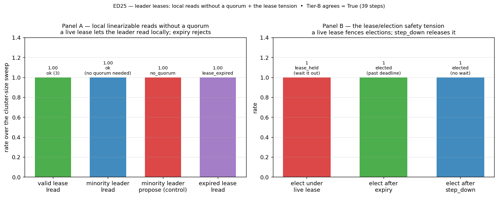](figures/ed25.png)<br>**Leader leases: local linearizable reads without a quorum, and the lease/election safety tension (SPEC-7 / ED25 / DS0 incr 18).** The Raft **leader lease** — a read optimization on the `elect`/`propose`/`step_down` core. **`lease node dt`** lets the *current* leader take a read lease through global clock `+ dt`; **`lread node key`** then serves a **local linearizable read with no quorum round-trip** while the lease holds (safe because the leader is always in a `propose`'s commit majority, and a live lease guarantees its term is uncontested). **Left (Panel A — local reads without a quorum):** a live lease serves `lread` (rate **1.0**), and the sharp case — a leader **partitioned into the minority can still `lread`** locally (**1.0**) where its `propose` there is `no_quorum` (the control, **1.0**): the read-availability the lease buys, exactly when a quorum is out of reach. Once the clock passes the deadline the same read is rejected `lease_expired` (**1.0**) — renew, or fall back to a quorum read. **Right (Panel B — the lease/election safety tension):** a fresh `elect` is fenced `lease_held` while the incumbent's lease is live (a successor must **wait it out**, **1.0**) and succeeds past expiry (**1.0**) — leadership cannot change hands under a live lease, which is *what makes the local read safe*; and a voluntary `step_down` **releases** the lease, so a graceful handoff elects with no wait (**1.0**) where a crashed leader forces the cluster to outlast it. One omitted-when-default `lease_until` field + one `LeaseSet` edit, **Tier-A ≡ Tier-B bit-for-bit**, purely additive. | [](figures/ed24.png)<br>**The read optimization, and why it needs the lifecycle (handoff ↔ lease).** A `propose` write and a quorum `get` both pay a majority round-trip; the lease is how Raft makes *reads* cheap — the leader answers locally. But a local read is only safe if the leader is *sure* it is still the leader, and that is exactly what the lifecycle provides: the lease couples to `elect` (a successor must wait out the lease, so two leaders never serve reads at once) and to `step_down` (a graceful handoff *releases* the lease, so the wait is only paid on a *crash*). So ED25 is not a new safety property bolted on — it is the read-side payoff of the ED23/ED24 leadership machinery: election + fencing + handoff make it sound for a leader to skip the quorum on a read, and the lease is the time-bounded certificate that it may. Each op a deterministic, seed-replayable, Tier-B-verified, purely-additive function over the core. |
| [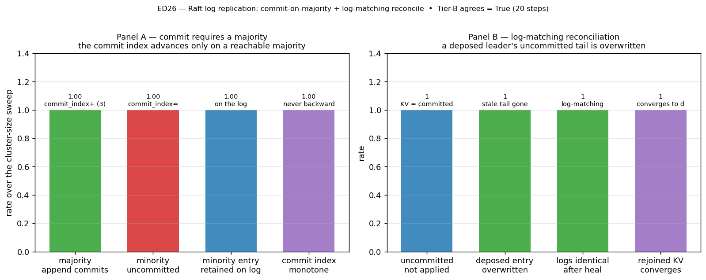](figures/ed26.png)<br>**Raft log replication: commit-on-majority, and log-matching reconciliation (SPEC-7 / ED26 / DS0 incr 19).** The replicated **log** the spec named since increment 1 — the piece the one-shot `propose` (incr 16) elided. **`append node key val`** appends a `(term, index, key, value)` entry to the leader's log, replicates it to the reachable followers (who **adopt the leader's prefix**, overwriting any divergent uncommitted tail), and commits it — folding it into the KV state machine — **iff a majority holds it**. **Left (Panel A — commit requires a majority):** a majority-reachable `append` commits (the monotone `commit_index` grows, **1.0**); a leader **stranded in the minority** appends to its own log but it stays **uncommitted** (commit index unchanged, **1.0**) yet is **retained on the log** (**1.0**) — not lost, just not durable; the commit index never moves backward (**1.0**). **Right (Panel B — log-matching reconciliation):** the safety the one-shot `propose` lacked — while uncommitted, the stale entry is **never applied to the KV** (**1.0**); after a higher-term leader commits a *conflicting* entry at the same index and the partition heals, the deposed leader's uncommitted entry is **overwritten** (**1.0**), all live nodes hold an **identical log** (the log-matching property, **1.0**), and the rejoined node's KV converges to the committed value (**1.0**). Per-node `logs` + a monotone `commit_index` (omitted until the first `append`) + a `LogSet`/`CommitIndexSet` edit pair, a metamorphic commit-index-monotone invariant, **Tier-A ≡ Tier-B bit-for-bit**. | [](figures/ed14.png)<br>**Three layers of no-split-brain, now all present (data, writer, history).** ED14's `quorum` kept the *data* single-valued (only a majority side commits, so a key never forks); ED23's `elect`/`propose` kept the *writer* single (one fenced leader per term); ED26's `append` keeps the *history* single — the **committed log is identical on every node**, and a minority leader's uncommitted divergence is reconciled away when a higher-term leader's log wins. The progression is the whole Raft-subset safety argument in three increments: a value never forks (quorum), a writer never forks (leadership + term fencing), and a log never forks (log-matching + commit-on-majority). And it closes the loop on the one-shot `propose`: `propose` committed a *value* with no record of *order*; `append` commits an *ordered, reconcilable log* whose committed prefix is permanent and whose uncommitted tail is safely discardable — the difference between "the write happened" and "the write happened *here in history, durably*." Each op a deterministic, seed-replayable, Tier-B-verified, purely-additive function over the core, every property pinned by a golden. |
| [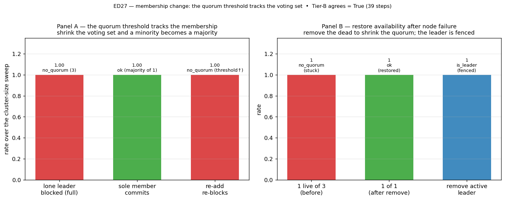](figures/ed27.png)<br>**Membership change: the quorum threshold tracks the voting set, and restoring availability (SPEC-7 / ED27 / DS0 incr 20).** The `add_replica`/`remove_replica` admin ops the §3.2 grammar named. They reconfigure the *consensus voting membership* (the nodes that count toward an election/commit quorum), a leader-committed change, so the **majority threshold follows the membership**. **Left (Panel A — the threshold tracks the votes):** a leader partitioned **alone** is a minority of the full cluster, so its `propose` is `no_quorum` (**1.0**); `remove_replica` the unreachable nodes until it is the sole member and the *same* lone leader commits (a majority of 1, **1.0**) — availability with no change in reachability, purely from shrinking the voting set; `add_replica` a node back raises the threshold and re-blocks it (**1.0**). **Right (Panel B — restore availability):** a 3-node cluster loses 2 nodes to crashes and the lone survivor is stuck (`no_quorum`, majority-2-of-3, **1.0**); `remove_replica` the two dead nodes and it commits again (majority-1-of-1, **1.0**) — the standard operator lever to recover from lost quorum. The change is fenced: the **active leader cannot be removed** (`is_leader`, **1.0** — step it down first), so a reconfiguration never strands the cluster leaderless mid-write. One omitted-when-default `members` voting set (empty = "all vote") + one `MemberSet` edit, a metamorphic members-subset invariant, **Tier-A ≡ Tier-B bit-for-bit**, purely additive. | [](figures/ed14.png)<br>**A static frontier made movable (the quorum threshold becomes a control surface).** ED14 plotted the `quorum` **availability frontier** — the commit rate steps from 0 to 1 exactly at the majority threshold, a *fixed* property of a fixed cluster. ED27 makes that threshold itself a **control surface**: `remove_replica`/`add_replica` slide the majority line left or right under the operator's hand. The same partition that was a minority (no_quorum) at 5 members is a majority once the cluster shrinks to 3 — the cluster did not heal, the *bar* moved. This is the operational counterpart to ED14's measurement: ED14 says *where* the availability cliff is for a given membership; ED27 says *you can move the cliff* by reconfiguring who votes, which is exactly how an operator restores progress after losing nodes — remove the dead, and the survivors are a majority again. The Raft-subset is now complete through dynamic reconfiguration: election, fencing, the handoff lifecycle, the lease read, the replicated log, and membership change — each a deterministic, seed-replayable, Tier-B-verified, purely-additive function over the core, every property pinned by a golden. |
| [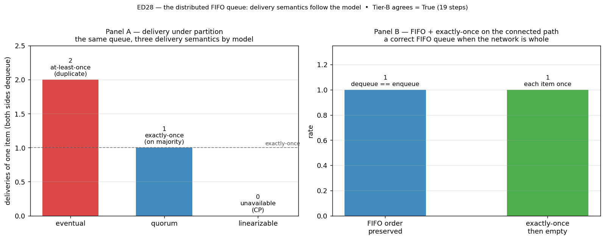](figures/ed28.png)<br>**The distributed FIFO queue: delivery semantics follow the consistency model (SPEC-7 / ED28 / DS0 incr 21).** The §3.2 `enqueue`/`dequeue` client ops — a **second data type** beside the KV store. The headline: a queue's delivery guarantee is not a property of the queue but of the consistency model it runs under. **Left (Panel A — delivery under partition):** one item is enqueued under full connectivity (so every replica holds it), the cluster partitions, and each side dequeues. The item is delivered **twice under `eventual`** (at-least-once / duplicate — the head-removal never crosses the split, so the peer re-delivers), **once under `quorum`** (exactly-once on the majority side; the minority `unavailable`), and **zero times under `linearizable`** (both sides lack all-replica reachability → both `unavailable`). Delivery count **2 → 1 → 0** as the model strengthens — the KV fork-vs-availability tradeoff (ED14) restated in delivery-semantics form. **Right (Panel B — the connected happy path):** with full connectivity, `enqueue` of `a, b, c` then three `dequeue`s returns `a, b, c` **in order** (FIFO, **1.0**), each **exactly once**, then `empty` (**1.0**) — a correct FIFO queue when the network is whole, under every model. One omitted-when-default `queues` map + one `QueueSet` edit, queues now in the observable `cluster_view`, **Tier-A ≡ Tier-B bit-for-bit** (the duplicate is reproduced on the autonomous actors too), purely additive. | [](figures/ed14.png)<br>**One CAP tradeoff, two data types (the KV fork ↔ the queue duplicate).** ED14 showed the consistency models as a *KV* availability/safety frontier: `eventual` forks a key under a partition (available, divergent), `quorum`/`linearizable` refuse to fork (consistent, less available). ED28 shows the *same* models are a **delivery-semantics frontier for a queue**: `eventual` duplicates an item (available, at-least-once), `quorum`/`linearizable` refuse to duplicate (exactly-once, less available). The mechanism is identical — the `_queue_available` gate is the queue's version of the KV write's availability check — so the queue inherits the whole consistency curriculum (`eventual`/`causal`/`quorum`/`linearizable`) for free, and the lesson generalizes: **a data type's safety guarantee under partition is the consistency model's, not the type's.** A KV fork and a queue duplicate are the same phenomenon seen through two data structures, each a deterministic, seed-replayable, Tier-B-verified, purely-additive function over the core. |
| [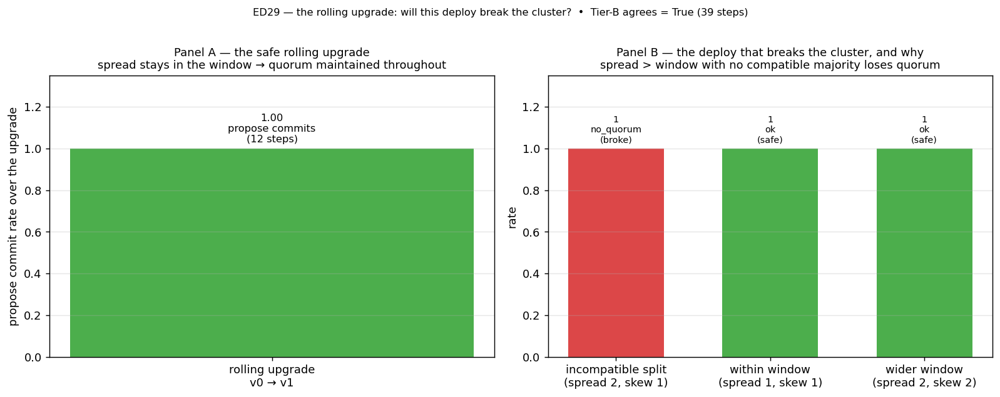](figures/ed29.png)<br>**The rolling upgrade: will this deploy break the cluster? (SPEC-7 / ED29 / DS0 incr 22).** The `deploy` admin op answers the question SPEC-7 names in its *introduction* (§1: *"will this config push break the cluster?"*) — the first increment to model the headline operational scenario. **`deploy node version`** sets a node's running software version, and two nodes share a consensus quorum only if their versions are within `max_version_skew` (default **1**, the standard N-1 rolling-upgrade window). **Left (Panel A — the safe rolling upgrade):** across a cluster-size sweep, rolling every node `v0 → v1` one at a time, a `propose` commits after *every* bump (rate **1.0**) — the version spread never leaves the window, so a compatible majority always exists. **Right (Panel B — the deploy that breaks the cluster, and why):** an incompatible split with **no compatible majority** (2 at `v0`, 2 at `v2`, spread `2 > 1`) turns the next `propose` into `no_quorum` (**1.0**) — the deploy broke the cluster. The diagnostic isolates the cause: the *same* shape is safe at a smaller spread (`v0`/`v1`, **1.0**) or under a wider configured window (`skew 2`, **1.0**) — it is the spread *exceeding the window*, not mixed versions per se. One omitted-when-default `versions` map + a `max_version_skew` config dial + one `VersionSet` edit, versions in the observable `cluster_view`, **Tier-A ≡ Tier-B bit-for-bit**, purely additive. | [](figures/ed14.png)<br>**From "what is the cluster?" to "what will this *change* do to it?" (the §7 plan-safety payoff).** The 22 DS0 increments built a faithful, deterministic model of a distributed system; ED29 is where that model starts earning its keep as a *decision tool*. SPEC-7's framing (§1, §7) is that the value of a cheap faithful world-model is answering **change-safety** questions before you run the change — *will this deploy / config push / failover break the cluster?* — and the §7 LLM-callable simulator scores exactly the delta in consistency-faithfulness between "before the change" and "after." ED29 makes the first such change first-class: a `deploy` is a *plan*, and the oracle says yes/no (does it lose quorum?) deterministically and for free, where a real cluster would have to actually roll the upgrade and risk the outage. This is the distributed instance of the whole program's thesis — a learned model proposes the plan, the oracle verifies whether it is safe — applied to the operational question an SRE actually asks. Each op a deterministic, seed-replayable, Tier-B-verified, purely-additive function over the core, every property pinned by a golden. |
| [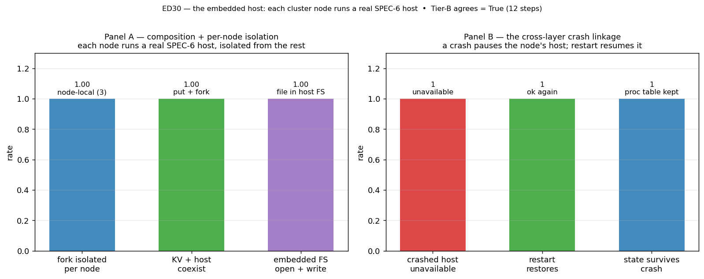](figures/ed30.png)<br>**The embedded host: each cluster node runs a real SPEC-6 host (SPEC-7 / ED30 / DS0 incr 23).** The compositional vision SPEC-7 names since increment 1 (§3.1/§4: a `HostDelta` on an embedded subsystem) — now a node is not just a bag of KV replicas but **runs a real SPEC-6 host**: a process table, per-process fd tables, and an embedded v0 filesystem. **`host node <syscall>`** (`fork`/`exit`/`kill`/`wait`/`setuid`/`open`/`write`/`read`/`close`/`dup`/`mkdir`/`chdir` — `read` + `kill` + `wait` added 2026-06: `read` closes the write/read round trip via a delegated FS `cat`; `kill` is the permission-gated inter-process terminate, root or same-uid; `wait` is the parent-only zombie **reap** that completes the spawn→run→die→reap lifecycle, collecting a dead child's exit status and freeing its table entry, pids never reused; `dup` added 2026-06: the fd-aliasing op — duplicate an open fd to the smallest free fd onto the **same path** (two fds onto one file, the shared-file coupling), reusing `FdOpen` with no new edit type; `mkdir` added 2026-06: adds **directory structure** to the embedded fs — delegates to the v0 `mkdir` (a `Create(path, Dir())` wrapped in `FsDelta`, the `write` pattern, no new edit type), so a later `write` into the subdir succeeds and a per-process `chdir` becomes meaningful; `chdir` added 2026-06: the per-process **working directory** — a relative `open`/`mkdir` resolves against it and a `fork` child inherits it (a `CwdChange`, the `setuid`/`CredChange` pattern; `ProcSpawn` and the learned-model token unchanged)) delegates to the SPEC-6 `ReferenceHostOracle` on that node's own host, wrapping its bundle delta in a `HostStep` edit. **Left (Panel A — composition + per-node isolation):** a `fork` runs on *that node's host only* (per-node isolation, **1.0**); a node serves a KV `put` *and* a host `fork` independently (the two subsystems coexist, **1.0**); and `open` + `write` + `read` round-trips a file in *that node's embedded v0 filesystem* — the composition runs three layers deep (cluster → host → FS, **1.0**). **Right (Panel B — the cross-layer crash linkage):** a `host` syscall on a **crashed** node is `unavailable` (**1.0**) — the same up/down gate the KV client ops obey, now reaching the host; `restart` resumes host ops (**1.0**), and the host **state survives the crash** (a pre-crash process persists, pids keep counting — **1.0**): a crash pauses the node, it does not wipe it. One omitted-when-empty per-node `hosts` map + one `HostStep` edit, hosts in the observable `cluster_view`, **Tier-A ≡ Tier-B bit-for-bit**, purely additive. | [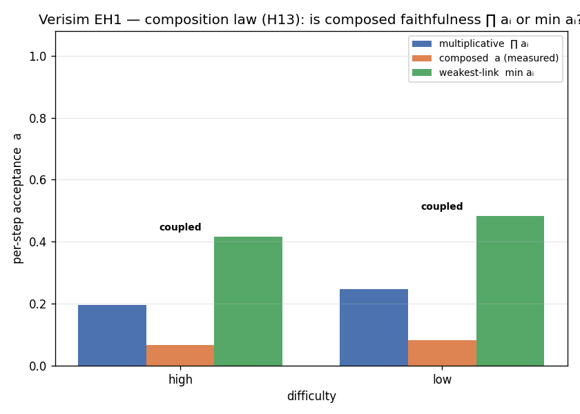](figures/eh1_composition.png)<br>**The whole-program composition closes a loop (v0 FS → SPEC-6 host → SPEC-7 cluster).** Verisim built three worlds bottom-up: the v0 **filesystem** (SPEC-2), the **composed host** that embeds that FS under a process table (SPEC-6), and the **distributed cluster** (SPEC-7). ED30 is where the top layer reaches down and embeds the middle one: a SPEC-7 node now *contains* a SPEC-6 host, which itself *contains* a v0 filesystem — and the `apply == oracle` invariant holds at all three layers simultaneously (the dist `apply` calls the host `apply` which calls the v0 `apply`, each verbatim). It is the same structural bet the whole program rests on — **a faithful oracle is a composition of faithful sub-oracles, and its correctness is the correctness of the parts plus the glue** (SPEC-6 §5.1) — now spanning the entire stack. The cross-layer crash linkage shows the layers are *coupled*, not just nested: a distributed fault (`crash`) propagates into the embedded host's availability. Each op a deterministic, seed-replayable, Tier-B-verified, purely-additive function over the core, every property pinned by a golden. |
| [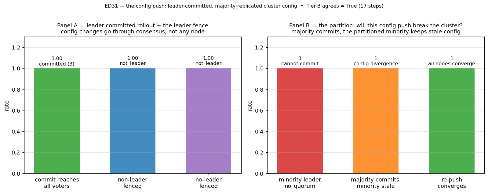](figures/ed31.png)<br>**The config push: will this config push break the cluster? (SPEC-7 / ED31 / DS0 incr 24).** The config-management admin op §3.2 names — SPEC-7's *other* headline operational question, the sibling of ED29's `deploy`. Unlike `deploy` (a node-local version *label* that gates consensus *compatibility*), **`config_push node key val`** is a **leader-committed, majority-replicated** cluster setting — a Raft-style config entry — so it shares the leader-fence + majority-reachability rule of `propose`/`append`. **Left (Panel A — leader-committed rollout + the leader fence):** across a cluster-size sweep, a push at the elected leader with full connectivity **commits and reaches every voting member** (rate **1.0**); a push by a **non-leader** is `not_leader` (**1.0**) and one with **no leader** is rejected (**1.0**) — config changes go through consensus, not any node that asks. **Right (Panel B — the partition):** a leader **stranded in the minority** gets `no_quorum` — the push **cannot commit and no node's config changes** (the all-or-nothing rule, **1.0**); a leader on the **majority** side **commits**, but the value reaches only the reachable majority, so the **partitioned minority retains its stale config** — *config divergence*, the broken-cluster outcome (**1.0**), repaired by a **re-push after `heal`** that converges every node (**1.0**). One omitted-when-empty per-(node, key) `config` map + one `ConfigSet` edit, config in the observable `cluster_view`, gating nothing in the data plane, **Tier-A ≡ Tier-B bit-for-bit**, purely additive. | [](figures/ed29.png)<br>**Two "will this break the cluster?" questions, two different mechanisms (deploy ↔ config_push).** SPEC-7's introduction names two operational change-safety questions; ED29 and ED31 answer both, and the contrast is the lesson. **`deploy`** (ED29) is a *node-local* version label with **no consensus** — you restart a node with new code without asking anyone — and it breaks the cluster *indirectly*, by making nodes version-*incompatible* so a quorum can no longer form. **`config_push`** (ED31) is the opposite shape: a *consensus-committed* cluster setting that breaks *directly under partition*, committing on the majority while the minority silently keeps stale config (config divergence). One fails by losing quorum, the other by splitting state — and a faithful model predicts *which* failure a given change will cause, before it is run. That is the §7 plan-safety payoff sharpened: the operator's two riskiest routine actions, both deterministic yes/no questions the free oracle answers. Each op a deterministic, seed-replayable, Tier-B-verified, purely-additive function over the core, every property pinned by a golden. |
| [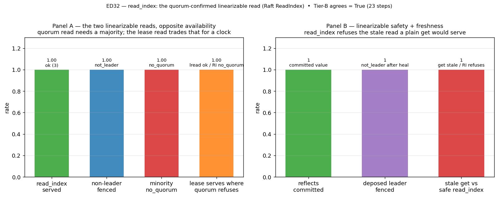](figures/ed32.png)<br>**The quorum-confirmed linearizable read: Raft ReadIndex, the partner to the lease read (SPEC-7 / ED32 / DS0 incr 25).** The *other* way Raft serves a linearizable read — the partner to the lease read **`lread`** (ED25). Where `lread` skips the quorum round-trip via a time **lease**, **`read_index node key`** keeps no clock assumption and instead **confirms leadership with a majority** before serving the read (the ReadIndex heartbeat round). **Left (Panel A — the two reads, opposite availability):** across a cluster-size sweep, a `read_index` at the leader with full connectivity serves the read (**1.0**); a **non-leader** is `not_leader` (**1.0**); a leader **stranded in a minority** is `no_quorum` (**1.0**) — it cannot confirm it is still leader, so it refuses. The sharp contrast: that same minority leader holding a **live lease** *can* serve `lread` locally (**1.0**) where its `read_index` is `no_quorum` — the read-availability the lease buys and the quorum read declines (and the clock dependence the quorum read avoids in return). **Right (Panel B — linearizable safety + freshness):** a `read_index` reflects the **latest committed value** after an `append` (**1.0**); a leader **deposed** by a higher-term election is `not_leader` on `read_index` **even after `heal`** (**1.0**) — *refusing* its now-stale local replica, where a plain `get` from that node **serves the stale value** (the read `read_index` exists to prevent), and the new leader's `read_index` returns the fresh committed value (**1.0**). A pure read (no state field, no edit type), majority read from the medium, **Tier-A ≡ Tier-B bit-for-bit**, purely additive. | [](figures/ed25.png)<br>**The two linearizable reads of Raft, now both present (lease ↔ quorum).** Raft serves a linearizable read two ways, and ED25 + ED32 are both halves. The **lease read** (`lread`, ED25) is *fast and locally available* — no round-trip, served even in the minority while the lease holds — but it rests on a **clock** assumption (bounded drift). The **quorum read** (`read_index`, ED32) is the opposite trade: it pays a **majority round-trip** (so it is unavailable in the minority) but assumes **no clock**, deriving its safety purely from confirming leadership with a live majority. They are the two points on the read-consistency design surface an operator actually chooses between — latency-and-availability vs. no-clock-dependence — and a faithful model must predict *both* refusals (the lease read's `lease_expired`, the quorum read's `no_quorum`) and the shared safety (neither serves a deposed leader's stale replica, where a plain `get` would). Each a deterministic, seed-replayable, Tier-B-verified, purely-additive function over the core, every property pinned by a golden. |
| [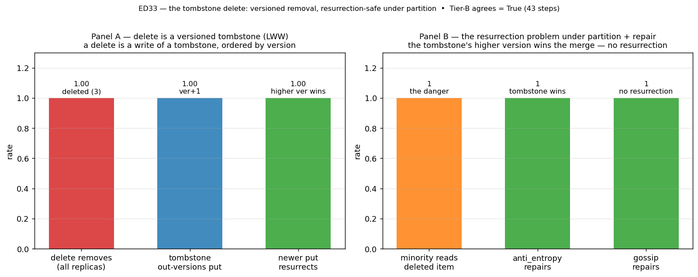](figures/ed33.png)<br>**The tombstone delete: versioned removal and the resurrection problem (SPEC-7 / ED33 / DS0 incr 26).** The fundamental KV **remove** the grammar lacked — and a canonical distributed hazard. A **`delete node key`** is a *versioned write of a tombstone* (it reuses the `put` replication path with the `TOMBSTONE` value), **not** a removal of the replica: the deleted key keeps a replica at a bumped version, so last-writer-wins orders the delete against concurrent/stale writes by version. **Left (Panel A — the versioned tombstone, LWW):** across a cluster-size sweep, `put` then `delete` leaves every replica reading `deleted` (**1.0**); the tombstone **out-versions the put it deleted** (**1.0**); and a *genuinely newer* `put` (a higher version than the tombstone) **legitimately brings the key back** (**1.0**) — a new write, not a resurrection. **Right (Panel B — the resurrection problem under partition + repair):** a `delete` on the majority side leaves the partitioned **minority still reading the old value** (the deleted item is "still there" — the danger, **1.0**); after `heal`, the tombstone's higher version **wins the merge**, so `anti_entropy` (**1.0**) and pairwise `gossip` (**1.0**) converge the minority to `deleted` rather than resurrecting it — the bug a naive removal would cause. A `get` on a tombstoned replica reports `deleted`. The tombstone is just a replica value (no state field, no edit type), **Tier-A ≡ Tier-B bit-for-bit**, purely additive. | [](figures/ed14.png)<br>**Why "delete" is the hardest write (the absence that must out-version a presence).** A `put` and a `delete` look like opposites, but in a replicated store the delete is the *harder* one: a write replaces a value with a value, while a delete must replace a value with an **absence** — and an absence has no version to win a merge with. The whole-program lesson the prior consistency increments (ED13/ED14) established was that **convergence is last-writer-wins by version**; ED33 shows that a *correct* delete is exactly the move that keeps an absence inside that same versioned framework (a tombstone is an absence with a version), so it converges by the very same rule instead of needing a special case. The naive alternative — actually removing the replica — drops out of the version order and resurrects under partition, which is why real systems (Dynamo, Cassandra) carry tombstones. It is the same insight the `quorum`/`eventual` curriculum taught, applied to the one operation where "do nothing special" silently corrupts: each a deterministic, seed-replayable, Tier-B-verified, purely-additive function over the core, every property pinned by a golden. |
| [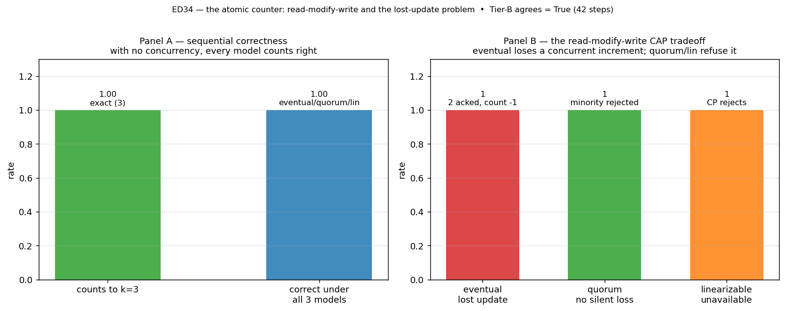](figures/ed34.png)<br>**The atomic counter: read-modify-write and the lost-update problem (SPEC-7 / ED34 / DS0 incr 27).** The first *read-modify-write* client op (`put`/`cas`/`delete` are blind or compare writes), and the canonical case where eventual-consistency last-writer-wins **silently loses updates**. An **`incr node key`** reads the coordinator's local counter (a non-numeric/absent value is `0`) and writes `count + 1` at a bumped version, reusing the `put` replication path. **Left (Panel A — sequential correctness):** across a cluster-size sweep, `incr` applied `k` times counts to exactly `k` (**1.0**), and the same sequence is correct under **all three** consistency models (with no concurrency, every model counts right). **Right (Panel B — the read-modify-write CAP tradeoff):** two `incr`s on opposite sides of a partition — under **`eventual`** both are *acknowledged* yet the count ends up **short by one** (a *lost update*, the danger, **1.0**); under **`quorum`** the minority is **`unavailable`** so only the accepted increment counts (no silent loss, **1.0**); under **`linearizable`** an `incr` under any partition is **`unavailable`** (CP, **1.0**). The counter is just a digit-valued replica (no state field, no edit type), **Tier-A ≡ Tier-B bit-for-bit**, purely additive. | [](figures/ed14.png)<br>**Why a counter is strictly harder than a blind write (stale is recoverable; lost is not).** ED14 mapped the consistency models as a *blind-write* availability/safety frontier: under `eventual` a `put` that loses a race leaves a replica **stale** — and stale is *recoverable* (a newer write or anti_entropy fixes it). ED34 shows the same models are a frontier for a *read-modify-write*, and there the failure is **worse**: a lost `incr` is **gone**, because both sides read the same count and write the same next version, so the merge silently drops one increment — no later repair can recover a number that was never written. This is the precise reason "you can't build a counter on last-writer-wins," and it sharpens the whole-program CAP lesson: the *operation class* (blind vs read-modify-write), not just the consistency model, determines whether a partition merely delays correctness or destroys it. The loss-free fix is a CRDT/PN-counter (built next, ED35); the value here is the **first-class negative** the simple model exhibits — each a deterministic, seed-replayable, Tier-B-verified, purely-additive function over the core, every property pinned by a golden. |
| [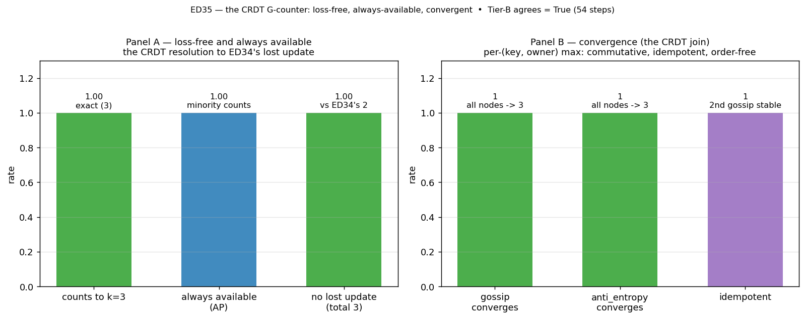](figures/ed35.png)<br>**The CRDT G-counter: the loss-free, always-available resolution to ED34 (SPEC-7 / ED35 / DS0 incr 28).** The *positive that resolves ED34's negative*. A **state-based CRDT** counter: each node keeps a per-owner vector of monotone sub-counts, **`cincr n key`** bumps *only `n`'s own* sub-count (**`cget`** reads the sum), and the CRDT **join is the per-(key, owner) max** applied by `anti_entropy`/`gossip` — commutative, associative, idempotent. **Left (Panel A — loss-free + always available):** across a cluster-size sweep `cincr` `k` times reads back `k` (**1.0**); under a partition **three** `cincr`s (two majority, one on the partitioned minority) are *all* acknowledged — including the minority one a LWW `quorum`/`linearizable` `incr` would reject (**always available, 1.0**) — and after `heal`+`gossip` the counter reads exactly **3** (**no lost update, 1.0**) where ED34's LWW counter read 2. **Right (Panel B — convergence):** the join converges **every** node to the full total — a `gossip` chain spreads it epidemically (**1.0**), `anti_entropy` reaches the same (**1.0**), and the join is **idempotent** (a second `gossip` is a no-op, **1.0**). One omitted-when-empty `gcounters` map + one `GCounterSet` edit, **Tier-A ≡ Tier-B bit-for-bit**, purely additive. | [](figures/ed34.png)<br>**A matched negative/positive pair: why CRDTs exist (ED34 ↔ ED35).** ED34 and ED35 are deliberately the *same scenario* with two data types, and the contrast is the whole lesson. The LWW `incr` (ED34) is **available but lossy** under `eventual` (both increments acknowledged, one silently dropped) and **safe but unavailable** under `quorum`/`linearizable` (the minority is refused) — you must pick. The CRDT `cincr` (ED35) escapes the dilemma: it is **both** available *and* loss-free, because it changes the *data type*, not the consistency model — each node owns a sub-count only it writes, so there is never a conflict to resolve, and merge-by-max is associative/commutative/idempotent so any gossip order converges. This is the canonical argument for CRDTs (Shapiro et al.), recovered here as a banked pair: the simple counter's first-class negative (ED34) and the convergent counter's positive (ED35), both deterministic, seed-replayable, Tier-B-verified, purely-additive functions over the core, every property pinned by a golden. The honest scope: this is a grow-only G-counter; a decrementable PN-counter pairs two of them, built next (ED36). |
| [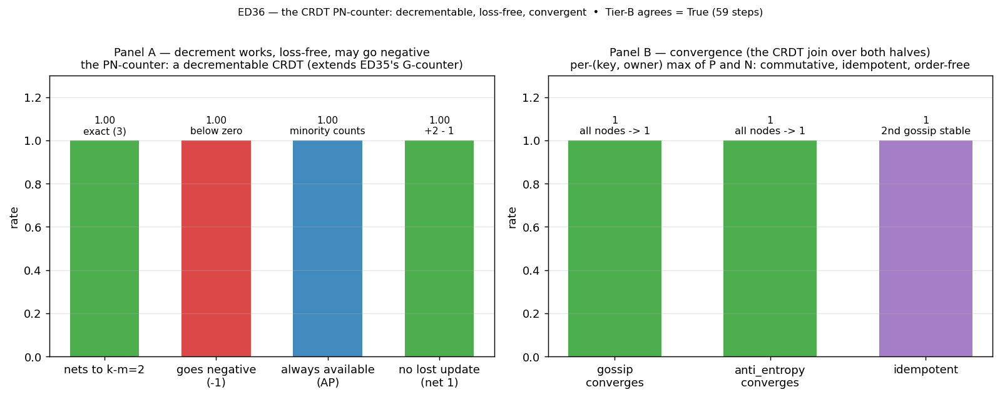](figures/ed36.png)<br>**The CRDT PN-counter: a decrementable counter that still converges loss-free (SPEC-7 / ED36 / DS0 incr 29).** The decrement that turns ED35's grow-only G-counter into a full **PN-counter**. A G-counter only goes up; a PN-counter pairs **two** G-counters — `P` (the `cincr` half) and `N` (the `cdecr` half) — and reads **`P − N`**. **`cdecr n key`** is the exact twin of `cincr` over the N half: it bumps *only `n`'s own* decrement sub-count, so it inherits every property that made the G-counter work — node-local, **always available**, single-writer-per-entry, merged by the same per-(key, owner) **max** join over *both* halves. **Left (Panel A — decrement works, loss-free, may go negative):** across a cluster-size sweep `k` `cincr`s then `m` `cdecr`s read back **`k − m`** (**1.0**); a fresh `cdecr` reads **−1** — the value goes **below zero** where a grow-only G-counter cannot (**1.0**); a partitioned-minority `cdecr` is acknowledged (**always available, 1.0**); and the concurrency contrast — **two** `cincr`s (majority) and **one** `cdecr` (minority) all count, and after `heal`+`gossip` the counter reads exactly **+2 − 1 = 1** (**no lost update across both halves, 1.0**). **Right (Panel B — convergence):** the join over both halves converges **every** node to the net — a `gossip` chain spreads it epidemically (**1.0**), `anti_entropy` reaches the same net (**1.0**), and the join is **idempotent** (**1.0**). One omitted-when-empty `ncounters` map + one `NCounterSet` edit, **Tier-A ≡ Tier-B bit-for-bit**, purely additive over increment 28. | [](figures/ed35.png)<br>**From grow-only to decrementable: the CRDT counter completed (ED35 → ED36).** ED35 shipped a **G-counter** — loss-free and always-available, but it can only count *up*. Many real counters need to go down too (inventory, reference counts, balances), and the naive fix — letting a sub-count decrement — breaks the CRDT's monotonicity and resurrects the lost-update problem the G-counter solved. The textbook resolution is the **PN-counter**: keep the increments and decrements as *two separate* grow-only G-counters and subtract them. ED36 recovers exactly that move, and the payoff is that *nothing else changes* — `cdecr` reuses `cincr`'s machinery verbatim over a second map, the merge is the same max-join run twice, and every property (always-available, loss-free, convergent, idempotent) carries over for free — while gaining the one the G-counter structurally lacked: a value that can dip **below zero** (the sub-counts stay monotone and non-negative; only their *difference* goes negative, which the metamorphic tier enforces precisely). The canonical CRDT-design lesson — *compose monotone pieces, never mutate one destructively* — banked as the positive completion of the counter arc. Each a deterministic, seed-replayable, Tier-B-verified, purely-additive function over the core, every property pinned by a golden. |
| [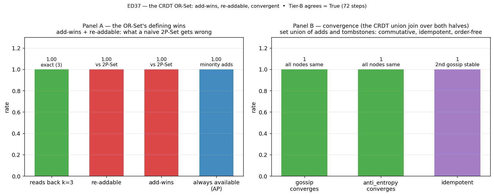](figures/ed37.png)<br>**The CRDT OR-Set: the canonical interesting CRDT, a replicated set done right (SPEC-7 / ED37 / DS0 incr 30).** The data type a naive replicated set gets wrong. An element-level **2P-Set** (a grow-only add-set + remove-set) is **remove-wins** (a concurrent add and remove resolve to *absent*) and can **never re-add** a removed element. The **observed-remove set** fixes both with a **unique dot**: **`sadd n key elem`** tags the element with a fresh `(owner=n, seq)` dot and stores it in `n`'s observed add-set; **`srem n key elem`** tombstones *only the dots `n` has observed*; **`smembers`** is the elements with a non-tombstoned dot. The join is **set union** of both halves (commutative, associative, idempotent). **Left (Panel A — the defining wins):** across a cluster-size sweep `sadd`-ing `k` distinct elements reads back all `k` (**1.0**); a removed element is **re-addable** (`srem` then `sadd` returns it, **1.0**) where a 2P-Set cannot; **add wins** — an element present cluster-wide, re-added at `n0` (a fresh dot) while `n3` removes the dot it saw, **survives** `heal`+`gossip` (**1.0**) where a 2P-Set would drop it; and `sadd` is **always available** (a partitioned-alone node still adds, **1.0**). **Right (Panel B — convergence):** from a diverged state the union join converges **every** node to the same set — a `gossip` chain epidemically (**1.0**), `anti_entropy` on each node (**1.0**), idempotently (**1.0**). Two omitted-when-empty `orset_adds`/`orset_tombs` maps + the `ORSetAdd`/`ORSetTomb` edits, **Tier-A ≡ Tier-B bit-for-bit**, purely additive. | [](figures/ed36.png)<br>**The CRDT data-type ladder: counter → set (ED35/36 → ED37).** The counters (ED35 G-counter, ED36 PN-counter) and the set (ED37 OR-Set) are the two canonical CRDT families, and ED37 is where the program leaves *numbers* for *collections* — the harder design problem, because a set has an identity question a counter does not: *when is this the same element?* The 2P-Set answers "same element = same value," and that single choice is what makes it remove-wins and un-re-addable. The OR-Set's insight is that **identity belongs to the dot, not the value** — every `sadd` is a distinct event with its own `(owner, seq)`, and a remove can only erase the events it has *seen*. That one move dissolves both defects at once: a concurrent add is a *new* event the remover never saw (so it wins), and a re-add is *also* a new event (so it works). It is the same compositional lesson the counters taught — *build from monotone, single-writer pieces and merge by a lattice join* (here set-union instead of max) — now carrying the program's CRDT coverage from registers and counters to sets, the structure most real replicated state actually needs. Each a deterministic, seed-replayable, Tier-B-verified, purely-additive function over the core, every property pinned by a golden. |
| [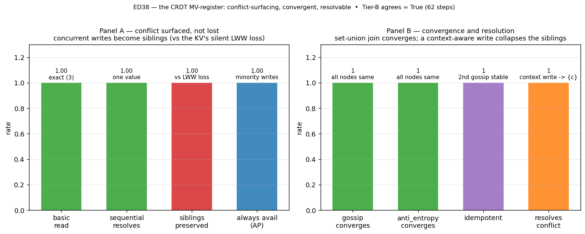](figures/ed38.png)<br>**The CRDT MV-register: concurrent writes surface as siblings, not silent loss (SPEC-7 / ED38 / DS0 incr 31).** The Dynamo/Riak data type that **surfaces** a write conflict instead of silently dropping one. Where the KV `put` and the counters resolve concurrent writes by last-writer-wins (one survives, one is lost — ED14/ED34), the **multi-value register** keeps *both* as **siblings** and lets a later reader resolve them. It reuses the OR-Set's dot/union machinery: **`mvput n key val`** tags `val` with a fresh dot, **tombstones every dot it currently observes** (a write supersedes the values it saw), and adds its own; **`mvget n key`** reads the surviving (non-tombstoned) sibling values. **Left (Panel A — conflict surfaced, not lost):** across a cluster-size sweep `mvput` then `mvget` reads back the value (**1.0**); a *sequential* overwrite **resolves** to one value (**1.0**); but two *concurrent* `mvput`s on opposite sides of a partition — neither observing the other — **both survive** as siblings after `heal`+`gossip` (**1.0**), where a LWW `put` keeps only one (the conflict is *visible*); and `mvput` is **always available** (a partitioned-alone node still writes, **1.0**). **Right (Panel B — convergence and resolution):** the union join converges **every** node to the same sibling set — `gossip` epidemically (**1.0**), `anti_entropy` per node (**1.0**), idempotently (**1.0**) — and a later context-aware `mvput` (observing both siblings) **resolves** them, so every node reads the single new value (**1.0**, the Dynamo read-and-resolve). Two omitted-when-empty `mvreg_vals`/`mvreg_tombs` maps + the `MVRegWrite`/`MVRegTomb` edits, **Tier-A ≡ Tier-B bit-for-bit**, purely additive. | [](figures/ed37.png)<br>**The CRDT family, completed: counter → set → register (ED35/36 → ED37 → ED38).** Verisim's CRDT coverage now spans the three canonical families, and the MV-register is where they compose. The counters (ED35/36) merge by **max**; the OR-Set (ED37) merges by **set-union over dots**; the MV-register reuses that *exact* union machinery for a different question — not "which elements are in the set?" but "which values is this register currently?" The elegant part is that the OR-Set and MV-register differ by a *single line* of op semantics: a `sadd` adds a dot, an `mvput` adds a dot **and tombstones everything it observed**. That one change turns "a set you add to and remove from" into "a register that overwrites — except when it can't decide." And the payoff is the property neither LWW nor a counter can give: a conflict that is **not silently resolved** but **surfaced** to the application, which is exactly what Dynamo's shopping cart, Riak's siblings, and every "your edit conflicts with another" merge UI are built on. The same compositional lesson — *monotone, single-writer pieces merged by a lattice join* — now yields conflict-surfacing for free. Each a deterministic, seed-replayable, Tier-B-verified, purely-additive function over the core, every property pinned by a golden. |
| [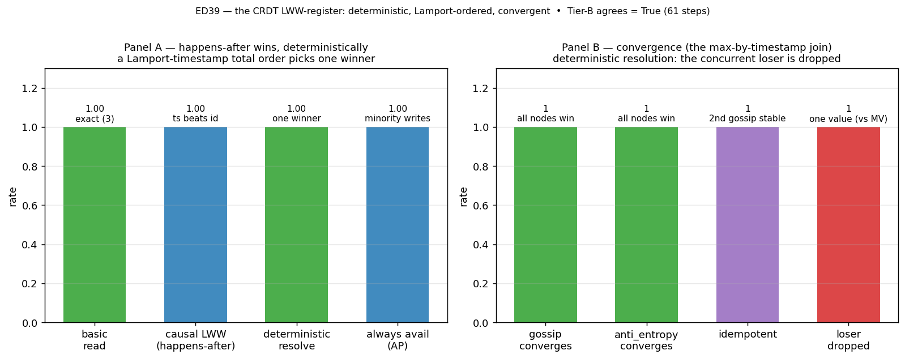](figures/ed39.png)<br>**The CRDT LWW-register: deterministic single-value resolution by a Lamport-timestamp order (SPEC-7 / ED39 / DS0 incr 32).** The *policy-opposite* of ED38's MV-register: where the MV-register **surfaces** a write conflict as siblings, the LWW-register **deterministically picks one winner**. The mechanism is a **Lamport clock** — a per-node logical counter that makes "happens-after" a comparable order without a real clock (which a partitioned cluster cannot share, HW-5). **`lwwput n key val`** stamps `val` with `(ts, owner=n)` where `ts = lamport[n] + 1` (advancing `n`'s clock), and the join keeps the **max** copy by `(ts, owner, value)`. **Left (Panel A — happens-after wins, deterministically):** across a cluster-size sweep `lwwput` then `lwwget` reads back the value (**1.0**); a write that **happened-after** another (a higher Lamport ts) **wins regardless of node id** — even a *lower*-id node's later write beats a higher-id node's earlier one (**causal LWW, 1.0**), where "highest node wins" gets it backwards; truly *concurrent* writes (equal ts) resolve to **one** value by the node-id tie-break, the same on every node (**deterministic resolution, 1.0**); and `lwwput` is **always available** (**1.0**). **Right (Panel B — convergence):** the max-by-timestamp join converges **every** node to the single winner — `gossip` epidemically (**1.0**), `anti_entropy` per node (**1.0**), idempotently (**1.0**) — and the concurrent *loser* is **dropped** (one value, not siblings — the policy-opposite of the MV-register, **1.0**). Two omitted-when-empty `lwwreg`/`lamport` maps + the `LWWRegSet`/`LamportSet` edits, **Tier-A ≡ Tier-B bit-for-bit**, purely additive. | [](figures/ed38.png)<br>**Two answers to one conflict: surface it or resolve it (ED38 ↔ ED39).** ED38 and ED39 are the two ways a register can treat a write conflict, and the pair is the whole lesson. The **MV-register** (ED38) *surfaces* the conflict — it keeps every concurrent write as a sibling and makes the application decide. The **LWW-register** (ED39) *resolves* it — a Lamport-timestamp total order picks one winner automatically, and the loser is silently dropped. Neither is "more correct"; they are the two points on a real engineering tradeoff (Riak exposes *both*, per-bucket). What makes ED39 genuinely new rather than "the KV with a tiebreak" is the **Lamport clock** it introduces: a logical clock that advances on every local op *and* on every merge, so "this write happened-after that one" becomes a comparable fact even across a partition where no wall clock is shared — the foundational primitive (Lamport 1978) that causal consistency, version vectors, and conflict detection are all built on. With it, "happens-after wins" is a *causal* guarantee, not just a per-key version race. Each a deterministic, seed-replayable, Tier-B-verified, purely-additive function over the core, every property pinned by a golden. |
| [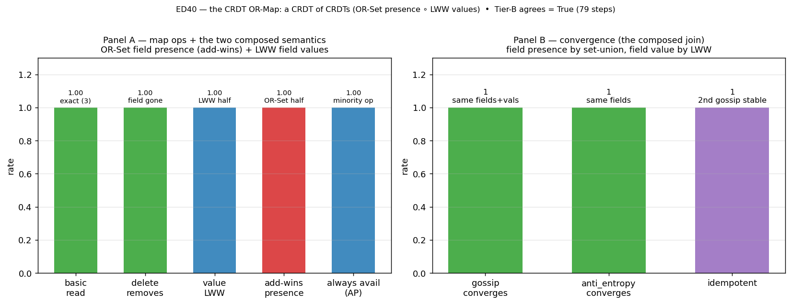](figures/ed40.png)<br>**The CRDT OR-Map: a CRDT *of* CRDTs, the compositional capstone of the family (SPEC-7 / ED40 / DS0 incr 33).** The capstone, because it is a CRDT **composed of** two CRDTs built earlier: the **OR-Set** (ED37) governs *field presence* (which fields the map has, add-wins + observed-remove over field names) and the **LWW-register** (ED39) governs each field's *value*. It is the in-CRDT-layer instance of the whole program's thesis — a faithful composite is a composition of faithful parts. **`mput n map field val`** adds a fresh presence dot for `field` *and* LWW-writes `val`; **`mdel`** observed-removes the field; **`mget`** reads a present field's value; **`mkeys`** enumerates the present fields (the map capability the flat KV/registers lack). **Left (Panel A — map ops + the two composed semantics):** across a cluster-size sweep `mput` then `mget`/`mkeys` reads the field and value back (**1.0**); a `mdel` removes a field (**1.0**); a concurrent **value** update resolves by **LWW** (one winner, **1.0**); a concurrent `mput` survives a concurrent `mdel` — **add-wins field presence** (**1.0**), where a naive map loses the update; and `mput` is **always available** (**1.0**). **Right (Panel B — convergence):** the composed join converges **every** node to the same fields *and* per-field values — `gossip` epidemically (**1.0**), `anti_entropy` per node (**1.0**), idempotently (**1.0**); the two halves converge independently (presence by set-union, value by LWW). Three omitted-when-empty `ormap_fields`/`ormap_tombs`/`ormap_vals` maps + the `ORMapField`/`ORMapTomb`/`ORMapVal` edits, **Tier-A ≡ Tier-B bit-for-bit**, purely additive. | [](figures/ed37.png)<br>**The CRDT family closes by composing itself (counter, set, register → map).** Verisim built the three canonical flat CRDT families — counters (ED35/36, merge by max), sets (ED37, merge by set-union), registers (ED38/39, merge by sibling-union or LWW-max) — and ED40 is where they *compose*: an OR-Map is literally an OR-Set (for "which fields exist") glued to a per-field LWW-register (for "what each field holds"). The elegant part is that **nothing in the merge is new** — the OR-Map join calls the exact `_dotset_union_edits` the OR-Set uses for presence and the exact LWW-max the register uses for values, and the two converge independently. This is the project's central structural bet, made visible at the smallest scale: *a faithful composite is a composition of faithful sub-oracles, and its correctness is the correctness of the parts plus the glue* (SPEC-6 §5.1) — the same claim that lets a SPEC-7 cluster embed a SPEC-6 host embed a v0 filesystem, here proven again for a map of CRDTs. It also surfaces the genuinely-new map capability — **enumeration** (`mkeys`) and **field removal** with add-wins — that a flat register cannot express. Each a deterministic, seed-replayable, Tier-B-verified, purely-additive function over the core, every property pinned by a golden. |
| [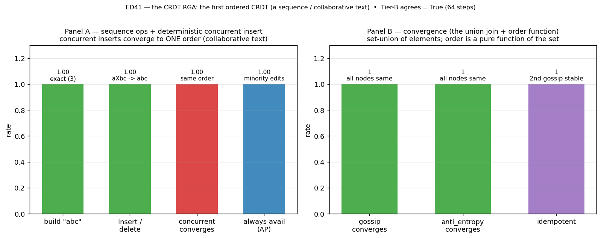](figures/ed41.png)<br>**The CRDT RGA: the first *ordered* CRDT, the basis of collaborative text (SPEC-7 / ED41 / DS0 incr 34).** Every prior CRDT is **unordered** (set, counter, register, map); the RGA (replicated growable array) is the first *ordered* one — a sequence, in which any node can insert at any position and concurrent inserts converge to **one** deterministic order with no duplication, the exact property collaborative editors (Google Docs, Figma) are built on. The trick is *positional identity*: each element carries a unique id `(seq, owner)` and a `parent` id (the element it was inserted *after*, or `ROOT` for the head), and the visible order is a DFS where siblings are ordered by id descending. **`rins n list i val`** inserts after the i-th visible element; **`rdel`** tombstones it (delete preserves structure — a tombstone is still an anchor); **`rget`** reads the visible values concatenated. **Left (Panel A — sequence ops + deterministic concurrent insert):** across a cluster-size sweep sequential `rins` builds `"abc"` (**1.0**); a middle insert and a delete both work (**1.0**); two nodes inserting *different* characters at the *same* position concurrently read back the **same** string on every node after `heal`+`gossip` (one interleaving, both present, no duplication — **1.0**), where a naive list would diverge; and `rins` is **always available** (**1.0**). **Right (Panel B — convergence):** the union join converges **every** node to the same sequence — `gossip` epidemically (**1.0**), `anti_entropy` per node (**1.0**), idempotently (**1.0**). Two omitted-when-empty `rga_elems`/`rga_tombs` maps + the `RGAInsert`/`RGATomb` edits, **Tier-A ≡ Tier-B bit-for-bit**, purely additive. | [](figures/ed37.png)<br>**Order from a set: the one CRDT category that isn't a flat container (sets → sequences).** The set/counter/register/map types are all *unordered* containers — they answer "is x in?", "how many?", "what value?", "which fields?" The RGA answers a fundamentally harder question — *"what order?"* — and the elegant resolution is that it needs **no new merge**: it reuses the exact set-union join the OR-Set uses, because the **order is a pure function of the element set**. Each element fixes its place by *identity* (a unique `(seq, owner)` id and a `parent` anchor) rather than by *position* (which shifts as others edit), so once two nodes hold the same elements they compute the same sequence by the same deterministic traversal. That is the whole reason RGAs (and their cousins, Logoot/LSEQ/Yjs/Automerge) are the standard substrate for real-time collaborative text: a concurrent "I typed b here" and "I typed c here" never conflict, never duplicate, and never need a central server to arbitrate — they merge by union and sort by id. It completes Verisim's CRDT coverage across all the canonical shapes — counter, set, register, map, **sequence**. Each a deterministic, seed-replayable, Tier-B-verified, purely-additive function over the core, every property pinned by a golden. |
| [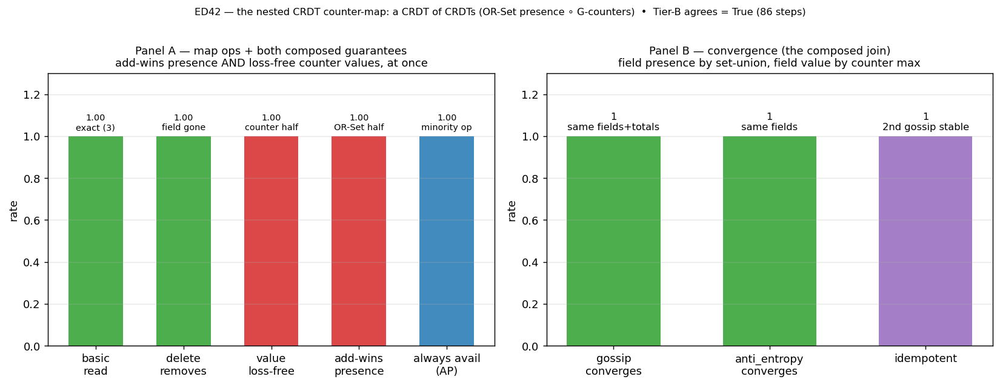](figures/ed42.png)<br>**The nested CRDT counter-map: a CRDT *of* CRDTs, recursive composition (SPEC-7 / ED42 / DS0 incr 35).** The *recursive* form of the OR-Map (ED40) — a CRDT whose **values are themselves CRDTs** of a different kind. Where the OR-Map holds LWW-register values, the counter-map holds **G-counter** values (a map of counters, Riak's `{user → visit_count}`): it composes the OR-Set field-presence with a value type that merges by per-owner **max** (loss-free), not LWW. The point is that **both** composed layers' guarantees hold *at once* under concurrency — which the LWW-valued map cannot, because LWW *drops* a concurrent write where a counter *sums* it. **`cminc n map field`** makes the field present *and* increments its counter; **`cmdel`** observed-removes it; **`cmget`** reads the total; **`cmkeys`** enumerates. **Left (Panel A — map ops + both composed guarantees):** across a cluster-size sweep `cminc` builds totals `cmget`/`cmkeys` read back (**1.0**); a `cmdel` removes a field (**1.0**); concurrent `cminc`s to the **same field** are summed **loss-free** (three across a partition total 3, **1.0**), where an LWW value reads 1; a concurrent `cminc` survives a concurrent `cmdel` — **add-wins presence** (**1.0**); and `cminc` is **always available** (**1.0**). **Right (Panel B — convergence):** the composed join converges **every** node to the same fields *and* totals — `gossip` epidemically (**1.0**), `anti_entropy` per node (**1.0**), idempotently (**1.0**); the two halves converge independently (presence by set-union, value by counter max). Three omitted-when-empty `cmap_fields`/`cmap_tombs`/`cmap_counts` maps + the `CMapField`/`CMapTomb`/`CMapCount` edits, **Tier-A ≡ Tier-B bit-for-bit**, purely additive. | [](figures/ed40.png)<br>**Recursion in the compositional thesis: a CRDT whose values are CRDTs (OR-Map → counter-map).** The OR-Map (ED40) already composed two CRDTs — an OR-Set for *which fields exist* and an LWW-register for *what each field holds*. The counter-map is where that composition becomes **recursive**: the value layer is itself a non-trivial CRDT (a G-counter) with a *different* merge — `max`, not last-writer-wins. That single change is what makes the demonstration sharp: a G-counter is **loss-free** (concurrent increments sum) where LWW is **lossy** (one write wins), so the counter-map can do something its LWW-valued sibling structurally cannot — preserve *both* the add-wins presence of the outer set *and* the no-lost-update of the inner counter, simultaneously, under the same partition. This is the deepest form of the project's central bet — *a faithful composite is a composition of faithful sub-oracles* (SPEC-6 §5.1) — applied **recursively**: the counter-map's correctness is the OR-Set's correctness plus the G-counter's correctness plus the (trivial) glue, and the merge literally calls `_dotset_union_edits` for presence and a per-owner counter `max` for values. It is exactly what Riak Map, Automerge, and Yjs expose — typed CRDT fields nested inside a CRDT container — recovered here as a deterministic, seed-replayable, Tier-B-verified, purely-additive function over the core, every property pinned by a golden. |
| [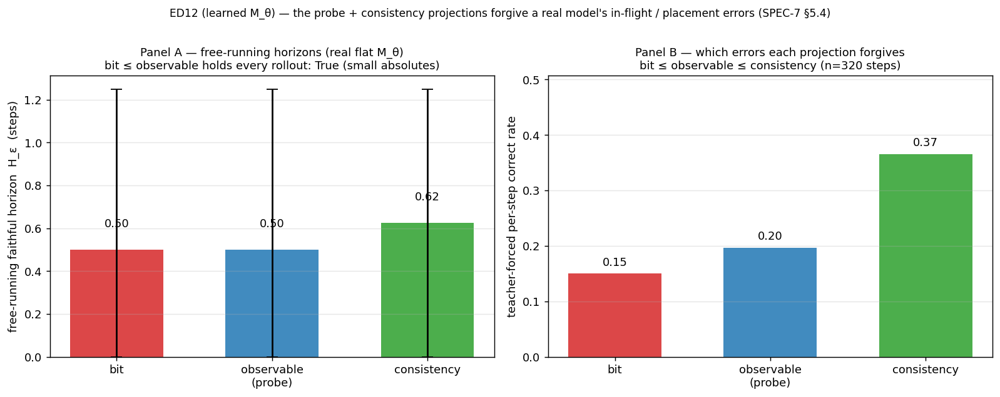](figures/ed12_learned.png)<br>**The probe and consistency projections forgive a real `M_θ`'s in-flight / placement errors (SPEC-7 / ED12-learned / DS4).** ED12 measured the partial-observation projections on the *synthetic* proposer; this re-points them onto the **real** flat DS4 `M_θ` (trained exactly as ED2-learned) — what ED1-learned is to ED1. **Left (Panel A — free-running horizons):** the structural dominance `bit ≤ observable` holds on every rollout, but the flat free-runner's absolute horizons are small (bit 0.50, observable 0.50, consistency 0.62) — directional, with wide CIs, the honest low floor inherited from ED1-learned. **Right (Panel B — the clean headline):** the **teacher-forced per-step accuracy**, free of the derailing the free-running horizon conflates — the model predicts each delta from the *true* current state and its correct-rate rises monotonically across the projections, **bit 0.15 ≤ observable 0.20 ≤ consistency 0.37**. The gaps are exactly which of the real model's per-step errors each projection forgives: the **probe** (+5 pts) forgives the errors in the unobservable in-flight medium, and **consistency** (+22 pts total) additionally forgives node placement. The partial-observation analogue of ED6-two-oracle's teacher-forced decision-sufficiency, on the same model — a defender watching the cluster is right about its *observable consistency behavior* far more often than about its exact bytes. | [](figures/ed12.png)<br>**Synthetic structure → real distribution (ED12 → ED12-learned).** ED12 (synthetic, tunable-noise proposer) proved the *structural* claim — `bit ≤ observable` always, with a clean +9.0-step probe gap when the dialed error is purely in-flight. ED12-learned asks what a *real* model's error mix does to the three projections. The free-running horizons are too small to separate cleanly (the flat model derails fast), so the teacher-forced per-step view is the honest measurement: there the ordering `bit ≤ observable ≤ consistency` reappears on the real model, with the probe forgiving the in-flight medium and consistency forgiving placement. The same lesson the synthetic experiment showed by construction, now confirmed on a trained `M_θ`'s genuine error distribution — and it motivates the deferred **RSSM belief**, whose job is to predict the *full* state from the *observable* one (the flat Markov model has no belief, so it cannot recover the unobserved subgraph). |
| [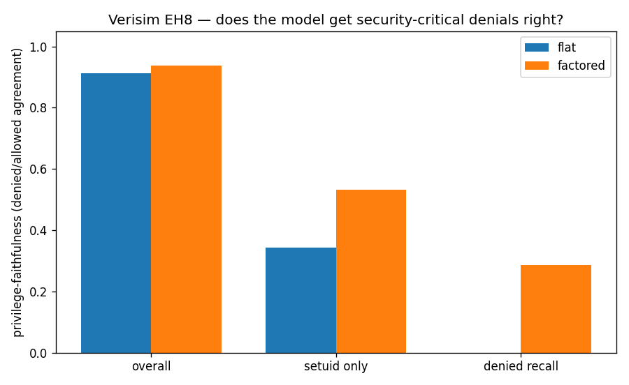](figures/eh8_privilege.png)<br>**Aggregate faithfulness hides a security-critical denial gap (host EH8).** On a denial-heavy workload, overall privilege-faithfulness looks high (0.91 flat, 0.94 factored) — but that is the easy successes. The defensively-critical number is **denied recall** (does the model predict failures when truth fails?): the flat arm scores **0.000** (it *never* predicts an EPERM/EBADF — it would tell a defender every blocked action succeeded), the factored arm only 0.286. Structure helps, but predicting *denials* is the open security gap. | [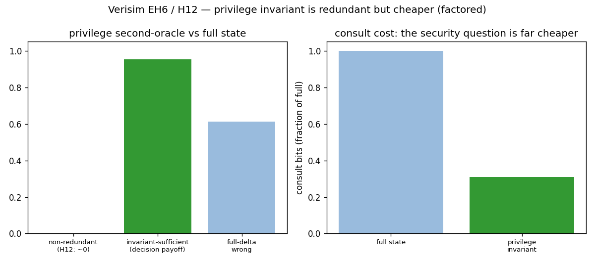](figures/eh6_two_oracle.png)<br>**A cheap security oracle is redundant but decision-sufficient (host EH6 / H12).** A symbolic privilege invariant ("no non-root process holds `/passwd`") vs the full state oracle: it catches **nothing** the full oracle misses (non-redundant rate **0**, by construction) — but in **95%** of the steps where the model's *full* prediction is wrong it still gets the **security verdict right**, at ~**3×** lower consult cost. Redundant for verification; cheaper and decision-sufficient for the question a defender asks. The host H12. |
| [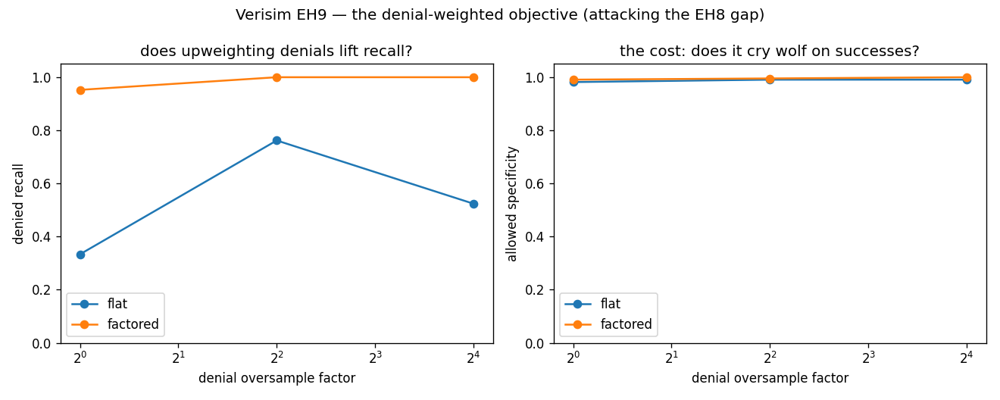](figures/eh9_denial_weighted.png)<br>**The free oracle closes the EH8 denial gap — data balance, not architecture (host EH9).** EH8's blindness to failures is largely a *data-balance artifact the oracle can label away for free*. Just adding the denial-carrying driver to training lifts flat denied recall **0.000→0.333** and factored **0.286→0.952**; then **oversampling** denials lifts flat further to **0.762** at 4× — at **no specificity cost** (it never cries wolf, ~0.98–1.0 throughout). But too much backfires (flat falls to 0.524 at 16×): the flat arm needs a *tuned* factor, while the structured arm saturates to perfect recall and is robust. | [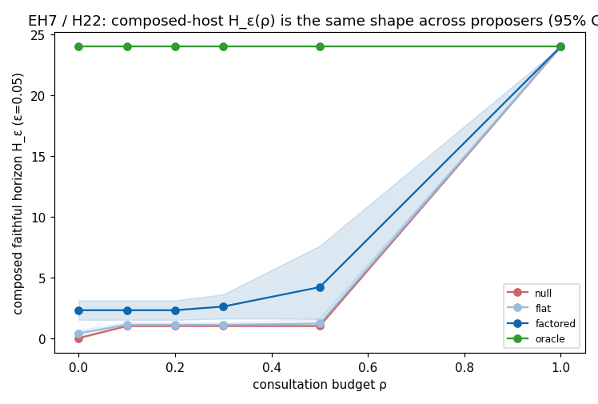](figures/eh7_invariance.png)<br>**The floor+cliff is the loop's, not the model's — even in the hardest world (host EH7 / H22).** Swap the proposer (untrained, biased, trained) under the composed host oracle and the `H_ε(ρ)` shape is invariant: a near-zero floor across the `ρ` interior, the cliff only at `ρ=1`. The curve is a property of the verify-correct method, not any one `M_θ`. |
| [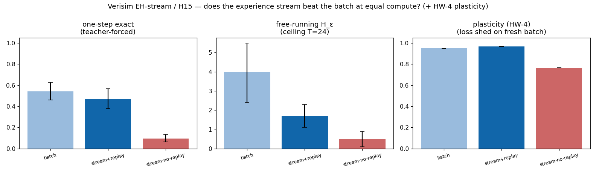](figures/eh_stream.png)<br>**The stream doesn't beat the batch — but replay is what saves it, and the plasticity probe says why (host EH-stream / H15 / HW-4).** At *equal compute*, the Era-of-Experience stream loses to the offline batch (one-step exact 0.47 vs 0.54, free `H_ε` 1.7 vs 4.0) — the manifesto's promise does not survive contact with the oracle at this scale (H15 negative). But **experience replay is decisively load-bearing**: it rescues the stream from collapse (0.47 vs the no-replay 0.10), and the **plasticity probe localizes why** — the no-replay stream *loses plasticity* (0.77 vs 0.95), replay keeps it high. The §2.5 "replay fixes forgetting *and* plasticity loss" lesson, grounded. | [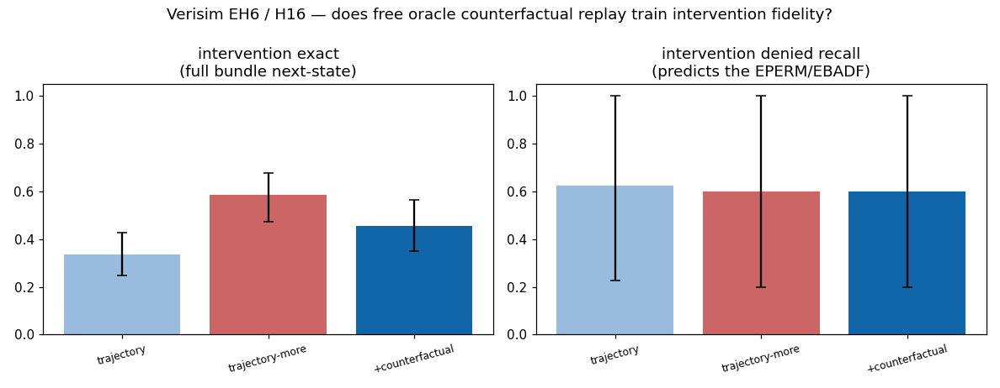](figures/eh6_counterfactual.png)<br>**Counterfactual replay is just more data for plain supervision — the same null the network found (host EH6 / H16).** The total oracle re-runs any process tree with one syscall changed, for free. Training on those counterfactual branches *does* beat the base trajectory on held-out intervention-exactness (0.46 vs 0.34) — but it **loses to a matched-volume control** of plain trajectory data (0.59). So the lift is **data volume, not counterfactual structure**: for next-state supervision a counterfactual is just another labeled transition. H16 is a null beyond volume — now confirmed *world-agnostic* (it matched the network's EN6/H5). |

| | |
|---|---|
| [](figures/en4_graph_vs_flat.png)<br>**Structure helps (EN4 / H11).** The message-passing graph+RSSM world model beats the flat serializer by **+16.5 pts** one-step token accuracy and **+30.6 pts** delta-exact rate — and the gap *widens* on the honest metric. | [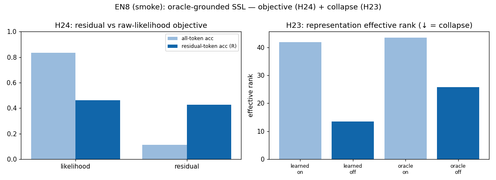](figures/en8_grounding.png)<br>**The oracle removes the collapse tax (EN8 / H23).** Ablate JEPA's EMA+VICReg crutches and a learned target collapses (eff-rank 41.8→13.4); an **oracle-anchored** target stays healthy (25.8) — the external referent the field lacks. *Scaled to 200 hosts (SPEC-9 S1): the gap stays disjoint-positive everywhere but **attenuates** — real at every scale, diminishing.* |
| [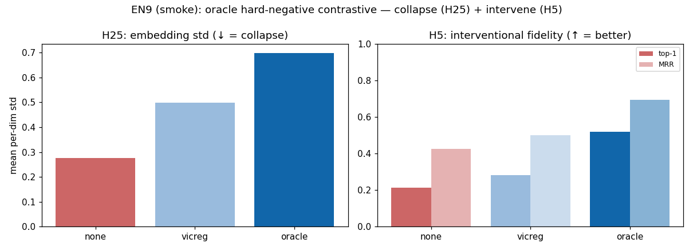](figures/en9_contrastive.png)<br>**Exact negatives beat statistical ones where it counts (EN9 / H25 / H5).** VICReg and the oracle both stop contrastive collapse — but only the oracle's *counterfactual* negatives teach which intervention leads where: branch-retrieval top-1 **0.519 vs VICReg's 0.282**. The statistical regularizer is full-rank but interventionally blind. *⚠ Scaled (SPEC-9 S2): this lift **reverses** by 100–200 hosts at higher capacity with a fixed `k=8` (VICReg overtakes) — but the reversal is a **negative-count artifact that recovers**: scaling `k_negatives` 8→32 flips it back to disjoint-positive. Real lift; feed it negatives that scale with the world.* | [](figures/en1_curve.png)<br>**A floor, not a knee (EN1 / K4 / H8).** Faithful horizon vs consultation budget `H_ε(ρ)` is flat-then-cliff on *both* worlds: consultation budget alone does not buy horizon. The honest negative that drove every later design choice. |
| [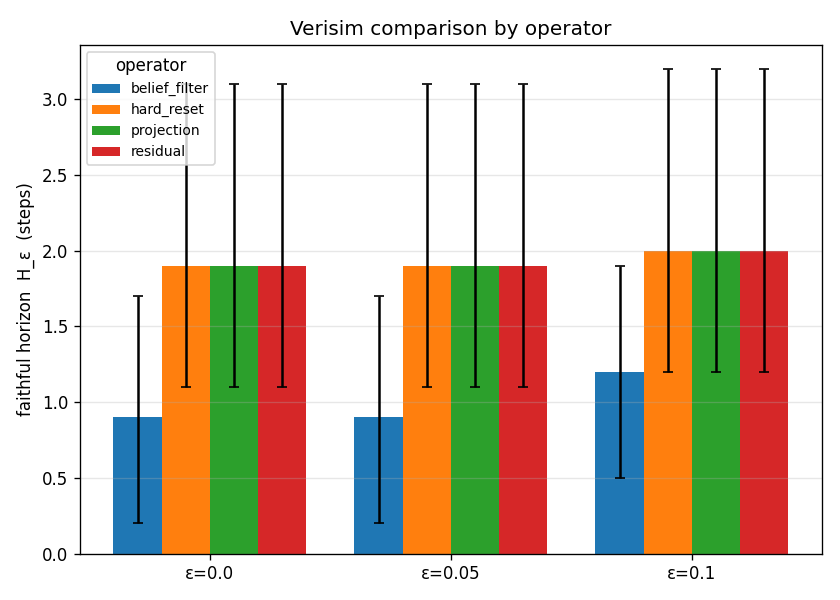](figures/en3_operators.png)<br>**What you consult beats whether (EN3).** Under partial observation a cheap one-host **probe + belief filter** earns **~2.3×** more faithful horizon per oracle-bit than full consultation — active sensing is a real lever. | [](figures/en7_invariance.png)<br>**The shape is the loop's, not the model's (EN7 / H22).** Run the *same* loop with four proposers (null, flat transformer, graph+RSSM, oracle-backed): the three imperfect ones share **one shape — floor + cliff, no knee.** The proposer sets the floor *height* (graph > flat > null); the loop sets the *shape*. The no-knee verdict is model-agnostic. |
| [](figures/eh1_curve.png)<br>**The floor+cliff holds in the *composed* world (host EH1 / HC6).** First result in the host world (process table + fd tables + embedded fs): the composed `H_ε(ρ)` is the same flat-then-cliff shape as the filesystem and network worlds — `ρ=0` drifts in <1 step, the cliff only at `ρ=1`. The no-knee verdict generalizes across all three worlds. | [](figures/eh1_composition.png)<br>**Whole-machine faithfulness is *coupled*, not independent (host EH1 / H13).** The headline-new measurement: composed per-step acceptance (orange) sits *below* the multiplicative/independence prediction `∏ aᵢ` (blue) — the flat baseline's subsystem failures are **anti-correlated**. Modeling subsystems independently is the wrong bet; coupling is load-bearing. The honest negative that licenses the factored interaction-graph arm. |
| [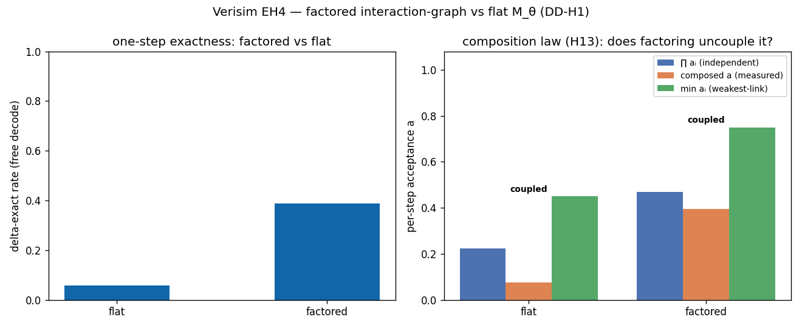](figures/eh4_factored_vs_flat.png)<br>**Structure helps in the bundle world too — but the coupling is real (host EH4 / H11 / H13).** The factored interaction-graph arm (GNN+RSSM over the process spine's lineage + shared-file edges) beats the flat serializer **~6.6× on delta-exact (0.058→0.388)** and **~5.3× on composed acceptance** — the host echo of EN4. But *both* stay **coupled** (composed still below the independence floor): modeling the references explicitly buys a lot of faithfulness, yet does **not** uncouple the composition — so H13's coupling is genuine, not a flat-arm artifact. | [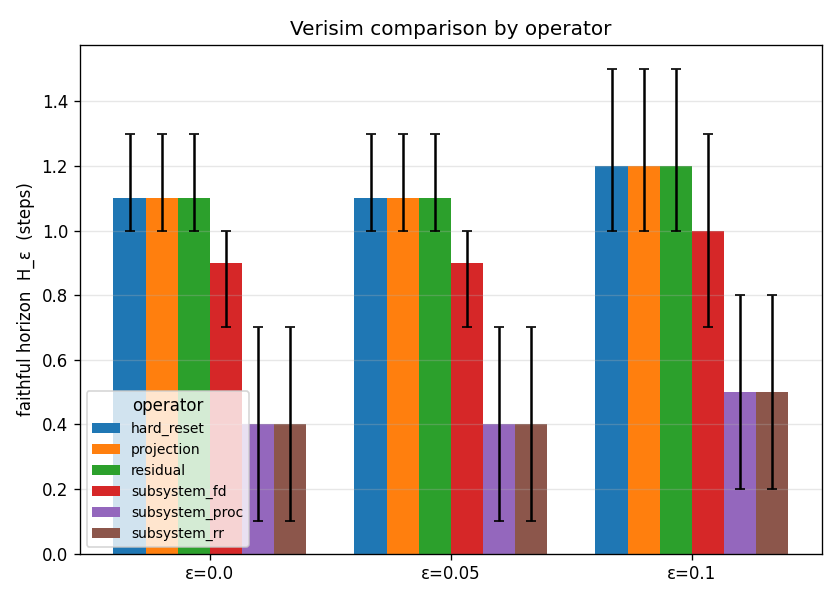](figures/eh3_operators.png)<br>**Which subsystem you verify is a lever — the cheapest beats the weakest (host EH3).** At equal budget the full-consult operators coincide on `H_ε`, but a per-subsystem probe earns **~3.7× more faithful horizon per oracle-bit**. The twist: the *cheapest* subsystem (`fd`) wins, not the H13-*weakest* (`proc`) — so efficient `π_w` is a cost-vs-consequence tradeoff, not "verify the worst." |
| [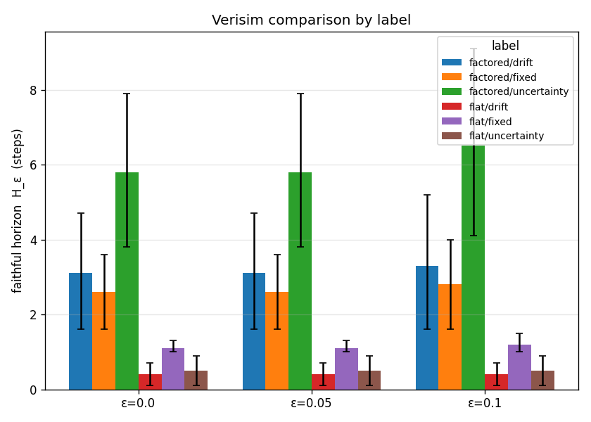](figures/eh2_policies.png)<br>**A calibrated signal finally makes *smart* consultation pay (host EH2 / H9).** The program's first smart-`π_c` **positive**. At equal budget the **flat** arm reproduces the standing negative (uncertainty/drift *worse* than fixed — decode entropy mis-localizes error), but the **factored** arm's **RSSM belief variance** makes uncertainty-triggered consultation earn **~2.2× more faithful horizon than fixed** (5.8 vs 2.6 steps). *When* to consult finally beats spreading the budget evenly — because the calibrated signal knows where the model is wrong. | [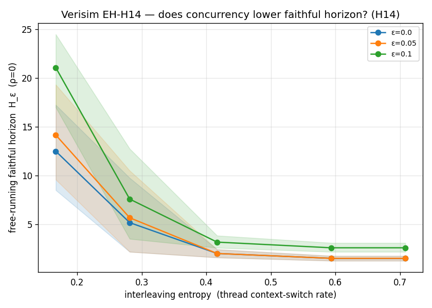](figures/eh_h14_interleaving.png)<br>**Concurrency is a measurable dial, not a binary wall (host EH-H14 / H14).** The host world's defining result — the thing the filesystem and network worlds *cannot* study. A chaos-seeded scheduler interleaves a multi-thread workload; free-running faithful horizon **degrades monotonically with interleaving entropy** (~8×, from `H_ε`≈12.5 at the recorded/sequential regime to ≈1.5 under chaos), and the recorded end recovers it. The **first quantification of HW-1's cost** — thread interleaving, the record/replay literature's named-unsolved nondeterminism source, made a continuous knob the chaos seed sweeps. |

## What we've found so far

Every number below is bit-exact and oracle-grounded, regenerates from config + seeds, and is reported
with its honest negative (the v0 norm — [SPEC §9–10](docs/specs/SPEC.md)). The interesting results,
front-loaded:

### 1. Structure helps — and helps *more* on the honest metric (network EN4 / H11)

The message-passing **graph + RSSM** world model beats the **flat** serializer on never-trained eval
seeds by **+16.5 pts** of one-step token accuracy *and* **+30.6 pts** of *delta-exact* rate (did the
model freely decode the **exact** true edit set this step?). The gap *widens* on the stricter metric —
token accuracy understates how much the graph inductive bias buys.


| arm | one-step token acc | **delta-exact** rate | `H_ε`(ρ=0), ε∈{0,.05,.1} |
|---|---|---|---|
| flat-Markov (NW4) | 0.673 | 0.264 | 0 / 0 / 0 |
| **graph + RSSM (NW8)** | **0.838** | **0.569** | 0 / 0 / 0 |
| graph + RSSM + noise lever (§6.3) | 0.828 | 0.556 | 0 / 0 / 0 |
| graph + RSSM + self-forcing lever (§6.3) | 0.803 | 0.500 | 0 / 0 / 0 |

### 2. …but better one-step prediction does **not** yet buy free-running horizon (the honest negative)

The right-hand column above is the catch: `H_ε(ρ=0) = 0` for **every** arm even at ε=0.1 — each drifts
on the first unaided step. The delta-exact number *quantifies* why: at 0.569 per-step exactness,
whole-delta correctness decays geometrically over unaided steps and first-exceedance is discrete (one
wrong edit spikes the graph divergence past ε in a single step). **Both pre-registered exposure-bias
levers — noise-injection and self-forcing / scheduled sampling — have now run, and both land the *same*
banked negative** (a small one-step dip, no horizon yet). That the random-corruption lever and the
model's-own-drift lever behave identically is itself informative: the wall is **localized to the
one-step→horizon conversion**, not the per-step learner (the arm fits teacher-forced to >0.9). This
routes the remaining budget to scale, the latent-overshooting objective, and *objective grounding*
([SPEC-8](docs/specs/SPEC-8.md)), not to more input-distribution patches. **Scale partly resolves this
(SPEC-10 / [§30](#30-capacity-buys-free-running-horizon--and-the-verdict-is-cross-world-spec-10--hs1hs2--h26)):** the `ρ=0` floor measured here at tiny scale *lifts* with capacity+data — to ~16–19 steps on
the network and ~5 on the harder host world — so this negative is in substantial part an
under-resourcing artifact of the committed (tiny) arm, not a fundamental compounding wall. What it does
*not* yet show is a favorable *consultation* knee, which stays open.

### 3. Cheap, localized sensing is the efficient way to buy horizon (network EN3)

Under partial observation the oracle has two modes — **full** (the whole next state) and **probe** (one
host's local view). v0's correction operators were indistinguishable on `H_ε`; in the network world a
cheap one-host **probe + belief filter breaks that collapse and earns ~2.3× more faithful horizon per
oracle-bit** than full consultation. *What* you consult, not just *whether*, is a real lever.

### 4. The consultation curve has a floor, not a favorable knee — on *both* worlds (the result that drove the design)

The prime directive is to plot `H_ε(ρ)` — faithful horizon vs. consultation budget — and ask whether a
little consultation buys a lot of horizon. On the single-filesystem world (left) and the network world
(right), the answer so far is a **floor + cliff, not a knee**:

| filesystem (SPEC-2.1 K4) | network (SPEC-5 EN1) |
|---|---|
| 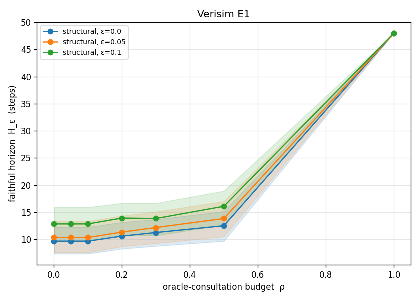 |  |

This is the **C-knee / H1–H8 honest negative**: discrete per-step errors make first-exceedance `H_ε`
reset-resistant, so consultation budget alone does not lift it. Far from a dead end, this negative is
*precisely* what licensed the network world (gradual drift, partial observability, a calibrated belief
signal) and what makes the NW8 graph arm + drift levers + SPEC-8 objective-grounding load-bearing
rather than speculative. Negatives here are **trustworthy** because the verdict is oracle-grounded, and
a refutation is frequently the deeper result.

### 5. The oracle generates its own training data — perfectly labeled, for free (SPEC-8 OG1/OG2, shipped)

Because the oracle is total, it is a *data factory*, not just a checker. The deterministic machinery is
built and property-tested ahead of the GPU runs: **oracle targets + the decidable/residual partition**
(mask the bits the oracle fixes, learn only the genuine residual), and a **hard-negative / counterfactual
factory** (one-edit-wrong successors and action-branch counterfactuals, each exactly labeled). This is
"oracle-grounded self-supervision" — pressing ground truth into the *bulk* of the cake, not just the RL
cherry.

### 6. …and putting it in the bulk **removes JEPA's collapse tax** (network EN8 / H23, shipped)

The first result from spending that data factory: a JEPA-style latent predictor trained with an
**oracle-anchored target** — a fixed projection of the *true next state*, an external referent with full
variance by construction — keeps its representation healthy *with the EMA-target + VICReg
collapse-prevention machinery ablated*, where the standard learned (EMA) target collapses.


| JEPA target | collapse machinery | embedding std | effective rank (d=48) |
|---|---|---|---|
| learned (EMA) | **on** (the baseline) | 0.557 | 41.8 |
| learned | **off** (ablated) | 0.276 | **13.4** (collapsed) |
| **oracle-anchored** | **off** (ablated) | **0.528** | **25.8** (healthy) |

Ablating the machinery collapses the learned target (effective rank 41.8 → 13.4); the oracle-anchored
target holds at 25.8 — roughly twice as healthy, no crutches. This is the strongest possible form of
SPEC-8's thesis: **the collapse-prevention machinery is a workaround for a missing oracle**, and where the
oracle exists the workaround is largely unnecessary — a fact the oracle-free field structurally cannot
establish. The companion **objective axis (H24)** — train only the genuinely-uncertain *residual* bits,
let the oracle supply the decidable ones — is an honest near-tie at this smoke scale (residual-token
accuracy 0.426 vs 0.463 raw-likelihood), the pre-registered negative branch: the decidable part is cheap to
learn until the worlds grow. A split EN8 verdict, like EN4 — and every cell is bankable under the oracle.

### 7. Exact negatives don't just stop collapse — they teach *interventions* (network EN9 / H25 / H5, shipped)

EN8 grounded the *predictive* target on the oracle; **EN9** grounds the *contrastive* one and spends the
OG2 hard-negative factory. A contrastive predictor over the same graph summary, with the only anti-collapse
referent varying across three cells: *none* (naked BYOL), *vicreg* (the field's statistical regularizer), or
*oracle* (InfoNCE against exact one-edit-wrong and counterfactual negatives). Two readouts — representation
health, and **interventional fidelity**: can the representation map each intervention `a'` to its true
successor `O(s, a')` (scored as branch-retrieval top-1 / MRR)?


| anti-collapse referent | embedding std | effective rank (d=48) | intervention top-1 | intervention MRR |
|---|---|---|---|---|
| none (naked BYOL) | 0.276 (collapsed) | 13.4 | 0.214 | 0.426 |
| vicreg (statistical) | 0.499 | **39.0** | 0.282 | 0.500 |
| **oracle (exact)** | **0.699** | 31.4 | **0.519** | **0.694** |

The split is the finding. On **collapse (H25)** the exact referent only *matches* the statistical one — both
hold the representation open, and VICReg's covariance term even buys higher effective rank (39.0 vs 31.4). But
on **intervention (H5)** the oracle wins decisively: its counterfactual negatives nearly double VICReg's
branch-retrieval fidelity (top-1 0.519 vs 0.282). The honest, sharper reading: **VICReg keeps the
representation full-rank but interventionally blind** (0.282 is barely above the naked 0.214), while the
oracle makes it faithful to the very branches the loop will be asked to predict. A statistical regularizer can
prevent collapse; it structurally cannot teach counterfactual structure it has no access to. This is the
H5 / change-safety lift arriving through the *self-supervised* objective rather than the RL cherry — a third
split verdict, every cell bankable under the oracle.

> **⚠ Scaling result (SPEC-9 S2 — the surface run, then the fix).** This lift is **scale-sensitive**, and
> measuring it is the point. On the 25–200-host surface (× `d64`/`d128` × 3 seeds) the oracle's top-1
> advantage is disjoint-positive at the smallest world + smaller capacity (25 hosts/`d64`: +0.106) and
> **reverses** at scale with the fixed `k_negatives=8` — VICReg *overtakes* the oracle at 100 hosts/`d128`
> (−0.086 [−0.113, −0.060]) and 200/`d128` (−0.094 [−0.111, −0.067]). The pre-registered diagnosis — a
> **negative-count artifact** — then proved correct: the LS-S2 sweep
> ([`en9_negatives.png`](figures/en9_negatives.png)) shows that at 100/`d128`, scaling `k_negatives` 8→16→32
> flips `lift_top1` −0.075 → +0.017 → **+0.032 [0.024, 0.044]** (disjoint-positive again). So H5 is
> **confirmed at small scale, reverses at scale with a fixed negative count, and recovers when negatives
> scale** — the magnitude is modest, so the rule is *feed negatives that scale with the world*. The oracle
> let us see a smoke-scale win reverse **and** repair, which is exactly what it is for. (This also refuted my
> own prior that more one-edit negatives wouldn't help — they did, by sharpening the contrastive geometry.)

### 8. Which wins survive scaling — the honest mixed verdict (SPEC-9)

Because the oracle labels for free, world size is a *learner-compute* choice, not a labeling-budget one
([SPEC-9](docs/specs/SPEC-9.md)) — so the smoke-scale EN8/EN9 wins can be carried up an **8× world-size
range on a single 32 GB machine** and stress-tested with bootstrap CIs. The surface (25→200 hosts ×
`d_model` ∈ {64, 128} × seeds) is the most important thing we ran, because it shows the three results
survive *unevenly*, and the unevenness is the finding:

| 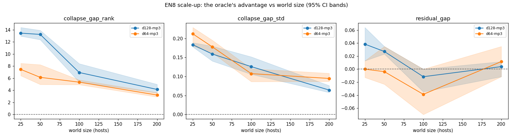 | 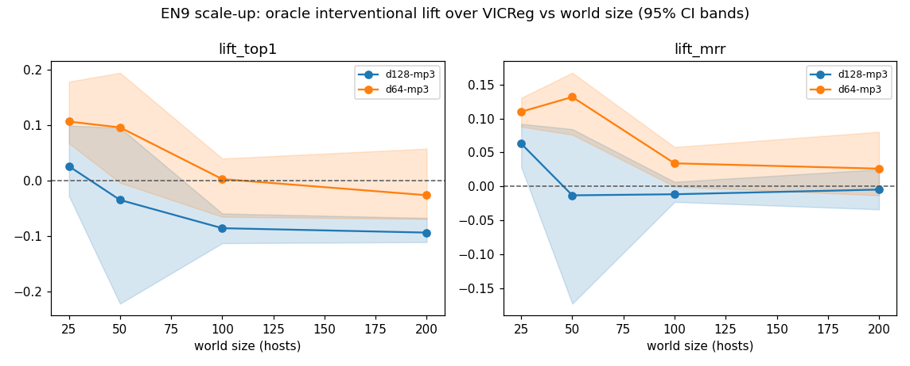 |
|---|---|
| **H23 collapse gap — persists but attenuates (S1).** Disjoint-positive at all 8 cells (the oracle's anti-collapse advantage is real across the whole range and both capacities) but **shrinks** with scale: eff-rank gap 13.4→6.9→4.1→**2.2** over 25→100→200→**300** hosts at `d128` (the last is the **LS3 hero instance** — the largest oracle-grounded world proven on one machine; still disjoint-positive at 300 hosts, [`en8_ls3_hero.csv`](figures/en8_ls3_hero.csv)). Real everywhere, diminishing. | **H25/H5 interventional lift — reverses at fixed `k`, then *recovers* when negatives scale (S2).** Disjoint-positive at 25 hosts/`d64` (+0.106); it **flips negative** at 100/`d128` (−0.086) and 200/`d128` (−0.094) with the fixed `k_negatives=8` — VICReg overtakes. But the reversal is a **negative-count artifact**: scaling `k_negatives` 8→32 at 100/`d128` flips `lift_top1` back to disjoint-positive (+0.032 [0.024, 0.044], [`en9_negatives.png`](figures/en9_negatives.png)). The H5 lift is real; it must be fed negatives that scale with the world. |

The third axis, **H24 (residual objective)**, is **regime-dependent** ([`en8_capacity.png`](figures/en8_capacity.png)):
masking the oracle-decidable bits `D` in the *loss* helps only in a narrow window (high capacity + moderate
residual + small world) and **hurts where `R` is tiny**, because masking removes *beneficial multi-task
training signal* rather than freeing capacity. What is bounded is the *training-objective* partition; the
*inference-time* partition (the oracle simply supplies `D`, the model is never trusted on it) is untouched.

This is the single most valuable thing the scaling bought, and the full arc is the lesson: a headline
(EN9/H5) that looked clean at smoke scale **reversed** under an honest CI sweep at 100–200 hosts — and then,
when the pre-registered lever was tried, **recovered** (scaling `k_negatives` 8→32 flips the lift back to
disjoint-positive). The deterministic oracle is what let us *see* both the reversal and the fix. A win
caught reversing and then honestly repaired is worth far more than one asserted and never stress-tested.
Each verdict carries its next lever (S1: normalize + grow `d_model`; **S2: scale negatives with the world —
now demonstrated**; S3: keep `D` in the loss, oracle-own it at inference).

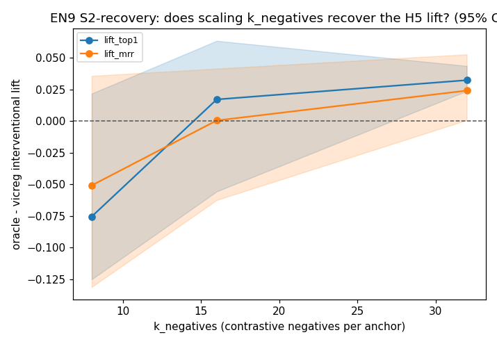

**The local envelope, measured (32 GB M4, CPU — the cost is the learner, not the labeler):**

| hosts `N` | oracle data build | one training run | peak RAM | binding constraint |
|---|---|---|---|---|
| 50 | 0.06 s | ~25 s | 351 MB | — |
| 100 | 0.13 s | ~50 s | 492 MB | — |
| 200 | 0.46 s | ~140 s | 779 MB | wall-clock `O(N²)` message passing |
| 400 | 1.76 s | ~8 min | 1.95 GB | wall-clock (memory has huge headroom) |

The oracle (the labeler) is effectively free at every size; what binds is the learner's `O(N²)` message
passing, not memory and not labels. MPS was *slower* than CPU at this model size (kernel-launch overhead),
so CPU is the bit-deterministic default. Sweep preset `N ≤ 200`; hero preset `N ~400–512`.

### 9. The no-knee shape is the loop's, not the model's (network EN7 / H22)

The project's most general claim is that the *loop*, not the proposer, governs the `H_ε(ρ)` curve — that
deterministic verification is a **model-agnostic primitive**. EN7 tests it by dropping four proposers into
the *same* loop and re-plotting the curve (5 hosts, ε=0.05, T=24, 3 seeds × 2 difficulties, CIs):


| proposer | ρ=0 | ρ=0.1 | ρ=0.3 | ρ=0.5 | ρ=1.0 |
|---|---|---|---|---|---|
| null (empty delta) | 0.0 | 1.2 | 1.2 | 1.3 | 24.0 |
| flat (NW4 transformer) | 0.0 | 1.0 | 1.0 | 1.0 | 24.0 |
| graph (NW8 GNN+RSSM) | 0.0 | 3.2 | 4.3 | 4.7 | 24.0 |
| oracle-backed (perfect) | 24.0 | 24.0 | 24.0 | 24.0 | 24.0 |

**H22 supported in kind.** The three imperfect proposers share **one shape — floor + cliff, no knee.** The
proposer's per-step competence sets the *floor height* (graph 3.2–4.7 > flat 1.0 > null), but the loop sets
the *shape* — none shows a favorable knee; all reach the ceiling only at ρ=1. So the EN1/K4 "no-knee"
verdict is **not** an artifact of the flat transformer: it reproduces across materially different
architectures, which is exactly the model-agnostic-primitive claim. The oracle-backed proposer (24
everywhere) is the degenerate ceiling. *Honest caveat:* this is not matched competence (graph is clearly
stronger), so the load-bearing evidence is the *shared shape across differing competence* — what moves with
the proposer is the floor, what stays is the shape.

### 10. Online self-healing (TTT) does not lift the floor — yet (network EN5 / H7, an honest null)

EN7 showed the floor is model-invariant; **EN5** tests the one lever that changes the model *during* the
rollout: when the loop consults the oracle, the revealed `(state, action) → true-delta` is a free labeled
example, so take a small in-rollout gradient step on it (test-time training / self-healing). Does adapting
the weights mid-rollout lift the curve where frozen weights cannot?

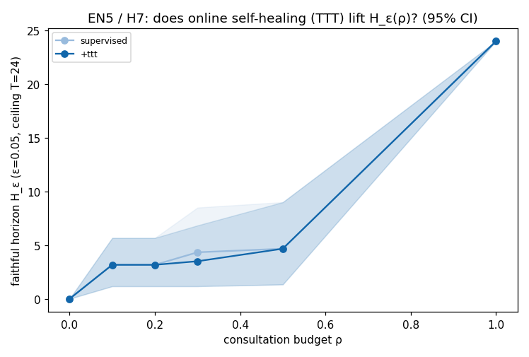

| arm | ρ=0 | ρ=0.1 | ρ=0.3 | ρ=0.5 | ρ=1.0 |
|---|---|---|---|---|---|
| supervised (frozen) | 0.0 | 3.2 | 4.3 | 4.7 | 24.0 |
| +ttt (single-example) | 0.0 | 3.2 | 3.5 | 4.7 | 24.0 |
| +ttt-replay (replay buffer) | 0.0 | 3.2 | 3.5 | 4.7 | 24.0 |

**A robust null — and the pre-registered lever was run, not just promised.** *Both* self-healing arms —
the minimal single-example update **and** the replay-buffer budget (a growing buffer of corrections, 5
minibatch updates per consult) — match the frozen baseline; neither changes *where* the first drift
happens, so `H_ε` is unmoved. The richer budget does not rescue H7. This is consistent, not surprising:
EN4 localized the wall to the **one-step→horizon conversion** and EN7 showed the floor is model-invariant,
so online adaptation — in either form — can't move the binding per-step competence. **Where this routes
the floor:** self-healing-as-floor-lifter is closed at this scale; the floor's real levers are **scale
([SPEC-9](docs/specs/SPEC-9.md)) and objective grounding ([SPEC-8](docs/specs/SPEC-8.md))**, not
adaptation. The [`online_update`](src/verisim/netmodel/graph_train.py) primitive ships for the
host/distributed worlds where horizons are longer.

### 11. Counterfactual grounding helps the contrastive objective, not supervision (network EN6 / H5)

The oracle generates **counterfactual branches for free** — the exact next state `O(s, a')` of actions
not taken. EN6 asks whether *training* the delta predictor on them improves prediction of **interventions**
(the change-safety question a network defender asks). A rigorous **3-arm, matched-example-count** design
separates the counterfactual signal from raw volume:

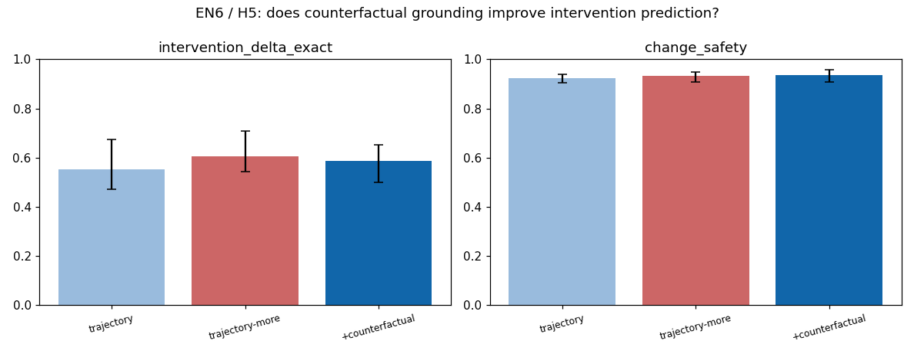

| arm | intervention delta-exact | change-safety (reachability) |
|---|---|---|
| trajectory | 0.551 | 0.924 |
| trajectory-more (volume control) | **0.604** | 0.933 |
| +counterfactual | 0.588 | 0.935 |

**H5 is a null for the predictive model — beyond volume.** `+counterfactual` (0.588) does *not* beat the
volume control `trajectory-more` (0.604) — marginally lower, CIs overlapping; change-safety (~0.93) is
indistinguishable. So the lift over the base is **data volume, not counterfactual structure** — for plain
next-state supervision, a counterfactual is just another labeled transition. The control arm is what makes
this honest. **The coherent contrast with EN9:** counterfactual *negatives* **did** lift the *contrastive*
representation (structure matters there) — but counterfactual *examples* don't lift plain *supervision*. So
H5 is objective-dependent. **Mild standalone positive:** change-safety (~0.93) ≫ delta-exact (~0.58) across
all arms — the model predicts the *reachability effect* of interventions far better than the exact delta,
which is the metric the defense use case cares about. *(The two-oracle axis H12 is measured in §12.)*

### 12. The control-plane oracle is redundant for verification but cheaper + decision-sufficient (network EN10 / H12)

The two-oracle axis: alongside the data-plane oracle (exact next state), a Batfish-style
[**control-plane oracle**](src/verisim/netoracle/control_plane.py) returns only the **reachability**
truth. H12 asks whether it's a *non-redundant* signal — does it catch reachability errors a full-state
consult misses? On held-out transitions of the trained graph arm:

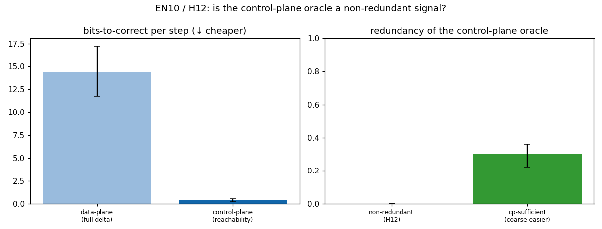

| metric | mean | 95% CI |
|---|---|---|
| data-plane bits-to-correct (full delta) | 14.4 | [11.8, 17.2] |
| control-plane bits-to-correct (reachability) | 0.4 | [0.20, 0.54] |
| **non-redundant rate** | **0.000** | [0.000, 0.000] |
| control-plane-sufficient rate | 0.30 | [0.22, 0.36] |
| consult-bits ratio (control / data) | 0.35 | [0.20, 0.49] |

**H12 ("non-redundant") is refuted, provably.** Non-redundant rate is **exactly 0** — the control-plane
oracle never catches a reachability error the full-state oracle misses, because reachability is a
deterministic function of the state. **But the experiment reframes its value:** it's ~38× cheaper to
satisfy (0.4 vs 14.4 bits-to-correct), a consult costs ~35% of a full one, and the model gets reachability
*exactly right in ~30% of the steps where its full delta is wrong*. So the control-plane oracle is
redundant as a *verification signal* but a **cheaper, decision-relevant consultation** for the
change-safety question — the tiered-oracle premise [SPEC-7](docs/specs/SPEC-7.md) builds on. The oracle
ships as a property-tested deterministic component (the NW0/OG1 "core-first" discipline).

### 13. The third world, and a new question: whole-machine faithfulness is *coupled* (host EH1 / H13, HC6)

The **host world** (SPEC-6) is the first world whose state is not one tree (filesystem) or one graph
(network) but a **bundle of coupled subsystems** — a process table, per-process fd tables, and the
embedded v0 filesystem, sharing references. Its oracle *composes* the v0 FS sub-oracle verbatim, so a
`write`'s bundle delta literally embeds the FS sub-oracle's own delta. With the deterministic core
(HC0–HC3), the flat `M_θ` (HC4), and the composed loop (HC5) in place, the prime-directive experiment
(HC6) runs and asks two questions.

**The composed `H_ε(ρ)` curve is the same floor+cliff (the no-knee verdict generalizes).** Train the
flat host `M_θ`, sweep the composed loop over `ρ × ε × difficulty × seed`: at `ρ=0` the model drifts in
under one step (the honest floor), the interior is near-flat, and the cliff to `H_ε=T` appears only at
`ρ=1`. The same shape as the filesystem (K4) and network (EN1) worlds — now in a coupled, composed
world. Consultation budget alone does not buy horizon; this is **model- *and* world-invariant** (the
host analogue of EN7/H22).


**The headline-new measurement — the composition law (H13) — reads `coupled`.** This is the question
only the bundle world can ask: *is whole-machine faithfulness predictable from the faithfulness of its
parts?* For each subsystem `i` measure the per-step (teacher-forced) acceptance `aᵢ` — the fraction of
one-step predictions that keep subsystem `i` faithful — and compare the **composed** acceptance `a`
(every subsystem faithful at once) against two candidate laws: multiplicative `a ≈ ∏ aᵢ` (failures
independent) and weakest-link `a ≈ min aᵢ` (failures coincide).


| difficulty | composed `a` | `∏ aᵢ` (independent) | `min aᵢ` (weakest-link) | verdict |
|---|---|---|---|---|
| low (`forky`) | 0.083 | 0.248 | 0.483 | **coupled** |
| high (`adversarial`) | 0.067 | 0.196 | 0.417 | **coupled** |

Composed acceptance sits *below* the multiplicative floor — the flat baseline's subsystem failures are
**anti-correlated** (it fails *different* subsystems on *different* steps, so the whole machine is
faithful even less often than independence predicts). **Modeling the subsystems independently is the
wrong bet; the coupling is load-bearing.** That is the honest negative HC6 was built to surface, and it
is exactly what licenses the next step: the **factored interaction-graph arm** (HC4 incr-2, the DD-H1
alternative the flat baseline is the floor for), which is built to model the cross-subsystem references
the flat serializer flattens away. (The per-step acceptance is measured teacher-forced, not on the
free-running rollout: a compounding subsystem that drifts once would otherwise read as permanently
unfaithful, making `aᵢ` bimodal rather than a rate — SPEC-6 §9.2.)

### 14. *Which subsystem* you verify is a real efficiency lever — but the cheapest, not the weakest (host EH3 / HC7)

The composition being coupled (§13) raises the operational question: given a consultation budget, *which
subsystem's truth should you buy?* (the host's new `π_w` axis, §8.2). EH3 fixes the policy and budget `ρ`
and compares correction operators at **equal `ρ`** (the host analogue of network EN3). The three
full-consult operators (`hard_reset`/`residual`/`projection`) all snap the whole bundle to truth, so
their `H_ε` is **identical** — the v0 full-truth identity. A per-subsystem `SubsystemFilter` corrects
only one subsystem, so it corrects *strictly less* (lower `H_ε`) but spends *far fewer* oracle-bits — and
the cost lens is the real verdict:


| operator | `H_ε` | oracle-bits / consult | **`H_ε` per oracle-bit** | vs full |
|---|---|---|---|---|
| `hard_reset` = `residual` = `projection` (full) | 1.10 | 75.3 | 0.0146 | 1.0× |
| `subsystem_proc` (target the H13-weakest link) | 0.40 | 20.8 | 0.0192 | 1.3× |
| `subsystem_rr` (round-robin) | 0.40 | 20.2 | 0.0198 | 1.4× |
| **`subsystem_fd` (target the cheapest)** | 0.90 | 16.8 | **0.0536** | **~3.7×** |

**Per-subsystem consultation earns up to ~3.7× more faithful horizon per oracle-bit than full** — *what*
you verify is a real lever, the host echo of EN3's ~2.3×. But the honest twist is the punchline: the
winner is the **cheapest** subsystem (`fd`, fewest facts), **not** the **weakest-link** subsystem (`proc`,
the one H13 said dominates the coupling). Targeting the weakest by the static heuristic barely beats full.
So efficient `π_w` is a genuine **cost-vs-consequence tradeoff** — exactly the optimization a *smart* `π_w`
(the remaining HC7 work) exists to solve, and a clean negative for "just verify the worst subsystem."

### 15. Modeling the composition explicitly helps a lot — but the coupling is real, not an artifact (host EH4 / H11 / H13)

H13 said the flat baseline's whole-machine faithfulness is *coupled*. Two readings were possible: either
the coupling is a real property of the host dynamics, or it is an artifact of the flat serializer
flattening the cross-subsystem references away. EH4 settles it by building the **factored interaction-graph
arm** (DD-H1) — the structured alternative the flat arm is the floor for — and comparing the two on
*identical* data. The factored arm featurizes the bundle as a **process-interaction graph** (process-
indexed nodes; two edge sets — the **lineage** fork-tree and the **shared-file** coupling, which fold the
fd/fs subsystems onto the process spine), message-passes over it with an RSSM belief, and decodes the
bundle delta under the *same* grammar as the flat arm — so the only thing that changes is whether the
composition is modeled or flattened.


| arm | delta-exact (free decode) | composed `a` | `∏ aᵢ` | `min aᵢ` | verdict |
|---|---|---|---|---|---|
| flat serializer (HC4 incr-1) | 0.058 | 0.075 | 0.223 | 0.450 | coupled |
| **factored graph (HC4 incr-2)** | **0.388** | **0.396** | 0.470 | 0.750 | coupled |

**Structure helps, decisively — the host echo of EN4/H11:** the factored arm is **~6.6×** more
delta-exact and **~5.3×** higher on composed acceptance. Modeling the references the flat arm flattens is
a large lever, exactly as the network graph arm was. **But the coupling survives:** the factored arm's
composed acceptance (0.396) is *still below* its own independence floor `∏ aᵢ` (0.470), so the verdict
stays **coupled** for both arms. The composition being coupled is therefore a **genuine property of the
host dynamics**, not an artifact of flattening — which sharpens H13 from "the flat model couples" to "the
world couples, and even the structured model only attenuates it." That residual coupling is the standing
target for the smart `π_w` (§17) and the per-subsystem decode heads (§17, EH5-heads — a negative).

### 16. A calibrated uncertainty signal finally makes *smart* consultation pay (host EH2 / H9)

Across v0 and the network world, *when* to consult was a negative: uncertainty- and drift-triggered
policies — spending the oracle budget on the steps the model flags as uncertain — did **not** beat a
dumb fixed interval, because the only available signal was the flat model's **decode entropy**, which
mis-localizes where the model is actually wrong (the standing "H2-negative"). SPEC-6 §8.1 conjectured
the factored arm's **RSSM belief variance** — an uncertainty *calibrated by construction* (§6.2), not a
decode-time artifact — would be the signal that finally makes smart `π_c` pay. EH2 tests it: both arms,
all three policies, at equal budget.


| arm (uncertainty signal) | `fixed` | `uncertainty` | `drift` |
|---|---|---|---|
| flat (decode entropy) | 1.1 | 0.5 | 0.4 |
| **factored (RSSM belief variance)** | 2.6 | **5.8** | 3.1 |

**This is the program's first smart-`π_c` positive.** The flat arm reproduces the negative exactly —
uncertainty (0.5) and drift (0.4) are *worse* than fixed (1.1), because high decode entropy does not
mark the steps that actually drift. But on the factored arm, **uncertainty-triggered consultation earns
~2.2× more faithful horizon than fixed** (5.8 vs 2.6 steps) at the same 7-consultation budget. The
difference is entirely the signal: the belief variance knows where the model is wrong, so spending the
budget there beats spreading it evenly. *When* to consult is a real lever — once you have an honest
estimate of *when you are about to be wrong*. (The full-truth identity still holds per consult; this is
about allocating a fixed budget across steps, the §8.1 H9 question.)

### 17. The other consultation axis: a smart *which-subsystem* policy gives a modest edge (host EH5 / H10)

EH2 settled *when* to consult; EH5 takes the host's second, novel axis — *which subsystem's truth to
buy* (`π_w`, §8.2). The factored arm now exposes **per-subsystem decode entropy** (each decoded token's
uncertainty bucketed into the subsystem of the op it belongs to), and an `UncertaintySubsystem` policy
spends each per-subsystem consult on the subsystem the model is **least certain** about. At equal budget,
against the static baselines:

| `π_w` policy | `H_ε` | oracle-bits | `H_ε` per bit |
|---|---|---|---|
| `fixed_fd` (cheapest subsystem) | 2.3 | 10.2 | **0.226** |
| `fixed_proc` (the H13-weakest) | 2.6 | 21.5 | 0.121 |
| `round_robin` (uniform) | 2.3 | 19.0 | 0.121 |
| **`uncertainty` (smart, information-gain)** | 2.6 | 20.1 | 0.129 |

**The honest read is a modest, mixed positive.** Targeting the uncertain subsystem ties the best raw
horizon (`fixed_proc`) while beating `round_robin` on *both* horizon and per-bit — so adaptive `π_w` is
a real, if small, lever (raw-horizon CIs overlap at this smoke scale). But the *cheapest* fixed
subsystem (`fd`) still wins pure bit-efficiency, exactly the cost-vs-consequence tension EH3 flagged:
the smart policy chases consequence (where the model is wrong) but ignores cost (how many bits the
subsystem costs to verify). The ideal `π_w` weights both — the standing target. What ships here is the
*apparatus* (per-subsystem uncertainty + the information-gain policy + the equal-budget harness); the
smoke-scale edge is reported as-is, not oversold.

**EH5-heads — the trained per-subsystem decode heads lose to the entropy bucket (an honest negative).**
The signal above is *post-hoc* (it reads the ambiguity of a constrained decode) and *sparse* (a
subsystem whose ops do not appear this step gets entropy 0, invisible to `π_w` even if the model is
quietly wrong about it). The named open HC7 lever was the calibrated alternative: a **trained
per-subsystem head** (opt-in `per_subsystem_heads`) that predicts *which subsystem the decoder will get
wrong* directly, regressed against the decoder's own per-subsystem error — the free oracle supplying the
target. EH5-heads ([`eh5_heads.py`](src/verisim/experiments/eh5_heads.py)) trains a *single*
heads-enabled arm exposing **both** signals on the **identical** proposer, so the comparison is
confound-free, and asks the §9.4 question: does each signal predict held-out per-subsystem error?

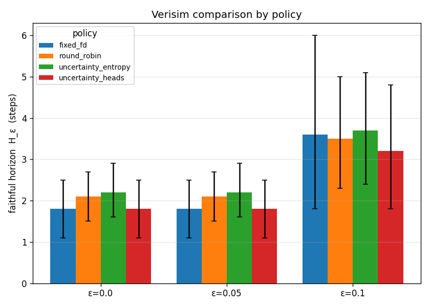

| `π_w` signal | Spearman(signal, per-subsystem error) | verdict |
|---|---|---|
| bucketed decode entropy | **+0.57** | well-calibrated |
| trained per-subsystem head | −0.02 | **uncalibrated** |

The head is essentially uncorrelated with held-out error (robust across noise levels), so the
head-driven `π_w` arm spends the **most** bits for the **least** horizon. The mechanism is clean: the
head's training target — the decoder's per-subsystem cross-entropy — collapses to ~0 on the overfit
training distribution, so it learns nothing about the deploy-time divergence that the entropy, measured
*on the actual decode*, tracks directly. This is the **per-subsystem echo of v0's H2 negative** (a
learned uncertainty proxy underperforms a decode-coupled one), and it **closes the open HC7 item with a
reproducible negative** rather than vague future work — the next lever is a head trained on the
deploy-time (drift) divergence, or scale, not this head.

### 18. The drift levers don't buy horizon here either — the same banked negative (host EH4-drift / §6.3)

The factored arm is far more one-step-accurate than flat (EH4), yet it still drifts at `ρ=0` — good
per-step prediction does not buy free-running horizon. That one-step→horizon gap is the program's
standing wall, and the §6.3 drift levers are its standard attack: **noise injection** (oracle-relabeled
state-noise augmentation) and **self-forcing** (re-roll on the model's own predictions, oracle-relabel),
both exploiting the oracle being a total, free teacher. EH4-drift trains the factored arm three ways on
identical seeds and asks whether either lever converts accuracy into horizon:

| arm | delta-exact | free-running `H_ε` (ρ=0), ε∈{0, .05, .1} |
|---|---|---|
| clean | 0.388 | 2.3 / 2.3 / 2.6 |
| +noise | 0.325 | 2.0 / 2.0 / 2.8 |
| +self-forcing | 0.379 | 2.0 / 2.0 / 2.2 |

**The same banked negative the network found.** Neither lever buys free-running horizon (all arms sit
at ~2–3 faithful steps, within noise), and noise injection slightly *lowers* one-step exactness. The
exposure-bias patches that should close the train/deploy gap don't, here — the wall is in the
one-step→horizon *conversion*, not the input distribution, so the remaining budget routes to scale and
objective grounding rather than more input patches (exactly the network's EN4 conclusion, now
replicated in the composed host world). A required ablation, run, and reported as the honest null it is.

### 19. Concurrency is a measurable dial, not a binary wall — the host world's defining result (host EH-H14 / H14)

The filesystem and network worlds run one action at a time; the host world's whole reason to exist is
that it has **concurrency** — multiple processes interleave, and the scheduler is a genuine
nondeterminism source. The record/replay literature (rr, Hermit) calls thread interleaving *the* one
unsolved determinism source (HW-1). SPEC-6 doesn't claim to solve it; it claims to make it a **measured
dial** (H14): a chaos-seeded scheduler interleaves a multi-thread workload (threads sharing files, so
the final content is last-writer-wins and order-sensitive; forks interleaved, so the pid a thread is
allocated depends on the global order), with an `interleave` knob from sequential (the *recorded*
regime) to fully random (*chaos*). The factored arm is trained on the recorded regime, then evaluated
free-running across the dial.


| interleaving entropy (thread context-switch rate) | free-running `H_ε` (ρ=0, ε=0) |
|---|---|
| 0.17 — recorded / near-sequential | **12.5** |
| 0.28 | 5.2 |
| 0.42 | 2.0 |
| 0.59 | 1.5 |
| 0.71 — chaos | **1.5** |

**H14 confirmed.** Faithful horizon degrades **monotonically** with interleaving entropy — an ~8×
collapse from the recorded regime (≈12.5 steps) to chaos (≈1.5), and the low-entropy/recorded end
**recovers** it. This is the first quantification of HW-1's cost: concurrency is not a binary
"deterministic or not" but a continuum the chaos seed sweeps, and `H_ε(interleaving-entropy)` is its
curve. The honest alternative (a flat line — the model learns schedule-invariant effects, concurrency a
non-issue) would have been a *surprising* simplification of every downstream world; the monotone
collapse is the expected-but-now-quantified result, and it is the one experiment in the whole program
that only the host world could run. The scheduler ships dependency-free (the deterministic-core
discipline) and emits concrete, replayable schedules, so every point regenerates from `(workload,
interleave, chaos_seed)`.

### 20. The payoff: a verified whole-machine simulator an LLM agent calls (host §7 / HC8)

Every result above exists to build one thing: the cheap, faithful, verifiable machine an LLM agent
*reasons over*. A computer-use or cyber-defense agent acts on a whole host — "kill this process,
write this config, drop this privilege" — so the host world *is* the simulator it needs. `HostSimulator`
([`hostsim/`](src/verisim/hostsim/)) packages the loop's `M_θ` + the oracle into the object the agent
calls. It is not a competitor to the LLM; it is the layer the LLM is bad at (simulating host dynamics)
made fast and honest, leaving the LLM only what it is good at (natural-language intent → a syscall plan):

```
  LLM agent ── "kill the rogue proc, scrub /tmp" ──▶ syscall PLAN  (NL intent → plan; the LLM's job)
                                                         │
                          ┌──────────────────────────────┴───────────────────────────┐
            imagine(plan) │  Mθ rolls the plan in imagination — fast, NO oracle        │ the cheap draft
                          ▼                                                            │
                    predicted final state ── agent explores many plans cheaply ◀───────┘
                          │
            verify(plan)  │  Mθ imagination  ‖  oracle truth, step by step (on a budget ρ)
                          ▼
              PlanReport: plan-faithful-horizon H_ε  (how many steps to trust the draft, §17.8)
                          + task-oracle: does the plan hit the GOAL?  predicted ?= true  (the 3rd oracle)
```

Two calls, the propose-verify-correct loop lifted from the *syscall* level to the *plan* level:
`imagine(state, plan)` rolls `M_θ` forward with **no oracle** — Dreamer's "plan in imagination", the
draft an agent explores by the hundred; `verify(state, plan)` runs that imagination against the oracle
step by step and returns a `PlanReport` — the predicted-vs-true final state, the **plan-level faithful
horizon** (the §17.8 `H_ε`-for-a-plan: how many leading steps the agent can trust the draft before
re-grounding), the oracle cost paid, and — composing the **task oracle** (a `Goal` predicate, the §7
"third oracle") — whether the plan *achieves the goal* and whether the model **agrees with the oracle**
that it did. On a trained model this is exactly as honest as the rest of the program: for a plan the
model drifts on, `verify` reports a short plan-faithful-horizon and flags that the model and oracle
*disagree* on task success — so the agent knows precisely when to stop trusting the draft and spend an
oracle consultation. This is the SLM/LLM-complementarity thesis made executable: ground truth at scale,
on a budget, for the thing OSWorld-class agents actually do.

### 21. The deepest claim holds in the hardest world: the shape is the loop's, not the model's (host EH7 / H22)

The program's deepest claim is not about a model but a *method*: **deterministic verification is a
model-agnostic primitive** — the qualitative shape of the faithful-horizon-vs-consultation curve is a
property of the oracle-loop, not the proposer's architecture (the network EN7 established this; finding
[§11](#9-the-no-knee-shape-is-the-loops-not-the-models-network-en7--h22)). EH7 asks the sterner
question: does it survive the **hardest** world — the coupled, concurrent host bundle? It drops four
materially different proposers into the *same* HC5 loop and sweeps `H_ε(ρ)` for each.


| proposer | `H_ε` at ρ=0 | ρ interior (0.1–0.5) | ρ=1 |
|---|---|---|---|
| null (empty delta) | 0.0 | ~1.0, flat | 24 (=T) |
| flat transformer | 0.4 | ~1.1, flat | 24 |
| **factored graph+RSSM** | **2.3** | 2.3 → 4.2, flat-ish | 24 |
| oracle-backed (ceiling) | 24 | 24 | 24 |

**H22 holds in the composed world.** The three imperfect proposers — despite *materially different*
per-step competence (factored ≫ flat ≫ null, the EH4 ordering) — share **one shape**: a low floor
across the ρ interior, then the cliff to `H_ε=T` only at ρ=1. The proposer sets the floor *height*
(better models float higher); the loop sets the *shape* (flat-then-cliff, no favorable knee). That a
shared shape survives across proposers of such different competence, in the world with the most
coupling (H13) and the only one with concurrency (H14), is the strongest evidence the program has that
the oracle-in-the-loop method is **model-agnostic** — exactly what makes the contribution a *method*,
not a model. The same floor+cliff now appears in all four worlds (filesystem K4, network EN1, host
EH1, distributed ED1) and across every proposer in each — the claim's most general statement.

### 22. The thesis in one figure: the floor+cliff is the same in every world (cross-world synthesis)

If the claim is that the oracle-in-the-loop tradeoff is a property of the *method*, the cleanest test
is to put all four worlds on one axis. Each world's `H_ε(ρ)` curve is normalized by its own horizon
ceiling `T` (so a tree, a graph, a coupled bundle, and a replicated cluster with different rollout
lengths are comparable), difficulty-averaged, and overlaid:


| world | state type | floor `H_ε/T` at ρ=0 | ρ=1 |
|---|---|---|---|
| filesystem (E1) | a tree | 0.00 | 1.0 |
| network (EN1) | a typed graph | 0.04 | 1.0 |
| host (EH1) | a coupled bundle | 0.02 | 1.0 |
| distributed (ED1) | a replicated cluster under faults | 0.01 | 1.0 |

**Four worlds, one curve.** Despite entirely different state representations, oracles, grammars, and
models, the normalized faithful horizon traces the same **floor + cliff**: a near-zero floor across the
whole `ρ` interior, then a steep climb to full horizon only as `ρ→1`. This is the program's thesis made
visual — *a little consultation does not buy a lot of horizon; faithfulness is paid for near-linearly
in oracle calls* — and it is a property of the **oracle-loop method**, not of any one world or model.
The fourth world (SPEC-7, the distributed cluster) makes it the *strongest* version of the claim: it is
the one world where bit-exact global truth is **intractable** (SPEC-7 §5, NP-complete consistency
checking), so its curve is measured against a **tiered, cost-bounded** oracle (ED1, the `panel == curve`
rows at the bit-exact tier) rather than a cheap exact one — the floor+cliff is therefore not an artifact
of having an exact oracle to spend. Combined with the model-invariance result (§21, the shape is
constant across proposers *within* each world), the floor+cliff is now both **model-agnostic and
world-agnostic** — the strongest statement the smoke-scale evidence supports. (Honest scope: same small
models; the *shape* is the robust claim, not the floor's exact height — and "what survives scaling"
remains the open question, [§8](#8-which-wins-survive-scaling--the-honest-mixed-verdict-spec-9).)

### 23. Concurrency's cost scales with concurrency's width (host EH-H14-scale)

H14 (§19) showed concurrency is a measurable dial at one workload width (5 threads). The scaling
question — the host analogue of the free-oracle scaling work ([§8](#8-which-wins-survive-scaling--the-honest-mixed-verdict-spec-9)) — is whether the *cost* of
concurrency grows with the *amount* of it. EH-H14-scale reruns the dial at 2→8 threads, each with its
own factored arm trained on its own recorded (sequential) regime:

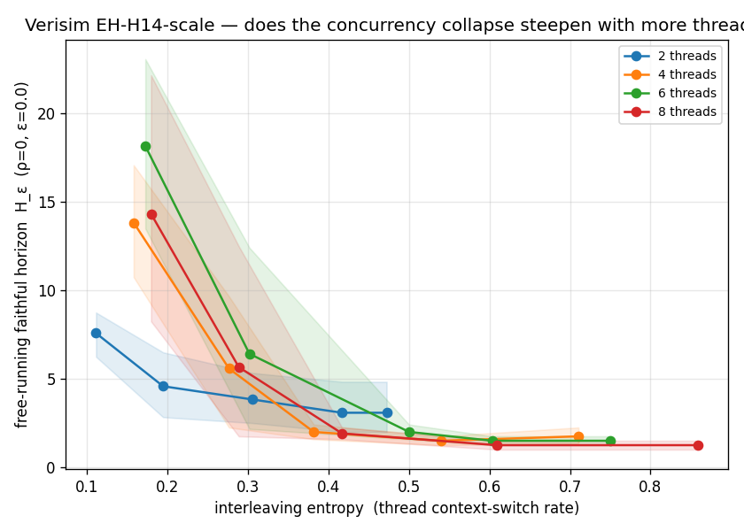

| threads | `H_ε` recorded (low entropy) | `H_ε` chaos (high entropy) | collapse |
|---|---|---|---|
| 2 | 7.6 | 3.1 | ~2.5× |
| 4 | 13.8 | 1.8 | ~7.7× |
| 6 | 18.2 | 1.5 | ~12× |
| 8 | 14.3 | 1.2 | ~12× |

**The collapse steepens with width.** At 2 threads chaos costs only ~2.5× of faithful horizon; by 6–8
threads it costs ~12×, dropping the model to barely one faithful step under chaos. More concurrent
threads mean more shared-file contention and more interleaved forks, so the schedule space the chaos
seed explores is both larger and more damaging — **concurrency width is a genuine difficulty axis, and
its cost is super-linear in the early regime before saturating.** (Honest wrinkle: the *recorded*-regime
horizon rises with width to 6 threads then dips at 8 — the longer 40-syscall schedule begins to strain
the tiny model's capacity, a smoke-scale artifact, not a property of the dynamics; the collapse *ratio*
is the robust signal.) This is the first quantification of *how* HW-1's cost grows with load.

### 24. Aggregate faithfulness hides a security-critical denial gap (host EH8)

The host world exists for cyber-defense, and a defender's trust hinges not on the model getting
*successes* right but *failures*: does it predict that a `setuid` by a non-root process is **denied**
(EPERM), that a write to a closed fd is **EBADF**? EH8 measures privilege-faithfulness (denied/allowed
agreement) for the flat and factored arms on a denial-heavy workload, reading the exit code off each
predicted bundle delta:


| arm | overall priv-faithfulness | setuid only | **denied recall** |
|---|---|---|---|
| flat | 0.912 | 0.344 | **0.000** |
| factored | 0.938 | 0.531 | **0.286** |

**Overall faithfulness is a comforting lie.** At 0.91–0.94 it looks like the model nails privilege —
but that number is dominated by the common case (operations that *succeed*). The security-critical
metric is **denied recall**: of the transitions truth says *failed*, what fraction does the model also
predict failed? The flat arm scores **zero** — it never predicts a denial, so it would assure a
defender that *every* blocked, unprivileged action succeeded. The factored arm is materially better
(0.286 recall, 0.531 on `setuid`) — structure helps here too — but still misses most denials. This is
the sharpest defensively-relevant negative in the program: **a host simulator can look 94% faithful
and still be blind to the failures that matter most**, and it makes "denied recall," not aggregate
faithfulness, the metric a security use-case must gate on. (Honest scope: smoke-scale; the *gap* and
the flat-vs-factored ordering are the robust signal, not the exact recall.)

### 25. A cheap symbolic second-oracle is redundant but decision-sufficient (host EH6 / H12)

The full state oracle answers "is the predicted bundle faithful, bit for bit?"; a defender often needs
only one cheap, formally-checkable property. EH6 adds a **symbolic privilege second-oracle** — *no
non-root process holds an fd to a protected path (`/passwd`)* — and asks the network EN10/H12 questions
of it against the factored arm, teacher-forced:


| metric | value | reading |
|---|---|---|
| non-redundant rate | **0.000** | catches nothing the full oracle misses (it is a pure function of the state) — *redundant for verification* |
| invariant-sufficient rate | **0.952** | of the steps where the *full* prediction is wrong, the model still gets the security verdict right |
| consult-bits ratio | **0.31** | the security answer (procs × protected) costs ~⅓ of the full state |

**Redundant, but cheaper and decision-sufficient — the host H12.** The privilege oracle never flags an
error a bit-exact prediction would miss (non-redundant rate is exactly 0, by construction), so as a
*verification* signal it adds nothing. But that is the wrong lens: in **95%** of the steps where the
model's full bundle prediction is *wrong*, the model still gets the **privilege-safety verdict** right,
and answering that verdict costs ~3× fewer bits than the full state. So an agent can ask the cheap
security question and trust the answer far more often than it can trust the whole prediction — the
tiered-oracle premise ([SPEC-7](docs/specs/SPEC-7.md)) the network's EN10 first showed, now replicated in the host with a
formally-checkable security invariant.

### 26. Concurrency manufactures the composition coupling (host EH-H13-scale / H13 × H14)

Two host-unique findings meet here: the composition is **coupled** (H13 — composed acceptance below the
independence floor `∏ aᵢ`), and concurrency is a **dial** (H14). EH-H13-scale asks whether the first is
*caused* by the second: does running more concurrent threads (more shared-file contention, more
interleaved forks coupling the subsystems through the schedule) deepen the coupling? It measures the
composition law teacher-forced on chaos-scheduled workloads at 2→8 threads:

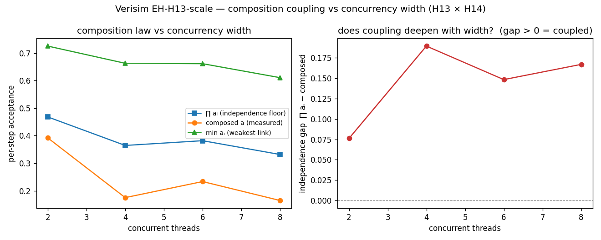

| threads | composed `a` | `∏ aᵢ` | **independence gap** | verdict |
|---|---|---|---|---|
| 2 | 0.392 | 0.468 | 0.076 | coupled |
| 4 | 0.175 | 0.364 | 0.189 | coupled |
| 6 | 0.233 | 0.382 | 0.148 | coupled |
| 8 | 0.165 | 0.332 | 0.167 | coupled |

**Concurrency manufactures coupling — then saturates.** The composition is `coupled` at *every* width
(composed always below the independence floor), but the gap is smallest at 2 threads (0.076 — failures
nearly independent) and roughly **doubles–triples by 4 threads (~0.19)**, then plateaus at ~0.15–0.19
through 8. So the anti-correlated subsystem failures H13 found are, in part, *made by the schedule*: a
little concurrency couples the subsystems sharply, and beyond a handful of threads the coupling is
saturated rather than ever-deepening. This ties the host's two signature results together — H13's
coupling is not a fixed property of the bundle but one **concurrency (H14) drives** — and says a faithful
host model must reason about the schedule, not just the per-subsystem dynamics.

### 27. The free oracle closes the EH8 denial gap — it was data balance, not architecture (host EH9)

EH8 banked the program's sharpest defensive negative: a host model looks ~94% privilege-faithful yet
has **denied recall ≈ 0** — it almost never predicts the EPERM/EBADF *failures* a defender most needs,
because denials are rare and the cross-entropy is dominated by the common success case. EH9 turns that
negative into an *intervention* using the program's signature lever — **the oracle labels every outcome
for free, so reweight the data**: oversample the training transitions whose oracle outcome is a denial by
a factor `k` (the cheapest, trainer-agnostic fix — it touches the data, not the loss), and read whether
recall lifts and at what specificity cost. EH9 differs from EH8 in one other deliberate way — it trains
on **both** the `forky` *and* the denial-carrying `adversarial` driver (EH8 trained `forky`-only), so its
`k=1` row already isolates a second, even cheaper intervention: *merely exposing the model to denials in
training at all*.


| arm | `k=1` (driver-only) | `k=4` | `k=16` | allowed specificity |
|---|---|---|---|---|
| flat | 0.333 | **0.762** | 0.524 | 0.98 → 0.99 → 0.99 |
| factored | 0.952 | 1.000 | 1.000 | 0.99 → 1.00 → 1.00 |

**The gap was a data-balance artifact the free oracle can fix — at no specificity cost.** Two stacked,
nearly-free interventions close most of EH8's blindness. First, just *including the denial-carrying
driver in training* (the `k=1` rows vs EH8's `forky`-only 0.000 / 0.286) lifts flat denied recall to
**0.333** and factored to **0.952** — exposure alone nearly closes the structured arm's gap. Second,
**oversampling** denials on top lifts the flat arm further to **0.762** at 4×, and the cost the
worry-line predicted — crying wolf on successes — **never materializes**: allowed specificity holds at
0.98–1.00 across every factor. The free oracle relabels the imbalance away without trading off the
common case.

But the lever is not monotone for the weaker arm: flat recall *falls* to **0.524** at 16× — too
aggressive a reweight distorts the flat model — so the flat arm needs a **tuned** factor (4× is its
sweet spot here), while the **factored arm saturates to perfect recall and is robust to the factor**.
That is the honest shape of the result: the EH8 negative is *largely* an artifact of data balance that
costs nothing to fix, structure both starts far ahead and stays well-behaved under the fix, and the
unstructured arm can be lifted a long way but needs the dial set with care. (Honest scope: smoke-scale;
the recall-lift trend, the zero specificity cost, the flat non-monotonicity, and the flat-vs-factored
ordering are the robust signals — not the exact recall values.) This closes the EH8 loop the way the
program is meant to: a banked negative becomes a measured intervention, and the intervention is the
oracle doing the one thing only an oracle can — labeling the rare, security-critical event for free.

### 28. The experience stream doesn't beat the batch — but replay saves it, and the plasticity probe says why (host EH-stream / H15 / HW-4)

SPEC-6's §8.5 puts the host world's defining promise on the table: the propose-verify-correct loop need
never stop. Because the oracle labels every transition for free, you can run a **continuous stream** of
sandboxed host activity from which the model predicts, the oracle verifies, and the model heals from a
replay buffer — forever (the "Era of Experience" loop). **H15** asks whether that stream *beats the
batch* at **equal total compute**; **HW-4** (loss of plasticity) asks whether a model that learns
forever keeps learning or **ossifies**. EH-stream makes both falsifiable on the factored arm: three
arms see the **same** ordered, oracle-labeled stream and take the **same number of gradient steps**,
differing only in *how* they consume it — `batch` (shuffle the whole stream, the offline baseline),
`stream+replay` (walk it in order, train on a minibatch sampled from a growing replay buffer per
arrival), and `stream-no-replay` (walk it in order but train only on the most recent window — the
forgetting-prone control that isolates *replay* as the lever).


| arm | one-step exact | free-running `H_ε` (T=24) | plasticity (HW-4) |
|---|---|---|---|
| batch | **0.542** | **4.0** | 0.950 |
| stream+replay | 0.471 | 1.7 | **0.966** |
| stream-no-replay | 0.096 | 0.5 | 0.766 |

**H15 is a negative at this scale — and that is the honest, pre-registered result.** At equal compute the
experience stream (`stream+replay`) does *not* beat the offline `batch`: it trails on both one-step
exactness (0.47 vs 0.54) and free-running horizon (1.7 vs 4.0). The Era-of-Experience promise does not
survive contact with the oracle here; the i.i.d. shuffle of the batch is simply a better diet than the
correlated order of the stream when the compute is the same. The negative is the §10.3 H15-refuted
branch, and the program banks it.

**But the experiment's real payoff is the mechanism, which only the controlled arms reveal.** Replay is
**decisively load-bearing**: without it the stream *collapses* (one-step 0.10, horizon 0.5) — correlated
sequential updates catastrophically overwrite earlier learning — and replay rescues it back to 0.47, a
~5× recovery. And the **plasticity probe localizes the failure precisely**: after training, we clone
each arm and measure how much loss it can still shed on a frozen, never-seen probe batch. The no-replay
stream's plasticity has **decayed to 0.77** while the batch and the replay stream sit at **0.95–0.97** —
the forgetting-prone regime has measurably begun to **ossify**, exactly the HW-4 wall §2.5 warned of,
and replay is its documented fix, now *grounded* rather than anecdotal. (Honest scope: smoke-scale; the
robust signals are the orderings — batch > stream+replay ≫ stream-no-replay on competence, and
no-replay's plasticity sitting well below the others — not the exact values.) The honest shape: the
stream loses to the batch at this scale, but the oracle-grounded probe turns "continual learning is
hard" into a number and names *which* lever (replay) holds the line on *which* wall (plasticity).

### 29. Counterfactual replay is just more data for plain supervision — the same null in the host world (host EH6 / H16)

The host oracle is **total**, so from any visited bundle state it returns the exact next state of an
**alternative** syscall the trajectory never took — a free counterfactual branch, the capability
physical-domain causal world models structurally lack (you can literally re-run the process tree from
step `t` with one syscall changed and read back the *true* alternative state). **H16** asks whether
*training* the host delta predictor on these free counterfactual branches lifts its prediction of
**interventions** — the change-safety question a defender actually asks ("what if this process had
called `setuid` instead?"). The counterfactual driver is `adversarial` on purpose: the near-miss
**privilege mistakes** (§17.7) whose oracle outcome is an EPERM/EBADF denial. To separate the
counterfactual *signal* from raw volume, three arms train the same factored arm for the same steps,
differing only in the training set's composition (matched example count): `trajectory` (base),
`trajectory-more` (extra trajectory seeds to the same count — the volume control), and
`+counterfactual` (base plus oracle counterfactual branches).


| arm | intervention exact | intervention denied recall |
|---|---|---|
| trajectory | 0.338 | 0.62 |
| trajectory-more | **0.588** | 0.60 |
| +counterfactual | 0.457 | 0.60 |

**H16 is a null beyond volume — and it matches the network's EN6/H5 exactly.** On the robust metric
(held-out intervention exactness), `+counterfactual` (0.457) *does* beat the base `trajectory` (0.338) —
but it **loses to the matched-volume control** `trajectory-more` (0.588). So the lift over the base is
**data volume, not counterfactual structure**: for plain next-state supervision a counterfactual is just
another labeled transition, and plain extra trajectory data of equal volume generalizes at least as
well. The control arm is what makes this honest — without it the counterfactual arm's beat over the base
would have looked like a win. (The denied-recall column is directionally flat across arms but too sparse
at smoke scale — denials are rare in held-out — to separate them; the §17.7 near-miss regime needs a
denser denial workload to read, a scope note that licenses future work.) The coherent payoff is the
**cross-world echo**: the network world found the *identical* result (EN6/H5 — counterfactual *examples*
don't lift plain *supervision*, though counterfactual *negatives* did lift the *contrastive*
representation, EN9). The H16 null is therefore not a host quirk but a **world-agnostic property of the
oracle-grounded method**, the same way the floor+cliff is — and it *bounds* how much counterfactual
augmentation buys for supervised world models: nothing beyond the labeled transitions it adds.

### 30. Capacity buys free-running horizon — and the verdict is *cross-world* (SPEC-10 / HS1–HS2 / H26)

Every floor+cliff above was at the *committed* (tiny) scale, and the report's own *Threats to validity*
named the confound: the models are small, so the floor *might* be a capacity artifact. SPEC-10 measures
that confound directly for the headline metric — it holds the world fixed and sweeps **model capacity**,
measuring two numbers exactly against the oracle on held-out rollouts: one-step acceptance `p` (per-step
accuracy) and free-running faithful horizon `H_free = H_ε(ρ=0)` (the headline). The sharp object is the
**independence baseline** `H_indep = p/(1−p)` — the horizon you'd get if per-step failures were i.i.d.
(no compounding) — and its ratio `η = H_free/H_indep`, the scale-free compounding penalty.

**HS1 (network world):** free-running horizon **lifts ~9× with capacity** (1.75 → 15.8 steps over 32×
params, disjoint CIs) then saturates; HS1.1 sharpens this into a **non-monotone, compute-optimal
frontier** (peak at `l`, then a data-starvation decline the one-step proxy `p` cannot see); HS1.2 shows
that decline is **data starvation, not a wall** (feeding `xl` more data recovers it, the Chinchilla
prescription); HS1.3 confirms the recipe lifts the peak to a **program-best `l@9.6k` = 19.2 id / 28.75
ood**. The floor+cliff dissolves into a **resourcing story with a measurable compute-optimal frontier**
([§ Results at a glance](#results-at-a-glance) top tile; full numbers in [docs/report.md](docs/report.md)).

**HS2 (the universality test):** the whole HS1 arc ran in the network world, so is the lift a fact about
the oracle loop or about one easy world? HS2 re-runs the **identical** capacity axis
([`horizon_host_scaling.py`](src/verisim/experiments/horizon_host_scaling.py), the HS1 harness reused
verbatim) on the harder **host** world (SPEC-6: the composed process/fd/filesystem/exit bundle).


| scale | params | `p` (id / ood) | **`H_free`** id [95% CI] | `H_free` ood | η (id) | η (ood) |
|---|---|---|---|---|---|---|
| xs | 1,024 | 0.11 / 0.11 | **1.00** [0.75, 1.25] | 0.75 | 8.56 | 6.33 |
| s | 8,192 | 0.21 / 0.26 | **2.42** [1.25, 3.25] | 1.50 | 8.65 | 4.41 |
| m | 32,768 | 0.30 / 0.44 | **2.92** [1.25, 4.00] | 1.33 | 6.37 | 1.75 |
| **l** | 110,592 | 0.49 / 0.52 | **5.08** [3.50, 8.25] | 2.92 | 5.30 | 2.70 |

**The verdict survives the world swap.** (1) **The lift is universal:** `H_free` scales *monotonically*
with capacity on the host world too (id 1.00 → 5.08, ~5× over 108× params, **disjoint CIs** xs [0.75,
1.25] vs l [3.50, 8.25]) — so "capacity buys horizon" is a property of the loop, not the easy world. (2)
**The harder world re-lowers the floor ~3–5× and re-opens the headroom** — exactly HS1's prediction:
every host `H_free` sits far below its network twin (host `l` 5.08 vs network `l` 15.7), and the host
curve **has not saturated by `l`** (the network saturated by `m`), so the harder dynamics push the
compute-optimal peak rightward. (3) **The per-step problem is genuinely harder, and `η` mirrors the
network:** the host `p` runs 0.11 → 0.49 (vs network's 0.47 → 0.79); `η` stays > 1 throughout (the
rollout self-stabilizes on the easy manifold) but **declines toward 1 with capacity** here — the mirror
of the network's rising `η` — because `p` climbs steeply from its low base. Honest caveats: seed variance
is high (the load-bearing facts are the monotone trend and the disjoint xs-vs-l gap); this is the `ρ=0`
floor on the *capacity* axis only (the host data/joint cross-axes are the open follow-up); and `η > 1` is
partly the held-out-`p` artifact HS1 flagged, so `H_free` is the unambiguous number. Net: **capacity buys
horizon on a second, harder world**, and **world difficulty — not a fixed compounding wall — sets the
floor height.** That is exactly the measurement the oracle-free world-model field structurally cannot
make: long-horizon fidelity, scored against exact ground truth, across a 100× capacity range and two
worlds.

### 31. …but the capacity lift is *proposer-dependent* — it does not reproduce for the structured arm (SPEC-10 / HS3 / H26)

HS1–HS2 swept the **flat** transformer. Is "capacity buys horizon" a property of the oracle loop, or of
that one proposer? HS3 ([`horizon_graph_scaling.py`](src/verisim/experiments/horizon_graph_scaling.py))
re-runs the **identical** axis with the **GNN+RSSM graph arm** — the NW8 proposer that *beats* the flat
arm ~6.6× on one-step delta-exact (EN4/H11) — as the proposer.


| scale | params | `p` (id / ood) | **`H_free`** id | `H_free` ood | `H_indep` id | η (id) |
|---|---|---|---|---|---|---|
| xs | 1,024 | 0.64 / 0.64 | **0.00** | 0.00 | 1.75 | 0.00 |
| s | 8,192 | 0.66 / 0.67 | 0.67 [0, 2] | 0.89 | 1.93 | 0.35 |
| m | 32,768 | 0.67 / 0.67 | **0.00** | 0.00 | 2.01 | 0.00 |
| l | 110,592 | 0.66 / 0.64 | **0.00** | 0.00 | 1.92 | 0.00 |

**The lift does not reproduce for the structured arm.** (1) For the graph arm, capacity buys **neither**
per-step accuracy **nor** horizon: `p` is **flat** (0.64 → 0.66, vs the flat arm's 0.47 → 0.82 climb;
the `s` `H_free`=0.67 is a single-seed blip, CI [0, 2]) and `H_free` is **≈ 0 at every capacity** (η ≈ 0)
— the floor+cliff in its purest, capacity-invariant form. **So HS1's lift was the *flat arm's specific
p-vs-capacity climb* crossing the self-stabilization threshold, not a universal loop property.** (2) The
graph arm makes **near-but-not-exact** predictions — an ε-sweep on the trained `m` arm gives `H_free`=0
up to ε=0.1 and only **4–6 steps at ε=0.2**: small-magnitude but *ubiquitous* errors that exceed ε≤0.1
within one step, where the flat arm's rollout self-stabilized *exactly*. The oracle exposes this
same-loop, opposite-behavior split that one-step delta-exact (where the graph arm wins) cannot see.

Honest caveats — a confounded negative, stated plainly: the committed graph trainer plateaus at `p` ≈ 0.66
(below the flat arm's 0.82 under `train_batched`; more iters 1.5k → 5k barely move it), so part of the
`H_free`=0 gap is the graph arm not reaching the flat arm's per-step operating point — an
architecture×optimizer interaction, not a proven architectural ceiling. And the graph arm's **flat** `p`
(it ceilings already at `xs`, *above* the flat `xs`'s 0.47) says it is **data-limited, not
capacity-limited**: the inductive bias is data-efficient but early-saturating, so its lever is *data* (the
HS1.2 reading), the graph data cross-axis being the HS3-increment-2 follow-up. The load-bearing fact:
across 108× capacity the structured arm's exact free-running horizon **never leaves the floor** — so
capacity-buys-horizon is **not** automatic across model classes, which sharpens HS1 and is consistent with
EN7/H22 (the loop governs the shape; the proposer's competence sets whether it escapes the floor).

### 32. …and the structured floor is *not* data starvation either — a genuine ceiling (SPEC-10 / HS3 incr 2 / H26)

HS3 left its own confound: the graph arm's **flat `p`** is the signature of a *data*-limited model, so —
exactly as HS1.2 was the clean test for the flat arm — HS3 increment 2
([`horizon_graph_data_scaling.py`](src/verisim/experiments/horizon_graph_data_scaling.py)) holds graph
capacity fixed at `m` and sweeps the coverage set 960 → 9,600 transitions.


| n_train | `p` (id / ood) | **`H_free`** id [95% CI] | `H_free` ood | `H_indep` id | η (id) |
|---|---|---|---|---|---|
| 960 | 0.65 / 0.64 | **0.00** [0, 0] | 0.00 | 1.87 | 0.00 |
| 2,400 | 0.65 / 0.72 | 1.00 [0, 3] | 1.11 | 1.87 | 0.52 |
| 4,800 | 0.59 / 0.69 | **0.00** [0, 0] | 0.00 | 1.46 | 0.00 |
| 9,600 | 0.60 / 0.70 | 0.11 [0, 0.33] | 0.22 | 1.49 | 0.07 |

**The structured floor is not data starvation.** (1) A **10× data increase does not lift `H_free`** (≈ 0
throughout; the 2,400 cell's 1.00 is a single-seed blip, CI [0, 3]) — the *opposite* of the flat arm, whose
HS1.2 floor *recovered* with data (7.7 → 16.2). (2) **`p` does not rise with data either** (flat ~0.60–0.72,
even dipping id), so the bottleneck is not the coverage set — the §31 capacity-flatness and this
data-flatness are the same phenomenon on two axes. (3) **η < 1 throughout (0.00–0.52)** — the tell that
splits the proposers: the flat arm's η stayed **> 1** (its rollout self-stabilizes, free-running *longer*
than its i.i.d. prediction), but the graph arm free-runs **shorter** than `p/(1-p)` — its near-but-not-exact
errors **compound**, the genuine compounding wall H26's honest-negative branch predicted, which the flat arm
escaped on this same world.

**Net across HS3: the structured arm's exact free-running floor moves with *neither* capacity nor data**,
while the flat arm's moved with both — so "the floor+cliff is a resourcing story" is itself
**proposer-dependent**: under-resourcing for the flat arm, a genuine compounding ceiling for the structured
one. Honest caveat: the committed graph trainer plateaus at `p` ≈ 0.6 and `p` does not climb with data, so
the binding constraint is plausibly the trainer/representation on this world, not data per se — "neither lever
lifts it" is shown for this committed graph recipe, not proven for every possible graph optimizer.

### 33. …and it survives the world-size axis too — the structured ceiling is world-size-invariant (SPEC-10 / HS3 incr 3 / H26)

Increments 1–2 swept capacity and data at the 5-host world. The last axis is the one the graph arm
exists **for**: world size — its inductive bias over network structure has *more* to exploit as the world
grows, so a bigger world is where the structured arm could finally pull off the floor. HS3 incr 3
([`horizon_graph_world_scaling.py`](src/verisim/experiments/horizon_graph_world_scaling.py)) holds graph
capacity fixed at `m` and sweeps `n_hosts` over SPEC-9's `O(N²)` axis.


| n_hosts | `p` (id / ood) | **`H_free`** id [95% CI] | `H_free` ood | `H_indep` id | η (id) |
|---|---|---|---|---|---|
| 5 | 0.66 / 0.67 | **0.00** [0, 0] | 0.00 | 1.91 | 0.00 |
| 10 | 0.63 / 0.67 | **0.00** [0, 0] | 0.00 | 1.67 | 0.00 |
| 20 | 0.58 / 0.67 | **0.00** [0, 0] | 0.00 | 1.40 | 0.00 |
| 40 | 0.59 / 0.67 | **0.00** [0, 0] | 0.00 | 1.43 | 0.00 |

**The structured ceiling is world-size-invariant.** Across an **8× world-size range** (5 → 40 hosts)
`H_free` is **0 at every world size** (tight zero CIs, 3 seeds), η = 0 throughout — and the graph arm's
per-step `p` **degrades** as the world grows (id 0.66 → 0.59; the bigger world is harder per step, faster
than the inductive bias compensates). The structural bias the graph arm exists for does **not** rescue its
floor at scale. **This completes the HS3 sweep: the structured arm's exact free-running floor is pinned at
0 across *all three* axes — capacity ([§31](#31-but-the-capacity-lift-is-proposer-dependent--it-does-not-reproduce-for-the-structured-arm-spec-10--hs3--h26)),
data ([§32](#32-and-the-structured-floor-is-not-data-starvation-either--a-genuine-ceiling-spec-10--hs3-incr-2--h26)),
and world size** — a genuine compounding ceiling, not an artifact of any single axis. Where the flat arm's
floor dissolved into a resourcing story on every axis (HS1/HS1.2/HS2), the structured arm's moves on **none**
of them: **"is the floor+cliff a resourcing artifact?" is decisively proposer-dependent.** Honest caveat:
the committed graph trainer plateaus at `p` ≈ 0.6 and `p` falls with world size, so the binding constraint is
plausibly the trainer/representation — shown for this committed graph recipe, at the strict tolerance ε ≤ 0.1.

**The joint push closes it (HS3 incr 4).** One marginal at a time isn't the whole story: HS1.3 showed
the *flat* arm's horizon lifts *above* either marginal when capacity and data scale **together** (a
compute-optimal ladder). So the structured joint ladder — a bigger graph arm in a bigger world, capacity
*and* world size scaled together
([`horizon_graph_joint_scaling.py`](src/verisim/experiments/horizon_graph_joint_scaling.py), s@5h → xl@40h)
— is the pre-registered final test. `H_free` is **0 at every rung** (η = 0; `p` flat ~0.6), while HS1.3's
flat joint ladder reached the **program-best** 19.2/28.75 steps. So the structured ceiling survives even
the joint scaling that lifted the flat arm to its peak: **across capacity, data, world size, *and* their
product, the structured floor is pinned at 0** — a genuine wall, the strongest form of the verdict, which
closes the SPEC-10 milestone table.

**And the under-training caveat is now refuted (HS3-T).** Every result above carried one qualifier — *the
graph trainer plateaus at `p` ≈ 0.66, below the flat arm's 0.82, so maybe the floor is just
under-training.* That's concrete and testable: the flat arm reached 0.82 with `train_batched`'s
**warmup+cosine** schedule while the graph trainer used a **flat LR**. HS3-T
([`horizon_graph_schedule.py`](src/verisim/experiments/horizon_graph_schedule.py)) gives the graph arm the
flat arm's own schedule (an opt-in `warmup_frac`, default-off so every committed result is byte-identical,
regression-pinned) and finds it lifts the graph arm's `p` only **0.66 → 0.68** (nowhere near 0.82) with
`H_free` still **0 for both arms**. So the plateau is the graph arm's **representation on this world, not
the flat LR** — the structured ceiling survives the trainer fix, and the load-bearing under-training
caveat is refuted against the flat arm's own winning recipe.

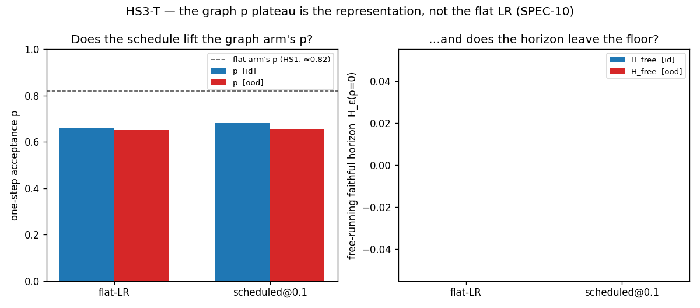

### 34. The SPEC-10 capstone: the floor is proposer-dependent (cross-proposer synthesis)

The whole SPEC-10 arc reduces to one contrast, and
[`horizon_synthesis.py`](src/verisim/experiments/horizon_synthesis.py) draws it in one figure — a
*figures-from-records* overlay (like the cross-world [§22](#22-the-thesis-in-one-figure-the-floorcliff-is-the-same-in-every-world-cross-world-synthesis))
that re-reads the two committed capacity-sweep CSVs (the flat `horizon_scaling`, the structured
`horizon_graph_scaling`) and **re-runs nothing**.


Sweeping the **same** capacity axis, the **flat** transformer's free-running horizon **lifts ~9×**
(1.75 → 15.8 steps) and its floor dissolves into a resourcing story across capacity, data, and world
size (HS1/HS1.2/HS2 — [§30](#30-capacity-buys-free-running-horizon--and-the-verdict-is-cross-world-spec-10--hs1hs2--h26)).
The **structured** GNN+RSSM graph arm — the proposer that *beats* the flat arm on one-step delta-exact
(EN4/H11) — shows the **opposite**: its `H_free` is **pinned at ≈ 0** and moves with *neither* capacity
([§31](#31-but-the-capacity-lift-is-proposer-dependent--it-does-not-reproduce-for-the-structured-arm-spec-10--hs3--h26))
*nor* data ([§32](#32-and-the-structured-floor-is-not-data-starvation-either--a-genuine-ceiling-spec-10--hs3-incr-2--h26))
*nor* world size ([§33](#33-and-it-survives-the-world-size-axis-too--the-structured-ceiling-is-world-size-invariant-spec-10--hs3-incr-3--h26)).

**So the program's standing question — "is the floor+cliff a resourcing artifact?" — has no single
answer: it depends on the proposer.** For the flat arm it is under-resourcing (scale lifts it); for the
structured arm it is a genuine compounding ceiling at this world's exact tolerance (nothing lifts it). A
per-step *winner* (the graph arm, on delta-exact) that is the long-horizon *loser* (η < 1), and a
per-step *loser-that-catches-up* (the flat arm) that is the long-horizon winner — exactly the proxy/truth
divergence the whole program exists to expose, and invisible without the exact, free oracle. Together
with the cross-*world* synthesis ([§22](#22-the-thesis-in-one-figure-the-floorcliff-is-the-same-in-every-world-cross-world-synthesis)),
the two capstones bracket the generality: the curve's **shape** is world- and model-invariant (the
loop's), while whether its `ρ=0` **floor height** is a resourcing artifact is proposer-dependent (the
model's). Verification is the invariant; the proposer sets the floor it lives on.

### 35. The oracle is faithful to a *real computer* — the one structural bet, measured (SPEC-11 / SY1 / H27)

Every result above rests on one sentence: *for computer worlds, a deterministic ground-truth oracle is
free, exact, and resettable.* But every figure to date proves the loop against a **from-scratch reference
model** of POSIX — a symbolic interpreter, not a real OS. That is the program's central exposure (W1: "the
oracle is a model, not reality") and the sharpest reviewer attack. SPEC-11 closes it by running the **exact
v0 grammar against a real `/bin/sh` on a real kernel**, inside a hermetic, no-side-effect sandbox, and
measuring agreement bit-for-bit.


The result is the strongest honest form the claim can take. On the **structure-building grammar** — the
regime v0 is *designed* to model — the reference oracle's predicted next state equals the real kernel's
**bit-for-bit, agreement = 1.000** (degenerate CI), over both an exhaustive action battery and driver
trajectories. The head-to-head `H_ε(ρ)` curve (right) seals it: swap the `SandboxOracle` in for the
`ReferenceOracle` and the prime-directive curve is **indistinguishable** (max `|H_ref − H_sys| = 0.000` at
every ρ) — the oracle substitution is *transparent* where v0 claims fidelity. **"Computer worlds have a
free, perfect oracle" stops being an argument and becomes a committed CSV.**

And the disagreement branch is a *gift*, exactly as H28 pre-registered: the differential harness is a
**debugger for the reference model**. It immediately caught a **genuine reference-oracle bug** — `mv`/`cp`
of a directory into its own subtree (`mv /e /e/e`) produced an *invalid* state with an orphaned subtree —
now fixed at the source and re-run to agreement. Beyond that one bug, **every** remaining divergence on the
destructive grammar falls into one of **four named, documented modeling boundaries** with a measured
**residual of zero**: root protection, overwrite policy, permission enforcement (v0 models `mode` as data,
not access control), and self-subtree (a GNU-vs-BSD coreutils choice, platform-stamped). The weakness
becomes a maintenance instrument.

This is built **macOS-first** (the dev host is an Apple Silicon Mac mini; the cross-POSIX
[`SandboxOracle`](src/verisim/oracle/sandbox.py) runs on BSD and GNU coreutils alike) — "reality" does not
mean "Linux," and the headline is pure POSIX, so it reproduces on Linux CI for free. The sandbox is proven
hermetic *before* any agreement number is claimed: [SY3](src/verisim/experiments/sy3.py)'s negative-control
battery shows every prohibited action (filesystem escape, egress, privilege gain, cross-step persistence)
is **denied**, and [SY4](src/verisim/experiments/sy4.py) shows the system oracle is **bit-reproducible**
under its determinism seal. *Prove the checks have teeth before reporting what they catch* —
[SY3](src/verisim/experiments/sy3.py) → [SY4](src/verisim/experiments/sy4.py) →
[SY1](src/verisim/experiments/sy1.py) → [SY2](src/verisim/experiments/sy2.py), the gate order.

### 36. From faithfulness to *planning*: the oracle-grounded landmark graph (SPEC-12 / LP1–LP8 / H31–H38)

Every figure to §35 measures how *faithful* a learned world model stays under oracle budget. None of
them *plans*. SPEC-12 adds the planning altitude — and it does so as the direct architectural answer
to the wall §31–§34 found: the structured (GNN+RSSM) arm's free-running horizon is **pinned at zero**
(HS3), a genuine compounding ceiling. The goal-conditioned-RL field met that exact failure and
abandoned free-running rollout: *don't roll the model forward step by step (it diverges); plan
landmark-to-landmark over a sparse graph and execute only short, trustable hops* (L3P, Zhang et al.
ICML 2021; SoRB; SPTM). Verisim's contribution is the one thing that line structurally cannot do —
**make every graph edge *exact* instead of distilled-and-hoped, because computer worlds have an oracle
and continuous-control worlds do not.**

```
   high-level   graph search over the VERIFIED landmark graph
                nodes = landmark states (reachability-distinct)   edges = reachability, ORACLE-VERIFIED
                        │ subgoal sequence ℓ_a → ℓ_b → … → goal
                        ▼
   low-level    imagine(ℓ_i, hop)  ‖  verify against the oracle on budget ρ   (the shipped loop)
                        ▼
   oracle       data-plane ReferenceNetworkOracle (exact)  +  ControlPlaneOracle (cheap reachability)
```

**LP1 — does the latent encode planning geometry? The gate, and a clean negative (H31 refuted).** L3P
scatters landmarks in a learned latent and *trusts* that latent distance ≈ reachability — the single
assumption the whole architecture rests on. Verisim **measures** it instead of assuming it, because it
has the oracle. On held-out states, the graph arm's `embed()` latent distance correlates only weakly
with the exact action-graph BFS geodesic (**Spearman ρ = 0.27**, CI [0.24, 0.32]) and barely with
control-plane reachability distance (ρ = 0.10) — both far below the ρ ≥ 0.6 bar. The EN8
representation encodes *one-step-prediction* geometry, not *planning* geometry. This is the program's
epistemic engine at design time: the assumption that sinks every oracle-free landmark planner is, here,
a **measurement with a banked alternative** — SPEC-12 takes its pre-registered §4 fallback and builds
the graph **directly in reachability space** (the control-plane metric, free and exact). The oracle
let us find the load-bearing assumption false *before* building on it.

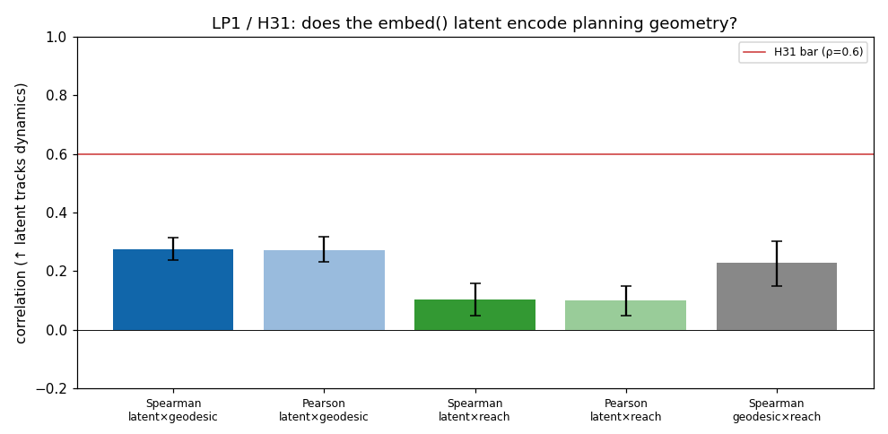

**LP2 — the faithful landmark graph + the verified-vs-hoped gap (H32 supported).** With landmarks now
reachability-distinct states and an edge a reachability-changing hop, LP2 measures what the model's
*hoped* graph gets wrong and what verification costs. The verdict is the HS3 wall read at edge
altitude: the structured arm's hoped graph is overwhelmingly wrong — edge precision **0.11**, and a
**false-edge rate of 0.77** (of the edges the model proposes confidently onto a known landmark,
three-quarters point at the *wrong* one). A model that cannot free-run an exact rollout cannot propose
an exact reachability edge either. Then the oracle makes the graph exact: control-plane verification
prunes **every** false edge — **verified residual false-edge rate = 0.000**, the zero-false-paths
guarantee made a measured fact — at **0.62×** the data-plane consult cost (cheaper, and *sufficient*,
because an edge is a reachability claim). The deliverable is the **faithful landmark graph**: an
oracle-verified reachability/attack graph with **zero false paths by construction** — the standing
weakness of every static attack-graph tool (MulVAL et al.) fixed by the oracle.

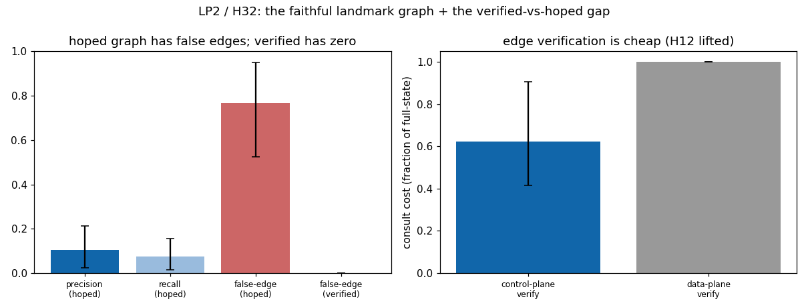

The defensive reading falls straight out: *"can an attacker reach the database from the DMZ, and by
what path?"* becomes a graph search whose answer the oracle has already verified is real;
*"did this firewall change open a new path?"* becomes a diff of the verified graph.

**LP3 — long-range goal reach: landmark planning vs flat free-running (H33 supported, the headline).**
The bet SPEC-10's HS3 wall set up: a structured arm whose *step* horizon is pinned at zero cannot be
rolled forward to a distant goal — but can it be re-grounded at landmark boundaries to reach one
anyway? LP3 runs two arms on the *same* model and the *same* trajectory, differing only in
re-grounding. The graph search ([`shortest_landmark_path`](src/verisim/landmark/plan.py)) emits the
subgoal sequence; the shipped `imagine`/`verify` loop executes each `L`-step hop; the oracle
re-grounds the coupled state at every *intermediate* landmark boundary — never at the goal, so
goal-reach is a genuine model prediction, never a tautology. As the goal-space distance `G` grows,
**flat free-running decays** — goal reach 0.50 → 0.33 → 0.17 from `G = 4` to `G = 20` (the HS3 cliff
at reachability altitude: error compounds) — while **landmark planning, re-grounding once per
`L = 4`-step hop (ρ ≈ 0.2), sustains and rises**: 0.50 → 0.67 → **0.83**. At the far goal the gap is
**5×** (0.83 vs 0.17) and it *widens* with distance — the compounding-vs-re-grounding signature, not a
constant offset. The budget sweep confirms the mechanism: at fixed `G = 16`, goal reach climbs
monotonically with the re-grounding budget — 0.17 (ρ=0) → 0.33 (ρ=1/8) → 0.67 (ρ=1/4) → 0.83 (ρ=1/2)
— so the verified graph buys goal-space horizon *in proportion to* the cheap oracle budget it spends.
The honest control: at `G = L` (a single hop, no interior boundary) landmark *equals* flat at ρ = 0,
so the win is the re-grounding and nothing else; and the model's own free-run reachability horizon
stays ~3–7 steps, which is exactly why the hops must re-ground. **The structured arm whose *step*
horizon SPEC-10 pinned at zero acquires a long *goal-space* horizon once short faithful hops are
composed over the verified graph — the SPEC-12 thesis, measured.** (Magnitudes are at the small
fast-CI scale; the separation and its distance-widening shape are the result.)

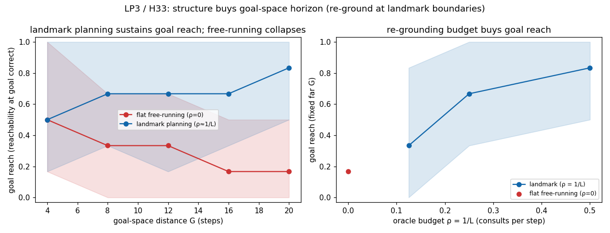

**LP4 — *why* the edges are reachability, not exact state (H34 supported).** LP3 showed re-grounding
buys goal-space horizon; LP4 isolates *why the graph is wired on reachability*. It is the EN10-vs-HS3
distinction — the model predicts a hop's reachability *effect* far better than its exact delta —
lifted to planning. The *same* planner runs over the *same* re-grounding boundaries, graded under two
edge projections. The **reachability-edge** arm sustains goal reach (0.50 → 0.83 with distance); the
**exact-state-edge** arm collapses (≈0, far-goal 0.33). The mechanism is the per-step horizon: the
model's *exact-state* free-run horizon is **pinned at 0** at every distance (the HS3 wall at exact
tolerance — it never lands even step 0's bit-for-bit state) while its *reachability* horizon climbs to
~7 steps (EN10). So the structured arm's exact-rollout failure *propagates* to edge construction —
a graph wired on exact-delta prediction cannot plan — and wiring on the reachability projection the
model is faithful on is what makes the planner work. The load-bearing design inversion, confirmed.

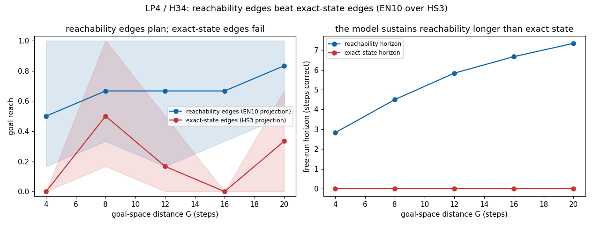

**LP5 + LP6 — placement and replanning, a mirrored pair (H35/H36).** Two policy axes — *where* to keep
a landmark under a budget (LP5), and *when* to re-plan at equal budget (LP6) — return a sharp,
complementary pair. **LP5 (placement):** of the two informed signals, **belief-variance (the model's
own uncertainty)** is load-bearing — it reaches the goal-reach ceiling with fewer landmarks than random
(advantage **+0.10**, beats random on 2/5 budgets, loses none) — while **betweenness (chokepoints)
under**performs random (**−0.20**) at this small world. **LP6 (replanning):** the mirror — the
**reachability-change trigger** (re-ground where the model's predicted reachability shifts most, the
"subgoal reached/unreachable" signal) beats fixed-interval (**+0.13**) and pinpoints the single
critical re-ground at `B = 1`, while the **belief-variance trigger** is *miscalibrated* (**−0.20**). So
the calibrated signal is signal-dependent: *uncertainty* for **where**, *reachability-change* for
**when** — the EH2 "smart beats dumb" lesson carried to the planner, on the right trigger for each
question. Both lean supported with overlapping CIs at this fast-CI scale (banked, revisit at larger
worlds), and the cross-over (uncertainty wins placement, loses triggering; reachability-change the
reverse) is itself the finding.

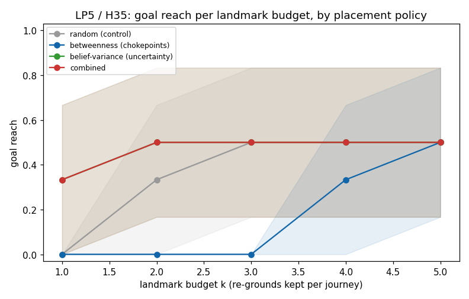

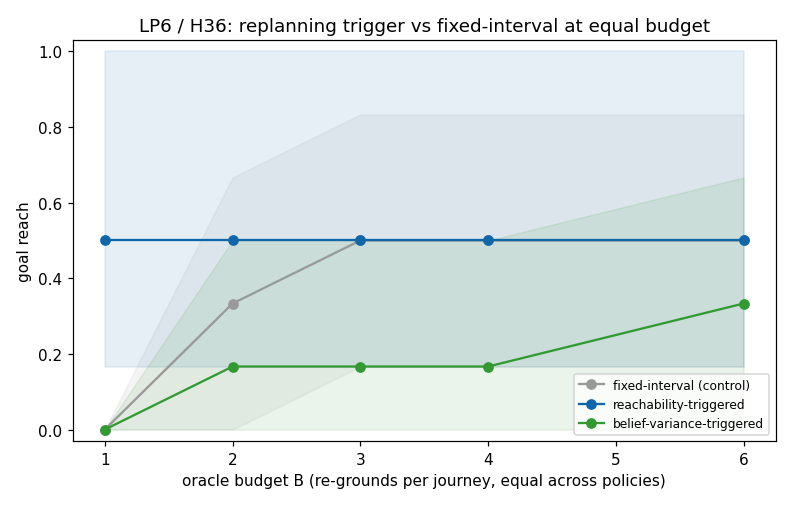

**LP7 — why the traversal belongs to graph search, not the LLM (H37 core supported; LLM arm deferred).**
The practitioner's founding insight and the NLGraph / Talk-like-a-Graph result: an LLM's
graph-reasoning degrades with traversal depth and node degree, so SPEC-12 confines the LLM to the
*leaves* (NL intent → one hop) and does the *traversal* by graph search server-side. LP7 makes that a
measured boundary. Its committed, dependency-free core compares, over the verified graph, **graph
search** (the planner's traversal — exact and complete, every path real by LP2's zero-false-edges)
against a **myopic greedy walk** — the deterministic structural class of an LLM choosing the next node
from local information, *never presented as an LLM itself*. Search stays at **validity 1.0 and
optimality 1.0 at every path length and node degree**; the myopic walk decays monotonically with depth
(**1.00 → 0.39** over 1→8 hops, CIs disjoint from search by depth ≥ 3) and with degree (**1.00 →
0.68**) — the NLGraph shape, derived mechanistically. That is the *correctness* argument for delegating
traversal to search: local choices cannot recover the global route on a branching graph. The real
LLM-traverser-vs-leaf-executor number needs a frozen model; it is wired behind the `NetModel` seam
(`llm_traverse_available`) and **never counted while absent** (§9), so the LLM claim itself stays open
— but the structural boundary the spec rests on is measured with no external dependency.

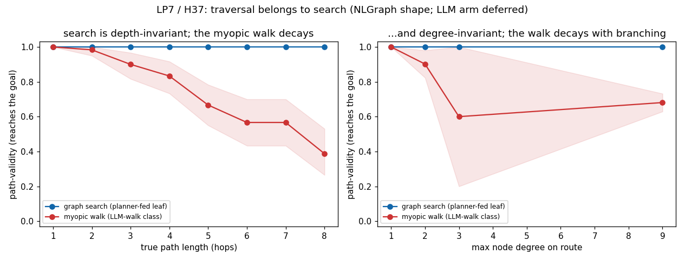

**LP8-dist — the method transfers off the network (H38 supported in kind).** The cross-world fork, now
ungated. The whole LP2/LP3 apparatus re-runs on the **distributed** world (`distsim`) with one swap:
the network's *reachability* signature becomes the distributed world's **coarse consistency/partition
structure** — per-object converged-vs-split, the partition topology, and the down-node set. This is
the hidden state ED12 measured, and deliberately coarse: each replica's exact `(version, value)`
increments on every write and would make the signature near-bit-exact (the projection the model is
*not* faithful on; ED5/H19 found its *consistency* prediction outlasts its *bit-exact* one). On that
projection the method transfers: **flat free-running is pinned near 0** (mean goal reach 0.03 across
distances — the HS3 wall, now at *consistency* altitude) while **consistency-landmark re-grounding
lifts it** (0.13 mean, adv **+0.10**), monotone in the re-grounding budget (ρ: 0 → 1/8 → 1/4 → 1/2
gives 0.00 → 0.00 → 0.17 → 0.25), and the LP2-analogue verified consistency-graph holds (the flat dist
`M_θ`'s hoped edges are **75% false**; control-plane consistency verification prunes **all** of them —
verified residual **0.000** — at **0.46×** the full bit-exact consult cost). The magnitudes are
*smaller* than the network LP3 (which reached 0.83): the distributed world is genuinely harder — the
model's per-hop coarse-consistency faithfulness caps the lift at ~0.25 and the far goal isn't reliably
reached — and that weaker-but-real transfer is itself the honest cross-world finding. The planning
*method* is not network-specific; it follows the world's planning-relevant projection wherever the
oracle can verify it.


**LP8-host — the third world, transferring more cleanly (H38 supported).** The host fork is the
*harder* test: unlike the network (reachability) and distributed (partition/consistency) worlds, the
host has **no given coarse hidden state** — its security-relevant projection is **privilege** (SPEC-6
§3.2: a non-root process gaining root), encoded as the coarse **privilege/liveness class set** — the
set of `(process state, uid)` classes present, count-free (it drops the exact process population so a
second `fork` does not move it, but an escalation or a process-death does). The pre-registered worry
was that this projection might be too *stable* (the model already faithful, re-grounding pointless) —
but measurement refuted it: the trained host model genuinely drifts on privilege over long free-runs.
The result transfers **more cleanly than the dist fork**: flat free-running decays with distance (goal
reach 0.50 → 0.00, the HS3 cliff at privilege altitude) while privilege-landmark re-grounding sustains
(0.50 at the far goal), mean **adv +0.18**, monotone in budget (ρ: 0 → 1/8 → 1/4 → 1/2 gives 0.00 →
0.08 → 0.25 → 0.50), and the verified privilege-graph prunes **74% false edges** to 0.000 residual at
the **cheapest consult of the three worlds (0.25×** the bit-exact set).


So the landmark method holds across **all three worlds** — network *reachability*, distributed
*consistency/partition*, host *privilege* — the strongest form of H38: **it is not network-specific; it
follows whatever planning-relevant projection a world has an oracle for.** The entire SPEC-12
experimental program (LP1–LP8) is shipped; only LP7's deferred LLM arm (the one external-model
dependency) remains. See [SPEC-12 §7](docs/specs/SPEC-12.md).

### 37. Scheduling the oracle: speculative world-model rollout (SPEC-13 / SR1–SR6 / H39–H44)

Every figure to here measures how *faithful* a model stays under an oracle budget. SPEC-13 asks a
different question — **when** to spend the budget — and observes that the program's whole
propose–verify–correct loop, read at the right altitude, **is speculative decoding lifted from tokens
to world-states.** The cheap model drafts `k` steps; the oracle verifies and **accepts the longest
faithful prefix**, re-anchoring at the first divergence — the same accept-longest-correct-prefix rule
that makes LLM speculative decoding exact-by-construction. The one verisim twist is the move the LLM
line structurally cannot make: the verifier is an **exact deterministic oracle**, so "longest correct
prefix" is correct against *ground truth*, not against a larger model's distribution.

```
  step t:  s_t (trusted, oracle-anchored)
             │  DRAFT k steps, NO oracle (free-run M_θ)
   ŝ_{t+1} ─▶ … ─▶ ŝ_{t+k}        ← optionally a TREE of drafts (SR3)
             │  VERIFY against the oracle, STOPPING at the first divergence
   accept the longest prefix with divergence ≤ ε   (= faithful_horizon of the window)
             │  CORRECT + RE-ANCHOR at the break, advance, repeat
```

The committed core is **CPU-only and deterministic**, built on a transparent *controlled stand-in
drafter* (right with probability `α`, else it *stalls* — predicts no change), with `α` held identical
across worlds so the figures isolate the *world's* contribution. The trained-`M_θ` arm is the one
deferred, `skipif`-guarded dependency (the LP7 discipline). The primitive is
[`loop/speculative.py`](src/verisim/loop/speculative.py); the bundles and drafters are in
[`experiments/sr_common.py`](src/verisim/experiments/sr_common.py).

**SR2 — the accepted-prefix law, and the reframing of K4 (H40 supported).** Run *before* any policy: the
empirical mean accepted prefix grows with the **dimensionless ratio `g = ε/δ`** — `ε` relative to the
world's *single-edit divergence granularity `δ`* — and tracks the i.i.d. law `E[a] = α(1−α^k)/(1−α)`
fed the *measured* per-step acceptance, the residual being position-dependence. The pre-registered
*world-identity* split (network gradual, filesystem discrete) turns out to be a **per-metric** law, not
a per-world one: `g < 1` is the discrete K4 cliff (the first missed edit exceeds `ε`), `g ≥ 2` is
gradual, and the worlds collapse onto one curve in `g`. This sharpens K4 and points the next move at
the *metric* (an edit-distance-graded `ε`), not the policy.

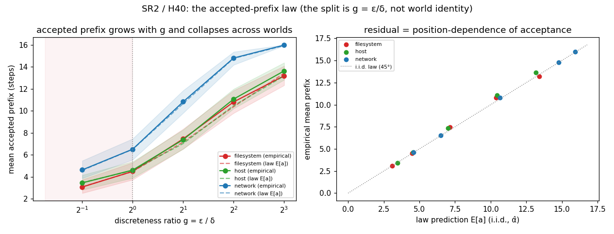

**SR1 — speculative vs fixed-ρ at equal budget: the budget crossover (H39 supported above ρ\*, refuted
below — the headline).** At *equal expensive budget* there is a crossover `ρ\*`: **above it, speculative
reaches full faithfulness** (consult-at-the-break wastes no oracle call on a still-faithful step — the
escape from SPEC-7's no-knee floor, EN7/H22); **below it, fixed's uniform clock wins**, because
accept-longest-prefix is *budget-greedy* — it spends corrections early and free-runs the tail. The
crossover is `ρ\* ≈ 0.10` (network) / `0.13` (host) / `0.20` (filesystem). The honest reading: the
favorable knee is real, but only once the budget covers the breaks; the scarce-budget loss is banked as
a genuine property of reactive scheduling.

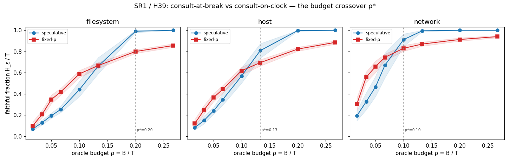

**SR3–SR6 — the follow-ons (two clean positives, two banked negatives).**
- **SR3 (H42 supported):** a draft *tree* (best-of-`m`, verified against one oracle pass) lifts the
  accepted prefix ~2.3× under **variance** (stochastic stalls) but is **flat under bias** (systematic
  stalls) — a tree helps iff the model's divergence is stochastic.
- **SR4 (H41 split):** the EAGLE-2 confidence↔acceptance link *transfers* (calibration slope ~+0.22 vs
  ~0 for an uncalibrated signal), but **calibrated draft length does not beat draft-long-everywhere** —
  the oracle-cost inversion (§8): the verify *stops at the break*, so a long draft that rejects early
  costs no more, and calibrating `k` down only adds oracle calls.
- **SR5 (H43 refuted — banked):** a cheap-drafter→large-drafter cascade does *not* cut **oracle** calls
  per faithful step vs the larger drafter alone — only the oracle adjudicates, and the cheap tier adds a
  verify round. The cheapness self-speculative decoding exploits lives on the GPU (free here), not in
  the oracle.
- **SR6 (H44 partial):** the speculative win is **hump-shaped in `g`** (small at the K4 cliff, small
  once free-run is already faithful, peaking in the transition band); worlds share the shape but the
  network saturates at lower `g`, so `g` governs the shape and the collapse is approximate.

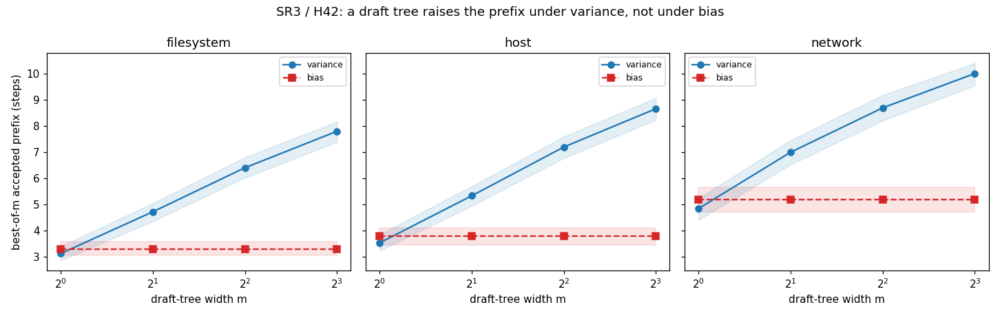

The SPEC-13 lesson is a *method* lesson, and it is mostly about the **cost inversion**: in LLM
speculative decoding the GPU drafter is the cost and the verifier is cheap; in verisim the **oracle is
the cost** and the drafter is free. That single flip explains every result — speculative wins by
consulting only at breaks (SR1), trees are free because the oracle pass is shared (SR3), but calibrating
draft length (SR4) and cascading cheap models (SR5) buy nothing because they only save the resource that
was already free. The entire SPEC-13 program (SR1–SR6) is shipped on the controlled-drafter core; only
the trained-`M_θ` arm remains. See [SPEC-13 §11](docs/specs/SPEC-13.md).

### 38. Guaranteeing the trigger: oracle-calibrated conformal consultation (SPEC-15 / CF1–CF6 / H50–H54)

Every consultation policy the program measured was a *heuristic* — "consult when the signal is high,"
threshold hand-set, payoff decided empirically per arm. That produced a split with no theory: the
host's calibrated belief-variance trigger beat fixed ~2.2× (EH2/H9), while the flat arm's
decode-entropy trigger lost, and lost badly (ED2-smart). SPEC-15 turns the trigger into a *guarantee*
and explains the split — using the one asset oracle-free domains can never have: **the oracle is a
free, exact, unlimited calibration set**, the textbook precondition for **conformal prediction**. So
the consultation threshold can be set to certify `P(undetected divergence > ε) ≤ α`, distribution-free
and finite-sample.

The calibrator is torch-free (it works on recorded `(score, oracle-divergence)` pairs); the committed
CPU core supplies the *score* with a transparent controlled stand-in — a noisy predictor of the step's
true divergence whose correlation is a stated knob (calibrated `belief_var` vs uncalibrated
decode-entropy), the trained-`M_θ` arm deferred. The drift and divergence are real (the SPEC-13
drafter against the real oracle). The layer is [`conformal/`](src/verisim/conformal/).

**CF1 — the coverage gate + the ρ-vs-coverage frontier (H50 pass, H51 supported — the headline).** On
exchangeable held-out steps the certified threshold keeps the empirical undetected-breach rate at or
under `α` for every target (H50, an implementation-correctness gate), and the calibrated trigger
certifies the same `α` at **~0.43 lower oracle budget ρ than fixed-interval** (H51) — a *guaranteed*
version of the EH2/H9 win: fewer consults to certify the same safety.

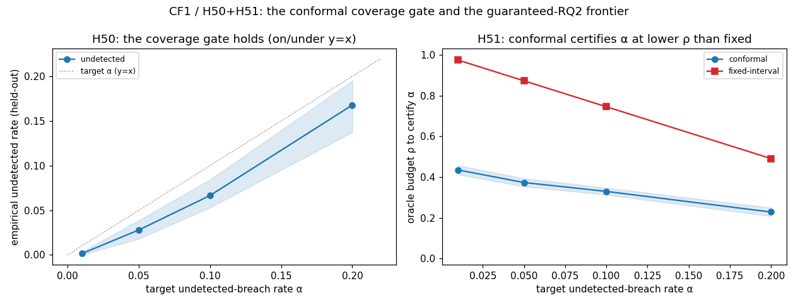

**CF4 — conformalizability: the EH2/ED2 mechanism (H53 supported).** The *identical* conformal
calibration on a calibrated signal saves ~0.50 ρ over fixed (score↔divergence slope ~+0.13) while on
an uncalibrated signal it saves ~0 (slope ~0). Crucially **both hit coverage** — conformal *validity*
is signal-agnostic; only *efficiency* is not. That is the measured, mechanistic statement of "entropy
is a decode artifact, not a calibrated belief," and it explains the EH2-yes / ED2-smart-no split with
one controlled comparison.

**CF2 — exchangeability under rollout: static vs ACI (H52 supported — the deepest result).** Split
conformal assumes exchangeability; an autoregressive rollout breaks it (the model goes overconfident as
its state leaves the calibration distribution). Static conformal's undetected rate **climbs with depth**
(0.10 → 0.41, above `α=0.1`). Gibbs–Candès **ACI**, fed the oracle's *free, exact per-step truth* — the
verisim twist, since that feedback is unavailable in ACI's native time-series setting — restores the
long-run rate near target (~0.13).

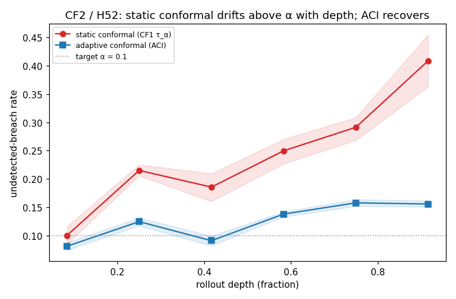

**CF3 — conformal risk control (H54 supported).** Bounding the *graded* undetected-breach loss
(severity, not a 0/1 indicator) buys ~0.22 lower ρ by tolerating near-misses, while still certifying
`E[graded loss] ≤ α` — the coverage-only trigger over-protects.

**CF5 — the cross-world fork (H50/H51/H53 transfer).** Re-running the *identical* torch-free conformal
machinery on the host world (the EH2/H9 confirmation) and the distributed world (the ED2-smart
challenge), alongside the network anchor, reproduces all three results on every world: the coverage
gate holds (H50, all α), the calibrated trigger certifies the target at **+0.42 / +0.44 / +0.44** lower
ρ than fixed at α=0.10 on network / host / distributed (H51), and the calibrated signal saves ρ while
the uncalibrated saves ~0 (−0.04 / −0.03 / −0.03) everywhere (H53). With the breach rate matched across
worlds (the control that isolates the *world's* contribution), the ρ-saved curves are near-coincident —
**conformal validity and efficiency are properties of the signal, not the world.** That localizes the
ED2-smart null precisely: it was the *uncalibrated signal*, not the distributed *world*, that could not
conformalize — the calibrated signal conformalizes there just as cleanly.


**CF6 — the trained-`M_θ` arm: does the REAL belief_var conformalize?** CF1–CF5 used a *controlled*
signal (a correlation knob). CF6 closes the deferred trained-arm question by training the real
structured graph arm and using its actual RSSM `belief_var` as the conformal score, against the two
stand-ins. The honest finding: on the network arm the real `belief_var` is **not** calibrated — weakly
*anti*-correlated with divergence (score↔divergence slope −0.004 ≈ 0, vs the calibrated stand-in's
+0.10). So conformal **validity holds** (the real-`belief_var` trigger still hits coverage ≈ 0.10 —
validity is signal-agnostic), but its **efficiency is null**: it saves −0.015 ρ, identical to the
uncalibrated stand-in, where the calibrated stand-in saves +0.45. This *instantiates* CF4's mechanism
(H53) on the real arm — efficiency *is* conformalizability — and locates the real network RSSM variance
at the uncalibrated end. The calibrated stand-in (CF1's ~0.43) is the achievable best case, and the
host `belief_var` (EH2's win) is the known positive, so conformalizability is world/arm-dependent. The
actionable reading: a network-arm conformal trigger needs a better-calibrated signal than its own RSSM
variance.

![CF6: the real graph-arm belief_var vs the two controlled stand-ins. Left — oracle budget ρ saved versus fixed at α=0.10: the calibrated stand-in saves ~0.45, while the real belief_var saves ~0 (slightly negative), identical to the uncalibrated stand-in. Right — the score↔divergence conformalizability slope: large positive for the calibrated stand-in, near-zero/negative for the real belief_var, showing the real network uncertainty signal is not calibrated (conformal validity holds regardless; only efficiency depends on it)](figures/cf6_real_signal.png)

The headline is the program's RQ2 thread resolved at last with a guarantee, a mechanism, a transfer,
*and* the trained-arm check: certify the trigger (CF1), explain the EH2/ED2 contradiction (CF4),
measure-and-fix the rollout exchangeability break (CF2), show it world-generic (CF5), and run the real
signal (CF6 — validity holds, but the real network `belief_var` isn't conformalizable, so efficiency is
the signal's). CF1–CF6 ship; what remains is a better-calibrated network trigger signal, not a CF
experiment. See [SPEC-15 §12](docs/specs/SPEC-15.md).

### 39. The product: a ground-truth faithfulness benchmark + a sim-to-emulation bridge and boundary (SPEC-18 / PB / H65–H68)

Every spec to here *produced* a result; this one *ships* one. The program's structural asset is the one
thing the oracle-free world-model field cannot have — a faithfulness benchmark with **exact
ground-truth labels** (Genie/Dreamer/V-JEPA are scored by eyeball, FID, or held-out rollout error,
never against a checkable next-state oracle). SPEC-18 freezes, versions, validates, and documents that
asset as [`bench/`](src/verisim/bench/): a hashable battery manifest, an `H_ε(ρ)` leaderboard, and a
conformance + metadata layer. The committed leaderboard entries are controlled-stand-in proposers (a
fidelity ladder); the trained transformer/GNN arms are the deferred real entries.

**PB-bench — discriminative validity (H65 supported, gates the rest).** A leaderboard is only worth
packaging if it *stably orders* proposers. Across disjoint seed splits the ranking is identical
(**Kendall τ = 1.0** at every world), and the strict adjacent-tier test passes: each adjacent pair's
gap exceeds twice its *paired* seed noise (common-mode seed noise lowers all proposers together, so it
never reorders the ladder — the gap that matters is between neighbors, and the noise that matters is
the noise of that gap).

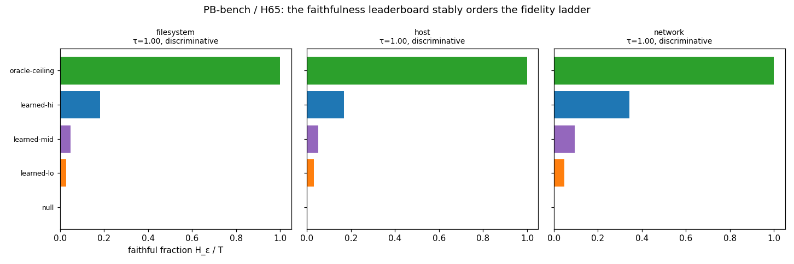

**PB-transfer — the sim-to-emulation gap, measured against a real OS (H66 supported, H67 banked).** The
ACD field asserts "full transferability" from a simulator to a real system and leaves it unmeasured.
PB-transfer measures it: a proposer fit against the reference oracle, re-scored against the SPEC-11
**system oracle** (real `/bin/sh`, real kernel — which runs on this host), has a transfer gap
`ΔH = H_ε^ref − H_ε^sys` that is **0.000 across the ρ-sweep** on the validated structure grammar.
Transfer is essentially lossless — the first such number in faithful-horizon terms, confirming SY1/H27
in the headline metric. Oracle-in-the-loop correction lifts the absolute real-OS horizon with ρ, but
there is no gap to shrink (the bridge is the measurement, not the fix, on this grammar).

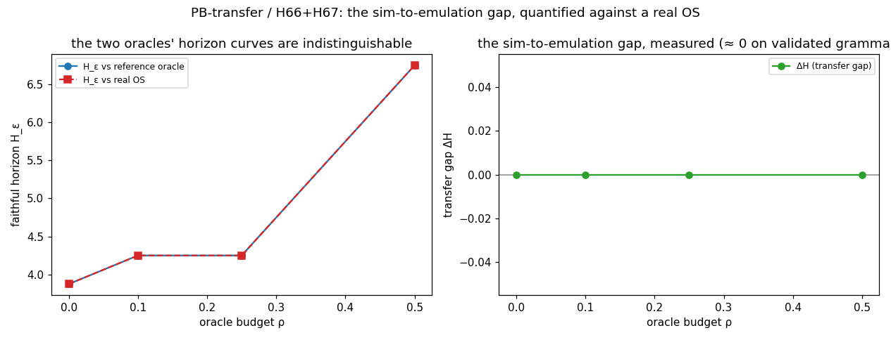

**PB-transfer-broad — the sim-to-emulation *boundary*, mapped (H66 across grammars).** A faithfulness
claim is honest only if its boundary is measured. PB-transfer's ΔH=0 was the *validated* structure
grammar; PB-transfer-broad runs the identical ΔH measurement against the real `/bin/sh` across grammars
of widening scope, and the boundary is now a number: ΔH(ρ=0) = **0.000** on `structural` (lossless,
confirming PB-transfer), **+0.67** on the everyday `weighted` grammar (cp/mv/rm/chmod/append), and
**+5.75** on the destructive `adversarial` grammar (rm -r / mv / rmdir-heavy). The reference FS model
diverges from the real shell *exactly* on the ops SY1/H27 did not validate. And a sharp finding on the
correction loop: **oracle-in-the-loop correction does *not* close the gap** — on the broad grammars ΔH
*grows* with ρ (0.67→4.83 weighted, 5.75→8.17 adversarial), because the loop consults the *reference*
oracle, which cannot fix a divergence from reality. This is the first quantified faithfulness boundary
(the SPEC-3 W1 wall, "the oracle is a model, not reality"): the program's "validated grammar is not all
of POSIX" caveat is now a measured curve, not a disclaimer.


**PB-pack — contamination control + conformance + metadata (H68 supported + the milestones).** A
public-manifest **memorizer** (perfect on public seeds, blind off them) shows a public-minus-held-out
faithful gap (~+0.98) far larger than an **honest** proposer's (~+0.10): the frozen eval is
contamination-resistant — overfitting is detectable. The **conformance suite is green** (each world's
RL env honors the Gymnasium reset/step contract and the `verifiers` `load_environment` entrypoint), and
the **Croissant descriptor, datasheet, and model-card** are emitted to [`bench/`](bench/), regenerable
from the manifest hash.

The capstone ships the accumulated asset as a versioned product: a faithfulness benchmark that
*discriminates*, with a *measured* bridge to a real OS (lossless on the validated grammar, and the
sim-to-emulation **boundary** now mapped across grammars — ΔH 0 → +5.75), and *contamination-resistant,
conformant, documented* packaging. Only the trained-`M_θ` leaderboard entries remain (the one GPU
dependency). See [SPEC-18 §10](docs/specs/SPEC-18.md).

### 40. The oracle as an exact Structural Causal Model (SPEC-17 / CX0–CX1 + CX3 + CX4 + CX5 / H60–H64)

The program's most-qualified result is H5: the counterfactual lift is *world-dependent* — it exists for
the distributed fault-branch replay (ED6) but is null for plain supervision in the on-policy-complete
network/host worlds (EN6/EH6). SPEC-17 gives that mixed result the one formalism that explains it
cleanly — Pearl's ladder — by observing that a **deterministic, resettable, seedable oracle *is* an
exact Structural Causal Model**: `step(s,a)` are the structural equations `F`, the seed/clock is the
exogenous noise `U`, and **abduction is reset+replay** — recovering the exact `U` behind a factual state
is an `O(1)` lookup, not the intractable inference an oracle-free SCM faces. From that one
identification, all three rungs of Pearl's ladder are executable exactly and for free.

The committed tranche is **pure-oracle** (no learner, no GPU): the `causal/` package + two experiments
across all four worlds. The *learned* counterfactual-lift bets (CX2–CX4) are deferred to the trained
arm — a non-parametric stand-in captures only the coverage channel, not the paired-contrast structure
channel a parametric model exploits, so the learned verdict honestly needs the trained arm.

**CX0 — the SCM gate (H60 supported, the build that licenses rung 3).** Abduction-action-prediction is
**bit-exact on every world** (rate 1.0): recovering `U` from the seed and replaying `F` reproduces the
factual trajectory bit-for-bit, so rung-3 counterfactuals are exact and free; the rung-3 trajectory
genuinely differs from the factual (cf-differs 0.81–1.00). This is the identification the whole spec
rests on, made empirical — a build, not a bet.

**CX1 — the counterfactual effect is hidden-state-dependent (H61 effect-size, the do-calculus reading
of H5).** Measuring each intervention's rung-2 *immediate* vs rung-3 *downstream* effect: the
**distributed** world's effect amplifies **~3.6× downstream** (its persistent partition/crash medium
carries the intervention forward, 65% of interventions consequential), while the on-policy-complete
**network/host** worlds amplify ~1× (the effect washes out). The clean ordering distributed ≫ host >
filesystem ≫ network *is* the mixed H5, now with a mechanism: counterfactual structure is large exactly
where the world has off-policy exogenous hidden state.


The same SCM machinery runs on all four worlds with no per-world causal-discovery step (the SCM is
*given* by the oracle, not learned), so the rung-3 recipe is a cross-world method by construction
(H64, in kind).

**CX5 — the SCM survives the move to reality (H64 transfer).** The natural objection to CX0 is that
bit-exact abduction is a property of the reference *abstraction*, not reality. CX5 re-runs the
abduction gate on the **system oracles** — the real `/bin/sh` + coreutils `SandboxOracle` (filesystem)
and the Tier-B `SystemDistOracle` (distributed, autonomous actors under a seeded scheduler) — replaying
the action sequence *through the system oracle*. Abduction-exactness, rung-3 counterfactual-exactness,
and cf-differs are **all 1.0 on both system oracles**, matching the reference anchor: exact, free
rung-3 counterfactuals survive onto the real system. The load-bearing nuance, stated honestly: this
holds *because* the filesystem oracle is sealed against clock/RNG/concurrency (the SY4 `DeterminismSeal`)
and the distributed oracle drives its real concurrency with a *seeded* scheduler (the DST thesis) — a
real system *without* the seal/seed is *not* an SCM, so CX5 measures that the seal/seed is exactly what
buys an exact rung 3 on reality. (A genuinely unavailable system oracle is a disclosed skip, never a
pass.)


**CX3 — the matched-coverage cut: branching was coverage (H62 refuted; the program's open caveat,
closed).** ED6 (SPEC-7) found a ~2× counterfactual lift on the distributed world but flagged its own
caveat: the counterfactual fault branches are *fault-heavier* than the on-policy control, so the lift
conflates counterfactual *branching* with the fault *coverage* it carries. CX3 — a CPU-scale trained-arm
experiment, the new [`causal/coverage.py`](src/verisim/causal/coverage.py) sampler over ED6's `_medium`
statistic — cuts the two apart: it matches a **factual** control (a fault-heavy on-policy trajectory:
high coverage, no branching) and the **+counterfactual** arm (branches off the on-policy states: the
abduction/re-grounding structure) on *both* example count *and* fault-coverage, so they differ in
**branching alone**. The result is decisive: at matched count and coverage (0.78) the **factual control
strictly beats** the counterfactual arm on held-out intervention-exact (0.569 vs 0.426) and medium-recall
(0.639 vs 0.480) with **disjoint CIs both ways**. So ED6's lift was **fault coverage, not counterfactual
structure** — re-attributed to H21 (fault coverage at equal volume); branching per se not only fails to
help, a fault-heavy factual sequence does *better* (it visits deeper drifted states in-sequence). The
raw arms reproduce the original lift (trajectory 0.245 → +counterfactual 0.425, as coverage rises
0.10 → 0.59), so the lift tracks coverage exactly. The SPEC-7 §10.1 caveat — the program's one
"no safe prior" question — resolves cleanly *against* branching.

![CX3: the matched-coverage cut on the distributed world. Held-out intervention-exact (left) and medium-recall (right) for four arms — raw on-policy trajectory (cov 0.10), raw +counterfactual (cov 0.59), and the matched cut: factual-matched and +counterfactual-matched, both at coverage 0.78. At matched coverage the factual control (orange) is highest, strictly above the counterfactual arm (green) with disjoint confidence intervals, so ED6's counterfactual lift was fault coverage, not counterfactual branching structure](figures/cx3_matched_coverage.png)

**CX4 — exact-oracle vs learned-model counterfactual augmentation: the unverifiability thesis, measured
(H63 supported).** This is the experiment that operationalizes the program's foundational claim
([SPEC §1.1](docs/specs/SPEC.md)): a *learned* world model's predictions are unverifiable and drift, so
data it synthesizes inherits that drift, while the *exact* oracle's counterfactuals are causally valid by
construction. CoDA (Pitis et al., NeurIPS 2020) is the SOTA for *learned* counterfactual data
augmentation; CX4 contrasts it against verisim's oracle augmentation. On the distributed world it builds
one counterfactual query set (alternative fault actions at visited states) and labels it two ways — the
exact oracle `O(s, a')` (causally valid by construction) and a learned local model `M_local` predicting
`M_local(s, a')` (the CoDA stand-in, labels that inherit its drift) — augmenting the same base to the same
count, plus a no-augmentation `base` reference. **The result is decisive: H63 supported.** +oracle-aug
lifts held-out intervention-exact to **0.394** (over base 0.277), while +learned-aug **collapses to 0.064
— *below* the base** (disjoint CIs). The mechanism is causal validity: the learned model's counterfactual
samples are only **5.8% valid** (the oracle's are 100% by construction), so its augmentation injects ~94%
causally-invalid data that actively *corrupts* training. A learned model's counterfactual augmentation is
not merely useless but **harmful** — exactly where the exact oracle is the unique leverage over the
learned-causal-model line.

![CX4: exact-oracle vs learned-model (CoDA) counterfactual augmentation on the distributed world. Left — held-out intervention-exact for base (gray, 0.28), +oracle-aug (green, 0.39, above base) and +learned-aug (red, 0.06, far below base) with bootstrap CIs: the exact-oracle augmentation helps while the learned-model augmentation actively hurts. Right — the mechanism: the causal-validity rate of each augmenter's samples — the learned model 0.06, the oracle 1.0 by construction — so the learned augmenter injects ~94% causally-invalid data that corrupts training](figures/cx4_coda_contrast.png)

The pure-oracle identification + effect-size law (CX0/CX1), the system-oracle transfer (CX5), the
matched-coverage confound-resolver (CX3), and the CoDA contrast (CX4) all ship; only the *learned* lift
(CX2) remains the open trained-arm bet (and its headline is now nuanced by CX3). See
[SPEC-17 §8](docs/specs/SPEC-17.md).

### 41. Curing the exposure-bias gap: free-oracle DAgger + the unrolled loss (SPEC-16 / RS1 + RS4 / H55–H58)

Every horizon number to here trained the proposer **teacher-forced** (on the oracle's true states) and
rolled it out **free-running** (on its own predictions) — the textbook exposure-bias / covariate-shift
gap, exactly what SPEC-10's HS1.1 caught (a per-step-accurate model with a near-zero free-running
horizon). The classic cure is DAgger: query the expert on the *learner's own* drifted states and
aggregate. DAgger's bottleneck is the expensive expert — but in verisim the expert is the **oracle**:
free, exact, callable at any drifted state. RS1 runs that cure on the **real flat `M_θ`** (a genuine
trained-arm experiment, not a stand-in): teacher-forced vs free-oracle DAgger at a fixed example
budget, with bootstrap CIs over 5 model × 12 eval seeds.

**The result is the program's pre-registered, first-class *negative* (H55 not supported at this
scale).** At CPU-affordable scale the flat `M_θ` reaches only modest one-step accuracy (`p≈0.47`) and a
near-floor horizon (`H_ε≈1.6`); free-oracle DAgger — despite relabeling the learner's own drift with
the exact oracle *and* spending extra compute (it retrains every round) — **does not lift `H_ε`** (best
DAgger round 1.47 vs teacher-forced 1.63, CIs overlapping, `p` unchanged). Showing the model its own
oracle-relabeled drift buys no horizon: at this scale the gap behaves like **fundamental compounding**,
not a fixable train/deploy mismatch — the deeper, sharper reading SPEC-16 §7 banks as "arguably the
bigger result."


**Honest caveat (load-bearing).** At CPU scale the model is near the `H_ε` floor with only modest
one-step competence, so there is not a large per-step-accurate-but-horizon-poor gap to cure. Small-scale
single-seed runs showed large but high-variance swings (a +2.2 fluke that did not survive powering up);
the powered multi-seed estimate is the trustworthy one, and it is a null. **Whether the cure pays for a
*competent* (high-`p`) model at larger scale is the genuinely open question** the compute budget did not
settle.

**RS2 / RS3 — the two cheap lever sweeps: both H57 nulls on the structured arm.** The two *shipped*
levers — scheduled sampling and oracle-relabeled noise injection — get dedicated parametric sweeps on the
structured GNN+RSSM arm (the competent-one-step / zero-horizon HS3 subject), each testing **H57, the
signed bias-stability tradeoff** (does rollout-aware training *lower* one-step `p` while *raising*
`H_free`?). **RS2** sweeps `max_sample_prob ∈ {0,…,1}`: across the whole curve neither `p` (flat ~0.58)
nor `H_free` (best +0.36 at ε=0.3, within ±0.70) moves beyond seed noise — no tradeoff. **RS3** sweeps a
`noise_prob × magnitude` grid (adding a `magnitude` knob that stacks off-trajectory mutations,
`magnitude=1` byte-identical to every prior caller): no cell lifts `H_free` over the no-noise baseline
(best +0.67 within ±1.50) and the `p` surface is flat. Both are clean nulls — strengthening NA6's
single-point comparisons into full sweeps: of the rollout-aware levers, these two buy nothing on this arm.


**RS4 — the multi-step unrolled loss (the pushforward made exact) on the *structured* arm: a lift, but
not a net one (H55/H57 supported on raw horizon, H58 null).** RS1 ran on the flat arm (near the floor,
nothing to cure); the RS2/RS3 sweeps tied teacher forcing on the structured arm. RS4 adds the one trainer
none of them did: `train_unrolled`, **Brandstetter's pushforward made
exact** — re-anchor to truth every `k` steps, unroll the model on its *own* predictions, and supervise
*every* visited drifted state with the oracle's exact delta there (the pushforward's load-bearing
"what's the target at a drifted state?" approximation dissolved by the free total oracle). Swept over
`k ∈ {1,2,4,8}` (with `k=1` reproducing teacher forcing byte-for-byte, the cost-1.0 anchor — confirmed
exactly), it is **the first rollout-aware lever to move the structured floor**: `η0` crosses above 1
(`H_free(ε=0)` 1.28 → 1.60 for every `k ≥ 2`, `η0` 0.97 → ~1.17) and raw `H_free` lifts at the loosest
tolerance (`k=8` at ε=0.5: 28.84 vs teacher-forced 25.60, **+3.24, just clearing TF's seed-CI half-width
±3.04**). So the `H_free` floor is *not* fully representational — a rollout-aware trainer does move it.
**But it does not pay net-per-compute (H58):** charged the pushforward's extra forward passes
(`1.5×`–`4.5×`), net `H_free / cost` falls monotonically with depth (at ε=0.5: 25.6 → 17.4 → 10.2 → 6.4
for TF/k2/k4/k8). The lift is a **reshaping of the error budget, not a reduction** — exactly the H58
banked null. Whether the unrolled loss pays net at GPU scale (a competent high-`p` model has a larger
gap to cure) is the standing open bet, the same caveat as RS1.

![RS4: the multi-step unrolled loss (the pushforward made exact) vs teacher forcing on the real structured GNN+RSSM arm. Left — free-running faithful horizon H_free vs tolerance ε for teacher forcing (red) and unroll depths k=1,2,4,8 (viridis): the curves nearly overlap, with k≥2 edging above TF at the loosest tolerance (η crosses 1 at exact tolerance). Right — the H58 net-per-compute read, net H_free / forward-cost at ε=0.5 per arm: teacher forcing and k=1 are highest and it falls monotonically with unroll depth (25.6 → 17.4 → 10.2 → 6.4), so the raw-horizon lift does not survive the compute charge — the cure reshapes the error budget, it does not reduce it](figures/rs4_unroll_depth.png)

**RS6 — the per-compute Pareto: the honest capstone (H58 confirmed at the family level).** RS4 charged
the unrolled loss with a *conceptual* per-step pushforward cost; RS6 makes the verdict rigorous and
*unified* — it puts all four structured-arm trainers (teacher-forced, self-forced DAgger, noise,
unrolled) on **one** `H_free`-vs-total-compute figure, each swept over a gradient-step grid, with a real
compute axis (forward passes × params) that **charges** self-forcing and unrolling for the extra model
forwards their data generation spends (teacher forcing and noise pay zero — the oracle makes their data).
The result: **teacher forcing is the faithful-horizon-per-compute frontier.** No rollout-aware trainer
beats it beyond seed noise — every rollout-aware point lies within its CI of (or below) the TF curve once
charged. So the whole rollout-aware family **reshapes the error budget; it does not buy faithful horizon
per unit compute on this arm.** This also answers RS5 (does *any* trainer move the structured floor?) in
aggregate: only RS4's unrolled loss moves *raw* `H_free`, and the Pareto shows even that does not pay net.

![RS6: the net faithful-horizon-per-compute Pareto on the structured arm. H_free at ε=0.3 vs total training compute (forward passes × params, log scale) for teacher-forced (red dashed, the reference frontier), self-forced DAgger (green), noise-injected (orange), and unrolled (blue), each swept over gradient-step budgets {500,1000,2000} with bootstrap CIs over seeds. All four curves overlap within wide confidence bands and none rises clearly above the teacher-forced frontier, so no rollout-aware trainer buys faithful horizon per unit compute — the honest H58 verdict for the whole family](figures/rs6_net_pareto.png)

**RS7 — the cross-world fork: the verdict transfers (H59 confirmed; the spec's closer).** Does the whole
network-world picture hold on a *different* world? RS7 re-runs the four-arm comparison on the **host**
factored arm (the SPEC-6 GNN+RSSM proposer — a different oracle over a process/fd/mount state grammar,
with HS2's re-lowered floor and re-opened headroom), adding the one missing trainer `train_host_unrolled`
(the host analogue of RS4's pushforward). **The verdict transfers**: no rollout-aware trainer lifts
`H_free` over teacher forcing beyond seed noise (best +0.44 at ε=0.1, within TF's CI half-width ±2.38;
all four arms cluster at `p ≈ 0.19`, `η0 ≈ 7–8`, overlapping `H_free`(ε) curves). So the rollout-stability
picture is a property of the oracle-grounded *loop*, not one world×proposer cell — on the host arm too,
the levers reshape the error budget without buying horizon.

![RS7: the rollout-aware trainers fork onto the host world. Left — free-running faithful horizon H_free vs tolerance ε for teacher-forced (red dashed), self-forced, noise-injected, and unrolled on the host factored arm, with bootstrap CIs: all four curves overlap within their confidence bands at every ε, so no lever beats teacher forcing. Right — H_free at exact tolerance (ε=0) per trainer: the floor bars are essentially identical (~1.8–1.9). The network-world verdict transfers to the host world — the cure is a property of the loop, not the world](figures/rs7_host_transfer.png)

The seven shipped trainers complete the SPEC-16 program across both worlds: **free-oracle DAgger does not
cure the flat arm (RS1); scheduled sampling and noise injection, swept fully, buy nothing on the
structured arm (RS2/RS3); only the deepest lever — the unrolled loss — lifts raw horizon (RS4), and even
that does not beat teacher forcing once compute is charged (RS6); and the whole picture transfers to the
host world (RS7).** The one standing open bet is the competent-high-`p` / GPU scale regime. See
[SPEC-16 §9](docs/specs/SPEC-16.md).

### 42. Diagnosing the structured-arm wall: does the GNN execute the propagation? (SPEC-14 / NA0+NA5+NA6 / H45–H46) — diagnosis, confirmation, and a banked negative

SPEC-10's HS3 found the program's one genuine wall: the structured GNN+RSSM arm free-runs to a faithful
horizon of **zero** at exact tolerance (η < 1) yet beats the flat transformer **~6.6×** on one-step
delta-exact (EN4/H11) — great one-step, zero horizon, the textbook end-to-end Neural-Algorithmic-Reasoning
symptom. SPEC-14 attacks that wall with NAR's fix — step-wise **hint** supervision on the algorithm's
intermediate states — and the one asset NAR never had: the network oracle's reachability is a BFS, so its
per-round propagation frontier is a **free, exact** hint. But the fix differs by branch, so NA0 runs the
diagnosis *first*: is the failure in the **processor** (the `mp_rounds` message passing never learns the
multi-hop BFS) or **downstream** (it computes reachability internally and the zero-horizon is decode/rollout
error accumulation)?

**The diagnostic.** Train three HS3-level graph arms (one-step `p=0.475`, the EN4 regime); on held-out
states, extract each round's node embeddings `h_r` (the new additive `message_pass_trace`) and fit a linear
ridge probe `h_r → F_r`, where `F_r` is the oracle's exact `≤ r`-hop reachability frontier (hop-bounded BFS,
free). The load-bearing comparison is the **processed** probe `h_r → F_r` against a **pre-propagation
control** `h_0 → F_r` — the input projection, which has the node features but *no link adjacency* — on the
identical target. Any margin is exactly what message passing *adds*.

**The result refutes H45 — and that is the valuable, pre-registered surprise.** The processor's embeddings
linearly decode the multi-hop frontier, *increasingly with depth*: the lift over the marginal baseline is
`0.119 / 0.237 / 0.283` at hops `r=1/2/3`, while the pre-propagation control reaches only `0.037 / 0.090 /
0.131` — the processed lift is **~2–3× the control at every deep hop, CIs non-overlapping**. Message passing
demonstrably injects the multi-hop reachability a linear readout extracts and the input lacks: **the
`mp_rounds` processor *does* execute the propagation.** Per SPEC-14 §5/§7 this is precisely the *"strong,
surprising result that redirects the spec to the decode side"* — the `H_free=0` wall is **not** an
under-aligned processor; it is a **decode/compounding** failure in the autoregressive delta head + free-run
rollout. So NA1's hint-on-`h_r` head would be redundant (the frontier is already there linearly), and the
genuine open work moves downstream — decoder/rollout supervision (the SPEC-16 RS-family lever, now on the
structured arm). The diagnosis gate fired and redirected the spec; NA1–NA4 are re-scoped accordingly.


**Honest caveats.** "Executes the propagation" is the NAR operational sense — *linear decodability* of `F_r`
from `h_r`, not a proof the forward pass is BFS. The control lift also rises with `r` (the probe is
expressive, denser frontiers correlate with up-host status), so the claim rests on the **processed-minus-control
margin** (decisive, CI-separated), not the processed lift alone. The world is 8 hosts (small diameter); the
qualitative gate is robust, the quantitative margins are this-scale numbers, read on the HS3 axis.

**NA5 — confirming the redirection at the rollout level.** NA0 read the embedding on *teacher-forced*
states; the redirection ("the wall is the decoder, not the processor") was an inference. NA5 tests it
*directly*: free-run the same arm and, at each rollout depth, apply NA0's **frozen** reachability probe
to the embedding of the model's *own drifted* state. The trap is that the in-distribution probe decays
off-distribution for *either* reason — the representation degrades, or the probe just fails to transfer.
The control that resolves it: **refit a fresh probe on the drifted states** (their oracle frontier is
free) and evaluate it held-out. The frozen probe falls with depth (0.87 → 0.71), but the refit probe
**recovers most of it** (0.87 → 0.83, **+0.12 over frozen at the deepest bucket**) — the reachability is
*still linearly in the embedding* of the drifted state — while `tracks-truth` (probe vs the *true*
state's frontier) falls **~4× more than the refit probe** as the state divergence climbs. So the wall is
**predominantly the decoder/rollout**: the processor stays faithful to whatever state it is in; the
autoregressive decoder emits wrong deltas that compound. A small residual (~0.04–0.06) of genuine
off-distribution representation drift is reported, not hidden. Pure measurement on the NA0 arm + a frozen
probe — no trained-arm bet.

![NA5: the decode-side rollout diagnostic. Left — per-bit reachability accuracy of three probes versus free-running rollout depth: a probe refit on the drifted states (green) stays high while the frozen in-distribution probe (blue) and the tracks-truth score (red) fall, showing the reachability remains linearly in the embedding and the loss is mostly probe-transfer plus state drift. Right — the state divergence between the model's own rollout and the truth climbs with depth, the decoder's deltas compounding](figures/na5_decode_rollout.png)

Together NA0 and NA5 localize the HS3 structured-arm wall conclusively: the `mp_rounds` processor *does*
execute the reachability propagation and *keeps* executing it on its own drifted states; the
`H_free = 0` failure lives in the autoregressive delta decoder and its compounding rollout.

**NA6 — testing the decoder-side fix the localization points to (the banked negative).** With the wall
localized to the decoder/rollout, NA6 attacks it at *training* time on the structured arm — the
*competent one-step / zero-horizon* regime the flat-arm RS1 lacked. Three arms at fixed capacity:
teacher-forced (HS3 baseline), **self-forced** scheduled-sampling DAgger (the arm rolls on its own
predictions and oracle-relabels each drifted state), and **noise-injected** (oracle-relabeled
state-noise augmentation, §6.3) — read across an ε sweep, 5 seeds with CIs. **Result: neither
decoder-side fix lifts `H_free` over teacher forcing at any tolerance** — the best lift is +0.92
(self-forced at ε=0.5), inside teacher forcing's own seed-CI half-width (±3.04). The ε sweep also
reframes the wall itself: the `H_free = 0` headline is **exact-tolerance-specific** — at ε=0 a
competent-but-imperfect one-step arm (`p ≈ 0.57`, η₀ < 1) misses instantly so `H_free → 0`, but at
ε=0.5 the *same* arm free-runs ~26 steps. So even on the competent structured arm the exact-tolerance
wall is **fundamental compounding, not exposure bias** — the decoder-side training cure does not pay at
CPU scale (sharpening RS1's flat-arm null and the HS3 η<1 verdict). The scale caveat is RS1's: whether
the cure pays for a higher-`p` model at GPU scale is the open bet.


The NA0→NA5→NA6 arc closes the redirected SPEC-14 program: diagnose (processor executes the propagation,
H45 refuted) → confirm at the rollout level (the decoder drifts, not the representation) → test the
decoder-side training fix (it does not lift `H_free` at CPU scale, the banked compounding negative). The
remaining NA1–NA4 (decoder-side supervision at scale, alignment, iterate-to-convergence) are the
deferred GPU-scale bets. See [SPEC-14 §11](docs/specs/SPEC-14.md).

### 43. The flagship: one real trained model, the whole stack, one headline curve (SPEC-19 / FL0–FL6 + HFL1 / H69–H72, H77, H84)

Every method spec above proved its mechanism on a *controlled stand-in* and deferred the trained-`M_θ`
arm — "only the trained-`M_θ` arm remains" recurs across SPEC-13/15/16/17/18. SPEC-19 un-defers it
**once**: it trains one flat network `M_θ` to the SPEC-10 HS1.3 compute-optimal frontier (`l@9.6k`,
~110k params), freezes it with a reload-determinism gate (`H_free` = **18.75 id / 29.75 ood**,
reproducing the 3-seed program-best on a single seed), and composes the shipped methods onto that one
checkpoint — the figure the program had been promising.

**The headline (FL1, H69).** The composed consultation policy (conformal trigger on the *real*
decode-entropy OR a speculative draft window) is run through the partial-observation loop and the
`H_ε(ρ)` curve is plotted against the exact oracle. The strict §3 bar (≥80% of ceiling at ρ≤0.2) is
**not met** — the curve rises ~linearly, floor 18.75 → ceiling 96, so composed reaches only ~31% of
ceiling at ρ=0.2, *no free sub-linear knee on a real model*. But the result is a large real positive
that no stand-in produced: the composed policy **nearly doubles fixed-interval consultation at equal
budget**, the gap widening with ρ — **+57% at ρ=0.2 (29.5 vs 18.75), +70% at ρ=0.3, +94% at ρ=0.5
(61.25 vs 31.5)**. Smart scheduling decisively beats the clock on a real trained model, measured
against ground truth where every oracle-free domain can only guess.


**What carries it, and the rest of the stack.** FL2's 2×2 ablation decomposes the FL1 win: the
**conformal trigger on the real signal carries the entire lift; the speculative window is inert** at
this operating point (conformal-only 42.0 = both 42.0, speculative-only = the floor). The methods
*compose* (H70: both ≥ max single) but not super-additively. FL6 explains *why* the real signal
schedules well even though SPEC-15's CF6 found it could not certify a conformal coverage bound:
Spearman(signal, divergence) = **+0.352** — the decode-entropy *ranks* drift, and consulting the
top-20%-signal steps catches breaches at **0.902 precision vs a 0.652 base rate** — **ranking ≠
calibration**, both true. FL3 reproduces SPEC-12's landmark result on the *real* structured arm
(H71): the HS3 wall survives (`H_free` ≈ 0.33) yet landmark planning lifts far-goal reach **0.167 →
0.667 (4×)** — structure buys *goal-space* horizon where it cannot buy step horizon. FL4 confirms the
curve's shape is the **loop's, not the model's** (H72): swapping the proposer (flat vs graph+RSSM)
leaves the shape unchanged, the proposer only setting the floor. The one sentence: *on a real neural
network world model at the compute-optimal frontier, faithful horizon rises ~linearly with oracle
budget — no free knee — yet a consultation policy that triggers on the model's own decode-entropy
nearly doubles fixed-interval consultation at equal budget.* See [SPEC-19](docs/specs/SPEC-19.md).

**The scheduling win is cross-world, not a network artifact (HFL1, H84).** FL1's win was measured only
on the network world. HFL1 runs the *same* four-arm `H_ε(ρ)` curve on the frozen **host** flagship
(HFL0 — the harder world: `H_free`≈9 vs the network's ≈18, `p`=0.70 vs 0.88), triggering on the *host*
model's real decode entropy. **The composed policy beats the fixed clock on the host world too** —
floor 9 → ceiling 48, with composed **+50% at ρ=0.2 (13.5 vs 9.0), +60% at ρ=0.5 (20.75 vs 13.0)**. So
the FL6/H77 ranking mechanism reproduces where the model is materially *less* faithful: the
less-faithful host model's decode entropy still orders its drift well enough to schedule. The win opens
at ρ≥0.2 (at lower budgets both arms sit at the floor — the signal needs budget to act on). Smart
scheduling is a property of the loop, not the network world.


### 44. The usefulness proof, the boundary law, and the useful knee (SPEC-20 / UA0–UA12 / H73–H92)

The field's gold-standard test of a world model is not its faithfulness number; it is whether you can
**train a policy inside it and have that policy work in reality** (Dreamer's learn-in-imagination).
Verisim is the one place that test can be run *honestly*, because reality — the oracle — is checkable.
SPEC-20 trains a defensive containment agent inside the frozen flagship model and transfers it to the
oracle's reality, with three rigorously separated environments: `E_oracle` (reality / the expensive
baseline), `E_grounded` (the model with oracle-in-the-loop correction at budget ρ — the product), and
`E_free` (the same model, never corrected — the ablation). All three are tested in `E_oracle`.

**Learn-in-imagination works (UA1, H73).** The defender trained in `E_grounded` reaches reality
containment **≥** the one trained directly against the oracle (**0.420 vs 0.390**) at **5× lower
training oracle cost** (720 vs 3,600 calls) — the cheap faithful model is a usable training environment.

**The money hypothesis is refuted — the bankable negative (UA2, H74).** The `E_grounded`- and
`E_free`-trained defenders transfer to reality **identically** (0.420 = 0.420, advantage 0.000).
Oracle-grounding during training buys *no* transfer advantage. The diagnosed mechanism: both backends
teach the same effective policy ("isolate exposed hosts"), which keys on compromise/exposure features
that **survive the model's reachability drift**, so the model's errors never change the preferred
action. Faithfulness does not convert into downstream usefulness *for this task* — which redirected the
spec to a task-taxonomy fork.

**The boundary law (UA6–UA8, the drift profile, the cross-world law).** Five more structural-control
formulations (structural feature, long-horizon, closed- and open-loop predictive control) all reproduce
the null. The mechanistic root, measured by free-running the flagship beside the oracle: the flat model
is **faithful on the discrete structural dynamics it learns** (network reachability / host process-tree:
host up/down drift 0.000, procs 0.000) and **drifts almost entirely on content** (network flows 0.252,
host file-writes ~0.30–0.64) — confirmed on *both* worlds. So structural-control tasks are drift-robust
and faithfulness is not load-bearing for them. The predicted *positive* is therefore a **content-keyed**
task. UA8 (H80) builds it: a predictive **file-integrity** defender protects the budget files it
predicts an adversarial workload will corrupt — a decision riding entirely on the model's prediction of
*which files get written*. **Result, the positive: the faithful predictor catches every corruption
(1.000) while the free predictor catches only 0.50–0.73, and the gap widens with horizon** as content
drift compounds. The complete, cross-world law: **world-model faithfulness is load-bearing for control
*exactly when* the task's optimal policy depends on the dynamics the model gets wrong (content), not the
dynamics it learns faithfully (structure)** — six structural-control nulls, one content-control positive,
a boundary drawn exactly against ground truth.

**The useful knee — buying that faithfulness cheaply (UA9, H81).** UA8 settled *that* content-keyed
control needs faithfulness, but only at the two extremes (ρ=1 faithful / ρ=0 free). The program's
central claim is that the oracle-in-the-loop *buys back* faithfulness cheaply at a budget ρ — but that
`H_ε(ρ)`-style curve had never been run on a *downstream task*, because on the structural tasks there
was no advantage for ρ to recover (UA4/H76 found it flat in ρ). UA9 runs it where the advantage exists.
The **ρ-grounded predictor** free-runs `M_θ` and re-anchors to the oracle's truth every `round(1/ρ)`
steps — the propose-verify-correct loop applied to the predictive rollout — swept over ρ on the
file-integrity task. **The catch rate rises *monotonically* with ρ (0.500 → 0.667 → 0.854 → 1.000),
recovering the every-step faithful predictor's perfect catch at ρ=0.5 — half the oracle calls (7 vs
14).** Two findings at once: the **H76/UA4 mirror** (the grounding advantage that was *flat* on
structural control is **monotone in ρ here**, on the task whose optimal policy depends on the content
the model drifts on — the boundary law read straight off the consultation curve), and the **useful
knee** (SPEC-19's "buy faithfulness cheaply" mechanism, demonstrated for the first time on downstream
*task success* rather than faithful horizon). The complete arc: faithfulness is load-bearing for control
exactly where the task keys on content the model drifts on (UA8) — and *there*, where it matters, you can
still buy it at sub-linear oracle cost (UA9). The cheap-faithful-model story holds where it has to.


**The law is cross-world, not host-specific (UA10, H82).** UA8 and UA9 lived entirely on the host
world (content = file-writes), so the symmetric question was open: does the boundary law — and the
useful knee — reproduce on the **network** world, whose content dimension is **flows** (the net
flagship drifts ~0.252 on the live-flow set, faithful on its structure)? UA10 builds the network
content-keyed task: an adversarial workload (from a connected seed topology, the flow-bearing regime)
opens connections, and a flow-integrity defender predicts which flows the adversary will establish
over the episode — the **cumulative** set, detect every connection made — and protects the budget it
predicts. **Both findings reproduce, more sharply than on host.** The content-keyed positive: the
faithful predictor catches every flow (1.000) while the free predictor **collapses 0.583 → 0.083** as
flow drift compounds, the gap widening from +0.42 at h=8 to **+0.92 at h=28** — the network model
drifts *harder* on its content than the host model, so the free predictor fails more completely than
host's 0.50–0.73. The useful knee: the ρ-grounded predictor recovers the faithful ceiling from that
near-zero floor at **ρ=0.2 — 4 oracle calls vs 20 (5× cheaper)**, monotone in ρ. So the complete
cross-world picture is symmetric — the boundary law and its cheap purchase hold in *both* worlds, with
magnitudes that scale with how hard each world's model drifts on its content. The law is a property of
the structure-vs-content split, not of one world.


**The operational completion — drift costs precision, not just recall (UA12, H92).** UA8–UA10 scored
the content-keyed defender by its **catch rate** (recall), which the budget-limited reward measures
exactly. But that metric is *structurally blind to false alarms*: it caps the defender's flags at a
budget and counts only the hits, so a model that flags the *wrong* files pays nothing. A real detector
does not get a free budget — it flags every file it predicts will be corrupted, and a SOC gates on its
**precision** (false-alarm rate), not its recall. A drifting world model mis-predicts *which* files the
workload writes, so its predicted set diverges from the truth in *both* directions: it misses real
corruptions **and** flags untouched files. UA12 scores the full confusion matrix
([`acd/host_detection.py`](src/verisim/acd/host_detection.py)). The faithful detector holds P = R = F1 =
**1.000** at every horizon; the free (trained `M_θ`) detector loses **both** — precision falls to
**0.69–0.79** (≈1 in 4 alarms is false, the cost the recall-only metric could not see) *and* recall to
0.50–0.73, so the **F1 deployability gap reaches +0.48**. The operational reading of the boundary law:
a drifting world model gives an *undeployable* detector (it floods the SOC with false alarms even where
its recall looks survivable), and faithfulness is what makes a content-keyed detector deployable. The
cheap knee restores the **whole operating point** — P + R + F1 ≥ 0.93 by **ρ ≈ 0.1–0.2 (2–4 oracle
calls of 20)**, the same sub-linear regime as UA9's recall knee. Faithfulness-grade detection, bought
cheaply.

![UA12 / H92: the operational detection characteristic, two panels. Left — the horizon sweep: the faithful detector's F1 (blue) holds flat at 1.0 while the free trained-model detector's precision (red dotted, the false-alarm cost), recall (orange dashed, UA8's metric), and F1 (red solid, deployability) all collapse together as the horizon grows, the shaded gap the operational cost of drift; precision sits at 0.69–0.79 (≈1 in 4 alarms false). Right — the ρ-knee for F1 at horizon 20: precision, recall, and F1 climb from the free floor (0.58) to the faithful ceiling (1.0), reaching deployable ≥0.93 by ρ≈0.1–0.2, just 2–4 oracle calls of 20 (the small non-monotone dip at ρ=0.3 is the re-anchoring-grid quantization artifact, the same UA9 caveat)](figures/ua12_host_detection.png)

Honest caveats (SPEC-20 §8): the adversary is scripted, not learned (a defender-only spec, the §13
ethics commitment); reality here is the Tier-A reference oracle (a checkable model of reality), with the
system-oracle rung reached as the network/host system-oracle line matures; and the policy is
deliberately the smallest that does the job — "the world model is a good training environment" is the
result, not "the agent is clever." See [SPEC-20](docs/specs/SPEC-20.md).

### 45. Scaling the boundary into a law — the CPU-proven core (SPEC-21 / CP0–CP5 / H87–H91)

The SPEC-20 boundary is sharp and cross-world, but it lived on *one tiny model per world* (110k
params) — so a frontier reader's first question is *does it survive scale, or is it a small-model
vignette?* SPEC-21 reframes the boundary as a **moving function of capacity** and measures its
trajectory: it sweeps the SPEC-10 capacity ladder *through* the SPEC-20 content/structure measurement,
on a **verifiable computer-use environment** (`verisim-cue` — the host shell/file/process world, the
slice of computer use that admits a ground-truth oracle, unlike GUI). The discipline that makes it a
GPU experiment a non-credentialed researcher can actually run is the **CPU-proven / GPU-ready contract**
(one pipeline, one dial): every component runs on CPU at smoke scale, identically, before any GPU is
rented — the GPU run is a config swap, not a rewrite. This iteration ships the whole CPU core (CP0–CP5).

**The ordered task suite (CP1–CP3).** Four computer-use predictive-defense tasks ordered
structure→content — `process-control` (the process tree) → `fd-control` (the open-fd table) →
`file-integrity` (*which* files written, UA8) → `content-value` (the actual *(path, content)*, the
highest-entropy rung and the irreducible-residue probe, H88) — each a SPEC-20 faithful-vs-free gap over
a generic **keyed-set extractor**, reusing the shipped UA8 machinery; the science is sweeping each task
across capacity, not the count.

**The committed 4-rung CPU run (CP0/CP4).** Training a host `M_θ` at `xs`(1k)→`s`→`m`→`l`(110k), the
structure→content gap gradient holds at **every** rung (process ≤0.16 → fd 0.13–0.25 → file 0.56–0.88 →
content **0.81–0.94**): `process-control` falls below the load-bearing threshold after `xs` — the
**structural-first recession beginning** — while `content-value` stays load-bearing at every rung (the
**irreducible residue**, H88, directionally confirmed). And the cheap per-task keyed drift **forecasts
the expensive gap at Spearman +0.965** (H89 — the cheap profile predicts the load-bearing verdict). The
honest scope is stated, not hidden: the CPU capacity range is too narrow to fit the *full* recession —
that is the GPU run's job, and the apparatus that produces it is proven here.

![SPEC-21 CS1: the faithfulness-for-control scale law (CPU-proven apparatus), two panels. Left — the load-bearing frontier: the faithful-vs-free gap per task versus model capacity (log x), one line per task ordered structure→content; process-control (green) drops below the load-bearing threshold while content-value (red) stays high — the structural-first recession with an irreducible content residue. Right — the forecast: the cheap per-task keyed drift versus the expensive gap, every (rung, task) cell falling near the y=x line (Spearman +0.965), so the cheap profile forecasts the load-bearing verdict](figures/cs1_loadbearing_frontier.png)

**The cost dimension — how expensive it is to buy back faithfulness, across scale.** The frontier says
*where* faithfulness is load-bearing; the harness also computes a per-task **ρ-knee** (the smallest
consultation budget that buys back the faithful catch, UA9/H81) — the *cost* of buying it — which sat
in the CSV unanalyzed. `knee_trajectory` / `knee_verdict` / `cost_forecast_check` surface it as the
law's second dimension. **On a fine ρ grid, the deep-content residue's knee is flat at ρ≈0.25 across
every rung** — an earlier coarse-grid run read this as a 0.3 → 0.5 *rise*, which the fine grid corrects
to a quantization artifact (the value of resolving the cost dimension properly). So the irreducible
residue (H88) is load-bearing and *persistent* but **cheaply *and stably* buyable**: verification on it
is a permanent primitive, but a *cheap* one (~ρ0.25), and the cost does not grow with scale. **And the
cost forecast extends H89:** the cheap keyed drift forecasts the *knee* — not just the gap — at
**Spearman +0.717**, so one cheap free-run profile predicts both *where* faithfulness is load-bearing
*and* how expensive it is to buy back.

![SPEC-21 the cost dimension of the scale law, two panels. Left — the knee trajectory: the useful-knee ρ (budget to buy back the faithful catch) per load-bearing task vs model capacity (log x); content-value (red, the deep residue) stays flat at ρ≈0.25 across every rung — cheaply and stably buyable, the cost not growing with scale — while file-integrity and fd-control sit near 0.10–0.20. Right — the cost forecast (H89 extended): the cheap keyed drift vs the knee on the load-bearing cells; higher-drift tasks (content, red) need a higher knee, so the cheap drift forecasts the cost at Spearman +0.717 (the gap forecast is +0.965)](figures/cs1_knee_trajectory.png)

**The GPU-readiness gate (CP5).** [`configs/scale_law_gpu.json`](configs/scale_law_gpu.json) (the full
`xs…xxxl` ladder + `device=cuda`) plus a `--dry-run` that validates shapes, device, and a pre-registered
cost estimate *without training* — green on the committed config. The headline wide-ladder scale law
(CS1/CS2) is now one command — `python -m verisim.experiments.scale_law --config
configs/scale_law_gpu.json --device cuda` — away.

**The reality anchor — does the law survive a real kernel? (CS3 / H90).** The whole scale law is
measured against the deterministic *reference* oracle, so the standing question is whether the
load-bearing frontier is about *real* computer-use dynamics or only a model of them. CS3 answers it on
CPU by measuring the scale law's own headline object — the **load-bearing gap** — against a real
`/bin/sh` ([`experiments/cs3_system_anchor.py`](src/verisim/experiments/cs3_system_anchor.py)). It is
the scale-law sibling of SY1/PB-transfer ([§35](#35-the-oracle-is-faithful-to-a-real-computer--the-one-structural-bet-measured-spec-11--sy1--h27)):
on the content grammar where SY1/H27 proved the system oracle bit-exact, the per-task faithful-vs-free
gap is swept across a **capacity-proxy α-ladder** — a content-drifting `M_θ` stand-in (the trained arm
deferred, the LP7 rule) faithful on structure, drifting on content with prob `1−α`, carrying an
**irreducible residue floor** (H88's effectively-unlearnable content) — and scored against *both*
reality anchors. The result: the load-bearing gap is **anchor-invariant — `gap_sys == gap_ref`
bit-for-bit (max Δ = 0.0e+00)** at every rung; the structure→content **gradient** holds under the real
kernel (file-integrity flat at **0.00**, content-value receding **0.76 → 0.56 → 0.41 → 0.28**); the
content **residue stays load-bearing under the real shell** at the top rung (0.28 > 0.05,
H88-consistency); and the cheap drift **forecasts the gap under the real kernel** at **Spearman
+1.000** (H89). The scale law is about real computer-use dynamics. `skipif`-guarded and §2.5-disclosed
where no real shell exists; the GPU run extends the *trained* arm and the wide capacity range.

![SPEC-21 CS3 / H90: the faithfulness-for-control scale law survives the system oracle, two panels. Left — the load-bearing gap versus the capacity proxy α, overlaid for both reality anchors: file-integrity (blue) sits flat at zero (structure, never load-bearing) while content-value (red) recedes from 0.76 to 0.28 as capacity rises, and the reference-oracle (solid) and real-/bin/sh (open markers) curves lie exactly on top of each other — the frontier and its motion do not move when the real kernel replaces the reference oracle. The content curve stays above the load-bearing threshold (0.05) at the top of the ladder — the residue, load-bearing on a real OS. Right — the anchor delta |gap_sys − gap_ref| per cell, a flat line at zero (max Δ = 0.0e+00): the reference oracle and the real shell produce the identical keyed sets on the validated content grammar, the bit-exact form of H90](figures/cs3_system_anchor.png)

**The artifact half — `verisim-cue` (deliverable #2).** A scale law is the result; `verisim-cue` is
the thing others use. The computer-use task suite is hardened the SPEC-18 way into a frozen, hashed,
versioned benchmark (`verisim-cue@0.1.0+<hash>`), emitting the full standardized metadata triple —
**Croissant** + **datasheet** + **model-card** — plus a **task-card** that carries what distinguishes
it from every other computer-use benchmark: the **per-task load-bearing verdict** (does a faithful
predictor beat a free one — is the oracle load-bearing for control; process-control *not* load-bearing
+0.03 → content-value +0.84 at the top CPU rung). The **eval surface** is `score_model(model)` — run
any host world-model through the suite and read its per-task scorecard (catch rate + *whether the
oracle was load-bearing for that model*); the model-card tabulates the reference scorecards, one per
scale-law rung, where the structural-first recession shows directly (`xs` has all four tasks
load-bearing; `s…l` catch process-control, leaving three). Its conformance contract holds — the
property no oracle-free benchmark can offer: **the faithful predictor scores exactly 1.000 on every
task** (ground-truth labels), the spectrum well-ordered, the dimensions recognized. And the frozen
eval is **contamination-resistant** (the SPEC-18 H68 parallel): a model that memorizes the public
seeds is caught by a disjoint held-out shard — the memorizer's public-minus-held-out catch gap is
**+0.875** vs the honest model's **+0.021** (margin +0.854), so a scorecard is trustworthy as a frozen
eval. Committed under [`cue/`](cue/), regenerable from the manifest hash; adoption is not a hypothesis,
so it ships regardless. See [SPEC-21](docs/specs/SPEC-21.md).

**Does the benchmark actually discriminate? (CL1 / H91).** A scorecard is only trustworthy if the
benchmark *stably ranks* models — and SPEC-21 §8.2 positions `verisim-cue` "on the SPEC-18
verisim-bench line", whose headline (H65) is exactly that discriminative-leaderboard test. The cue
artifact shipped a per-model `score_model` but no cross-model ranking; CL1 closes that parity
([`cue/leaderboard.py`](src/verisim/cue/leaderboard.py)). It scores a controlled fidelity ladder
(floor → graded learned tiers → oracle ceiling; the trained arm deferred, the LP7 rule) through the
ordered suite by **recall over the keyed set** — a defense budget covering the true set, so catch is a
*smooth* fidelity score (the scale-law's small fixed budget saturates to {0, 0.5, 1} per seed and
collapses adjacent tiers) — then decides validity the strict SPEC-18 way (reusing the proven
`bench.leaderboard` rank-stability discipline): Kendall τ between disjoint seed-split leaderboards
**and** every adjacent fidelity tier resolved above its *paired* across-split noise. The verdict:
**discriminative** — τ = **+1.000** [+1.00, +1.00], every adjacent gap clears 2× its noise (binding
0.035 > 0.021). And the ranking is carried by the **structure→content gradient** the scale law sweeps:
process/fd recall sit flat at 1.0 (structure is never load-bearing, so it never separates models),
while content-value recall climbs **0.00 → 0.49 → 0.68 → 0.86 → 1.00** with capacity (file-integrity
0.83 → 1.00 in between). The leaderboard and the frontier are the **model-facing and capacity-facing
duals** of one object — *for these models, which ranks highest?* vs *across capacity, where does the
boundary sit?* — both keyed on the same content drift. The bankable negative (a scorecard that does
*not* stably rank) is first-class; the trained-`M_θ` leaderboard entries are the deferred GPU arm.

![SPEC-21 CL1 / H91: the verisim-cue scorecard is discriminative, two panels. Left — the leaderboard: a horizontal bar per fidelity tier (floor α=0 at the bottom through oracle-ceiling α=1 at the top), mean catch (recall over the keyed set) rising monotonically 0.707 → 0.857 → 0.916 → 0.964 → 1.000, with red diamonds marking the content-value recall (the single task that separates the tiers — it climbs from 0.0 at the floor to 1.0 at the ceiling while the structure tasks sit pinned at 1.0). Right — the discrimination test: one green bar per adjacent-tier pair showing the paired catch gap, every bar clearing the red dashed 2×-noise line at 0.021, with the Kendall τ = +1.000 in the title. The benchmark resolves adjacent fidelity tiers above seed noise, not merely top-beats-floor](figures/cl1_cue_leaderboard.png)

**The writeup (deliverable #3).** The thing that circulates: a single essay,
[*The Verifier Is the Primitive: Where Scale Cannot Save a Computer-Use World Model*](docs/essays/the-verifier-is-the-primitive.md)
— the free-oracle insight, the compounding wall, the structure/content boundary, the scale law and its
irreducible residue, the real-kernel anchor, and the discriminative artifact, in the cyber-defense /
computer-use framing for the reader a non-credentialed researcher needs to reach.

## The problem, and what we're trying to accomplish

### The wall every world model hits

Generative world models (Genie 3, V-JEPA 2, Cosmos) all hit the same wall: **long-horizon error
accumulation and faithfulness**, with no cheap way to *detect* or *correct* drift, because physical and
visual worlds have **no ground-truth oracle**. You can render a plausible next frame, but you cannot
cheaply ask "is this *exactly* right?" — so error compounds silently and the field spends enormous
effort on proxies that keep a self-referential objective from cheating (JEPA's collapse-prevention
machinery is the clearest instance).

### The one asymmetry computer environments have

| Signal source | Dense? | Exact / true? | Free? | Generative? |
|---|---|---|---|---|
| Self-supervision (corpus co-occurrence) | ✅ | true to the *corpus*, not the world | ✅ | ✅ |
| Human supervision (annotation) | ◐ | usually — but **unscalable** | ❌ | ❌ |
| RL reward / reward model | ❌ (sparse scalar) | a **proxy**, hackable | ◐ | ❌ |
| **A deterministic oracle (computer worlds)** | ✅ | **exact, by construction** | ✅ | ✅ |

No other domain has the last row. A deterministic interpreter of a computer world returns the *entire
true next state* at every step, for free, and can *generate* unbounded perfectly-labeled data and
counterfactuals. Everything in Verisim follows from asking **where to spend that asymmetry**:
inference-time verification, RL reward, and — newest — self-supervised pretraining; and **how much it
actually buys**.

### What we're building: the propose → verify → correct loop

The signature mechanism runs the world model forward and lets the oracle bound its drift under a
consultation budget `ρ`:

```
                 ┌──────────────────────── step t ────────────────────────┐
  state s_t ────▶│  Δ̂ = Mθ.predict_delta(s_t, a_t)      ← neural proposer  │
  action a_t     │       (any model behind the Model protocol)             │
                 │                          │                              │
                 │   consult this step?  ◀── π_c policy, spends budget ρ    │
                 │        │ no                          │ yes               │
                 │        ▼                             ▼                   │
                 │  ŝ_{t+1} = apply(s_t, Δ̂)    O(s_t,a_t)  (oracle: truth)  │
                 │   (free-running prediction)  full | probe → correct ŝ    │
                 └─────────────────────────────────────────┬───────────────┘
                                                            ▼
        divergence d(ŝ_{t+1}, s*_{t+1}) ≤ ε ?   ──▶  faithful horizon
        H_ε(ρ) = first step where d > ε   (how long the model stays bit-exact)
```

- **`apply` is shared by the oracle**, so `apply(s, O(s,a).delta) == O(s,a).state` *by construction* —
  the model and the oracle speak the same delta language (the M1 / NW1 invariant).
- **`ρ`** ranges from 0 (never consult — pure free-running) to 1 (consult every step — always exact).
  The whole research question is the shape of `H_ε(ρ)` between those ends.
- Under partial observation the oracle has **full** and **probe** modes, turning consultation into a
  real bit-budget and opening an active-sensing axis ([SPEC-5 §5.3](docs/specs/SPEC-5.md)).

### The neuro-symbolic split, as a *training* principle

The next-state partitions into two regimes that want opposite treatment — the heart of
[SPEC-8](docs/specs/SPEC-8.md):

```
  s' = O(s, a)
    ├─ D  decidable bits  ── the oracle fixes them exactly & free  ──▶  VERIFY, don't learn  [symbolic]
    └─ R  residual bits   ── genuinely uncertain given what's seen  ──▶  LEARN (the model's job) [neural]
```

Burning network capacity to memorize `D` is waste — the oracle computes it perfectly for free. "Even
nature offloads": evolution does not store chemistry in the genome. SPEC-8 makes this a training
objective (mask `D`, spend gradient on `R`) and ships the deterministic machinery for it (OG1/OG2). *(The
SPEC-9 scaling surface above qualifies this: masking `D` in the **loss** removes beneficial multi-task
signal at small capacity; the partition's load-bearing form is the **inference-time** one — verify `D`,
don't learn-then-mask it.)*

## Architecture & system design

The repo is a stack of **worlds** (filesystem v0, network SPEC-5, host SPEC-6, and now the distributed
world SPEC-7) over one shared contract — the propose→verify→correct loop — plus cross-cutting
training/packaging and a **scaling layer** (SPEC-10) that sweeps the prime-directive metric itself along
capacity/data/world-size. Every box below is dependency-free and torch-free except `model/`, `netmodel/`,
`hostmodel/`, and `train/` (the optional `[model]` extra). The **`Model` protocol is the seam**: the loop,
oracle, metrics, and benchmark never know which proposer they hold, which is what makes the contribution a
*method* rather than a model (the H22 model-invariance claim) — and is exactly what lets the SPEC-10 scaling
layer swap the flat transformer for the graph arm under the *same* harness (the proposer-dependence result,
§34). Each world **composes** the ones below it: a host runs on the network; the distributed world replicates
services *across* hosts — and it is the first world where the bit-exact global oracle becomes
**intractable**, so SPEC-7's payload is the *tiered* oracle (cheap consistency checks + rare bit-exact
replay).

```
                       ACTION a_t
                          │
                          ▼
   ┌────────────────┐  predict_delta   ┌────────────┐   apply(s,Δ̂)   ┌────────────┐
   │  Mθ  proposer  │ ───────────────▶ │  Δ̂  delta  │ ──────────────▶ │  ŝ_{t+1}   │
   │ (Model proto)  │   grammar-       └────────────┘                 └─────┬──────┘
   │ txf | graph+   │   constrained          ▲ same delta grammar           │
   │ RSSM | LLM     │                        │                              │ divergence d(ŝ, s*)
   └────────────────┘                        │                              ▼
   ┌────────────────┐  O(s,a) = (state, Δ*)  │                       ┌──────────────────┐
   │ Oracle (truth) │ ───────────────────────┘   consult on budget ρ │ H_ε(ρ) · bits-to- │
   │ deterministic  │        full | probe ─────────────────────────▶ │ correct · δ-exact │
   └────────────────┘                                                └──────────────────┘
        apply(s, O(s,a).Δ) == O(s,a).state   ← the M1 / NW1 invariant, tested by construction
```

Package map (parallel structure; `net*` mirrors v0 for the graph world):

```
  v0 filesystem (SPEC-2)        network world (SPEC-5)            cross-cutting
  ─────────────────────         ──────────────────────            ────────────────────────────
  env/      state, actions      net/        typed-graph state     train/   supervised + RLVR
  oracle/   O(s,a) truth        netoracle/  Tier-A (data-plane)    eval/    faithfulness benchmark
                                            + control-plane oracle
  delta/    Δ types, apply      netdelta/   graph Δ, apply         rl/      oracle-as-reward env
  metrics/  d, H_ε, bits        netmetrics/ d, reachability,       auto/    autoresearch ratchet
  loop/     runner, π_c, ops                delta-exact, bits      experiments/  E*, EN*, K*, EH*,
  model/    Mθ transformer      netmodel/   flat Mθ + graph+RSSM                 en8/9_scale, en8_capacity,
  data/     drivers, traj                   + grounded_train (SSL)              en9_negatives, + the
                                netdata/    drivers + OG1/OG2 factory           SPEC-10 scaling layer
                                netloop/    partial-obs runner, probe,         (horizon_*: HS1 capacity,
                                            belief filter                       HS1.2/1.3 data/joint, HS2
                                                                                host, HS3 graph + its data/
                                                                                world/joint/schedule cross-
                                                                                axes, HS-synth synthesis)

  host world (SPEC-6, HC0-HC8 — the composing world; the host oracle *composes* the FS + net sub-oracles)
  host/      bundle state (procs + per-process fds + embedded v0 fs), syscall grammar, bundle delta, config
  hostoracle/  Tier-A reference host oracle (process/fd/credential glue over the v0 FS sub-oracle)
               + invariant.py: a symbolic privilege second-oracle (the cheap EH6/H12 security check)
  hostdata/  workload drivers + trajectory JSONL + manifests/splits + the concurrency scheduler
             (interleaving-entropy chaos dial → H14: H_ε(interleaving-entropy))
  hostmetrics/  composed + per-subsystem d, bits, composition-law (H13), privilege-faithfulness, run-record
  hostmodel/   flat Mθ (HC4 incr-1) + factored interaction-graph Mθ (incr-2): GNN+RSSM over the
               process spine's lineage + shared-file edges, same grammar/decode (DD-H1: flat vs factored)
  hostloop/    composed loop (HC5): two-mode oracle, π_w which-subsystem policy (fixed/round-robin/
               uncertainty — the smart information-gain choice), SubsystemFilter per-subsystem correct
  hostsim/     the LLM-callable whole-machine simulator (HC8, §7): imagine a plan (oracle-free draft)
               + verify it (plan-level H_ε + the task-oracle "third oracle") — what an agent calls
  hostrl/      oracle-as-reward RL env (HC8, §12; the v0 rl/ shape): reset/step, reward = faithful step,
               return == composed H_ε — the verifiable-reward substrate, no learned reward model in loop
  hosteval/    composed-host faithfulness benchmark (HC8, §1.4; the v0 eval/ shape): score_host_model +
               single-step QA grader + the inspect_ai task adapter (behind the [eval] extra)
  contrib/     §16 decentralized verified-contribution protocol: accept a contributed transition/
               trajectory iff the oracle reproduces it bit-for-bit — trustless by re-execution

  distributed world (SPEC-7, the current build front — the layer *above* the host: replicated
                     services across machines, where the bit-exact global oracle becomes
                     *intractable*; core DS0/DS2/DS3/DS5/DS6 + the learned M_θ flat arm DS4 ship)
  dist/        DistributedState (per-(object,node) MVCC replicas + causal event log + in-flight
               messages + partition/crash/clock + active txns), the client (put/get/cas) + fault/time
               (advance/partition/heal/crash/restart) + transaction (begin/tget/tput/commit/abort)
               action grammar, the DistDelta + compositional apply, canonical serialization, and
               txn.py — the shared OCC (first-committer-wins) multi-key transaction logic
  distoracle/  Tier-A reference DES (reference.py): a from-scratch deterministic discrete-event
               simulator of a fully-replicated KV under async replication + the fault/time medium
               (eventual-consistency last-writer-wins, the apply==oracle invariant); AND the
               **tiered oracle** (tiers.py) — SPEC-7's payload: the metamorphic ↔ cycle ↔ symbolic ↔
               bit-exact menu where cheapest_refutation spends the cheapest tier that can refute a
               prediction, recording the oracle-dollar cost (the H17 premise); AND **Tier-B**
               (system.py) — the system oracle: the protocol run as autonomous node actors under a
               seeded shuffled-delivery scheduler (the DST model), with a differential.py harness
               (the observable-cluster channel) that retires W1 for the distributed world (ED7); AND
               **Elle** (elle.py) — the black-box serializability checker (Adya's DSG cycle
               detection over the observable txn history; the stronger-consistency, over-a-history
               sibling of the per-step cycle tier) that recovers the write-skew anomaly with no
               oracle and certifies the serializable level reference-free (ED10, the DS3 incr-2
               piece), plus its **version oracle** (DS3 incr-3): recover_versions reconstructs the
               per-key MVCC order from list-append read *values* alone — no store-supplied versions —
               and catches the split-brain incompatible-order fork the integer mode cannot represent
               (ED11)
  distdata/    seeded workload+fault drivers (uniform/contention/adversarial = BUGGIFY) with the
               explicit fault-intensity (fault_prob) + partition-entropy (partition_bias) dials the
               H20/H21 sweeps need; trajectory JSONL + regenerable dataset manifests (DS2)
  distmetrics/ live-cluster divergence d(s,ŝ) (feeds the generic faithful_horizon, so distributed
               H_ε(ρ) is defined as in every world), the headline-new consistency-faithfulness
               (§9.1: did the model predict each object's converged/split state?), bits-to-correct
               / delta-exact over the DistDelta (DS3 metric core)
  distloop/    the tiered propose-verify-correct runner (DS5): model-agnostic over any DistModel
               (null/oracle-backed baselines), the π_w which-TIER policy (fixed | cheapest-refutation
               escalate), and the oracle-DOLLAR accounting — a consult spends its tier's cost, a
               refutation adds the bit-exact correction, an unrefuted prediction is trusted; the
               record carries divergences (→ H_ε) AND cumulative oracle-dollars (→ H17)
  distmodel/   the learned M_θ (DS4): the closed DistVocab (ops + commands + statuses +
               node/object/value leaves + one bounded <int:..> pool that closes the monotone
               bookkeeping counters) and the bidirectional tokenizer (state,action → Δ encode +
               exact parse). The causal-log EventAppend is a bare marker reconstructed from
               (state,action) on parse — keeping its variable-length happens_before out of the
               grammar. Round-trip parse(encode(Δ))==Δ tested exhaustively (incr 1, torch-free
               modules). Incr 2 (the [model] extra) adds the LL(1) DistDeltaGrammar (nested
               partition run + status-typed result), the NeuralDistWorldModel over v0's GPT (a
               drop-in DistModel), and the supervised dataset builders — overfit/grammar-valid/
               loop-protocol tested.
  distsim/     the LLM-callable cluster simulator (§7, DS8; the hostsim/ analogue): imagine a plan
               (oracle-free draft) + verify it → a DistPlanReport with a consistency-faithful plan
               horizon (distinct from bit-exact) + change-safety (does the plan break consistency?)
  distcontrib/ §16 verified-contribution protocol (DS8; the contrib/ analogue): accept a contributed
               cluster trace iff re-running the oracle reproduces it, with TIERED acceptance
               (bit-exact byte-for-byte OR cheap-tier admissibility, the W7 path) + SHA-256 manifest
  distrl/      oracle-as-reward RL env (DS8, §12; the hostrl/ shape): reset/step, reward = the tiered
               oracle's faithfulness verdict, return == H_ε; the reward_mode ∈ {bit_exact,
               consistency} knob grades the §9.1 split-brain DECISION (ED5/H19) not just bytes
  disteval/    distributed faithfulness benchmark (DS8, §1.4; the hosteval/ shape): score_dist_model
               (both horizons + oracle-DOLLARS) + single-step QA grader + inspect_ai task ([eval])

  the SYSTEM ORACLE (SPEC-11, cross-cutting — validating the *reference* oracle against reality)
  oracle/sandbox.py       SandboxOracle: a real /bin/sh over a real kernel behind the SAME Oracle
                          protocol — materialize state → render the v0 action → exec under the seal
                          → snapshot → destroy. v0-resolve path confinement; cross-POSIX (macOS+Linux)
  oracle/sandbox_seal.py  DeterminismSeal: the per-step env-scrub/umask/rlimit/no-new-privs seal
  oracle/differential.py  differential_step: ref vs system on the same (s,a); world/exit/stdout
                          channels + classify_divergence (the named modeling boundaries)
  experiments/sy{1..4}.py SY3 hermeticity (H29) → SY4 determinism (H30) → SY1 agreement (H27, retires
                          W1: structure-grammar = 1.000, residual = 0) → SY2 debugger (H28)
```

The host **bundle** is the structural novelty: state is a coupled set of subsystems (process table +
per-process fd tables + the embedded v0 filesystem) sharing references, not one tree. So a bundle delta
*composes* sub-system deltas — and the seam `M_θ` must learn is visible right in the encoding. The flat
HC4 arm (DD-H1 baseline) flattens that composition into one token stream; the factored arm (later
increment) keeps it. A `write` through fd 3 makes this concrete:

```
  syscall:  write 7 3 alpha           # pid 7 writes "alpha" through fd 3 (→ path /log)
  bundle Δ: [ FsDelta( v0:[ Create(/log, File"alpha"), SetResult(0) ] ),  SetExit(0) ]
              └── the embedded FS sub-oracle's OWN delta, applied by the v0 apply ──┘  └ host glue ┘
  flat Mθ : <fs_create> <path:/log> <c:alpha> <exit:0>   <set_exit> <exit:0>   <eos>
            └ the composition flattened to one closed-vocab stream; round-trips verbatim (§5.1) ┘
  invariant: apply(state, Δ) == oracle.step(state, action).state    # the M1/NW1-analogue, by construction
```

The composed loop (HC5) adds a second axis on top of v0's *when-to-consult* (`π_c`): **which subsystem's
truth to buy** (`π_w`, §8.2). A full consult corrects the whole bundle; a per-subsystem probe corrects
exactly one subsystem and keeps the model's belief for the rest — strictly less correction, so faithful
horizon is no greater at equal budget (the EH3 lever, native here with no v0 identity collapse):

```
  PROPOSE  Δ̂ = Mθ(ŝ, a) ;  ŝ' = apply(ŝ, Δ̂)            # cheap, every step
  CONSULT  if π_c fires (budget ρ):
     full    →  ŝ' ← truth                              cost = |all facts|     (HardReset)
     π_w=fd  →  ŝ'.fds ← truth.fds, rest kept           cost = |fd facts|      (SubsystemFilter)
                └ proc / fs / global beliefs survive verbatim ┘
  RECORD   composed d(ŝ', s*)  AND  per-subsystem d_proc/d_fd/d_fs/d_global   → HostRunRecord
                                    └ the two views H13's composition law needs ┘
```

The deterministic cores (oracle, delta/apply, divergence, the loop, the OG1/OG2 data factory) ship and are
property-tested **before** any training claim — the figure is always gated, never assumed (the NW0–NW3 /
OG1–OG2 discipline). See [SPEC-2 §10](docs/specs/SPEC-2.md) and [SPEC-5 §16](docs/specs/SPEC-5.md) for the
full module-by-module layout.

## Specifications

All specs live under [`docs/specs/`](docs/specs/); the canonical, evidence-gated build order is
[SPEC §12](docs/specs/SPEC.md#12-research-roadmap). The worlds form a ladder (filesystem → network →
host → distributed); three specs are *cross-cutting methods* every world inherits.

| Spec | Role | What it is |
|---|---|---|
| [SPEC.md](docs/specs/SPEC.md) | **the science** | why the project exists, what it claims, how we'd know we were wrong (RQs, H1–H25) |
| [SPEC-2](docs/specs/SPEC-2.md) / [SPEC-2.1](docs/specs/SPEC-2.1.md) | **v0 build** | the shell/filesystem world; the focused effort that earned a competent model and the knee result |
| [SPEC-3](docs/specs/SPEC-3.md) | depth | how the toy grows into a real simulator (system oracle, partial obs, online self-healing, info-theoretic metric) |
| [SPEC-4](docs/specs/SPEC-4.md) | **the engine** | the autonomous research engine — Verisim improving Verisim, human out of the loop |
| [SPEC-5](docs/specs/SPEC-5.md) | **world: network** | the reachability/connectivity world — NW0-NW8 built (oracle, graph delta, drivers, composed loop, the EN-series curves and the flat+graph learned arms) |
| [SPEC-6](docs/specs/SPEC-6.md) | world: host | the running computer (process tree, fds, scheduler) — **HC0-HC8 built**: the host oracle *composes* the v0 FS sub-oracle; bundle delta + `apply == oracle` invariant; workload drivers + datasets; composed + **per-subsystem** metrics with the **composition-law diagnostic** (H13); the **flat learned `M_θ` baseline** (HC4 incr-1); the **composed loop** with the `π_w` oracle-selection axis (HC5 incr-1); **the prime-directive figure (HC6)** — the composed `H_ε(ρ)` floor+cliff + the **H13 composition law = `coupled`** ([eh1_curve](figures/eh1_curve.png), [eh1_composition](figures/eh1_composition.png)); **the EH3 equal-budget operator comparison (HC7)** — per-subsystem consultation earns **~3.7× more horizon per oracle-bit** ([eh3_operators](figures/eh3_operators.png)); **the factored interaction-graph arm (HC4 incr-2) + EH4** — structure beats flat **~6.6× on delta-exact** yet the H13 coupling survives ([eh4_factored_vs_flat](figures/eh4_factored_vs_flat.png)); **EH2** — the factored arm's calibrated belief variance makes smart consultation beat fixed **~2.2×** (the first smart-`π_c` positive, [eh2_policies](figures/eh2_policies.png)); **EH5** — a smart *which-subsystem* `π_w` (per-subsystem decode entropy) gives a modest edge over round-robin ([eh5_subsystem_policy](figures/eh5_subsystem_policy.png)); **EH5-heads** — a trained per-subsystem decode *head* (opt-in) is **uncalibrated** (Spearman −0.02) where the bucketed entropy it would replace is **well-calibrated** (+0.57), closing the open HC7 lever with a negative ([eh5_heads](figures/eh5_heads.png)); the **§6.3 drift levers** (noise / self-forcing) reproduce the network's banked negative ([eh4_drift](figures/eh4_drift.png)); **H14 — the concurrency dial — is CONFIRMED**: free-running `H_ε` collapses ~8× as interleaving entropy rises (the host's defining result, [eh_h14_interleaving](figures/eh_h14_interleaving.png)); the **§7 LLM-callable whole-machine simulator** (HC8) — `imagine` a plan + `verify` it (plan-level `H_ε` + the task "third oracle"); **EH7/H22** — the floor+cliff `H_ε(ρ)` shape is **model-agnostic in the composed world too** ([eh7_invariance](figures/eh7_invariance.png)); and the **HC8 security/scaling findings** — **EH8** (aggregate faithfulness hides a **denied-recall gap**, flat 0.000 / factored 0.286, [eh8_privilege](figures/eh8_privilege.png)), **EH6** (a symbolic privilege second-oracle is redundant but **decision-sufficient in 95%** of error steps at ~3× lower cost, the host H12, [eh6_two_oracle](figures/eh6_two_oracle.png)), **EH-H13-scale** (concurrency **manufactures** the H13 coupling, [eh_h13_scale](figures/eh_h13_scale.png)), **EH9** (the denied-recall gap is a **data-balance artifact the free oracle fixes** — exposure + oversampling lift recall at no specificity cost, [eh9_denial_weighted](figures/eh9_denial_weighted.png)), **EH-stream/H15** (the experience stream **loses to the batch** at equal compute, but **replay** rescues it from collapse and the **plasticity probe** localizes HW-4 — no-replay plasticity 0.77 vs 0.95, [eh_stream](figures/eh_stream.png)), and **EH6/H16** (counterfactual replay is a **null beyond volume** for plain supervision — world-agnostic with the network's EN6, [eh6_counterfactual](figures/eh6_counterfactual.png)); plus the **oracle-as-reward RL environment** ([`hostrl/`](src/verisim/hostrl/)) whose episode return *is* the composed `H_ε` |
| [SPEC-7](docs/specs/SPEC-7.md) | **world: distributed** | replicated services, transactions, consensus — **DS0–DS8 complete**: the replicated-KV-under-partition deterministic core ([`dist/`](src/verisim/dist/), [`distoracle/`](src/verisim/distoracle/), [distributed-semantics](docs/distributed-semantics.md)) — async replication + eventual-consistency LWW, stale-read-under-partition, `apply==oracle` + goldens (DS0); the data factory with fault-intensity/partition-entropy dials (DS2); the metric core + **headline-new consistency-faithfulness** and the **tiered oracle** (metamorphic→cycle→symbolic→bit-exact, the **H17** payload, DS3); the **tiered propose-verify-correct loop** with the `π_w` which-tier axis + oracle-dollar accounting (DS5); the **distributed `H_ε(ρ)` curve + first H17 verdict** (ED1/DS6); the **learned `M_θ`** — tokenizer/vocab foundation + the LL(1)-constrained-decode flat arm over v0's `GPT` (DS4); and the **equal-dollar-budget H17/H18 frontier** on both the synthetic proposer (ED2) and the *real* learned `M_θ` (ED2-learned), the **`π_c` smart-when comparison** (ED2-smart — the H9 null carried in), the **ED3 correction-operator comparison** (the partial operator breaks v0's identity on the in-flight medium), the H21 fault-injection sweep, and the **ED4 consistency-level sweep (H20)** — the `linearizable` strong-consistency model added, the H19 gap shown to track the in-flight medium, plus its **learned arm** (ED4-consistency-learned) confirming the *absolute*-predictability H20 (the real `M_θ` free-runs ~2.4× further under `linearizable`) with the honest twist that the real model's H19 gap is positive at *both* levels (its errors land on consistency-invisible bookkeeping, not only the in-flight medium) (DS7); and the **DS8 ED5 consistency-vs-bit horizon (H19) + competitive-ratio fit (H18)** — consistency-faithful horizon outlasts bit-faithful where the error hides in the consistency-invisible in-flight medium, and the loop is learning-augmented in the error axis but floor→cliff in the budget axis; and **DS8 ED6 counterfactual lift (H5)** — free oracle fault-flip branch training beats equal-volume on-policy data on held-out interventions (the honest inverse of the network/host supervision null, because the distributed medium is off-policy by nature) — plus the **ED6 two-oracle slice (H12)**: the cheap consistency oracle is redundant for verification but decision-sufficient for the split-brain question (1.00 on in-flight vs 0.00 on durable errors) at ~3.6× lower consult cost — and its **learned-`M_θ` re-pointing** (ED6-two-oracle-learned), where the real model's mixed-but-mostly-`subtle` errors land decision-sufficiency at 0.57 *between* the synthetic poles, the same model losing as a verifier yet decision-sufficient as a decision oracle; the **§16 verified-contribution protocol** ([`distcontrib/`](src/verisim/distcontrib/)) — trustless distributed-trace contribution by re-execution with tiered acceptance (bit-exact *or* cheap-tier admissibility, the W7 path); and the **§7 LLM-callable simulator** ([`distsim/`](src/verisim/distsim/)) — imagine/verify a plan against the oracle, with a consistency-faithful plan horizon + change-safety (does the plan break consistency, and does the model agree with the oracle?); and the **DoD §4 community packaging** — the **`verifiers`-spec distributed RL env** ([`distrl/`](src/verisim/distrl/)), whose reward *is* the tiered oracle's faithfulness verdict (return == `H_ε`, with a `reward_mode ∈ {bit_exact, consistency}` knob that grades the §9.1 split-brain *decision*, not just bytes), and the **distributed faithfulness benchmark + Inspect adapter** ([`disteval/`](src/verisim/disteval/)) — `score_dist_model` reports both horizons + the tiered oracle-dollars, with a single-step QA grader and an `inspect_ai` task behind the `[eval]` extra, the §1.4 metrology a *running cluster* lacked. **The Tier-B system oracle ships (ED7)** ([`distoracle/system.py`](src/verisim/distoracle/system.py)) — an in-repo, dependency-free **autonomous-actor DST runtime** (madsim/Antithesis-class) where each node actor holds *only* its own replicas and an inbox and the cluster state is *emergent* (W7 operational); it reproduces Tier-A **bit-for-bit under seed-shuffled delivery** (certifying eventual consistency is delivery-order-independent), runs on **real OS threads** as a disclosed tier, and catches a deliberately order-dependent actor as a faithfulness break — the distributed **W1 retirement**. And the deterministic core grows a full **multi-key transaction + consensus + queue + embedded-host layer** (DS0 increments 2–35): the `begin`/`tget`/`tput`/`commit`/`abort` grammar under **two concurrency-control mechanisms** (`occ` first-committer-wins + deterministic wound-wait **`2pl`**, ED15), the **four standard SQL isolation levels** (`serializable` ⊃ `snapshot` ⊃ `read_committed` ⊃ `read_uncommitted`) exhibiting the textbook anomaly at each rung — **write skew** (ED9), **lost update** (ED16), and the **dirty read** (ED17) — each recovered black-box by a **Jepsen/Elle-style serializability checker** ([`distoracle/elle.py`](src/verisim/distoracle/elle.py)) that reconstructs Adya's DSG from the observable history alone (write-skew as a G2 `{rw}` cycle, lost-update as `{ww, rw}`, the dirty read as a value-oracle `dirty-read` recovery), plus the **`causal`** (ED13) and **`quorum`** Raft-subset (ED14) consistency models filling the curriculum between `eventual` and `linearizable`, and the **unreliable-network medium**: the **`drop`** message-loss fault (ED18) breaks the convergence guarantee where `partition` recovers (a lost write vs a delayed one), and **`anti_entropy`** read-repair (ED19, the first protocol op / §4 `ReplicaConverge`) restores it without a fresh write — the Dynamo/Cassandra mechanism that makes eventual consistency eventual under message loss, bounded only by reachability — with its **pairwise** sibling **`gossip`** (ED22, incr 15): `gossip a b` reconciles *both* nodes to the per-object winner (vs anti-entropy's one-directional pull), so a chain of pairwise gossips converges the whole reachable component epidemically — and the message-timing faults **`delay`**/**`reorder`** (ED20, incr 13): `delay` is a *recoverable* deferral (convergence rate 1.0 where `drop` is 0.0, completing the two-media contrast) and `reorder` flips the in-transit observation while last-writer-wins keeps the converged value invariant (delivery-order independence made a controllable input); and **`clock_skew`** (ED21, incr 14 — the **last** §3.4 medium fault, the grammar now complete): a signed per-node clock offset shifts a node's send timestamps yet convergence is **clock-independent** (sweeping skew leaves the converged state byte-identical at invariance rate 1.0, because LWW is by `(version, value)` not timestamp — the property DST injects skew to verify); and the **`elect`/`propose` Raft-subset consensus core** (ED23, incr 16 — the third action family): `elect node` makes a node leader iff its partition side holds a strict majority of the *live* cluster (so two sides can never both elect — **no split-brain**, an even split leaderless rather than forked), bumping a monotone `term`; `propose node key val` is a **leader-fenced** majority write whose deposed-leader rejection survives a `heal` (the Raft **leader-completeness** safety a leaderless `quorum` write lacks — a plain `put` by the same stale coordinator still commits, the control) — two omitted-when-default state fields (`term`/`leader`), one `ProtocolStep` edit, shared `elect_edits`/`propose_edits`; and the **`step_down` voluntary-handoff op** (ED24, incr 17 — the leadership lifecycle's graceful close): `step_down node` lets the current leader relinquish power, leaving the cluster **leaderless at the same term** (the voluntary counterpart to ED23's higher-term deposition) — so the same node's next `propose` is `not_leader` (**no leaderless commit window**), a clean handoff is `step_down` then `elect <successor>`, and a minority-stranded leader can still step down where its `propose` is `no_quorum` (relinquishing needs no quorum) — reusing the `ProtocolStep` edit (`leader → None`, no new state); and the **`lease`/`lread` leader-lease** (ED25, incr 18 — the Raft read optimization): `lease node dt` lets the current leader take a read lease through global clock `+ dt`, and `lread node key` then serves a **local linearizable read with no quorum round-trip** while it holds (so a minority-stranded leader can still `lread` where its `propose` is `no_quorum`) — the safety coupling being that a fresh `elect` is fenced `lease_held` until the lease expires (no two leaders read at once) while `step_down` releases it for a no-wait handoff — one omitted-when-default `lease_until` field + one `LeaseSet` edit; and the **`append` replicated log** (ED26, incr 19 — Raft log-matching / log replication, the piece the one-shot `propose` elided): `append node key val` appends a `(term, index, key, value)` entry to the leader's log and replicates it to the reachable followers (who adopt the leader's prefix, **overwriting any divergent uncommitted tail** — log-matching reconciliation), committing it (and folding the committed prefix into the KV, backfilling a rejoined follower) **iff a majority holds it**, where a minority-stranded leader's entry stays `uncommitted` and is overwritten by a higher-term leader at the same index — per-node `logs` + a monotone `commit_index` (omitted until the first `append`) + a `LogSet`/`CommitIndexSet` edit pair; and **`add_replica`/`remove_replica` membership change** (ED27, incr 20 — the §3.2 admin ops): they reconfigure the consensus voting set (a leader-committed change), so the **majority threshold tracks the membership** — `remove_replica` shrinks the cluster (restoring availability after failures: a lone survivor of a 3-node cluster commits again once the 2 dead are removed) and `add_replica` grows it, with the active leader fenced from removal — one omitted-when-default `members` voting set + one `MemberSet` edit; and the **`enqueue`/`dequeue` distributed FIFO queue** (ED28, incr 21 — the §3.2 client ops, a *second data type*): a queue's delivery guarantee follows the `consistency_model` — `eventual` admits **duplicate delivery** under partition (the dequeue's head-removal reaches only the reachable side), where `quorum`/`linearizable` gate availability for **exactly-once** (the delivery count steps `2 → 1 → 0` across the three models — the KV CAP tradeoff in delivery-semantics form), one omitted-when-empty `queues` map + one `QueueSet` edit (now in the observable `cluster_view`); and the **`deploy` rolling-upgrade op** (ED29, incr 22 — SPEC-7's headline *"will this deploy break the cluster?"*): `deploy node version` sets a node's running software version, and two nodes share a consensus quorum only if within `max_version_skew` (the N-1 window) — so a rolling upgrade inside the window keeps quorum, but an **incompatible version split with no compatible majority** loses it (the deploy broke the cluster); one omitted-when-default `versions` map + a `max_version_skew` config dial + one `VersionSet` edit (compatibility gating consensus only); and the **`host` embedded-host op** (ED30, incr 23 — the compositional vision §3.1/§4 names since increment 1): each cluster node runs a real **SPEC-6 host** (process table + per-process fd tables + an embedded v0 filesystem), and `host node <syscall>` delegates to the SPEC-6 `ReferenceHostOracle` on that node's own host (wrapping its bundle delta in a `HostStep` edit) — per-node isolated, host ops respect the node's up/down status (a crashed node's host is `unavailable`, the cross-layer crash linkage), `apply==oracle` holding three layers deep (cluster → host → v0 FS); one omitted-when-empty per-node `hosts` map + one `HostStep` edit, hosts in the observable `cluster_view`; and the **`config_push` config-management op** (ED31, incr 24 — SPEC-7's *other* headline *"will this config push break the cluster?"*, the sibling of `deploy`): unlike `deploy` (a node-local version label gating consensus *compatibility*), `config_push node key val` is a **leader-committed, majority-replicated** cluster setting (a Raft-style config entry), so it is leader-fenced like `propose`/`append` (a non-leader push is `not_leader`, a minority-stranded leader is `no_quorum` and changes nothing) — and a push that commits under partition reaches only the majority, leaving the **partitioned minority with stale config** (config divergence), repaired by a re-push after `heal`; one omitted-when-empty per-(node, key) `config` map + one `ConfigSet` edit, config in the observable `cluster_view`, gating nothing in the data plane; and the **`read_index` quorum-confirmed linearizable read** (ED32, incr 25 — the Raft *ReadIndex*, the partner to the `lread` lease read): `read_index node key` confirms leadership with a **majority** before serving the read (no clock assumption), so a minority-stranded leader is `no_quorum` where a live-lease `lread` still serves locally (the two linearizable reads' opposite availability profiles) and a **deposed** leader is `not_leader` even after `heal` — refusing the stale read a plain `get` would serve; a pure read (no state field, no edit type); and the **`delete` tombstone** (ED33, incr 26 — the fundamental KV remove, and a canonical distributed hazard): `delete node key` is a **versioned write of a tombstone** (reusing the `put` path with the `TOMBSTONE` value), *not* a removal of the replica, so last-writer-wins orders it against concurrent/stale writes by version — the **resurrection-safe** discipline: under partition the minority still reads the deleted item, but after `heal` the tombstone's higher version wins the `anti_entropy`/`gossip` merge so the key converges to deleted (a genuinely newer `put` legitimately returns it — a new write, not a resurrection); the tombstone is just a replica value (no state field, no edit type); and the **`incr` atomic counter** (ED34, incr 27 — the first read-modify-write op, and the canonical lost-update negative): `incr node key` reads the coordinator's local count and writes `count+1`, reusing the `put` path — sequentially correct, but under partition **`eventual` silently loses a concurrent increment** (two acked `incr`s, count short by one — LWW keeps one of two same-version writes), where `quorum` makes the minority `unavailable` and `linearizable` rejects; *harder* than the blind-write CAP frontier (ED14) because LWW loses a read-modify-write where it merely makes a blind write stale (a loss-free counter needs a CRDT — deferred); the counter is just a digit-valued replica (no state field, no edit type); and the **`cincr`/`cget` CRDT G-counter** (ED35, incr 28 — the loss-free, always-available *resolution* to ED34): a state-based grow-only counter where each node bumps only its own per-owner sub-count (`cincr` is node-local, so **always available** — a partitioned-alone node counts, the AP property `incr` lacked) and the CRDT **join is the per-(key, owner) max** applied by `anti_entropy`/`gossip` (commutative/idempotent); concurrent increments touch disjoint entries so there is **no lost update** and the counter converges to the exact total (the three-increment partition that lost one under `incr` now reads 3); one omitted-when-empty `gcounters` map + one `GCounterSet` edit); and the **`cdecr` CRDT PN-counter** (ED36, incr 29 — the decrement that makes ED35's grow-only G-counter *decrementable*): a PN-counter pairs two G-counters, P (the `cincr` half) and N (the `cdecr` half), and `cget` reads **P − N**; `cdecr n key` is the exact twin of `cincr` over the N half, so it inherits node-locality (always available), single-writer-per-entry (no lost update), and the same per-(key, owner) max join over *both* halves — while gaining the property the G-counter lacked, a value that may go **negative** (the sub-counts stay monotone/non-negative, only their difference dips below zero; +2 majority − 1 minority converges to net 1 loss-free across a partition); one omitted-when-empty `ncounters` map + one `NCounterSet` edit); and the **`sadd`/`srem`/`smembers` CRDT OR-Set** (ED37, incr 30 — the canonical *interesting* CRDT, a replicated set a naive implementation gets wrong): an element-level 2P-Set is **remove-wins** and can **never re-add**, where the **observed-remove set** fixes both with a **unique dot** — `sadd n key elem` tags the element with a fresh `(owner=n, seq)` and stores it in `n`'s observed add-set, `srem` tombstones only the dots `n` observed, and the join is **set union** of both halves (commutative/associative/idempotent); the fresh-dot identity buys **add-wins** (a concurrent add survives a concurrent remove — its dot is unseen, so never tombstoned) and **re-addability** (a removed element returns under a new dot), with `sadd`/`srem` purely node-local (always available); two omitted-when-empty `orset_adds`/`orset_tombs` maps + the `ORSetAdd`/`ORSetTomb` edits); and the **`mvput`/`mvget` CRDT MV-register** (ED38, incr 31 — the Dynamo/Riak register that *surfaces* a write conflict as **siblings** instead of silently dropping one): where the KV `put` and the counters resolve concurrent writes by last-writer-wins (one survives, one lost), the multi-value register keeps *both* and lets a later reader resolve them, reusing the OR-Set's dot/union machinery — `mvput n key val` tags `val` with a fresh dot, **tombstones every dot it currently observes** (a write supersedes the values it saw), and adds its own, so a *sequential* overwrite collapses to one value while *concurrent* writes (neither observing the other) **both survive** (`mvget` reads `{a,b}` where a LWW `put` keeps one), and a later context-aware `mvput` (having seen both) **resolves** them (the read-and-resolve); `mvput` is purely node-local (always available) and the join is **set union** of both halves; two omitted-when-empty `mvreg_vals`/`mvreg_tombs` maps + the `MVRegWrite`/`MVRegTomb` edits); and the **`lwwput`/`lwwget` CRDT LWW-register** (ED39, incr 32 — the *policy-opposite* of the MV-register: where the MV-register surfaces a conflict as siblings, the LWW-register **deterministically picks one winner** by a **Lamport-timestamp total order**): `lwwput n key val` stamps `val` with `(ts, owner=n)` where `ts = lamport[n] + 1` (advancing `n`'s Lamport clock — the per-node logical counter that makes "happens-after" a comparable order without a shared real clock the partitioned cluster cannot have), and the join keeps the **max** copy by `(ts, owner, value)`, so a write that happened-after another (higher ts) wins regardless of node and truly concurrent (equal-ts) writes break the tie by node id (a single deterministic winner, the concurrent loser dropped); `lwwput` is purely node-local (always available); two omitted-when-empty `lwwreg`/`lamport` maps + the `LWWRegSet`/`LamportSet` edits); and the **`mput`/`mget`/`mdel`/`mkeys` CRDT OR-Map** (ED40, incr 33 — the *capstone*, a CRDT **of** CRDTs): it composes the OR-Set (governing **field presence**, add-wins + observed-remove over field names) with the LWW-register (governing each field's **value**) — the in-CRDT-layer instance of the program's compositional thesis; `mput n map field val` adds a fresh presence dot for `field` *and* LWW-writes `val`, `mdel` observed-removes the field, `mget` reads a present field's value, `mkeys` enumerates the present fields (the map capability the flat KV/registers lack), and the join reuses the **OR-Set union** (presence) + **LWW max** (value) verbatim, converging the two halves independently — so a concurrent `mput` survives a concurrent `mdel` (add-wins) while a value resolves by last-writer-wins; `mput`/`mdel` are purely node-local (always available), sharing the Lamport clock (now max-applied so the LWW + OR-Map merges compose order-independently); three omitted-when-empty `ormap_fields`/`ormap_tombs`/`ormap_vals` maps + the `ORMapField`/`ORMapTomb`/`ORMapVal` edits); and the **`rins`/`rdel`/`rget` CRDT RGA** (ED41, incr 34 — the first *ordered* CRDT, a sequence, the basis of collaborative text): where every prior CRDT is unordered, the RGA maintains a list in which any node inserts at any position and concurrent inserts converge to **one** deterministic order with no duplication; each element carries a unique id `(seq, owner)` and a `parent` id (the element it was inserted after, or `ROOT` for the head), and the visible order is a DFS with siblings ordered by id descending — so the **order is a pure function of the element set**, making the **set-union** join (elements + tombstones, the same the OR-Set uses) converge every node to the same sequence; `rins` inserts after the i-th visible element, `rdel` tombstones it (delete preserves structure as an anchor), `rget` reads the visible values concatenated, all purely node-local (always available); two omitted-when-empty `rga_elems`/`rga_tombs` maps + the `RGAInsert`/`RGATomb` edits); and the **`cminc`/`cmget`/`cmdel`/`cmkeys` nested CRDT counter-map** (ED42, incr 35 — a CRDT **of** CRDTs, the *recursive* form of the OR-Map): a map of **G-counters** that composes the OR-Set field-presence with a value type merging by per-owner **max** (loss-free) rather than LWW — so **both** composed layers' guarantees hold at once: a field survives a concurrent `cmdel` (add-wins) *and* concurrent `cminc`s to the same field are summed loss-free (three across a partition total 3, where the OR-Map's LWW value would read 1); `cminc` makes the field present + increments its counter, `cmdel` observed-removes it, `cmget` reads the total, `cmkeys` enumerates, all purely node-local (always available); three omitted-when-empty `cmap_fields`/`cmap_tombs`/`cmap_counts` maps + the `CMapField`/`CMapTomb`/`CMapCount` edits — all composing with Tier-B bit-for-bit and purely additive (every prior golden/hash unchanged). The first world where the bit-exact global oracle is *intractable*, so the payload is the **tiered oracle** (H17) |
| [SPEC-8](docs/specs/SPEC-8.md) | **method: oracle-grounded SSL** | put the oracle's truth in the *bulk* of the cake (self-supervised pretraining), not just the cherry (RL) |
| [SPEC-9](docs/specs/SPEC-9.md) | **method: free-oracle scaling** | because the oracle labels for free, world size is a *compute* choice, not a labeling-budget one — how large/deep the world goes on one machine, and what holds as it grows |
| [SPEC-10](docs/specs/SPEC-10.md) | **method: the faithful-horizon scaling law** | scales the *prime directive itself* (`H_ε(ρ)`) along model capacity: does free-running faithful horizon grow with scale, or is the one-step→horizon compounding gap fundamental (H26)? |
| [SPEC-11](docs/specs/SPEC-11.md) | **method: the system oracle** | validates the program's *one structural bet* — that a deterministic ground-truth oracle exists for computer worlds — by running the v0 grammar against a **real `/bin/sh` on a real kernel** in a hermetic sandbox and measuring agreement bit-for-bit (H27–H30). **The figure that retires W1.** |
| [SPEC-12](docs/specs/SPEC-12.md) | **method: the landmark graph** | the planning altitude above the loop — a sparse graph of waypoint states with **oracle-verified** reachability edges, the L3P escape from the HS3 wall. **The §7 buildable tranche ships** ([`landmark/`](src/verisim/landmark/)): **LP1 refuted H31** (the latent doesn't encode planning geometry, ρ=0.27 → build in reachability space, [lp1](figures/lp1_latent_geometry.png)); **LP2 supports H32** (the hoped graph is 77% false edges; verification prunes all of them, residual 0.000, at 0.62× cost — the zero-false-paths faithful-graph artifact, [lp2](figures/lp2_faithful_graph.png)); **LP3 supports H33** (the headline — graph-search subgoals + per-hop re-grounding: flat free-running decays with goal-space distance 0.50→0.17 while landmark planning at ρ≈0.2 sustains and rises 0.50→0.83, a 5× far-goal gap that widens with distance and is monotone in the re-grounding budget — *structure buys goal-space horizon where SPEC-10 could not buy step horizon*, [lp3](figures/lp3_goal_reach.png)). **The LP4–LP7 follow-ons now ship too:** **LP4 supports H34** (reachability edges sustain 0.50→0.83, exact-state edges collapse to ~0 — exact-state horizon pinned at 0, reachability horizon ~7, [lp4](figures/lp4_edge_metric.png)); **LP5/LP6 are a mirrored pair** (placement: belief-variance is the load-bearing signal +0.10, betweenness underperforms; replanning: reachability-change beats fixed-interval +0.13, belief-variance miscalibrated — uncertainty for *where*, reachability-change for *when*, [lp5](figures/lp5_placement.png) / [lp6](figures/lp6_replanning.png)); **LP7 core supports H37** (graph search exact at every depth/degree while a myopic walk decays 1.00→0.39 by depth — the LLM-traverser arm deferred, [lp7](figures/lp7_traversal.png)). **LP8-dist supports H38 in kind** (the cross-world fork: the LP2/LP3 apparatus re-runs on `distsim` with the reachability→coarse-consistency/partition signature swap — flat free-running pinned near 0 on the consistency projection, consistency-landmark re-grounding lifts goal reach +0.10 monotone in budget, verified consistency-graph 75% false edges→0.000 residual at 0.46× cost; smaller magnitudes than network LP3 as the dist world is harder — *the method generalizes off the network*, [lp8-dist](figures/lp8_dist_goal_reach.png)). **LP8-host supports H38 more cleanly still** (the third world: the privilege/liveness class set — SPEC-6 §3.2 — as the host's design-choice projection; flat free-running decays with distance 0.50→0.00 while privilege-landmark re-grounding sustains 0.50 at the far goal, adv +0.18 monotone in budget, verified privilege-graph 74% false edges→0.000 residual at 0.25× cost — *the method holds across network/distributed/host, following whatever projection a world has an oracle for*, [lp8-host](figures/lp8_host_goal_reach.png)). Only LP7's deferred LLM arm remains. |
| [SPEC-13](docs/specs/SPEC-13.md) | **method: speculative rollout** | the propose–verify–correct loop *is* speculative decoding lifted from tokens to world-states — draft `k`, the oracle verifies and accepts the longest faithful prefix, re-anchor at the break. **SR1–SR6 ship** ([`loop/speculative.py`](src/verisim/loop/speculative.py), [`experiments/sr_common.py`](src/verisim/experiments/sr_common.py)) on a controlled stand-in drafter (trained-`M_θ` arm deferred): **SR2 supports H40** (the accepted prefix tracks the i.i.d. law `E[a]=α(1−α^k)/(1−α)` and is governed by `g=ε/δ` — the metric's granularity, not world identity; this reframes K4 as a per-metric law and the worlds collapse onto one curve, [sr2](figures/sr2_accept_law.png)); **SR1 supports H39 above ρ\*, refutes below** (the headline budget crossover — speculative reaches *full faithfulness* above `ρ\*≈0.10/0.13/0.20` by consulting at the break, but is *budget-greedy* and loses to fixed's uniform spread below it, [sr1](figures/sr1_knee.png)); **SR3 supports H42** (a draft tree lifts the prefix ~2.3× under variance, flat under bias, [sr3](figures/sr3_tree.png)); **SR4 splits H41** (the EAGLE-2 confidence↔acceptance link transfers but calibrated draft length does not beat draft-long — the oracle-cost inversion, the verify stops at the break, [sr4](figures/sr4_calibration.png)); **SR5 refutes H43** (a cheap-drafter cascade saves no *oracle* calls — only the oracle adjudicates, banked negative, [sr5](figures/sr5_cascade.png)); **SR6 partially supports H44** (the win is hump-shaped in `g`, peaking in the transition band; worlds share the shape, collapse approximate, [sr6](figures/sr6_discreteness.png)). The whole program turns on the **cost inversion** — the oracle is the cost here, not the GPU. Only the trained-`M_θ` arm remains. |
| [SPEC-14](docs/specs/SPEC-14.md) | **method: neural algorithmic reasoning** | attack the HS3 structured-arm wall (great one-step, `H_free=0`, η<1) head-on with NAR — step-wise **hint** supervision on the oracle's free, exact intermediate reachability-propagation states (the oracle *is* the BFS, so the hints NAR pays for are free here). **NA0 ships** ([`experiments/na0.py`](src/verisim/experiments/na0.py), the additive `message_pass_trace` on [`graph_model.py`](src/verisim/netmodel/graph_model.py)) as the diagnosis gate: **H45 REFUTED** — a linear probe of the trained arm's per-round embeddings `h_r` decodes the oracle's `≤r`-hop reachability frontier with a lift `0.119/0.237/0.283` at hops `1/2/3`, **~2–3× the pre-propagation control** (`h_0→F_r`: `0.037/0.090/0.131`) with non-overlapping CIs — message passing *does* execute the multi-hop propagation ([na0](figures/na0_hint_probe.png)). The pre-registered surprise (§5/§7): the `H_free=0` wall is **not** the processor but the **decoder/rollout** (autoregressive compounding). **NA5 confirms this at the rollout level** ([`experiments/na5.py`](src/verisim/experiments/na5.py)): free-running the arm, a probe *refit* on the model's own drifted states recovers +0.12 over the frozen in-distribution probe at the deepest rollout bucket (the reachability is still in the embedding), while `tracks-truth` falls ~4× more — the processor stays faithful to whatever state it is in; the decoder emits the wrong deltas that compound ([na5](figures/na5_decode_rollout.png)). **NA6 then tests the decoder-side fix the localization points to** ([`experiments/na6.py`](src/verisim/experiments/na6.py)): training the structured arm with self-forced scheduled-sampling DAgger or oracle-relabeled noise injection does **not** lift `H_free` over teacher forcing at any tolerance (best lift +0.92, inside the seed-CI half-width ±3.04) — and the ε sweep reframes the wall as exact-tolerance-specific (at ε=0.5 the same arm free-runs ~26 steps). So on the competent structured arm too the wall is fundamental compounding, not exposure bias — the banked negative ([na6](figures/na6_decode_training.png)). The remaining NA1–NA4 (decoder-side supervision at GPU scale, alignment, iterate-to-convergence) are the deferred bets. |
| [SPEC-15](docs/specs/SPEC-15.md) | **method: conformal consultation** | the *calibration altitude* beside the loop — the free, exact, unlimited oracle is a distribution-free conformal calibration set, so a consultation trigger gets a finite-sample coverage guarantee instead of a hand-set threshold. **CF1–CF5 ship** ([`conformal/`](src/verisim/conformal/), [`experiments/cf_common.py`](src/verisim/experiments/cf_common.py)) on a controlled signal stand-in (only the trained-`M_θ` arm deferred): **CF1 passes H50 + supports H51** (the coverage gate holds on exchangeable data, and the calibrated trigger certifies the same α at ~0.43 lower ρ than fixed — a *guaranteed* RQ2 win, [cf1](figures/cf1_coverage_frontier.png)); **CF4 supports H53** (the EH2/ED2 mechanism — both signals hit coverage, but the calibrated one saves ~0.50 ρ and the uncalibrated ~0: conformal *validity* is signal-agnostic, *efficiency* is not, [cf4](figures/cf4_signal_split.png)); **CF2 supports H52** (the deepest result — static conformal's undetected rate climbs above α with rollout depth as exchangeability breaks, while ACI fed the free per-step oracle truth restores long-run coverage near target, [cf2](figures/cf2_drift_aci.png)); **CF3 supports H54** (conformal risk control on the graded loss buys ~0.22 lower ρ by tolerating near-misses, [cf3](figures/cf3_risk_control.png)); **CF5 shows H50/H51/H53 transfer** (the identical machinery on host + distributed reproduces the win — calibrated saves +0.42/+0.44/+0.44 ρ, uncalibrated ~0, gate holds — so conformal efficiency is the *signal's*, not the *world's*; the ED2-smart null was the uncalibrated signal, not the distributed world, [cf5](figures/cf5_cross_world.png)); **CF6 runs the trained-`M_θ` arm** ([`experiments/cf6.py`](src/verisim/experiments/cf6.py)) — the real graph-arm `belief_var` is *not* conformalizable on the network world (slope −0.004 ≈ 0), so it inherits conformal validity (coverage holds) but not the efficiency win (saves −0.015 ρ, like the uncalibrated stand-in, vs the calibrated +0.45): H53's mechanism on the real arm, conformalizability is world/arm-dependent ([cf6](figures/cf6_real_signal.png)). Resolves the RQ2 contradiction with a guarantee, a mechanism, a cross-world transfer, *and* the real-signal check. |
| [SPEC-18](docs/specs/SPEC-18.md) | **product: the benchmark** | the capstone — freezes the accumulated asset (the one faithfulness benchmark with *exact* labels) into a versioned product. **PB-bench/transfer/pack ship** ([`bench/`](src/verisim/bench/)) on the controlled-proposer core + the real-shell oracle (trained-arm leaderboard entries deferred): **PB-bench supports H65** (the leaderboard stably orders the fidelity ladder, Kendall τ=1.0 across seed splits, adjacent tiers resolved above paired noise — discriminative, [pb-bench](figures/pb_bench_leaderboard.png)); **PB-transfer supports H66 / banks H67** (the sim-to-emulation gap vs the SPEC-11 real-OS oracle is ΔH≈0 across the ρ-sweep on the validated grammar — transfer is lossless, the first such number in horizon terms, confirming SY1/H27; correction lifts the absolute real-OS horizon, [pb-transfer](figures/pb_transfer_gap.png)); **PB-transfer-broad maps the boundary** ([`experiments/pb_transfer_broad.py`](src/verisim/experiments/pb_transfer_broad.py)) — the same ΔH measurement across grammars: 0.000 (validated structural) → +0.67 (weighted) → +5.75 (adversarial), and oracle-in-the-loop correction does *not* close it (ΔH grows with ρ, since the loop consults the reference oracle which can't fix divergence from reality) — the first quantified sim-to-emulation boundary, SPEC-3 W1 ([broad](figures/pb_transfer_broad.png)); **PB-pack supports H68** (the public-minus-held-out gap separates a memorizer ~+0.98 from an honest proposer ~+0.10 — contamination-resistant; conformance 6/6 green; Croissant + datasheet + model-card emitted to [bench/](bench/), [pb-pack](figures/pb_pack_contamination.png)). Ships the asset as a versioned, conformant, documented benchmark. |
| [SPEC-17](docs/specs/SPEC-17.md) | **method: the oracle as an SCM** | a deterministic, resettable, seedable oracle *is* an exact Structural Causal Model (`step`=`F`, seed=`U`, abduction=reset+replay), so all three rungs of Pearl's ladder are executable exactly and for free. **CX0–CX1 ship** ([`causal/`](src/verisim/causal/), [`experiments/cx_common.py`](src/verisim/experiments/cx_common.py)) pure-oracle on all four worlds (learned-lift bets deferred): **CX0 supports H60** (abduction-action-prediction is bit-exact on every world, rate 1.0 — the gate that makes rung-3 counterfactuals exact and free, an O(1) lookup not the intractable inference of an oracle-free SCM, [cx0](figures/cx0_scm_gate.png)); **CX1 supports H61** (the counterfactual effect is hidden-state-dependent — it amplifies ~3.6× downstream on the distributed world's persistent medium but ~1× on the on-policy-complete network/host worlds: the do-calculus reading of the mixed H5, [cx1](figures/cx1_counterfactual_effect.png)); the recipe runs cross-world with no causal-discovery step (H64 in kind). **CX5 supports H64 on the system oracles** ([`experiments/cx5.py`](src/verisim/experiments/cx5.py)): re-running the abduction gate on the real `/bin/sh` `SandboxOracle` and the Tier-B `SystemDistOracle` gives abduction + rung-3 counterfactual exactness = 1.0 on both, matching the reference anchor — exact, free rung-3 counterfactuals survive the move to the real system (the SY4 seal and the DST seeded scheduler are what make reality an exact SCM, [cx5](figures/cx5_system_oracle.png)). **CX3 ships** ([`experiments/cx3.py`](src/verisim/experiments/cx3.py), the new [`causal/coverage.py`](src/verisim/causal/coverage.py)) the matched-coverage cut that closes the ED6 branching-vs-coverage caveat: **H62 refuted** — at matched count *and* fault-coverage the *factual* control strictly beats the counterfactual arm (intervention-exact 0.569 vs 0.426, disjoint CIs), so ED6's ~2× lift was fault coverage (H21), not counterfactual structure ([cx3](figures/cx3_matched_coverage.png)). **CX4 ships** ([`experiments/cx4.py`](src/verisim/experiments/cx4.py)) the CoDA contrast: **H63 supported** — exact-oracle counterfactual augmentation lifts held-out intervention-exact (0.277→0.394) while a learned-local-model (CoDA stand-in) augmenter, whose counterfactual samples are only 6% causally valid, *corrupts* training below baseline (0.064), validating SPEC §1.1's unverifiability thesis ([cx4](figures/cx4_coda_contrast.png)). Only the *learned* three-world lift (CX2) remains a deferred trained-arm bet. |
| [SPEC-16](docs/specs/SPEC-16.md) | **method: rollout-stability training** | the exposure-bias cure — train the proposer on the *learner's own* drifted states relabeled by the free, exact oracle (DAgger), where the simulator-learning field can only approximate it. **RS1 ships** ([`experiments/rs1_dagger.py`](src/verisim/experiments/rs1_dagger.py)) as a *genuine trained-`M_θ`* experiment (a real GPT, teacher-forced vs free-oracle DAgger at equal example budget, 5 model × 12 eval seeds): **H55 not supported at CPU scale** — the flat `M_θ` is near the `H_ε` floor (`p≈0.47`, `H_ε≈1.6`) and DAgger, despite relabeling its own drift with the exact oracle and spending extra compute, does not lift `H_ε` (best round 1.47 vs teacher-forced 1.63, CIs overlap, [rs1](figures/rs1_dagger.png)). The program's pre-registered, first-class **negative**: at this scale the gap behaves like fundamental compounding, not a train/deploy mismatch (a +2.2 small-scale fluke did not survive powering up). Whether the cure pays for a competent high-`p` model at larger scale is the open question. **RS4 ships** ([`experiments/rs4_unrolled.py`](src/verisim/experiments/rs4_unrolled.py), the new `train_unrolled` in [`graph_train.py`](src/verisim/netmodel/graph_train.py)) — the multi-step unrolled loss, **Brandstetter's pushforward made exact**, on the *structured* GNN+RSSM arm (the competent-one-step / zero-horizon HS3 subject): swept over `k∈{1,2,4,8}` it is the **first** rollout-aware lever to move the structured floor — `η0` crosses 1 (`H_free(ε=0)` 1.28→1.60) and raw `H_free` lifts at the loosest tolerance (`k=8` +3.24 at ε=0.5, clearing TF's CI), where RS1 and NA6's SF/NZ arms all *tied* TF (**H55/H57 supported on raw horizon**). **But it does not pay net-per-compute (H58):** charged the pushforward's `1.5×`–`4.5×` forwards, net `H_free/cost` falls monotonically with depth — the cure reshapes the error budget, it does not reduce it ([rs4](figures/rs4_unroll_depth.png)). **RS2/RS3 ship** ([`experiments/rs2_scheduled.py`](src/verisim/experiments/rs2_scheduled.py), [`rs3_noise.py`](src/verisim/experiments/rs3_noise.py)) as the dedicated lever sweeps — scheduled sampling over `max_sample_prob` ([rs2](figures/rs2_sample_prob_tradeoff.png)) and noise injection over a `noise_prob × magnitude` grid ([rs3](figures/rs3_noise_surface.png), adding a byte-identical-by-default `magnitude` knob): **both H57 nulls** (no signed tradeoff at any setting — `p` flat ~0.58, `H_free` within seed-CI), strengthening NA6's single-point comparisons into full sweeps. So of the four trainers only the unrolled loss moves the horizon. **RS6 ships** ([`experiments/rs6_pareto.py`](src/verisim/experiments/rs6_pareto.py)) the cross-trainer per-compute Pareto — all four structured-arm trainers on one `H_free`-vs-total-compute figure, charging self-forcing/unrolling for their extra data-gen forwards: **teacher forcing is the faithful-horizon-per-compute frontier, no rollout-aware trainer beats it beyond seed noise** (H58 confirmed at the family level, [rs6](figures/rs6_net_pareto.png)); this also answers RS5 in aggregate (only the unrolled loss moves raw H_free, and not net). **RS7 ships** ([`experiments/rs7_host.py`](src/verisim/experiments/rs7_host.py), the new `train_host_unrolled`) the cross-world fork onto the **host** factored arm: **H59 confirmed — the verdict transfers**, no host-arm lever beats teacher forcing either ([rs7](figures/rs7_host_transfer.png)). **SPEC-16 is complete (RS1–RS7)**; only the competent-high-`p` / GPU scale regime remains the standing open bet. |
| [SPEC-19](docs/specs/SPEC-19.md) | **the flagship** | un-defer the trained `M_θ` once and compose the methods onto **one** frozen checkpoint — the headline `H_ε(ρ)` figure on a real model. **FL0–FL6 ship + frontier run** ([`experiments/flagship.py`](src/verisim/experiments/flagship.py)): **FL0** freezes the `l@9.6k` checkpoint (`H_free` = 18.75 id / 29.75 ood, reload-determinism gate PASS); **FL1 / H69** — the four-arm curve ([fl1](figures/fl1_flagship_curve.png)): the strict ≥80%-at-ρ≤0.2 bar is **not met** (curve rises ~linearly, no free knee) **but** the composed policy **nearly doubles fixed-interval** at equal budget (+57% at ρ=0.2, +94% at ρ=0.5) — smart scheduling beats the clock on a real model; **FL2 / H70** the methods compose (the conformal trigger on the real signal carries the win, speculative inert); **FL3 / H71** the HS3 wall survives (`H_free`≈0.33) yet landmark planning lifts far-goal reach 0.167→0.667 (4×) on the real arm; **FL4 / H72** the curve shape is the loop's, not the model's; **FL6 / H77** ranking ≠ calibration (Spearman +0.352, trigger precision 0.902 vs 0.652 base); **HFL1 / H84** the scheduling win is **cross-world** — the same composed-beats-fixed result reproduces on the harder **host** flagship (floor 9 → ceiling 48, composed +50% at ρ=0.2, +60% at ρ=0.5, [hfl1](figures/hfl1_host_curve.png)), so smart scheduling is a property of the loop, not the network world. The flat CPU frontier; the GPU arm is the standing bet. |
| [SPEC-20](docs/specs/SPEC-20.md) | **the usefulness proof (Phase 5)** | train a defensive agent **inside** the oracle-grounded flagship model, transfer to the oracle's reality, measure task success — the field's gold-standard world-model test, run honestly because reality is checkable. **UA0–UA9 ship + frontier run** ([`acd/`](src/verisim/acd/), [`experiments/ua_transfer.py`](src/verisim/experiments/ua_transfer.py)): **UA1 / H73** learn-in-imagination works (grounded-trained ≥ oracle-trained at 5× lower oracle cost); **UA2 / H74** the money hypothesis **REFUTED, the bankable negative** — grounding buys no transfer advantage for structural control (0.420 = 0.420), because the optimal policy keys on structure the model learns faithfully; the drift profile + cross-world law confirm the flat model is **faithful on structure, drifts on content** (both worlds); **UA8 / H80** the predicted positive — a content-keyed file-integrity defender **does** need faithfulness (faithful predictor 1.000 vs free 0.50–0.73, gap widens with horizon), closing the boundary law: *faithfulness-for-control is load-bearing exactly when the task keys on the dynamics the model gets wrong*; **UA9 / H81** the **useful knee** — the ρ-grounded predictor recovers the faithful catch rate **monotonically** in ρ, reaching perfect catch at **ρ=0.5, half the oracle calls** ([ua9](figures/ua9_grounded_knee.png)) — SPEC-19's "buy faithfulness cheaply" mechanism demonstrated on downstream task success, where it matters; **UA10 / H82** the **cross-world confirmation** — the law *and* the knee reproduce on the **network** world (content = flows): the free predictor collapses 0.58→0.08 while faithful holds at 1.0 (gap widening to +0.92), and the ρ-grounded predictor recovers the ceiling at **ρ=0.2, 5× cheaper** ([ua10](figures/ua10_net_integrity.png)) — the boundary law is a property of the structure-vs-content split, not one world; **UA12 / H92** the **operational completion** — UA8 scored a recall-only catch rate blind to false alarms, but a SOC gates on precision: scoring the full confusion matrix, the free detector loses **both** precision (to 0.69–0.79, ≈1 in 4 alarms false) and recall, so the **F1 deployability gap hits +0.48** while faithful holds at 1.000, and the cheap knee restores the whole operating point at **ρ≈0.1–0.2** ([ua12](figures/ua12_host_detection.png)) — faithfulness is what makes a content-keyed detector *deployable*. Defender-only (the §13 ethics commitment); Tier-A reference reality, with the system-oracle rung as it matures. |
| [SPEC-21](docs/specs/SPEC-21.md) | **the scale law (CPU-proven / GPU-ready)** | scale the SPEC-20 structure/content boundary *through* the SPEC-10 capacity ladder on a **verifiable computer-use environment** (`verisim-cue`), to measure whether the load-bearing frontier *recedes* with scale (H87) and whether an irreducible-content residue makes verification a permanent primitive (H88). **CPU core CP0–CP5 ships** ([`cue/`](src/verisim/cue/), [`experiments/scale_law.py`](src/verisim/experiments/scale_law.py)): the ordered structure→content task suite (CP1–CP3, generic keyed-set predictive-defense); the one-pipeline-one-dial harness (CP0); the load-bearing-frontier reducer + the forecast (CP4) — **committed 4-rung CPU run** ([cs1](figures/cs1_loadbearing_frontier.png)): the gap gradient holds at every rung (process ≤0.16 → content **0.81–0.94**), the structural-first recession begins (process drops below threshold after `xs`), the content residue stays load-bearing (H88), and the cheap drift forecasts the gap at **Spearman +0.965** (H89); the **cost dimension** ([cs1-knee](figures/cs1_knee_trajectory.png)) — on a fine ρ grid the residue's knee is **flat at ρ≈0.25** across scale (cheaply *and stably* buyable, not increasingly expensive — correcting a coarse-grid artifact), and the cheap drift forecasts the *cost* too at **Spearman +0.717** (H89 extended to the knee); and the GPU-readiness gate (CP5, [`configs/scale_law_gpu.json`](configs/scale_law_gpu.json) + `--dry-run` cost estimate, no training). **The `verisim-cue` artifact ships too** ([`cue/pack.py`](src/verisim/cue/pack.py) + [`cue/scorecard.py`](src/verisim/cue/scorecard.py) + [`cue/`](cue/)): a frozen, hashed, versioned computer-use benchmark (Croissant + datasheet + **model-card** + a **task-card carrying the per-task load-bearing verdict**), with a `score_model(model)` eval surface (run a host world-model → its per-task scorecard + load-bearing footprint), the ground-truth-labels conformance contract green (the faithful predictor scores exactly 1.000 per task — the property no oracle-free benchmark can offer), and a **contamination control** (H68: a public-seed memorizer is caught by a held-out shard, gap +0.875 vs honest +0.021). **The scale law is cross-world** ([`net_scale_law.py`](src/verisim/experiments/net_scale_law.py), [cs1-net](figures/cs1_net_frontier.png)): a network task suite (service/link/flow) swept through a network ladder reproduces the gradient (structure ~0 → flow 0.91–0.94) and the cheap forecast (+0.825) — the law is a property of the structure-vs-content split, not one world. **And the reality anchor is CPU-proven (CS3/H90)** ([`cs3_system_anchor.py`](src/verisim/experiments/cs3_system_anchor.py), [cs3](figures/cs3_system_anchor.png)): measured against a real `/bin/sh`, the scale law's load-bearing *gap* is **anchor-invariant — `gap_sys == gap_ref` bit-for-bit** (max Δ = 0.0e+00) at every capacity-proxy rung, the gradient + content residue hold under the real kernel, and the cheap drift forecasts the gap there too (+1.000) — so the law is about real computer-use dynamics, not a model of them. **And the benchmark half reaches parity with its sibling (CL1/H91)** ([`cue/leaderboard.py`](src/verisim/cue/leaderboard.py), [cl1](figures/cl1_cue_leaderboard.png)): the cue scorecard is shown **discriminative** — scoring a controlled fidelity ladder by recall over the keyed set, it stably ranks computer-use world-models by faithfulness (Kendall τ = +1.000, every adjacent tier resolved above 2× its noise), the SPEC-18 H65 property that makes a frozen eval trustworthy, carried by the same structure→content gradient the scale law sweeps. The committed wide-ladder scale law (CS1/CS2, and CS3's/CL1's *trained* arm) is the GPU run of the *same* pipeline — one command away. |

Semantics docs ([filesystem](docs/semantics.md), [network](docs/network-semantics.md)) pin the normative
command semantics, paired with the reference oracles, which are the executable truth. SPEC-11's system
oracle now validates the filesystem semantics against a real kernel ([§4.1](docs/specs/SPEC-11.md)). The
full result write-up is [docs/report.md](docs/report.md).

## Status

> **Where things stand (2026-06): v0 is done; the network graph arm shipped and split the H11 verdict;
> both §6.3 drift levers, the SPEC-8 data factory, and the SPEC-8 EN8 + EN9 ablations shipped.** Filesystem v0
> (M0–M8) and the focused [SPEC-2.1](docs/specs/SPEC-2.1.md) effort are complete (K0 learner works → K1/K2
> floor ~0 → **0.86** → K3/K4 knee refuted, licensing SPEC-5). The network deterministic core (NW0–NW3),
> flat `M_θ` (NW4), partial-observation loop (NW5), prime-directive EN1 curve (NW6, the H8 negative), and
> EN2/EN3 equal-budget comparisons (NW7, the ~2.3× probe-efficiency result) all ship. **NW8** adds the
> GNN+RSSM graph arm, the EN4 graph-vs-flat comparison (the +16.5/+30.6-pt split verdict), the
> **delta-exact** metric, **both §6.3 exposure-bias levers** (noise-injection + self-forcing), the **SPEC-8
> OG1/OG2** oracle-grounded-SSL data factory, and now both **SPEC-8 EN8 / OG3** and **EN9 / OG4** ablations
> that consume it — two more split verdicts: **H23 confirmed** (the oracle-anchored target removes the
> collapse tax), **H24 a near-tie** (residual masking buys nothing at this scale), **H25 confirmed** (exact
> negatives match VICReg at preventing collapse) with a decisive **H5 lift** (the oracle's counterfactual
> negatives nearly double VICReg's interventional fidelity).
>
> **The [SPEC-9](docs/specs/SPEC-9.md) scaling surface (LS0–LS2) then carried those smoke verdicts up an 8×
> world-size range (25→200 hosts × {d64,d128}) with bootstrap CIs — the honest mixed result of [§8](#8-which-wins-survive-scaling--the-honest-mixed-verdict-spec-9):
> H23 *persists but attenuates*, H24 is *regime-dependent*, and H25/H5 *reverses* at 100–200 hosts with a
> fixed negative count — then **recovers**: the EN9 `k_negatives` S2-recovery diagnostic confirms scaling
> negatives 8→32 flips the lift back to disjoint-positive (the reversal is a negative-count artifact, fixed
> modestly by scaling negatives with the world).** **EN7/H22 model-invariance now ships** ([§9](#9-the-no-knee-shape-is-the-loops-not-the-models-network-en7--h22)):
> the floor+cliff `H_ε(ρ)` shape is the same across null / flat / graph proposers — the loop governs the
> shape, the proposer sets the floor height (H22 supported in kind). **EN5/H7 self-healing also ships**
> ([§10](#10-online-self-healing-ttt-does-not-lift-the-floor--yet-network-en5--h7-an-honest-null)):
> *neither* a minimal in-rollout TTT step *nor* the pre-registered replay-buffer self-healing budget
> lifts the floor (a robust null, consistent with EN4/EN7) — so the floor's levers are scale (SPEC-9) and
> objective grounding (SPEC-8), not adaptation. **EN6/H5 change-safety also ships** ([§11](#11-counterfactual-grounding-helps-the-contrastive-objective-not-supervision-network-en6--h5)):
> counterfactual training is a null for the predictive model beyond a matched-volume control (H5 is
> objective-dependent — it lifts the contrastive representation, not supervision). **The SPEC-9 LS3 hero
> instance also ships** — at N=300 hosts (the largest oracle-grounded world proven on one machine) the H23
> collapse gap is still disjoint-positive but nearly exhausted at fixed `d128` (rank 2.2, std 0.064),
> confirming "persistent but attenuating" at the envelope's edge. **EN10/H12 two-oracle also ships** ([§12](#12-the-control-plane-oracle-is-redundant-for-verification-but-cheaper--decision-sufficient-network-en10--h12)):
> a Batfish-style control-plane oracle is *redundant* for verification (it catches nothing the data-plane
> misses) but a **cheaper, decision-sufficient** consultation. With EN1–EN10, the network EN-series is
> complete. **The host world (SPEC-6) has now begun:** HC0 increment 1 + HC1 + HC2 + HC3 ship the
> deterministic core — the bundle host state (process table + fd tables + embedded v0 fs), the Tier-A oracle
> that *composes the v0 FS sub-oracle*, the **compositional bundle delta + `apply == oracle` invariant** (the
> M1/NW1-analogue; a `write`'s delta embeds the v0 FS sub-oracle's own `Delta` verbatim), the **data factory**
> — three state-reading workload drivers (`uniform`/`forky`/`adversarial`) + regenerable trajectory
> JSONL/manifests whose recorded deltas replay to every next_state — and now the **composed metric core**
> ([`hostmetrics/`](src/verisim/hostmetrics/)): composed **and per-subsystem** divergence and bits-to-correct
> (`proc`/`fd`/`fs`/`global`, the embedded fs reusing v0's gates verbatim), the **composition-faithfulness
> diagnostic** (`composition_law` — multiplicative ↔ weakest-link ↔ coupled, the §9.2 headline-new metric for
> H13), privilege-faithfulness, and the `HostRunRecord` schema — property-, invariant-, data-, and
> metric-tested, no GPU. **HC4 increment 1 now ships the learned model's flat baseline arm**
> ([`hostmodel/`](src/verisim/hostmodel/)): the closed `HostVocab` over the bundle DSL (the unbounded
> pid/fd families bounded by sized pools), the `(bundle_state, action) → bundle_delta` tokenizer with the
> embedded FS write delta **flattened and reconstructed verbatim** (§5.1), the LL(1) `HostDeltaGrammar` +
> constrained decode reusing v0's `GPT` (grammar-validity is structural, not learned), the supervised
> dataset adapter (v0's generic trainer reused), and `NeuralHostWorldModel` — the **DD-H1 flat-serializer
> floor the factored arm must beat**, overfit/round-trip/grammar-tested. **HC5 increment 1 now ships the
> composed propose-verify-correct loop** ([`hostloop/`](src/verisim/hostloop/), the rest of the
> deterministic core): the model-agnostic runner, the **two-mode partial-observation oracle** (full vs a
> cheap per-subsystem probe), the **`π_w` "which-subsystem" policy** (the host's new oracle-selection axis —
> *which truth-source to buy*, §8.2) and the per-subsystem **`SubsystemFilter`** operator (correct only the
> observed subsystem — the EH3 lever, native here with no v0 identity collapse), plus null/oracle-backed
> baselines, all populating HC3's composed + per-subsystem `HostRunRecord`. Loop invariants tested: `ρ=1`
> full-consult reproduces the oracle (`H_ε=T`), the perfect model never drifts at `ρ=0`, the budget is never
> exceeded and the spend-down backstop spends it exactly, and a per-subsystem consult corrects strictly less
> than a full one (horizon no greater at equal `ρ`). **HC6 now ships the prime directive**
> ([`eh1.py`](src/verisim/experiments/eh1.py), figures [`eh1_curve.png`](figures/eh1_curve.png) +
> [`eh1_composition.png`](figures/eh1_composition.png)): the composed `H_ε(ρ)` curve is the **floor+cliff**
> shape (the no-knee verdict generalizes to the bundle world), and the **composition law (H13) reads
> `coupled`** — composed per-step acceptance sits *below* the multiplicative/independence prediction, so
> the flat baseline's subsystem failures are anti-correlated (coupling is load-bearing; see finding
> [§13](#13-the-third-world-and-a-new-question-whole-machine-faithfulness-is-coupled-host-eh1--h13-hc6)).
> **HC7's EH3 also ships** ([`eh3.py`](src/verisim/experiments/eh3.py), figure
> [`eh3_operators.png`](figures/eh3_operators.png)): the equal-budget operator comparison shows the
> full-consult operators coincide on `H_ε` while per-subsystem consultation earns **~3.7× more faithful
> horizon per oracle-bit** — and that the *cheapest* subsystem wins, not the H13-*weakest*, so a *smart*
> `π_w` must trade cost against consequence (finding
> [§14](#14-which-subsystem-you-verify-is-a-real-efficiency-lever--but-the-cheapest-not-the-weakest-host-eh3--hc7)).
> **HC4 increment 2 + EH4 now ship the factored interaction-graph arm** ([`graph_model.py`](src/verisim/hostmodel/graph_model.py),
> figure [`eh4_factored_vs_flat.png`](figures/eh4_factored_vs_flat.png)): a masked message-passing GNN+RSSM
> over the process spine's lineage + shared-file edges, decoding under the same grammar as the flat arm. It
> **beats flat ~6.6× on delta-exact and ~5.3× on composed acceptance** (structure helps), **but both stay
> `coupled`** — so the H13 coupling is a genuine property of the host dynamics, not a flat-arm artifact
> (finding [§15](#15-modeling-the-composition-explicitly-helps-a-lot--but-the-coupling-is-real-not-an-artifact-host-eh4--h11--h13)).
> **EH2 also ships** ([`eh2.py`](src/verisim/experiments/eh2.py), figure [`eh2_policies.png`](figures/eh2_policies.png)):
> the consultation-policy comparison is the program's **first smart-`π_c` positive** — the flat arm
> reproduces the standing H2-negative, but the factored arm's RSSM belief variance makes
> uncertainty-triggered consultation beat fixed **~2.2×** at equal budget (finding
> [§16](#16-a-calibrated-uncertainty-signal-finally-makes-smart-consultation-pay-host-eh2--h9)).
> **EH5 then ships the smart `π_w` axis** ([`eh5.py`](src/verisim/experiments/eh5.py), figure
> [`eh5_subsystem_policy.png`](figures/eh5_subsystem_policy.png)): the factored arm's per-subsystem
> decode entropy drives an information-gain `UncertaintySubsystem` policy that gives a **modest edge**
> over round-robin (matches the best raw horizon at lower cost), though the cheapest-fixed still wins
> pure bit-efficiency (finding
> [§17](#17-the-other-consultation-axis-a-smart-which-subsystem-policy-gives-a-modest-edge-host-eh5--h10)).
> **EH5-heads then closes the open HC7 decode-*heads* lever with a negative**
> ([`eh5_heads.py`](src/verisim/experiments/eh5_heads.py), figure [`eh5_heads.png`](figures/eh5_heads.png)):
> an opt-in trained per-subsystem error head (the calibrated alternative to the post-hoc entropy bucket)
> is **uncalibrated** to held-out per-subsystem error (Spearman −0.02) where the bucketed entropy it was
> meant to replace is **well-calibrated** (+0.57) — its CE target collapses on the overfit train
> distribution; the per-subsystem echo of v0's H2 negative (finding
> [§17](#17-the-other-consultation-axis-a-smart-which-subsystem-policy-gives-a-modest-edge-host-eh5--h10)).
> Both consultation axes (when `π_c` × which `π_w`) are now measured. **The §6.3 drift levers also ship**
> ([`eh4_drift.py`](src/verisim/experiments/eh4_drift.py), figure [`eh4_drift.png`](figures/eh4_drift.png)):
> oracle-relabeled noise injection + self-forcing reproduce the network's **banked negative** — neither
> buys free-running horizon at this scale, so the one-step→horizon gap stays open (finding
> [§18](#18-the-drift-levers-dont-buy-horizon-here-either--the-same-banked-negative-host-eh4-drift--63)).
> **The concurrency scheduler + the H14 dial now ship and CONFIRM H14**
> ([`scheduler.py`](src/verisim/hostdata/scheduler.py), [`eh_h14.py`](src/verisim/experiments/eh_h14.py),
> figure [`eh_h14_interleaving.png`](figures/eh_h14_interleaving.png)): free-running `H_ε` degrades
> **monotonically** with interleaving entropy (~8×, recorded→chaos), the first quantification of HW-1's
> cost and the host world's defining result — the experiment only the host world can run (finding
> [§19](#19-concurrency-is-a-measurable-dial-not-a-binary-wall--the-host-worlds-defining-result-host-eh-h14--h14)).
> **HC8 begins with the §7 LLM-callable simulator** ([`hostsim/`](src/verisim/hostsim/)): `HostSimulator`
> both predicts the next state (the loop) and *simulates a plan* for an agent — `imagine` (oracle-free
> draft) + `verify` (the plan-level faithful horizon + the task "third oracle"), the SLM/LLM-complementarity
> payoff (finding [§20](#20-the-payoff-a-verified-whole-machine-simulator-an-llm-agent-calls-host-7--hc8)).
> And **EH7 confirms H22 in the composed world** ([`eh7.py`](src/verisim/experiments/eh7.py), figure
> [`eh7_invariance.png`](figures/eh7_invariance.png)): four proposers in the same loop share the
> floor+cliff `H_ε(ρ)` shape — the model-agnostic-primitive claim holds in the hardest (coupled,
> concurrent) world (finding [§21](#21-the-deepest-claim-holds-in-the-hardest-world-the-shape-is-the-loops-not-the-models-host-eh7--h22)).
> **Two cross-cutting findings round out the picture:** the **cross-world synthesis**
> ([`synthesis.py`](src/verisim/experiments/synthesis.py), figure [`synthesis_floor_cliff.png`](figures/synthesis_floor_cliff.png))
> overlays the normalized `H_ε(ρ)` of all three worlds onto **one floor+cliff** — the thesis in a single
> figure, model- *and* world-agnostic (finding [§22](#22-the-thesis-in-one-figure-the-floorcliff-is-the-same-in-every-world-cross-world-synthesis));
> and **EH-H14-scale** ([`eh_h14_scale.py`](src/verisim/experiments/eh_h14_scale.py), figure
> [`eh_h14_scale.png`](figures/eh_h14_scale.png)) shows the concurrency collapse **steepens with thread
> count** (~2.5×→~12× from 2→8 threads) — concurrency's cost scales with its width (finding
> [§23](#23-concurrencys-cost-scales-with-concurrencys-width-host-eh-h14-scale)).
> **Six security/scaling/continual-learning findings round out the host:** **EH8** ([§24](#24-aggregate-faithfulness-hides-a-security-critical-denial-gap-host-eh8)) — aggregate
> privilege-faithfulness (0.91–0.94) *hides* a security-critical **denial-recall gap** (flat 0.000,
> factored 0.286: the model rarely predicts the EPERM/EBADF *failures* a defender most needs); **EH6**
> ([§25](#25-a-cheap-symbolic-second-oracle-is-redundant-but-decision-sufficient-host-eh6--h12)) — a
> symbolic privilege second-oracle is redundant for verification (0%) but **decision-sufficient in 95%**
> of error steps at ~3× lower cost (the host H12); **EH-H13-scale**
> ([§26](#26-concurrency-manufactures-the-composition-coupling-host-eh-h13-scale--h13--h14)) — the H13
> coupling is in part **manufactured by concurrency** (the independence gap doubles from 2→4 threads,
> then saturates), tying H13 × H14; and **EH9** ([§27](#27-the-free-oracle-closes-the-eh8-denial-gap--it-was-data-balance-not-architecture-host-eh9))
> — the EH8 denial gap turns out to be a **data-balance artifact the free oracle can fix**: just adding
> the denial-carrying driver to training lifts flat recall 0.000→0.333 and factored 0.286→0.952, and
> **oversampling** denials lifts flat to 0.762 at **no specificity cost** (though too aggressive a factor
> backfires for the flat arm; the structured arm saturates to perfect and is robust). The banked negative
> becomes a measured intervention. **EH-stream/H15** ([§28](#28-the-experience-stream-doesnt-beat-the-batch--but-replay-saves-it-and-the-plasticity-probe-says-why-host-eh-stream--h15--hw-4))
> — the §8.5 Era-of-Experience stream **does not beat the batch** at equal compute (a pre-registered
> negative), but **experience replay** rescues it from collapse (one-step 0.47 vs the no-replay 0.10) and
> the **HW-4 plasticity probe localizes why**: the no-replay stream's plasticity decays to 0.77 vs 0.95
> for the batch/replay arms — "continual learning is hard" turned into a number with the lever (replay)
> that holds the line. And **EH6/H16** ([§29](#29-counterfactual-replay-is-just-more-data-for-plain-supervision--the-same-null-in-the-host-world-host-eh6--h16))
> — free oracle **counterfactual replay** is a **null beyond volume** for plain supervision (it beats the
> base trajectory but loses to a matched-volume control), confirming the network's EN6/H5 result is
> *world-agnostic*.
> **HC8 packaging also ships the oracle-as-reward RL environment** ([`hostrl/`](src/verisim/hostrl/)): the
> host analogue of v0's `rl/` — a `verifiers`-spec reset/step env whose reward *is* a faithful step and
> whose episode **return equals the composed faithful horizon** `H_ε`, with no learned reward model in the
> loop (the verifiable-reward substrate a future denial-aware objective plugs into).
> **And HC8 closes its dependency-free packaging:** the **§16 decentralized verified-contribution protocol**
> ([`contrib/`](src/verisim/contrib/)) — a contributed host transition or trajectory is accepted *iff
> re-running the deterministic oracle reproduces it bit-for-bit* (`verify_transition`/`verify_trajectory`),
> with chaining checks against spliced transitions and a `content_address` integrity hash; what TOPLOC
> verifies *heuristically*, the oracle verifies *exactly*, so contributed data is **trustless by
> construction** — and the **composed-host faithfulness benchmark + Inspect adapter**
> ([`hosteval/`](src/verisim/hosteval/)): `score_host_model` grades any `HostModel` through the composed
> loop, with a single-step QA grader and an `inspect_ai` task behind the `[eval]` extra — the §1.4 missing
> metrology for a *whole machine*, packaged where labs already look.
> The host-world results are written up in the **[technical report](docs/report.md#the-host-world-spec-6-does-faithfulness-compose)**
> (the SPEC-6 §18 honest write-up, per-hypothesis). Remaining: the **Tier-B system oracle**
> (rr/Hermit/gVisor) — a real-OS dependency, deferred under the no-egress posture (SPEC-6 §15).
> The per-subsystem decode *heads* shipped as EH5-heads (above), an honest negative.
>
> **The planning layer (SPEC-12) has shipped LP1–LP8 across all three worlds (network + distributed + host)**
> ([`landmark/`](src/verisim/landmark/),
> [§36](#36-from-faithfulness-to-planning-the-oracle-grounded-landmark-graph-spec-12--lp1lp8--h31h38)):
> the §7 *confidently-buildable* tranche, the headline (LP3/H33), and the LP4–LP7 follow-ons, each rung
> graduating on a committed figure. **LP1 refuted
> H31** — the graph arm's `embed()` latent does not encode planning geometry (Spearman ρ = 0.27 < 0.6
> against the exact action-graph geodesic), so the landmark graph is built **in reachability space**
> directly (the pre-registered §4 fallback), [`lp1_latent_geometry.png`](figures/lp1_latent_geometry.png).
> **LP2 supports H32** — the structured arm's *hoped* graph is **77% false edges** (the HS3 wall read at
> edge altitude: a model that can't free-run an exact rollout can't propose an exact reachability edge),
> and control-plane verification prunes **every** one (verified residual false-edge rate **0.000**) at
> **0.62×** the data-plane cost, shipping the **zero-false-paths faithful-graph artifact** — the
> MulVAL-unsoundness fix made a number, [`lp2_faithful_graph.png`](figures/lp2_faithful_graph.png).
> **LP3 supports H33** (the headline) — graph-search subgoals + per-hop re-grounding over the verified
> graph: as the goal-space distance grows, **flat free-running decays** (goal reach 0.50 → 0.17, the
> HS3 cliff at reachability altitude) while **landmark planning at ρ ≈ 0.2 sustains and rises**
> (0.50 → 0.83) — a **5× far-goal gap that widens with distance** and is monotone in the re-grounding
> budget. *The structured arm whose step horizon SPEC-10 pinned at zero acquires a long goal-space
> horizon once short faithful hops are composed*, [`lp3_goal_reach.png`](figures/lp3_goal_reach.png).
> **LP4 supports H34** — graded under two edge projections, reachability edges sustain goal reach
> (0.50 → 0.83) while exact-state edges collapse (≈0): the model's exact-state free-run horizon is
> pinned at 0 (HS3) while its reachability horizon climbs to ~7 (EN10), so the exact-rollout failure
> propagates to edge construction and the reachability projection is what makes the graph plannable,
> [`lp4_edge_metric.png`](figures/lp4_edge_metric.png). **LP5/LP6 are a mirrored pair** — *belief-variance
> (uncertainty)* is the load-bearing signal for **where** to place a landmark (LP5: +0.10 over random;
> betweenness underperforms), while *reachability-change* is the load-bearing trigger for **when** to
> re-plan (LP6: +0.13 over fixed-interval; belief-variance miscalibrated); both lean supported with
> overlapping CIs, banked, [`lp5_placement.png`](figures/lp5_placement.png) /
> [`lp6_replanning.png`](figures/lp6_replanning.png). **LP7 core supports H37** — graph search is exact
> at every depth/degree (validity & optimality 1.0) while a myopic walk (the LLM-walk structural class)
> decays with depth (1.00 → 0.39) and degree (1.00 → 0.68), the correctness argument for delegating
> traversal to search; the real LLM-traverser arm is wired and deferred (never counted, §9),
> [`lp7_traversal.png`](figures/lp7_traversal.png). **LP8-dist supports H38 in kind** — the cross-world
> fork: the LP2/LP3 apparatus re-runs on `distsim` with the network's reachability signature swapped for
> the distributed world's coarse consistency/partition structure (the ED12 hidden state). Flat
> free-running is pinned near 0 on that projection (the HS3 analogue) while consistency-landmark
> re-grounding lifts goal reach (adv +0.10, monotone in budget), and the verified consistency-graph
> prunes 75% false edges to 0.000 residual at 0.46× cost; the magnitudes are smaller than the network
> LP3 because the dist world is harder — *the planning method generalizes off the network*,
> [`lp8_dist_goal_reach.png`](figures/lp8_dist_goal_reach.png). **LP8-host then transfers more cleanly
> still** — the third world, whose design-choice projection is the coarse privilege/liveness class set
> (SPEC-6 §3.2): flat free-running decays with distance (0.50 → 0.00, the HS3 cliff at privilege
> altitude) while privilege-landmark re-grounding sustains (0.50 at the far goal), adv +0.18 monotone in
> budget, and the verified privilege-graph prunes 74% false edges to 0.000 residual at the cheapest
> consult of the three worlds (0.25×); the worry that the privilege projection was too stable was
> refuted by measurement, [`lp8_host_goal_reach.png`](figures/lp8_host_goal_reach.png). So the landmark
> method holds across **all three worlds** (network reachability / distributed consistency / host
> privilege) — the strongest form of H38. Remaining: only LP7's deferred LLM arm.
>
> **The six cross-cutting method specs (SPEC-13–18) each shipped a committed CPU tranche** — the
> controlled-stand-in / pure-oracle cores; the trained-`M_θ`/GPU and external-LLM arms stay
> `skipif`-guarded and deferred under the LP7 rule (never scored without a checkpoint or live model).
> **SPEC-13 — speculative world-model rollout** (SR1–SR6, [§37](#37-scheduling-the-oracle-speculative-world-model-rollout-spec-13--sr1sr6--h39h44)):
> accept-longest-faithful-prefix lifts faithful-steps-per-oracle-call above fixed-`ρ` *above* a per-world
> crossover `ρ*` and ties below it (H39), governed by the accepted-prefix law `g = ε/δ` (H40), the
> cost-inversion the LLM-decoding analogy predicts.
> **SPEC-14 — NAR repair of the structured arm** (NA0+NA5+NA6, [§42](#42-diagnosing-the-structured-arm-wall-does-the-gnn-execute-the-propagation-spec-14--na0na5na6--h45h46--diagnosis-confirmation-and-a-banked-negative)):
> a linear probe **refutes H45** — the GNN processor *does* execute the multi-hop reachability
> propagation, so the `H_free=0` wall is downstream in the decoder/rollout (NA5 confirms at rollout
> level), and no decoder-side training arm lifts it past teacher forcing (NA6, the banked compounding
> negative).
> **SPEC-15 — oracle-calibrated conformal consultation** (CF1–CF6, [§38](#38-guaranteeing-the-trigger-oracle-calibrated-conformal-consultation-spec-15--cf1cf6--h50h54)):
> the free exact oracle is a perfect conformal calibration set, certifying `P(undetected divergence > ε) ≤ α`
> at ~0.43 lower `ρ` than fixed (H50/H51); ACI restores coverage under rollout non-exchangeability (H52);
> conformalizability *is* the EH2/ED2 mechanism (H53), and it is world/arm-dependent — the real network
> graph-arm `belief_var` is valid but **not** efficiently conformalizable (CF6).
> **SPEC-16 — rollout-stability training** (RS1–RS7, [§41](#41-curing-the-exposure-bias-gap-free-oracle-dagger--the-unrolled-loss-spec-16--rs1--rs4--h55h58)):
> free-oracle DAgger on the real flat `M_θ` does **not** cure the gap at CPU scale (RS1, the pre-registered
> negative — the gap is fundamental compounding, not exposure bias); scheduled sampling and noise injection
> swept fully are null (RS2/RS3); the unrolled loss lifts raw horizon but teacher forcing holds the
> per-compute Pareto frontier (RS4/RS6), and the verdict transfers to the host world (RS7).
> **SPEC-17 — the oracle as an exact Structural Causal Model** (CX0–CX1+CX3+CX4+CX5, [§40](#40-the-oracle-as-an-exact-structural-causal-model-spec-17--cx0cx1--cx3--cx4--cx5--h60h64)):
> reset+replay *is* exact abduction, so verisim climbs Pearl's rung 3 bit-exactly and for free where every
> oracle-free world model is barred (H60); the counterfactual effect is hidden-state-dependent (distributed
> ~3.6× ≫ network ~0.4×, H61); the matched-coverage cut **refutes H62** (ED6's lift was fault coverage, not
> branching); the CoDA contrast supports H63; and the SCM contract **survives the move to a real `/bin/sh`**
> (CX5/H64).
> **SPEC-18 — the product** (PB-bench/transfer/transfer-broad/pack, [§39](#39-the-product-a-ground-truth-faithfulness-benchmark--a-sim-to-emulation-bridge-and-boundary-spec-18--pb--h65h68)):
> the faithfulness leaderboard **discriminates** (Kendall τ=1.0 across seed splits, H65), the
> sim-to-emulation transfer to the SPEC-11 system oracle is **lossless on the validated structure grammar**
> (ΔH=0, H66/H67) with the boundary now mapped across grammars (ΔH grows to +5.75 on the destructive
> grammar SY1 did not validate — and oracle-in-the-loop correction does *not* close it, since the loop
> consults the *reference* oracle), and the frozen battery is **contamination-resistant** (H68) with a
> Croissant descriptor + datasheet + model-card emitted to [`bench/`](bench/). Across all six, only the
> trained-`M_θ`/GPU and external-LLM arms remain deferred; every committed result is CPU-reproducible.

**v0 — shell/filesystem world (`src/verisim/`, SPEC-2 §13): complete.**

| Milestone | What | Status |
|-----------|------|--------|
| **M0–M3** | Env + `ReferenceOracle`, `Delta`/`apply`, drivers/data, divergence + `H_ε` + run-records | ✅ |
| **M4–M5** | Neural `M_θ` (from-scratch transformer, constrained decoder) + propose–verify–correct loop | ✅ |
| **M6–M8** | E1–E4 experiments, smart policies/operators, report, faithfulness benchmark + RL env | ✅ |
| **SPEC-2.1** | K0 (learner works) → K1/K2 (floor ~0 → **0.86**) → K3/K4 (knee refuted on single-FS; licenses SPEC-5) | ✅ |

**Network world (`src/verisim/net*`, SPEC-5 §13): graph arm + EN4 + delta-exact + both §6.3 levers + SPEC-8 factory + EN8/EN9.**

| Milestone | What | Status |
|-----------|------|--------|
| **NW0** | Typed-graph `NetworkState`, action grammar, serialization + **Tier-A reference oracle** + [network semantics](docs/network-semantics.md) + goldens | ✅ |
| **NW1** | Graph `Delta` types, `apply`, serialization; the `apply == oracle` invariant | ✅ |
| **NW2** | Drivers (uniform/weighted/adversarial topology+traffic) + trajectory generation | ✅ |
| **NW3** | Graph divergence, **reachability-faithfulness**, bits-to-correct (`H_ε` + run-records reused from v0) | ✅ |
| **NW4** | Network `M_θ` ([`netmodel/`](src/verisim/netmodel/)): closed vocab, tokenizer, LL(1) graph-delta grammar, constrained decode, supervised training. The **flat** arm (H11 baseline) ships | ◐ flat arm |
| **NW5** | Partial-observation loop ([`netloop/`](src/verisim/netloop/)): two-mode (full / **probe**) oracle, probe policies `π_o`, correction/belief operators, baselines, model-agnostic runner | ✅ |
| **NW6** | **EN1 network `H_ε(ρ)` curve** ([`en1_curve.png`](figures/en1_curve.png)) — the prime directive. Honest H8 negative on the flat arm: near-flat interior | ✅ |
| **NW7** | Equal-budget comparisons. **EN2** (policy `π_c`, H9) + **EN3** (operators, §8.3): EN3 breaks v0's operator-identity collapse — the probe earns **~2.3×** more faithful horizon per oracle-bit | ◐ EN2/EN3 |
| **NW8** | **GNN + RSSM graph arm** ([`graph_model.py`](src/verisim/netmodel/graph_model.py)) + §6.3 **noise + self-forcing** levers + **EN4 graph-vs-flat (H11)** + **delta-exact metric** ([`exact.py`](src/verisim/netmetrics/exact.py)) + **SPEC-8 OG1/OG2 data factory** ([`grounding.py`](src/verisim/netdata/grounding.py), [`negatives.py`](src/verisim/netdata/negatives.py)) + **SPEC-8 EN8/OG3 ablation** ([`en8.py`](src/verisim/experiments/en8.py), [`grounded_train.py`](src/verisim/netmodel/grounded_train.py): H23 collapse-tax removed, H24 near-tie) + **SPEC-8 EN9/OG4 ablation** ([`en9.py`](src/verisim/experiments/en9.py): H25 confirmed, H5 fidelity ~2× over VICReg) + **EN7/H22 model-invariance** ([`en7.py`](src/verisim/experiments/en7.py): the floor+cliff `H_ε(ρ)` shape is invariant across null/flat/graph proposers — H22 supported in kind) + **EN5/H7 self-healing** ([`en5.py`](src/verisim/experiments/en5.py): a robust null — neither single-example TTT nor a replay-buffer budget lifts the floor; the floor's levers are scale/objective, not adaptation) + **EN6/H5 counterfactual change-safety** ([`en6.py`](src/verisim/experiments/en6.py): a null for the predictive model beyond a matched-volume control — H5 is objective-dependent) + **EN10/H12 two-oracle** ([`en10.py`](src/verisim/experiments/en10.py) + the Batfish-style [`control_plane.py`](src/verisim/netoracle/control_plane.py): the control-plane oracle is redundant for verification but cheaper + decision-sufficient). With EN1–EN10 the network EN-series is complete | ◐ graph arm + EN4 + both levers + OG1/OG2 + EN8/OG3 + EN9/OG4 + EN7/H22 + EN5/H7 + EN6/H5 + EN10/H12 |
| **SPEC-9 LS0–LS2** | **Free-oracle scaling** ([`en8_scale.py`](src/verisim/experiments/en8_scale.py), [`en9_scale.py`](src/verisim/experiments/en9_scale.py), [`en8_capacity.py`](src/verisim/experiments/en8_capacity.py), [`scale_common.py`](src/verisim/experiments/scale_common.py)): the measured local envelope + the 8× world-size surface with bootstrap CIs ([§8](#8-which-wins-survive-scaling--the-honest-mixed-verdict-spec-9)). **S1** H23 attenuates, **S2** H25/H5 reverses, **S3** H24 regime-dependent. The [`en9_negatives.py`](src/verisim/experiments/en9_negatives.py) S2-recovery diagnostic **confirms** the lift recovers when negatives scale with the world (k 8→32 flips it back to disjoint-positive) | ✅ LS0–LS2 + S2-recovery + S3 frontier |

**SPEC-10 — the faithful-horizon scaling law (`H_ε(ρ=0)` vs capacity, H26): the floor+cliff is a resourcing story, and the lift is cross-world.**

| Milestone | What | Status |
|-----------|------|--------|
| **HS0/HS1** | Capacity-sweep harness + the network curve ([`horizon_scaling.py`](src/verisim/experiments/horizon_scaling.py), [horizon_scaling.png](figures/horizon_scaling.png)): `H_free` lifts **~9×** with capacity (1.75→15.8, disjoint CIs) then saturates — **H26 supported**; the prior floor was an under-resourcing artifact | ✅ |
| **HS1.1** | The **resourced frontier** ([horizon_scaling_xl.png](figures/horizon_scaling_xl.png)): `H_free` is **non-monotone** — peaks at `l` then declines while one-step `p` stays flat/high (the proxy goes blind); the floor lifts ~4× from resourcing even at fixed tiny capacity | ✅ |
| **HS1.2** | The **data cross-axis** ([`horizon_data_scaling.py`](src/verisim/experiments/horizon_data_scaling.py), [horizon_data_scaling.png](figures/horizon_data_scaling.png)): the decline is **data starvation, not a wall** — at fixed `xl`, data recovers `H_free` and ood η from 0.97 back to 1.90 (Chinchilla) | ✅ |
| **HS1.3** | The **joint capacity×data push** ([`horizon_joint_scaling.py`](src/verisim/experiments/horizon_joint_scaling.py), [horizon_joint_scaling.png](figures/horizon_joint_scaling.png)): a compute-optimal ladder lifts the peak to a **program-best `l@9.6k` = 19.2 id / 28.75 ood**, but returns vanish past `l` | ✅ |
| **HS2** | **Universality across worlds** ([`horizon_host_scaling.py`](src/verisim/experiments/horizon_host_scaling.py), [horizon_host_scaling.png](figures/horizon_host_scaling.png)): the *identical* axis on the harder **host** world — the lift is **cross-world** (`H_free` 1.00→5.08, disjoint CIs) but the world **re-lowers the floor ~3–5×** and re-opens the headroom ([§30](#30-capacity-buys-free-running-horizon--and-the-verdict-is-cross-world-spec-10--hs1hs2--h26)) | ✅ |
| **HS3 (incr 1)** | The **structured (graph) arm** ([`horizon_graph_scaling.py`](src/verisim/experiments/horizon_graph_scaling.py), [horizon_graph_scaling.png](figures/horizon_graph_scaling.png)): the *identical* axis with the GNN+RSSM proposer — the lift is **proposer-dependent**, it does **not** reproduce (`p` flat ~0.66, `H_free`≈0, η≈0); HS1's lift was the flat arm's p-climb, not a loop property ([§31](#31-but-the-capacity-lift-is-proposer-dependent--it-does-not-reproduce-for-the-structured-arm-spec-10--hs3--h26)) | ✅ |
| **HS3 (incr 2)** | The **graph data cross-axis** ([`horizon_graph_data_scaling.py`](src/verisim/experiments/horizon_graph_data_scaling.py), [horizon_graph_data_scaling.png](figures/horizon_graph_data_scaling.png)): fixed graph capacity, sweep the coverage set — the structured floor is **NOT data starvation** (10× data lifts neither `H_free`≈0 nor `p`, η<1 — it free-runs *shorter* than i.i.d.). The structured floor moves with **neither capacity nor data** — the first floor that doesn't dissolve into resourcing ([§32](#32-and-the-structured-floor-is-not-data-starvation-either--a-genuine-ceiling-spec-10--hs3-incr-2--h26)) | ✅ |
| **HS3 (incr 3)** | The **world-size cross-axis** ([`horizon_graph_world_scaling.py`](src/verisim/experiments/horizon_graph_world_scaling.py), [horizon_graph_world_scaling.png](figures/horizon_graph_world_scaling.png)): fixed graph capacity, sweep `n_hosts` over SPEC-9's `O(N²)` axis — the ceiling is **world-size-invariant** (`H_free`=0 at every world size 5–40, η=0, `p` *degrades*). Completes the HS3 arc: the structured floor is pinned at 0 across **capacity, data, AND world size** ([§33](#33-and-it-survives-the-world-size-axis-too--the-structured-ceiling-is-world-size-invariant-spec-10--hs3-incr-3--h26)) | ✅ |
| **HS3 (incr 4)** | The **joint capacity×world-size push** ([`horizon_graph_joint_scaling.py`](src/verisim/experiments/horizon_graph_joint_scaling.py), [horizon_graph_joint_scaling.png](figures/horizon_graph_joint_scaling.png)): a structured ladder (bigger graph arm in a bigger world). The ceiling **survives the joint push too** — `H_free`=0 at every rung (s@5h→xl@40h), vs HS1.3's *flat* joint ladder reaching the program-best 19.2/28.75. Across capacity, data, world size, **and** their product the structured floor is pinned at 0 (§33) | ✅ |
| **HS3-T** | The **trainer diagnostic** ([`horizon_graph_schedule.py`](src/verisim/experiments/horizon_graph_schedule.py), [horizon_graph_schedule.png](figures/horizon_graph_schedule.png)): is the graph `p` plateau a *flat-LR* artifact? Give it the flat arm's warmup+cosine schedule (opt-in `warmup_frac`, default-off, regression-pinned). **No** — the schedule lifts `p` only 0.66→0.68 (vs the flat arm's 0.82) and `H_free` stays 0. The plateau is the **representation, not the trainer**; the under-training caveat is refuted (§33) | ✅ |

**Distributed world (`src/verisim/dist*`, SPEC-7 §13): the current build front — the deterministic core (DS0/DS2/DS3/DS5/DS6) ships, the learned `M_θ` flat arm (DS4 incr 1+2) drops into the loop (ED1-learned), and four DS7 results land — the equal-*dollar*-budget H17/H18 frontier on the synthetic proposer (ED2) *and on the real learned `M_θ`* (ED2-learned, where the constrained decoder's subtle-only errors make bit-exact the sole budget-efficient tier — the honest inverse), the **`π_c` smart-when comparison** (ED2-smart, where entropy-gated consultation is *worse* than fixed — the H9 null carried in, sharper than a tie), the **ED3 correction-operator comparison** (where the partial `ReplicasOnlyCorrection` *breaks* v0's operator identity exactly on the in-flight medium — the `subtle` error class), and the H21 fault-injection sweep, which together pin the tiered oracle's value as *model-dependent*, localize the smart-`π_c` lever to the structured arm's belief variance, expose the in-flight medium as the distributed world's hidden state, and confirm the DST data-factory lesson. A fifth DS7 result lands — the **ED4 consistency-level sweep (H20)**: the strong `linearizable` model (synchronous, CP-under-partition, no in-flight medium) is added to the `CONSISTENCY_MODELS` axis, and sweeping the declared model shows the H19 gap is *exclusively* a weak-consistency phenomenon on the *synthetic* proposer — it tracks the in-flight medium (+10.5 under `eventual`, 0 under `linearizable`). Its **learned arm** (ED4-consistency-learned) then supplies the *absolute*-predictability form the synthetic proposer cannot (equal noise is not equal difficulty across levels): training one flat `M_θ` per level, the model free-runs **~2.4× further under `linearizable` (1.4) than `eventual` (0.6)** — H20 confirmed in direction, strong consistency is more predictable — with the honest twist that the real model's H19 gap is **positive at both levels** (its errors land on consistency-invisible *bookkeeping* — clocks/log/partition — not only the in-flight medium the dialed synthetic error targets). DS8 then opens with **ED5** (the §9.1 consistency-faithfulness metric's first loop consumer): consistency-faithful horizon **outlasts** bit-faithful where the error hides in the consistency-invisible in-flight medium (H19), and the propose-verify-correct loop is a learning-augmented algorithm whose competitive ratio degrades gracefully with prediction error but stays floor→cliff in the budget axis (H18). **ED6** then settles the counterfactual question (H5): training the flat `M_θ` on free oracle **fault-flip** branches beats equal-volume on-policy data on held-out interventions (intervention-exact 0.51 vs 0.25, disjoint CIs) — the *honest inverse* of the network/host supervision null, because the distributed **medium** is the one hidden state on-policy volume cannot reach (the held-out-intervention analogue of the H21 data-factory result). **ED6's two-oracle slice (H12)** closes it: the cheap consistency oracle is *redundant* for verification (non-redundant rate 0) but **decision-sufficient** for the split-brain question (1.00 on in-flight errors, 0.00 on durable — the in-flight medium once more) at ~3.6× lower consult cost — redundant truth, cheaper decision. Its **learned-`M_θ` re-pointing** (ED6-two-oracle-learned, what ED1-learned is to ED1) then lands the verdict on the *real* error distribution: trained flat `M_θ`, teacher-forced on the fault-heavy eval, the consistency oracle is decision-sufficient on **0.57 [0.53, 0.61]** of the model's bit-wrong steps — *between* the synthetic `gross` (0.0) and `subtle` (1.0) poles because a real error distribution is a mixture, predominantly the consistency-invisible in-flight class — at the same ~3.6× cheaper consult, even as the full prediction is wrong 87% of the time. The clearest single statement of the program's tiered-oracle thesis: the *same* model, same constrained decoder, **loses as a verifier** (ED2-learned's cheap tiers refute nothing) yet is **decision-sufficient as a decision oracle** — the cheap oracle's value depends on *which question you ask it*. The **§16 verified-contribution protocol** ([`distcontrib/`](src/verisim/distcontrib/)) packages the distributed world for the open corpus: a contributed trace is trustless by re-execution, with **tiered acceptance** (bit-exact reproduction *or* cheap-tier admissibility where bit-exact is intractable, the W7 path) — and building it surfaced and fixed a latent serialization bug (partition order made `from_canonical` non-exact). Finally, the **§7 LLM-callable simulator** ([`distsim/`](src/verisim/distsim/)) is the verified cluster an agent reasons over: `imagine` drafts a plan oracle-free, `verify` checks it against the oracle into a plan-level report carrying a consistency-faithful plan horizon (distinct from the bit-exact one) and **change-safety** — does the plan break consistency, and does the model agree with the oracle on that? And the **DoD §4 community packaging closes** (what `hostrl/`/`hosteval/` are to the host world): the **`verifiers`-spec distributed RL env** ([`distrl/`](src/verisim/distrl/)) makes the tiered oracle's faithfulness verdict a *verifiable reward* (no learned reward model in the loop; teacher-forced so the episode return *is* `H_ε`), with the distributed-specific `reward_mode ∈ {bit_exact, consistency}` so an agent can be graded on the split-brain *decision* an SRE actually asks (which outlasts the bit-exact horizon in the in-flight medium, ED5/H19); and the **distributed faithfulness benchmark + Inspect adapter** ([`disteval/`](src/verisim/disteval/)) packages the metrology a *running cluster* lacked (Jepsen grades a system's history, never a simulator's predicted next state) — `score_dist_model` grades any `DistModel` through the tiered loop reporting both horizons and the oracle-dollars, with a single-step QA grader and an `inspect_ai` task behind the `[eval]` extra. The **DS8 technical report** is written up in the [distributed-world section of docs/report.md](docs/report.md#distributed-world-spec-7-the-tiered-oracle-where-the-bit-exact-global-oracle-is-intractable) — every hypothesis (H8/H17/H18/H19/H20/H21/H5/H12) with its committed number and honest negative. Finally, **Tier-B — the system oracle — ships and retires W1 for the distributed world** ([`distoracle/system.py`](src/verisim/distoracle/system.py), [`experiments/ed7.py`](src/verisim/experiments/ed7.py), [ed7.png](figures/ed7.png)): the distributed analogue of the host `SandboxOracle`. Where Tier-A is a *single-threaded analytic DES*, `SystemDistOracle` runs the replicated-KV protocol as **autonomous node actors** holding only their own replicas + an inbox (no global state — the cluster is emergent, W7 made operational), driven by a **seeded scheduler** whose delivery order is *seed-shuffled* vs Tier-A's sorted order, so agreement certifies that the eventual-consistency convergence is **delivery-order-independent** (LWW is a commutative join). Two disclosed isolation tiers (the SPEC-11 `process`/`namespaced` split): `simulated` (the default) and `threaded` (actors on **real OS threads + queues**, the strongest reality claim). **ED7's four-tier finding:** Tier-A and Tier-B agree **bit-for-bit 1.000 (residual 0)** across the exhaustive grammar battery and all three workload drivers; the `H_ε(ρ)` curve is **oracle-invariant** (gap 0 at every ρ); a teeth-bearing broken **arrival-order** actor (order-dependent) is **caught** as the `delivery_order` boundary (the SY3 analog); and the real-OS-thread tier agrees too. The distributed world is now **complete through DS8**. The deterministic core then grows a **multi-key transaction layer** (DS0 increment 2, [`dist/txn.py`](src/verisim/dist/txn.py)): `begin`/`tget`/`tput`/`commit`/`abort` under **optimistic concurrency control** (first-committer-wins; OCC chosen over 2PL because it is deterministic + deadlock-free, DD-D3) — a coordinator buffers a txn's read-set and writes and `commit` validates-then-applies-atomically or aborts on `conflict`. It composes with everything: committed writes replicate through the same in-flight medium (inheriting the consistency model), the state is purely additive (empty `txns` omitted from the canonical form, so DS0-incr-1 hashes are unchanged), and **ED8** ([`experiments/ed8.py`](src/verisim/experiments/ed8.py), [ed8.png](figures/ed8.png)) shows the OCC commit rate tracks the balls-in-bins occupancy law `M·(1−(1−1/M)^K)/K` with Tier-B agreeing on every scenario — transactions inherit the ED7 W1 retirement for free. On that substrate the core then grows the two **transaction isolation levels** (DS0 increment 3, the `txn_isolation` dial, DD-D4): **serializable** validates the read-set (OCC backward validation — forbids write skew) vs **snapshot** validates only write-write conflicts (admits it). **ED9** ([`experiments/ed9.py`](src/verisim/experiments/ed9.py), [ed9.png](figures/ed9.png)) exhibits the classic **write-skew anomaly** (rate 1.0 under snapshot, 0.0 under serializable) and **the price of serializability** (read-heavy abort rate 0.70 vs 0.55, disjoint CIs) — a new database guarantee landing as a purely additive one-field refinement (`TxnState.write_versions`) that re-runs the full Tier-A↔Tier-B differential unchanged. The DS3-deferred **Elle-style cross-object cycle detection** then ships ([`distoracle/elle.py`](src/verisim/distoracle/elle.py)) — the distributed analogue of Jepsen's Elle (Kingsbury & Alvaro, VLDB 2020) and the stronger-consistency, over-a-history sibling of the per-step `cycle` tier: from the observable transaction history alone (no oracle, no cluster state) it reconstructs Adya's Direct Serialization Graph and reports a violation iff the DSG has a cycle. **ED10** ([`experiments/ed10.py`](src/verisim/experiments/ed10.py), [ed10.png](figures/ed10.png)) shows it **recovers the ED9 write-skew anomaly black-box** (a `G2` anti-dependency cycle at rate 1.0 snapshot / 0.0 serializable, agreeing with the oracle on every scenario) and **certifies the serializable level reference-free** (0.0 non-serializable vs 0.60 [0.30, 0.90] under snapshot) — the H17 lesson from the other side: a cheap tier that refutes *exactly the right thing* for the serializability question a defender asks, for free, against the history alone. Elle's **version oracle** then removes its last store cooperation ([`recover_versions`](src/verisim/distoracle/elle.py)): over a list-append register the per-key MVCC order is recoverable from the read *values* alone (Kingsbury & Alvaro 2020), and **ED11** ([`experiments/ed11.py`](src/verisim/experiments/ed11.py), [ed11.png](figures/ed11.png)) shows the recovery is *sound* against the store's exact versions (so the ED10 write-skew verdict survives with zero store cooperation) and catches the **split-brain `incompatible-order` fork** (and `dirty-read`/`duplicate-write`) the single-integer-sequence mode is structurally unable to represent — Elle now checks the cluster the way an operator must, from the outside, trusting nothing it is handed. The core then gains **partial observation** (DS3 increment 4, [`dist/observe.py`](src/verisim/dist/observe.py)): `observe(state, vantage)` projects the cluster onto what a probe connected to a set of `vantage` nodes can see — replicas on reachable nodes only, **never the in-flight medium**, dark nodes labelled `unreachable` with no crash-vs-partition reason — the §5.4 *probe (cheap, localized) vs full (expensive)* oracle mode made a deterministic object, and the substrate the deferred RSSM belief must roll forward under partition (the belief predicts the *full* state from the *observable* one, a task undefined until "observable" is). **ED12** ([`experiments/ed12.py`](src/verisim/experiments/ed12.py), [ed12.png](figures/ed12.png)) measures two findings dependency-free: the **observable**-faithful horizon outlasts the **bit**-faithful one for `subtle` (in-flight) errors (free-running probe gap **+9.0 steps**, disjoint CI [4.0, 16.1]) and coincides for `gross` (durable-replica) errors — the partial-observation form of H19/ED5, read through *physical observability* rather than the consistency-view abstraction, and structurally guaranteed (`H_ε^bit ≤ H_ε^obs` on every rollout); and **crash and partition are indistinguishable from one vantage** (a single external probe sees them as byte-identical, indistinguishable rate **1.0** — the FLP failure-detector limit) but separable from two (a paired vantage rate **0.0**) — one probe cannot localize a fault, a quorum can. **ED12's learned arm** ([`ed12_learned.py`](src/verisim/experiments/ed12_learned.py), [ed12_learned.png](figures/ed12_learned.png)) then re-points those projections onto the *real* flat DS4 `M_θ` (what ED1-learned is to ED1): free-running, the `bit ≤ observable` dominance holds but the absolute horizons are small (the flat free-runner's floor), so the clean signal is the **teacher-forced per-step accuracy** — the correct-rate rises across projections, **bit 0.15 ≤ observable 0.20 ≤ consistency 0.37**, quantifying which of a real model's errors each projection forgives (the probe forgives the unobservable in-flight medium, consistency additionally forgives node placement) — and it motivates the deferred RSSM belief (the flat Markov model has no belief, so it cannot recover the unobserved subgraph). The core then fills the **middle of the consistency curriculum** with **`causal`** (DS0 increment 5, [`distoracle/reference.py`](src/verisim/distoracle/reference.py)): `eventual`'s async, partition-available replication plus the guarantee that *no replica observes an effect before its cause*, implemented as a delivery-order refinement — each `Message` carries a `deps` version-vector slice and `advance` defers it until the destination has applied those dependencies. **ED13** ([`experiments/ed13.py`](src/verisim/experiments/ed13.py), [ed13.png](figures/ed13.png)) routes the effect to an observer while its cause is still partitioned away: the **effect-before-cause anomaly rate is 1.0 under `eventual`, 0.0 under `causal`**; causal orders only causally-linked writes (the independent write stays concurrent) and still converges (eventual ≡ causal after heal, in-flight drained) — a minimal, purely-additive refinement (the `deps` field is omitted-when-empty, so every prior golden/hash is byte-for-byte unchanged). The **causal Tier-B then closes the W1 loop for it** (DS0 increment 6, [`distoracle/system.py`](src/verisim/distoracle/system.py)): the autonomous-actor system oracle honors causal delivery under the seed-shuffled scheduler — a *stronger* test than eventual's, because the shuffle may try a message before its cause, so Tier-B's `_advance` runs delivery to a **fixed point** (deliver any message whose `deps` are met at the destination actor, until a pass delivers nothing) that yields exactly the causally-ready closure independent of the shuffle. ED13 now reports Tier-A ≡ Tier-B **bit-for-bit** over the causal scenarios + a 1080-step driver battery, with the broken-arrival control still caught. The core then adds the **`quorum` (Raft-subset) consensus model** (DS0 increment 7, [`distoracle/reference.py`](src/verisim/distoracle/reference.py)): the realistic CP middle — a write commits **synchronously to a reachable majority** and is rejected only when no majority is reachable, the minority catching up async. **ED14** ([`experiments/ed14.py`](src/verisim/experiments/ed14.py), [ed14.png](figures/ed14.png)) plots the **availability frontier** (a write commits at all partition-side sizes `k` under eventual, iff `k≥3` of 5 under quorum — the step at the majority threshold — and at *no* `k<5` under linearizable) and **split-brain prevention** (both sides write → eventual forks at **1.0**, quorum and linearizable at **0.0**): quorum is the only model that is *both* available on the majority side *and* divergence-free, the reason real systems commit on quorums. Purely additive (no new state, prior goldens unchanged), and Tier-A ≡ Tier-B bit-for-bit. With it the replication-consistency curriculum is **four-ended** (eventual → causal → quorum → linearizable), spanning the CAP design space from AP to CP. The transaction layer then gains its second concurrency-control discipline — **lock-based 2PL** (DS0 increment 8, [`dist/txn.py`](src/verisim/dist/txn.py)): the pessimistic counterpart to OCC, strict two-phase locking with **deterministic wound-wait** (the older txn preempts the younger; no blocking, no scheduler → deadlock-free + deterministic, the 2PL the core *can* pin where DD-D3 deferred the blocking form). **ED15** ([`experiments/ed15.py`](src/verisim/experiments/ed15.py), [ed15.png](figures/ed15.png)) measures the optimistic/pessimistic tradeoff: both forbid write skew (serializable), but OCC validates at commit and so wastes **3.0** data ops per abort while 2PL fails fast at the conflicting lock (**2.0**). Purely additive (one config value, one omitted-when-empty `locks` field, one `LockSet` edit; prior goldens unchanged), and Tier-B reproduces it bit-for-bit. Building it also surfaced and fixed a latent bug — the transaction *commit* only replicated under `eventual`/`linearizable`, so a `quorum` txn commit fell through to eventual-style async; the commit now replicates under the same discipline as a plain `put` across all four models. The transaction layer then gains its **weak isolation end — `read_committed`** (DS0 increment 9, [`dist/txn.py`](src/verisim/dist/txn.py)): the real-world default of Postgres/Oracle/SQL-Server, it does **no** commit-time validation (`validation_set = ()`) — reads still see only committed data (no dirty reads), but with no write-write check two same-key read-modify-write txns both commit and the later overwrites the earlier. **ED16** ([`experiments/ed16.py`](src/verisim/experiments/ed16.py), [ed16.png](figures/ed16.png)) exhibits the classic **lost-update anomaly** (rate 1.0 under read_committed, 0.0 under snapshot/serializable) and **the price it sells correctness for** (read_committed *never aborts* under contention, 0.00 vs ~0.53) — purely additive (one new enum value; prior goldens unchanged), Tier-B-reproduced bit-for-bit, and recovered black-box by Elle as a `{ww, rw}` G2 cycle (distinct from write-skew's pure `{rw}`). The transaction layer then gains its **weakest end — `read_uncommitted`** (DS0 increment 10, [`dist/txn.py`](src/verisim/dist/txn.py)): it drops even read-committed's last guarantee — a `tget` may observe another active transaction's **uncommitted** buffered write, so if that writer aborts the reader saw a value that never committed (the **dirty read**, Adya G1a). It applies **only under OCC** (2PL's exclusive lock blocks it — locking gives serializability regardless of the declared level). **ED17** ([`experiments/ed17.py`](src/verisim/experiments/ed17.py), [ed17.png](figures/ed17.png)) exhibits the **dirty-read anomaly** (rate 1.0 under read_uncommitted, 0.0 under the three stronger levels, Tier-B agreeing on every scenario) and shows **Elle recovers it black-box** — the value oracle reconstructs it from the client history alone as a `dirty-read` recovery anomaly, matching the oracle on every scenario. With it the transaction layer is **four-isolation-ended** (serializable → snapshot → read-committed → read-uncommitted), spanning the **complete standard SQL isolation hierarchy** from the level that forbids write skew to the one that admits even the dirty read. *(Remaining future work: a wrapped **external**-binary real-DST runtime — madsim/Shadow/Antithesis — over the same differential; full Raft leader-election + log-matching; and the structured GNN/RSSM `M_θ` arm that supplies a real error distribution under the now-defined partial observation.)*

| Milestone | What | Status |
|-----------|------|--------|
| **DS0 (incr 1)** | The **replicated-KV-under-partition** core ([`dist/`](src/verisim/dist/), [`distoracle/`](src/verisim/distoracle/)): `DistributedState` (per-(object,node) MVCC replicas + causal event log + in-flight messages + partition/crash/clock), the client (`put`/`get`/`cas`) + fault/time (`advance`/`partition`/`heal`/`crash`/`restart`) grammar, the Tier-A async-replication DES (eventual-consistency LWW), canonical serialization, [distributed-semantics](docs/distributed-semantics.md), and golden trajectories pinning **stale-read-under-partition + convergence** — dependency-free, GPU-free, `apply==oracle` invariant tested every step | ✅ incr 1 |
| **DS2** | The **data factory** ([`distdata/`](src/verisim/distdata/)): seeded workload+fault `DistDriver`s (`uniform`/`contention`/`adversarial`) interleaving client ops + `advance` + faults, with the **explicit `fault_prob` (fault-intensity) + `partition_bias` (partition-entropy) dials** the H20/H21 sweeps need; trajectory JSONL + regenerable dataset manifests with disjoint trajectory-level splits — tested for valid-action/`apply==oracle`, determinism, and dial monotonicity | ✅ for the incr-1 world |
| **DS3 (metric core)** | The **metric core** ([`distmetrics/`](src/verisim/distmetrics/)): live-cluster **divergence** `d(s,ŝ)` (feeds the generic `faithful_horizon`, so distributed `H_ε(ρ)` is defined as in every world), the **headline-new consistency-faithfulness** (§9.1 — did the model predict each object's converged/split state? it catches a partition-split mispredicted as converged), and **bits-to-correct / delta-exact** over the `DistDelta` | ✅ |
| **DS3 (tiered oracle)** | **SPEC-7's payload** ([`distoracle/tiers.py`](src/verisim/distoracle/tiers.py)): the four-tier menu **metamorphic** ¢1 → **cycle** ¢2 → **symbolic** ¢4 → **bit-exact** ¢16, where `cheapest_refutation` spends the cheapest tier that can refute a prediction (DD-D1) and records the cumulative oracle-dollar — every error class caught at its right tier, and a subtle invariant-respecting error caught only by bit-exact (the non-redundancy **H17** measures) | ✅ |
| **DS5 (the loop)** | The **tiered propose-verify-correct loop** ([`distloop/`](src/verisim/distloop/)): the model-agnostic runner with the **`π_w` which-tier axis** (fixed | cheapest-refutation escalate) and the **oracle-dollar accounting** (each consult spends its tier's cost; a refutation adds the bit-exact correction; an unrefuted prediction is trusted) — loop invariants tested with the null/oracle-backed baselines (ρ=1 reproduces truth, perfect never drifts at $0, null drifts at step 0, budget exact). The record carries divergences (→`H_ε`) **and** oracle-dollars (→H17) | ✅ baselines |
| **DS6 (ED1, the prime directive)** | The **distributed `H_ε(ρ)` curve + the tiered-oracle (H17) measurement** ([`experiments/ed1.py`](src/verisim/experiments/ed1.py), [ed1_dist.png](figures/ed1_dist.png)): the curve is the *same floor→cliff* (0.2→40); and **H17's first verdict** — *cheap tiers win per oracle-dollar conditionally*, for **gross** errors ($9.4 vs $16/faithful-step) but not **subtle** ones ($848). On a controlled-noise proposer (the apparatus before the learned `M_θ` supplies a real error distribution) | ✅ apparatus |
| **DS6 (ED1, learned `M_θ`)** | The **real-model** distributed curve + H17 ([`experiments/ed1_learned.py`](src/verisim/experiments/ed1_learned.py), [ed1_learned.png](figures/ed1_learned.png)): the flat DS4 `M_θ` trained then run through the *same* tiered loop. Same **floor→cliff** (0.2→32). The **real-model H17 is the honest inverse of the synthetic one**: the constrained decoder removes gross errors by construction, so the model's residual errors are *subtle* — **metamorphic** catches none ($624/faithful-step), only **bit_exact** is efficient ($16), and cheapest-refutation **escalate** pays *more* ($21.6, it needs the bit-exact correction anyway). *A cheap tier helps only for cheaply-catchable errors, which a grammar-constrained learned model does not make — the tiered oracle's value is model-dependent* | ✅ learned |
| **DS4 (incr 1)** | The learned `M_θ` **serialization foundation** ([`distmodel/`](src/verisim/distmodel/), torch-free modules): the closed `DistVocab` (a single bounded `<int:..>` pool closes the monotone bookkeeping counters — the host's `max_pid` trick) and the bidirectional tokenizer with an **exact `parse_target`**. The key move: the causal-log `EventAppend` (its `happens_before` is the one variable-length field) is a bare marker **reconstructed from `(state, action)`** on parse, keeping the unbounded list out of the grammar. Round-trip `parse(encode(Δ))==Δ` tested exhaustively (every preset × seeds × 40 steps, a 5-node cluster, a multi-group partition), the decoded delta still satisfying `apply==oracle` | ✅ incr 1 |
| **DS4 (incr 2)** | The **learned (flat) arm** ([`grammar.py`](src/verisim/distmodel/grammar.py), [`decode.py`](src/verisim/distmodel/decode.py), [`world_model.py`](src/verisim/distmodel/world_model.py)): the LL(1) `DistDeltaGrammar` (two structured nonterminals the flat net/host grammars lack — the **nested partition run** and the **status-typed result**, where `advanced`→int and every other status→value), the `NeuralDistWorldModel` over v0's `GPT` (a drop-in `DistModel` with a decode-entropy uncertainty signal), and supervised dataset builders feeding the generic `verisim.train` trainers. Free-running decode surfaced a **structural bug** — an untrained model could emit `<event_append>` after a non-client action whose `args[0]` is no node — so the decoder masks it out for fault/time ops (§5.1). Tested: grammar-valid-from-untrained, overfit-to-<0.05-and-free-run-back (each still `apply==oracle`), `DistModel`-protocol, 5-node config-driven | ✅ incr 2 |
| **DS7 (ED2, equal-dollar-budget)** | **H17 in budget form + the H18 competitive ratio** ([`experiments/ed2.py`](src/verisim/experiments/ed2.py), [ed2.png](figures/ed2.png)): where ED1 reported cost *per faithful step at ρ=1*, ED2 sweeps ρ and plots the **faithful-horizon-vs-oracle-dollar frontier** per tier policy (`metamorphic`/`symbolic`/`bit_exact` + cheapest-refutation `escalate`), comparing policies **at a matched dollar budget** by interpolating each one's horizon along its Pareto envelope (a true equal-*dollar*, not equal-ρ, comparison). At the sub-linear **quarter budget** `B/4`: for **gross** errors the metamorphic tier buys **H=14.2 vs bit-exact's 4.2** (tiering wins, H18 ratio 0.36 of the full-truth ceiling at ¼ the cost); for **subtle** errors the cheap tiers are flat at the floor (**1.5 vs 4.2**) and even `escalate` *loses* to single-tier bit-exact — H17's honest negative, in the form the spec poses it | ✅ ED2 |
| **DS7 (ED2, learned `M_θ`)** | **H17/H18 in budget form on the *real* model** ([`experiments/ed2_learned.py`](src/verisim/experiments/ed2_learned.py), [ed2_learned.png](figures/ed2_learned.png)): ED2's synthetic frontier re-pointed at the trained flat DS4 `M_θ` — what ED1-learned is to ED1, this is to ED2. The constrained decoder removes the gross error class, so a real model lives entirely in ED2's `subtle` regime: at the sub-linear **quarter budget** `B/4=$128` the cheap tiers stay flat at the floor (**metamorphic 0.2, symbolic 0.8**) while only **bit_exact** buys horizon (**2.0**), and **escalate** *loses* (1.6, and spends `$691 vs $512` to reach the same H=32 ceiling). The **H18 ratio at `B/4` is 0.06** — for a grammar-constrained learned model a sub-linear budget buys little horizon however the tiers are sliced. *The budget-form of ED1-learned's per-step finding, and the honest inverse of ED2's `gross` panel: the tiered oracle's value is model-dependent, reported not assumed* | ✅ learned |
| **DS7 (ED2, smart-`π_c`)** | **The "smart-when" axis of ED2 — does entropy-gated consultation beat fixed?** ([`experiments/ed2_smart.py`](src/verisim/experiments/ed2_smart.py), [ed2_smart.png](figures/ed2_smart.png)): at a fixed interior budget `ρ`, compare `fixed` / `uncertainty` / `drift` `π_c` policies at *equal* `ρ` on the real flat `M_θ` (its constrained-decode entropy as the signal). The DS5 runner gained the uncertainty plumbing it was missing — a `_predict` helper + `DistUncertaintyModel` protocol feeding the per-step signal into the loop's `StepContext`, as the net/host runners already do. **H9 — the standing H2/H9 negative carried into the distributed world, and *sharper than a tie*:** entropy-gating does **not** beat `fixed` — it is strictly *worse* (lift **0.08–0.12×** at every budget), because faithful horizon is a *prefix* property: `fixed` consults at step 0 to protect the prefix while the entropy signal spends late and lets the model derail early. Flat decode entropy is a decode-time artifact, not a calibrated belief — localizing the smart-`π_c` lever to the (deferred) structured `M_θ`'s belief variance, the EH2 lesson | ✅ smart-π_c |
| **DS7 (ED3, operators)** | **Correction operators — and the distributed world *breaks* v0's operator identity** ([`experiments/ed3.py`](src/verisim/experiments/ed3.py), [ed3.png](figures/ed3.png); [`distloop/operator.py`](src/verisim/distloop/operator.py)): the DS5 runner gained the §8.3 correction-operator axis (`HardReset` default + `Residual`/`Projection` diagnostics + the partial `ReplicasOnlyCorrection`). v0 proved an *identity* — a full-truth consult makes `hard_reset`/`residual`/`projection` behaviorally identical on `H_ε`. ED3 breaks it, *mode-dependently*: `ReplicasOnlyCorrection` snaps the durable replicas but **trusts the model's predicted in-flight** (the stale-read medium, the `subtle` error class). For **gross** (replica-write) errors all four operators match (H=7.2, identity holds); for **subtle** (in-flight) errors the three full-correction operators hold (H=6.2) but `ReplicasOnlyCorrection` **collapses to H=1.8** (gap 4.5) — the in-flight medium is the distributed world's hidden state a partial correction cannot see, tied to the gross/subtle structure H17 turns on | ✅ ED3 |
| **DS7 (H21, fault-injection)** | The **DST/BUGGIFY data-factory lesson** ([`experiments/ed4_fault.py`](src/verisim/experiments/ed4_fault.py), [ed4_fault.png](figures/ed4_fault.png)): train two equal-volume `M_θ` — one fault-free (`fault_prob=0`), one fault-injected — then sweep eval fault-intensity **free-running**. **H21 confirmed**: as faults intensify the fault-injected model holds ~3× more free-run horizon (0.375 vs 0.125) — *and the fault-free model is the **better** clean predictor* (acc 0.60 vs 0.49) yet less fault-robust (a bonus proxy/truth-divergence instance). Fault injection buys robustness factual data cannot — DST as a *data factory*, not just a test harness | ✅ H21 |
| **DS7 (ED4, H20 consistency level)** | **Weaker consistency opens the H19 gap** ([`experiments/ed4_consistency.py`](src/verisim/experiments/ed4_consistency.py), [ed4_consistency.png](figures/ed4_consistency.png)): the `CONSISTENCY_MODELS` dial (§3.4) gains its first strong end — **`linearizable`** (synchronous all-replica writes, CP write-rejection under partition, **no in-flight medium**; [distributed-semantics §2.1](docs/distributed-semantics.md), goldens in [`test_dist_goldens`](tests/test_dist_goldens.py)). Sweeping the declared model resolves H20 *through* H19: the consistency-vs-bit gap is exclusively a *weak*-consistency phenomenon — it needs the consistency-invisible in-flight medium. The `subtle` (in-flight) gap is **+10.5 under `eventual` (in-flight rate 3.2/step) and 0 under `linearizable` (rate 0)**; the `gross` durable-replica control is 0 at both. Strong consistency buys no forgiveness because there is no hidden state to forgive — the H20 mechanism made concrete, dependency-free | ✅ H20 (gap) |
| **DS7 (ED4, H20 absolute, learned `M_θ`)** | **Weaker consistency is harder to predict** ([`experiments/ed4_consistency_learned.py`](src/verisim/experiments/ed4_consistency_learned.py), [ed4_consistency_learned.png](figures/ed4_consistency_learned.png)): the synthetic arm reports only the *gap* (the absolute horizon at equal noise is confounded by per-level delta composition — a `put` is one local write + N async messages under `eventual` but N synchronous writes under `linearizable`), so this trains **one flat `M_θ` per consistency level** (same init seed; only the world differs) and measures free-running (ρ=0) predictability. **H20 confirmed in direction**: the model free-runs **~2.4× further under `linearizable` (bit `H_ε`=1.4) than `eventual` (0.6)** — strong consistency is more predictable (less hidden state). *Honest caveats*: the absolute horizons are small (a weak flat free-runner, ED1-learned's low floor) so the CIs overlap — directional, not disjoint, clean separation awaits the structured arm; and the H19 gap on the *real* model is **positive at both levels** (not the synthetic's clean eventual-only gap) because a real model errs on consistency-invisible bookkeeping (clocks/log/partition), not only the in-flight medium | ✅ H20 (absolute) |
| **DS8 (ED5, H19 + H18)** | **Consistency-vs-bit horizon + the competitive-ratio fit** ([`experiments/ed5.py`](src/verisim/experiments/ed5.py), [ed5.png](figures/ed5.png)): the §9.1 consistency-faithfulness metric gets its first loop consumer — the DS5 runner now records the consistency-divergence trajectory alongside bit-exact divergence — and ED5 reads both findings off the dependency-free synthetic proposer. **H19 confirmed mode-dependently**: free-running, the consistency-faithful horizon **outlasts** the bit-faithful one for `subtle` (in-flight) errors (**H=13.1 vs 1.5, gap +11.6, disjoint CI** — the in-flight message is bit-visible but consistency-invisible until delivered) and **coincides** for `gross` (durable-replica) errors (the control). **H18 split**: the competitive ratio fit across `ρ × prediction error` confirms graceful degradation in the *error* axis (quarter-budget ratio monotone 1.00 → 0.05, trivial bound recovered for a perfect model) but reproduces the **floor→cliff / no-knee** negative in the *budget* axis (ratio near the floor at `B/4`, cliff only at ρ→1) — learning-augmented in kind, no free lunch at sub-linear budget | ✅ ED5 |
| **DS8 (ED6, H5)** | **Counterfactual grounding — the distributed world is where it finally pays** ([`experiments/ed6.py`](src/verisim/experiments/ed6.py), [ed6.png](figures/ed6.png)): three matched-count arms train the same flat `M_θ` — `trajectory` (base), `trajectory-more` (5× more on-policy data, the volume control), `+counterfactual` (base + free oracle **fault**-flip branches) — then predict **held-out fault interventions**. **H5 confirmed, the honest inverse of EN6/EH6**: `+counterfactual` beats **both** the base **and** the volume control on **both** metrics with disjoint CIs — intervention-exact **0.51 vs 0.25 vs 0.06**, medium-recall (predicts the split-brain) **0.56 vs 0.22 vs 0.05** — where the network and host found counterfactual supervision adds nothing over volume. The mechanism is the distributed **medium** (partition/crash/in-flight): a hidden state the light-fault on-policy distribution underrepresents, so volume buys little while off-policy oracle fault branches buy a lot — the held-out-intervention analogue of H21. The first distributed experiment to need the minibatched `train_batched` K2 loop (a real perf fix over the full-batch path). *Honest caveat: the branches are fault-heavier than the control, so the lift conflates counterfactual branching with the fault coverage it carries — but EN6/EH6 found null under the identical design* | ✅ ED6 |
| **DS8 (ED6 two-oracle, H12)** | **The consistency oracle is redundant but decision-sufficient and cheaper** ([`experiments/ed6_two_oracle.py`](src/verisim/experiments/ed6_two_oracle.py), [ed6_two_oracle.png](figures/ed6_two_oracle.png)): the distributed analogue of the host's privilege second-oracle (EH6) and network's control-plane oracle (EN10) — the cheap **consistency oracle** (the §9.1 split-brain decision) vs the full **bit-exact** one, teacher-forced over the fault-heavy `adversarial` workload (dependency-free). **H12 confirmed, mode-dependently**: **non-redundant rate 0** by construction (a bit-exact-correct prediction is always consistency-correct — *redundant for verification*); **consistency-sufficient 1.00 for `subtle` (in-flight) vs 0.00 for `gross` (durable-replica) errors** (disjoint CIs — the per-step form of ED5's H19 horizon gap, tracking the in-flight medium); at a **consult-fact ratio of 0.28** (~3.6× cheaper, widening under fault). *Redundant for verification, but a cheaper, decision-sufficient consult for the question an SRE/defender actually asks* | ✅ H12 |
| **DS8 (ED6 two-oracle, learned `M_θ`)** | **The H12 verdict on the *real* model** ([`experiments/ed6_two_oracle_learned.py`](src/verisim/experiments/ed6_two_oracle_learned.py), [ed6_two_oracle_learned.png](figures/ed6_two_oracle_learned.png)): what ED1-learned is to ED1 — train the flat DS4 `M_θ` (exactly as ED2-learned) and run the **same** teacher-forced H12 measurement on its real (un-dialled) error distribution. **H12 confirmed on the real model, the honest mirror of ED2-learned read through the other oracle**: non-redundant **0.0** (structural, unchanged); the consistency oracle is **decision-sufficient on 0.57 [0.53, 0.61]** of the model's bit-wrong steps at a **consult-fact ratio 0.28 (~3.6× cheaper)** — even though the full prediction is wrong **87%** of the time on the fault-heavy eval. The 0.57 sits **between the synthetic `gross` (0.0) and `subtle` (1.0) poles** because a real error distribution is a mixture (predominantly the consistency-invisible in-flight class). The same model, same constrained decoder, **loses as a verifier** (ED2-learned's cheap tiers refute nothing) yet is **decision-sufficient on the majority of errors as a decision oracle** — the clearest single statement that the tiered oracle's value depends on *which question you ask it* | ✅ H12-learned |
| **DS8 (§16 verified contribution)** | **Trustless distributed-trace contribution by re-execution** ([`distcontrib/`](src/verisim/distcontrib/), [`test_distcontrib.py`](tests/test_distcontrib.py)): the dependency-free distributed analogue of the host [`contrib/`](src/verisim/contrib/) — the concrete form of the open/decentralized intent. `verify_transition`/`verify_trajectory` accept a contributed trace iff re-running the deterministic oracle reproduces it; trajectories must *chain* (no splicing); `content_address` is the tamper-evident SHA-256 manifest hash; hostile input is *rejected, never raised*. The distributed-specific novelty is **tiered acceptance**: `bit_exact` demands byte-for-byte reproduction, while the cheap `metamorphic`/`cycle`/`symbolic` tiers admit *any* next-state legal under the declared model — the **W7 path** (a contributor running an equally-valid but byte-different schedule is admitted by the consistency tier where bit-exact rejects it; a read that mutates a replica is still caught). *Fixed in the build: `from_canonical(to_canonical(s))` was non-exact because `partitions` was stored in construction order while serialization sorted it — fixed at the source (canonical partition order in `apply` + `__post_init__`), pinned by a round-trip test.* | ✅ §16 |
| **DS8 (§7 LLM-callable simulator)** | **The verified cluster simulator an agent calls** ([`distsim/`](src/verisim/distsim/), [`test_distsim.py`](tests/test_distsim.py)): the dependency-free distributed analogue of the host [`hostsim/`](src/verisim/hostsim/) — the SLM/LLM complementarity layer. `DistSimulator.imagine` rolls `M_θ` over a proposed admin-op plan with **no oracle** (Dreamer's cheap draft); `verify` runs that imagination against the oracle step-by-step → a `DistPlanReport` with two distributed-specific readouts beyond the host's plan horizon: a **consistency-faithful plan horizon** distinct from the bit-exact one (ED5/H19 at the plan level — the agent trusts the model's split-brain prediction longer than its byte prediction) and **change-safety as differential consistency-faithfulness** (the securifine pattern: *will this plan break consistency?*, scored as the change in consistency health with the **model-vs-oracle agreement** on the safe/unsafe verdict). A composing `DistGoal` task oracle ("object `x` converged everywhere", "no split-brain", "node back up") gives goal-level agreement. Exercised in CI with no torch (the dependency-free baselines satisfy `DistModel`). | ✅ §7 |
| **DS8 (Tier-B, ED7)** | **The system oracle — the distributed W1 retirement** ([`distoracle/system.py`](src/verisim/distoracle/system.py), [`distoracle/differential.py`](src/verisim/distoracle/differential.py), [`experiments/ed7.py`](src/verisim/experiments/ed7.py), [ed7.png](figures/ed7.png), [`test_dist_system.py`](tests/test_dist_system.py)): the distributed analogue of the host [`SandboxOracle`](src/verisim/oracle/sandbox.py). Where Tier-A is a *single-threaded analytic DES*, `SystemDistOracle` **runs the replicated-KV protocol as a real distributed system** — autonomous **node actors** holding only their own replicas + an inbox, **no global state** (the cluster is emergent, W7 made operational) — under a **seeded scheduler** (the madsim/turmoil DST model) whose delivery order is *seed-shuffled* vs Tier-A's sorted order, so agreement certifies **delivery-order-independence** (LWW is a commutative join). Two disclosed tiers (the SPEC-11 `process`/`namespaced` split): `simulated` (default) and `threaded` (each actor on a **real OS thread** + `queue.Queue`, one message in flight — deadlock-free; an unavailable tier raises `SystemDistOracleUnavailable`, a disclosed skip). The differential compares the **observable-cluster channel** (replicas + id-independent in-flight + medium + result; log/ids excluded as bookkeeping, as the host excludes `last`). **ED7's four-tier finding:** bit-exact **1.000 (residual 0)** across the exhaustive grammar battery + all three drivers; the `H_ε(ρ)` curve is **oracle-invariant** (max gap 0); a teeth-bearing broken **arrival-order** actor (order-dependent) is **caught** as the `delivery_order` boundary (the SY3 analog); the real-OS-thread tier agrees too | ✅ Tier-B |
| **DS0 (incr 2, transactions)** | **Multi-key transactions under OCC** ([`dist/txn.py`](src/verisim/dist/txn.py), [`test_dist_txn.py`](tests/test_dist_txn.py)): the `begin`/`tget`/`tput`/`commit`/`abort` grammar under optimistic concurrency control (first-committer-wins; DD-D3 — deterministic + deadlock-free, no lock table). A coordinator buffers the read-set (pinning `(key, version)` per first read) and write-buffer; `commit` validates the read-set (aborting `conflict` if any read key's version changed), else applies every buffered write atomically (MVCC bump + replication through the same in-flight medium as `put`, inheriting the consistency model). Shared by Tier-A and Tier-B; purely additive (empty `txns` omitted from the canonical form, so DS0-incr-1 hashes are unchanged). The **ED8** commit/abort frontier ([`experiments/ed8.py`](src/verisim/experiments/ed8.py), [ed8.png](figures/ed8.png)) tracks the balls-in-bins occupancy law (the semantics are exactly right), Tier-B agreeing on every scenario | ✅ transactions |
| **DS0 (incr 3, isolation)** | **Transaction isolation levels** ([`dist/txn.py`](src/verisim/dist/txn.py), [`dist/config.py`](src/verisim/dist/config.py), [`test_ed9.py`](tests/test_ed9.py)): the `txn_isolation` dial (DD-D4) — **serializable** validates the read-set (OCC backward validation, forbids write skew) vs **snapshot** validates only write-write conflicts (admits write skew). The write version is pinned at first `tput` (`TxnState.write_versions`) as the read version is at first `tget`; only the validation set differs. **ED9** ([`experiments/ed9.py`](src/verisim/experiments/ed9.py), [ed9.png](figures/ed9.png)) exhibits the classic **write-skew anomaly** (rate 1.0 under snapshot, 0.0 under serializable) and **the price of serializability** (read-heavy abort rate 0.70 vs 0.55, disjoint CIs); a golden pins the anomaly outcomes, and both levels compose with Tier-B | ✅ isolation |
| **DS3 (incr 2, Elle)** | **Elle-style black-box serializability checking** ([`distoracle/elle.py`](src/verisim/distoracle/elle.py), [`test_elle.py`](tests/test_elle.py), [`test_ed10.py`](tests/test_ed10.py)): the stronger-consistency, over-a-history sibling of the per-step `cycle` tier (the DS3-deferred piece). The distributed analogue of Jepsen's **Elle** (Kingsbury & Alvaro, VLDB 2020) — from the observable txn history alone (no oracle, no cluster state) it reconstructs Adya's **Direct Serialization Graph** (`ww`/`wr`/`rw` edges off the MVCC version order) and reports a violation iff the DSG has a cycle, classified `G0`/`G1c`/`G2`. **ED10** ([`experiments/ed10.py`](src/verisim/experiments/ed10.py), [ed10.png](figures/ed10.png)) **recovers the ED9 write-skew anomaly black-box** — a `G2` cycle at rate **1.0 snapshot / 0.0 serializable**, matching the oracle on every scenario — and **certifies the serializable level** (0.0 non-serializable contended histories vs 0.60 [0.30, 0.90] under snapshot); a black-box DSG golden pins it | ✅ Elle |
| **DS3 (incr 3, version oracle)** | **Elle's version oracle — list-append / value-recoverable histories** ([`distoracle/elle.py`](src/verisim/distoracle/elle.py), [`test_elle.py`](tests/test_elle.py), [`test_ed11.py`](tests/test_ed11.py)): the one cooperation ED10 still took from the store — the integer MVCC version of each read/write — removed. Over a **list-append** register (every write appends a unique value, every read returns the whole list) the per-key order is recoverable from the read *values* (Kingsbury & Alvaro 2020): `recover_versions` merges each key's read-lists (every one a *prefix* of the single append log) into one total order, then `check_serializable_appends` assigns each value its recovered version and reuses the unchanged DSG/cycle machinery. **ED11** ([`experiments/ed11.py`](src/verisim/experiments/ed11.py), [ed11.png](figures/ed11.png)) shows the version oracle is **sound** (recovery reproduces the store's exact versions on every scenario, so the G2 rate is ED10's — **1.0 snapshot / 0.0 serializable** — with zero store cooperation) and catches the **split-brain `incompatible-order` fork** (rate 1.0, clean control 0.0) the single-integer-sequence mode cannot represent, plus `dirty-read` (Adya G1a) and `duplicate-write`; value-recovered goldens pin it | ✅ version oracle |
| **DS3 (incr 4, partial observation)** | **The probe projection** ([`dist/observe.py`](src/verisim/dist/observe.py), [`distmetrics/observe.py`](src/verisim/distmetrics/observe.py), [`test_dist_observe.py`](tests/test_dist_observe.py), [`test_ed12.py`](tests/test_ed12.py)): the §5.4 *probe (cheap, localized) vs full (expensive)* oracle mode made a deterministic object. `observe(state, vantage)` projects the cluster onto what an observer at a set of `vantage` nodes sees — replicas on reachable (up + co-partitioned) nodes only, **never the in-flight medium**, dark nodes labelled `unreachable` *with no crash-vs-partition reason*. `observable_divergence` is the probe-mode faithfulness; because a bit-faithful step is necessarily observably faithful, the **observable horizon dominates the bit horizon** structurally. **ED12** ([`experiments/ed12.py`](src/verisim/experiments/ed12.py), [ed12.png](figures/ed12.png)): the probe horizon outlasts the bit horizon for `subtle` in-flight errors (**probe gap +9.0 steps**, disjoint CI) — the partial-observation form of H19 — and a single vantage cannot tell a crash from a partition (**indistinguishable rate 1.0**, the FLP limit) while a paired vantage always can (**0.0**); a probe-projection golden pins it. The substrate the deferred RSSM belief must roll forward under partition | ✅ partial observation |
| **DS0 (incr 5, causal)** | **The `causal` consistency model** ([`dist/state.py`](src/verisim/dist/state.py), [`distoracle/reference.py`](src/verisim/distoracle/reference.py), [`test_dist_causal.py`](tests/test_dist_causal.py), [`test_ed13.py`](tests/test_ed13.py)): the middle of the §3.4 curriculum (eventual → **causal** → linearizable). `eventual`'s async, partition-available replication plus the guarantee that *no replica observes an effect before its cause* — a delivery-order refinement where each `Message` carries a `deps` version-vector slice and `advance` defers it until the destination has applied those dependencies. **ED13** ([`experiments/ed13.py`](src/verisim/experiments/ed13.py), [ed13.png](figures/ed13.png)): the effect-before-cause anomaly rate is **1.0 under eventual, 0.0 under causal**; causal orders only causally-linked writes (independent writes stay concurrent) and still converges (eventual ≡ causal after heal). The `deps` field is omitted-when-empty in the canonical form, so all prior goldens/hashes are unchanged; a causal golden pins the held message | ✅ causal |
| **DS0 (incr 6, causal Tier-B)** | **The causal Tier-B** ([`distoracle/system.py`](src/verisim/distoracle/system.py), [`test_dist_system.py`](tests/test_dist_system.py)): the autonomous-actor **system oracle** now honors causal delivery, extending the W1 retirement (ED7) to the third consistency model. Stronger than `eventual`'s test — the seed-shuffled scheduler may try a message before its cause, so Tier-B's `_advance` runs delivery to a **fixed point** (deliver any message whose `deps` are met at the destination actor, until a pass delivers nothing), which delivers exactly the causally-ready closure *independent of the shuffle*, reproducing Tier-A's sorted-order result. Both oracles attach deps via the shared `causal_deps` helper; the differential's observable channel includes `deps`. **ED13** now reports it: Tier-A ≡ Tier-B **bit-for-bit** over the causal scenarios + a 1080-step driver battery, broken-arrival control still caught | ✅ causal Tier-B |
| **DS0 (incr 7, quorum consensus)** | **The `quorum` (Raft-subset) consensus model** ([`distoracle/reference.py`](src/verisim/distoracle/reference.py), [`distoracle/system.py`](src/verisim/distoracle/system.py), [`test_dist_quorum.py`](tests/test_dist_quorum.py)): the realistic CP middle — a write commits **synchronously to a reachable majority** and is rejected only when no majority is reachable; the minority catches up async. **Strictly more available than `linearizable`** (which needs *every* replica): under a majority partition `quorum` keeps serving the majority side where `linearizable` goes dark — yet still divergence-free (only one side holds the majority, so no split-brain). **ED14** ([`experiments/ed14.py`](src/verisim/experiments/ed14.py), [ed14.png](figures/ed14.png)): the availability frontier steps at the majority threshold (`k≥3` of 5); split-brain rate is **1.0 eventual / 0.0 quorum / 0.0 linearizable** but only quorum is also available. Purely additive (no new state, prior goldens unchanged); Tier-A ≡ Tier-B bit-for-bit; a quorum golden pins it | ✅ quorum |
| **DS0 (incr 8, 2PL)** | **Lock-based 2PL** (the `concurrency_control ∈ {occ, 2pl}` dial, the DD-D3 alternative; [`dist/txn.py`](src/verisim/dist/txn.py), [`test_dist_2pl.py`](tests/test_dist_2pl.py)): the pessimistic counterpart to OCC — **strict two-phase locking with deterministic wound-wait** (the older txn — smaller id — preempts the younger; no blocking, no scheduler → deadlock-free + deterministic, the 2PL the core *can* pin). The lock table is purely additive (omitted-when-empty, prior goldens unchanged). **ED15** ([`experiments/ed15.py`](src/verisim/experiments/ed15.py), [ed15.png](figures/ed15.png)): both forbid write skew (serializable), but OCC wastes **3.0** ops/abort (validates late) vs 2PL **2.0** (fails fast at the lock) — the optimistic/pessimistic tradeoff. Tier-B reproduces it bit-for-bit; a 2PL golden pins the wound-wait. *(Also fixed: the txn commit now replicates under quorum/linearizable too, not just eventual.)* | ✅ 2PL |
| **DS0 (incr 9, read-committed)** | **The `read_committed` isolation level** (the `txn_isolation` weak end, DD-D4; [`dist/txn.py`](src/verisim/dist/txn.py), [`test_dist_read_committed.py`](tests/test_dist_read_committed.py)): the real-world default of Postgres/Oracle/SQL-Server — **no** commit-time validation (`validation_set = ()`), so reads see only committed data (no dirty reads) but two same-key read-modify-write txns both commit and the later overwrites the earlier (**lost update**). **ED16** ([`experiments/ed16.py`](src/verisim/experiments/ed16.py), [ed16.png](figures/ed16.png)): lost-update rate **1.0 read_committed / 0.0 snapshot / 0.0 serializable**, and read_committed **never aborts** under contention (0.00 vs ~0.53) — the throughput it sells correctness for. Purely additive (one enum value, prior goldens unchanged); Tier-B reproduces it bit-for-bit; Elle recovers it black-box as a `{ww, rw}` G2 cycle; lost-update + Elle goldens pin it | ✅ read-committed |
| **DS0 (incr 10, read-uncommitted)** | **The `read_uncommitted` isolation level** (the `txn_isolation` weakest end, completing the standard SQL hierarchy `read_uncommitted ⊂ read_committed ⊂ snapshot ⊂ serializable`, DD-D4; [`dist/txn.py`](src/verisim/dist/txn.py), [`test_dist_read_uncommitted.py`](tests/test_dist_read_uncommitted.py)): it drops even read-committed's last guarantee — a `tget` may observe another active txn's **uncommitted** buffered write (the most recent by lexicographic id), so if that writer aborts the reader saw a value that never committed (the **dirty read**, Adya G1a). Applies **only under OCC** (2PL's exclusive lock blocks it). **ED17** ([`experiments/ed17.py`](src/verisim/experiments/ed17.py), [ed17.png](figures/ed17.png)): dirty-read rate **1.0 read_uncommitted / 0.0** under the three stronger levels, Tier-B agreeing on every scenario, and **Elle recovers it black-box** as a value-oracle `dirty-read` anomaly matching the oracle. Purely additive (one enum value; prior goldens/hashes unchanged); dirty-read + Elle goldens pin it | ✅ read-uncommitted |
| **DS0 (incr 11, drop)** | **The `drop` message-loss fault** ([`dist/action.py`](src/verisim/dist/action.py), [`distoracle/reference.py`](src/verisim/distoracle/reference.py), [`test_dist_drop.py`](tests/test_dist_drop.py)): `drop src dst` destroys every in-flight `src`→`dst` replication message — the unreliable-network `BUGGIFY` primitive the `MsgDrop` delta had anticipated since incr 1 but no action produced. Unlike `partition` (which *holds* a message until `heal`), `drop` **destroys** it, so the peer permanently misses the write. **ED18** ([`experiments/ed18.py`](src/verisim/experiments/ed18.py), [ed18.png](figures/ed18.png)): drop breaks convergence where partition recovers (post-heal rate **0.0 drop / 1.0 partition**) and only a newer write heals the lost one (the dropped value never observed). No new state field; Tier-A ≡ Tier-B bit-for-bit | ✅ drop |
| **DS0 (incr 12, anti-entropy)** | **Anti-entropy / read-repair** — the first **protocol** op ([`dist/action.py`](src/verisim/dist/action.py), [`test_dist_anti_entropy.py`](tests/test_dist_anti_entropy.py)): `anti_entropy node` pulls each object to the winning `(version, value)` among the node's **reachable** replicas, the §4 `ReplicaConverge` Dynamo/Cassandra mechanism that converges *despite* lost messages. **ED19** ([`experiments/ed19.py`](src/verisim/experiments/ed19.py), [ed19.png](figures/ed19.png)): it repairs a dropped write where `advance` cannot (rate **1.0 vs 0.0**, no in-flight message needed) but is **bounded by reachability** (0.0 while partitioned away, 1.0 after heal). Reuses `ReplicaWrite` (no new state); Tier-A ≡ Tier-B bit-for-bit; the tiered oracle defers its multi-version jump to bit-exact | ✅ anti-entropy |
| **DS0 (incr 13, delay/reorder)** | **The `delay` / `reorder` message-timing faults** ([`dist/action.py`](src/verisim/dist/action.py), the shared `timing_fault_edits` in [`distoracle/reference.py`](src/verisim/distoracle/reference.py), [`test_dist_timing.py`](tests/test_dist_timing.py)): the message-timing half of the §3.4 medium ("partition, crash, message loss, **reorder**, clock skew"), the last fault SPEC named-but-deferred. `delay src dst dt` defers a channel's messages by `dt` (a *recoverable* delay — the counterpart to `drop`'s loss); `reorder src dst` reverses that channel's delivery schedule. Both via a new `MsgReschedule` edit over the existing `deliver_after` (no new state). **ED20** ([`experiments/ed20.py`](src/verisim/experiments/ed20.py), [ed20.png](figures/ed20.png)): `delay` is **recoverable where `drop` is not** (convergence rate **1.0 delay / 0.0 drop** — completing ED18's two-media contrast), and `reorder` **flips the in-transit observation (rate 1.0) but never the converged value (rate 1.0)** — last-writer-wins is a commutative join, so delivery order changes what you catch in flight but not where the cluster lands (§5.2 order-independence made a controllable input). Pure medium change, so Tier-A ≡ Tier-B bit-for-bit through the shared helper; delay + reorder goldens pin it | ✅ delay/reorder |
| **DS0 (incr 14, clock-skew)** | **The `clock_skew` fault** — the **last** of the §3.4 medium faults, the fault grammar now complete ([`dist/action.py`](src/verisim/dist/action.py), the shared `clock_skew_edits` + `DistributedState.sender_clock`, [`test_dist_clock_skew.py`](tests/test_dist_clock_skew.py)): `clock_skew node δ` offsets a node's local clock by a signed `δ`, which shifts the `deliver_after` it stamps on **every** message it sends (ahead = its sends deferred, behind = rushed) — one omitted-when-empty `skew` map, no per-message state. **ED21** ([`experiments/ed21.py`](src/verisim/experiments/ed21.py), [ed21.png](figures/ed21.png)): skew is a **persistent per-node timing shift** (deliver_after moves by exactly `δ`, so a positively-skewed write is deferred past a short advance) yet convergence is **clock-independent** — sweeping skew leaves the converged state byte-identical (invariance rate **1.0**), because last-writer-wins is by `(version, value)` not by timestamp (the property DST tools inject skew to verify; timestamp-LWW would diverge). Pure medium change; Tier-A ≡ Tier-B bit-for-bit; two clock-skew goldens pin it | ✅ clock-skew |
| **DS0 (incr 15, gossip)** | **The `gossip` protocol op** — pairwise bidirectional anti-entropy, the §4 `ReplicaConverge` ([`dist/action.py`](src/verisim/dist/action.py), the shared `gossip_edits`, [`test_dist_gossip.py`](tests/test_dist_gossip.py)): `gossip a b` reconciles **both** `a` and `b` to the per-object winner of their two replicas — the Merkle-tree sync Dynamo/Cassandra run between *pairs* of nodes, vs `anti_entropy`'s one-directional pull-to-one-node. Reuses `ReplicaWrite` (no new state); needs a live link; bounded by reachability. **ED22** ([`experiments/ed22.py`](src/verisim/experiments/ed22.py), [ed22.png](figures/ed22.png)): one pairwise gossip reconciles **both** endpoints (fills complementary holes a single anti-entropy leaves one-sided), and a chain of pairwise gossips converges the **whole reachable component epidemically** (rate **1.0**, hop-by-hop), a partitioned node staying stale. Tier-A ≡ Tier-B bit-for-bit; the `cycle`/`symbolic` tiers defer its multi-version jump to bit-exact; a gossip golden pins it | ✅ gossip |
| **DS0 (incr 16, consensus)** | **The `elect`/`propose` Raft-subset consensus core** — the third action family, the `ProtocolStep`/`ProtocolState` named since incr 1 ([`dist/action.py`](src/verisim/dist/action.py), the shared `elect_edits`/`propose_edits` in [`distoracle/reference.py`](src/verisim/distoracle/reference.py), [`test_dist_consensus.py`](tests/test_dist_consensus.py)): `elect node` makes a node leader iff the *live* nodes in its partition group are a strict majority of the cluster (bumping the monotone `term`, installing the global `leader` via one `ProtocolStep` edit); `propose node key val` is a leader-fenced majority write (synchronous to the reachable majority, async catch-up to the minority — like a `quorum` `put`). Two omitted-when-default state fields (`term`/`leader`), so every prior golden/hash is unchanged. **ED23** ([`experiments/ed23.py`](src/verisim/experiments/ed23.py), [ed23.png](figures/ed23.png)): **no split-brain** — only a strict-majority side can elect (minority blocked + majority elects, rate **1.0**; an even `2\|2` is leaderless, **1.0**); **term-fencing** — a deposed leader's `propose` is rejected **after heal** (rate **1.0**) where a plain `put` by the same stale node still commits (the control), the Raft leader-completeness `quorum` alone lacks. Tier-A ≡ Tier-B bit-for-bit (coordinator-level decisions); the `metamorphic` tier gains term-monotone + known-leader invariants; a consensus golden pins it | ✅ consensus |
| **DS0 (incr 17, step-down)** | **The `step_down` op** — the leadership lifecycle's graceful close ([`dist/action.py`](src/verisim/dist/action.py), the shared `step_down_edits` in [`distoracle/reference.py`](src/verisim/distoracle/reference.py), [`test_dist_consensus.py`](tests/test_dist_consensus.py)): `step_down node` lets the *current* leader voluntarily relinquish power, leaving the cluster **leaderless at the same `term`** (the voluntary counterpart to ED23's higher-term deposition) — reusing the `ProtocolStep` edit with `leader → None`, so **no new state field** and every prior golden/hash is unchanged. **ED24** ([`experiments/ed24.py`](src/verisim/experiments/ed24.py), [ed24.png](figures/ed24.png)): **the handoff lifecycle** — after `step_down` the same node's `propose` is `not_leader` (**no leaderless commit window**) and a fresh `elect` of a successor lands at a strictly higher term and commits (all **1.0**); **authority + partition-independence** — only the current leader may relinquish (a non-leader / second `step_down` is a no-op reject, **1.0**), and a **minority-stranded leader can still step down** where its `propose` is `no_quorum` (relinquishing needs no quorum, **1.0**). Tier-A ≡ Tier-B bit-for-bit; a step-down golden pins it | ✅ step-down |
| **DS0 (incr 18, leader lease)** | **The `lease`/`lread` leader-lease** — the Raft read optimization ([`dist/action.py`](src/verisim/dist/action.py), the shared `lease_edits`/`lread_edits` in [`distoracle/reference.py`](src/verisim/distoracle/reference.py), the `LeaseSet` edit + `lease_until` field, [`test_dist_consensus.py`](tests/test_dist_consensus.py)): `lease node dt` lets the current leader take a read lease through global clock `+ dt`; `lread node key` then serves a **local linearizable read with no quorum round-trip** while it holds, so a minority-stranded leader can still `lread` where its `propose` is `no_quorum`. The safety coupling: a fresh `elect` is fenced `lease_held` until the lease expires (no two leaders read at once), while `step_down` releases it for a no-wait handoff. `lease_until` omitted from the canonical form until the first `lease`, so prior goldens/hashes are unchanged. **ED25** ([`experiments/ed25.py`](src/verisim/experiments/ed25.py), [ed25.png](figures/ed25.png)): local reads without a quorum (valid / minority / expired, with the `propose` `no_quorum` control) and the lease/election tension (fenced under a live lease, unblocked past expiry, released by `step_down`), all **1.0**. Tier-A ≡ Tier-B bit-for-bit; a lease golden pins it | ✅ leader lease |
| **DS0 (incr 19, replicated log)** | **The `append` replicated log** — Raft log-matching / log replication ([`dist/action.py`](src/verisim/dist/action.py), the shared `append_edits` in [`distoracle/reference.py`](src/verisim/distoracle/reference.py), the `LogSet`/`CommitIndexSet` edits + per-node `logs` + `commit_index`, [`test_dist_consensus.py`](tests/test_dist_consensus.py)): `append node key val` appends a `(term, index, key, value)` entry to the leader's log and replicates it to the reachable followers (who adopt the leader's prefix, **overwriting any divergent uncommitted tail** — log-matching reconciliation), committing it (and folding the committed prefix into the KV, backfilling a rejoined follower) **iff a majority holds it**. A minority-stranded leader appends locally but `uncommitted`, so its entry is never applied to the KV and is overwritten by a higher-term leader at the same index. `logs`/`commit_index` omitted until the first `append`; the metamorphic tier gains a commit-index-monotone invariant. **ED26** ([`experiments/ed26.py`](src/verisim/experiments/ed26.py), [ed26.png](figures/ed26.png)): commit-requires-a-majority (majority commits / minority uncommitted-but-retained / commit index monotone) and log-matching reconciliation (uncommitted never applied to KV / deposed tail overwritten / all live logs identical / rejoined KV converges), all **1.0**. Tier-A ≡ Tier-B bit-for-bit; a log golden pins it | ✅ replicated log |
| **DS0 (incr 20, membership change)** | **The `add_replica`/`remove_replica` membership change** — the §3.2 admin ops ([`dist/action.py`](src/verisim/dist/action.py), the shared `add_replica_edits`/`remove_replica_edits` + `active_members` in [`distoracle/reference.py`](src/verisim/distoracle/reference.py), the `MemberSet` edit + `members` field, [`test_dist_consensus.py`](tests/test_dist_consensus.py)): they reconfigure the consensus voting set (a leader-committed change), so every quorum (`elect`/`propose`/`append`) routes through `active_members` and the **majority threshold tracks the membership** — `remove_replica` shrinks it (restoring availability after failures), `add_replica` grows it. Fenced: the active leader can't be removed (`is_leader`), the last member is protected, a change needs a leader. `members` omitted until the first change (empty = "all vote" sentinel). **ED27** ([`experiments/ed27.py`](src/verisim/experiments/ed27.py), [ed27.png](figures/ed27.png)): the threshold tracks the votes (lone leader blocked at full membership / commits as sole member / re-blocked after add) and restore-availability (1-live-of-3 stuck → commits after removing the 2 dead; active leader fenced), all **1.0**. Tier-A ≡ Tier-B bit-for-bit; a membership golden pins it | ✅ membership change |
| **DS0 (incr 21, FIFO queue)** | **The `enqueue`/`dequeue` distributed FIFO queue** — a second client data type ([`dist/action.py`](src/verisim/dist/action.py), the shared `enqueue_edits`/`dequeue_edits` in [`distoracle/reference.py`](src/verisim/distoracle/reference.py), the `QueueSet` edit + `queues` field, [`test_dist_queue.py`](tests/test_dist_queue.py)): a queue's **delivery semantics follow the `consistency_model`** — under `eventual` a dequeue's head-removal reaches only the reachable side, so a partitioned peer re-delivers the same item (at-least-once / duplicate), where `quorum`/`linearizable` gate availability for exactly-once. `queues` omitted until the first `enqueue`; now part of the observable `cluster_view`. **ED28** ([`experiments/ed28.py`](src/verisim/experiments/ed28.py), [ed28.png](figures/ed28.png)): the delivery count of one item steps **2 → 1 → 0** across eventual/quorum/linearizable under a partition (duplicate / exactly-once-on-majority / CP-unavailable), and the connected path is a correct FIFO + exactly-once (all **1.0**). Tier-A ≡ Tier-B bit-for-bit; a queue golden pins it | ✅ FIFO queue |
| **DS0 (incr 22, rolling upgrade)** | **The `deploy` rolling-upgrade op** — SPEC-7's headline "will this deploy break the cluster?" ([`dist/action.py`](src/verisim/dist/action.py), the shared `deploy_edits` + `_compatible` in [`distoracle/reference.py`](src/verisim/distoracle/reference.py), the `VersionSet` edit + `versions` field + `max_version_skew` dial, [`test_dist_deploy.py`](tests/test_dist_deploy.py)): `deploy node version` sets a node's version, and every consensus quorum routes through `_compatible` so two nodes interoperate only if within `max_version_skew` (N-1 window, default 1). A rolling upgrade inside the window keeps quorum; an incompatible split with no compatible majority loses it (the deploy broke the cluster). Gates consensus only; `versions` omitted until the first deploy; in the observable `cluster_view`. **ED29** ([`experiments/ed29.py`](src/verisim/experiments/ed29.py), [ed29.png](figures/ed29.png)): the safe rolling upgrade commits at every step, and an incompatible split is `no_quorum` while the same shape within a wider window commits, all **1.0**. Tier-A ≡ Tier-B bit-for-bit; a deploy golden pins it | ✅ rolling upgrade |
| **DS0 (incr 23, embedded host)** | **The `host` embedded-host op** — the compositional vision §3.1/§4 names ([`dist/action.py`](src/verisim/dist/action.py), the shared `host_op_edits` in [`distoracle/reference.py`](src/verisim/distoracle/reference.py), the `HostStep` edit + per-node `hosts` field, [`test_dist_host.py`](tests/test_dist_host.py)): each node runs a real **SPEC-6 host** (process table + fd tables + an embedded v0 FS), and `host node <syscall>` delegates to the SPEC-6 `ReferenceHostOracle`, wrapping its bundle delta in a `HostStep` (the §4 `HostDelta`). Per-node isolated; host ops respect the node's up/down (a crashed node's host is `unavailable`); host state survives a crash. `hosts` omitted until the first host op; in the observable `cluster_view`; `apply==oracle` holds three layers deep. **ED30** ([`experiments/ed30.py`](src/verisim/experiments/ed30.py), [ed30.png](figures/ed30.png)): composition + per-node isolation (fork node-local / KV+host coexist / open+write reaches the embedded FS) and the crash linkage (crashed host unavailable / restart restores / state survives), all **1.0**. Tier-A ≡ Tier-B bit-for-bit; a host golden pins it | ✅ embedded host |
| **DS0 (incr 24, config push)** | **The `config_push` config-management op** — SPEC-7's other headline "will this config push break the cluster?" ([`dist/action.py`](src/verisim/dist/action.py), the shared `config_push_edits` in [`distoracle/reference.py`](src/verisim/distoracle/reference.py), the `ConfigSet` edit + per-(node, key) `config` field, [`test_dist_config_push.py`](tests/test_dist_config_push.py)): unlike `deploy` (a node-local version label gating consensus *compatibility*), `config_push node key val` is a **leader-committed, majority-replicated** cluster setting (a Raft-style config entry), leader-fenced like `propose`/`append` — a non-leader push is `not_leader`, a minority-stranded leader is `no_quorum` and changes nothing. A push that commits under partition reaches only the majority, leaving the **partitioned minority with stale config** (config divergence), repaired by a re-push after `heal`. Gates nothing in the data plane; `config` omitted until the first push; in the observable `cluster_view`. **ED31** ([`experiments/ed31.py`](src/verisim/experiments/ed31.py), [ed31.png](figures/ed31.png)): the leader-committed rollout + fence and the partition divergence + repair, all **1.0**. Tier-A ≡ Tier-B bit-for-bit; a config-push golden pins it | ✅ config push |
| **DS0 (incr 25, read_index)** | **The `read_index` quorum-confirmed linearizable read** — the Raft *ReadIndex*, the partner to the `lread` lease read ([`dist/action.py`](src/verisim/dist/action.py), the shared `read_index_edits` in [`distoracle/reference.py`](src/verisim/distoracle/reference.py), [`test_dist_read_index.py`](tests/test_dist_read_index.py)): `read_index node key` confirms leadership with a **majority** (no clock assumption) before serving the leader's committed replica, so a minority-stranded leader is `no_quorum` where a live-lease `lread` still serves locally (the two reads' opposite availability), and a **deposed** leader is `not_leader` even after `heal` — refusing the stale read a plain `get` would serve. A pure read: no state field, no edit type, purely additive. **ED32** ([`experiments/ed32.py`](src/verisim/experiments/ed32.py), [ed32.png](figures/ed32.png)): the two reads' opposite availability and the no-stale-read safety, all **1.0**. Tier-A ≡ Tier-B bit-for-bit; a read_index golden pins it | ✅ ReadIndex |
| **DS0 (incr 26, delete)** | **The `delete` tombstone** — the fundamental KV remove, resurrection-safe ([`dist/action.py`](src/verisim/dist/action.py), the `TOMBSTONE` sentinel + the delete branch of `_write`/`_get` in [`distoracle/reference.py`](src/verisim/distoracle/reference.py) and [`distoracle/system.py`](src/verisim/distoracle/system.py), [`test_dist_delete.py`](tests/test_dist_delete.py)): `delete node key` is a **versioned write of a tombstone** (it reuses the `put` replication path), not a removal — so last-writer-wins orders it against concurrent/stale writes by version, the discipline that prevents the **resurrection problem**. Under partition the minority still reads the deleted item; after heal the tombstone's higher version wins the anti_entropy/gossip merge (converges to deleted, no resurrection); a newer put legitimately returns the key. A `get` on a tombstone reads `deleted`. Purely additive: no new state field, no new edit type. **ED33** ([`experiments/ed33.py`](src/verisim/experiments/ed33.py), [ed33.png](figures/ed33.png)): the versioned tombstone and the resurrection-under-partition + repair, all **1.0**. Tier-A ≡ Tier-B bit-for-bit; a delete golden pins it | ✅ tombstone delete |
| **DS0 (incr 27, incr)** | **The `incr` atomic counter** — the first read-modify-write op, banked as a first-class negative ([`dist/action.py`](src/verisim/dist/action.py), the incr branch of `_write` in [`distoracle/reference.py`](src/verisim/distoracle/reference.py) and [`distoracle/system.py`](src/verisim/distoracle/system.py), [`test_dist_incr.py`](tests/test_dist_incr.py)): `incr node key` reads the local count (non-numeric/absent → 0) and writes `count+1`, reusing the `put` path. Sequentially correct under every model; but under partition `eventual` **silently loses** a concurrent increment (two acked, count short by one — LWW keeps one of two same-version writes), where `quorum` makes the minority unavailable (no silent loss) and `linearizable` rejects — the read-modify-write CAP tradeoff, strictly worse than the blind-write one (ED14). The counter is a digit-valued replica; purely additive (no new state field, no new edit type; the metamorphic tier admits digit values). **ED34** ([`experiments/ed34.py`](src/verisim/experiments/ed34.py), [ed34.png](figures/ed34.png)): sequential correctness + the 3-model CAP tradeoff, all **1.0**. Tier-A ≡ Tier-B bit-for-bit; an incr golden pins it | ✅ atomic counter |
| **DS0 (incr 28, CRDT counter)** | **The `cincr`/`cget` CRDT G-counter** — the loss-free, always-available resolution to ED34 ([`dist/state.py`](src/verisim/dist/state.py) `gcounters` + the `GCounterSet` edit, the `cincr_edits`/`cget_edits`/`_gcounter_merge_edits` helpers in [`distoracle/reference.py`](src/verisim/distoracle/reference.py), [`test_dist_gcounter.py`](tests/test_dist_gcounter.py)): a state-based grow-only counter where each node bumps only its own per-owner sub-count (`cincr` is node-local → **always available**, even partitioned-alone, the AP property `incr` lacked), and the CRDT **join is the per-(key, owner) max** applied by `anti_entropy`/`gossip` (commutative/associative/idempotent). Concurrent increments touch disjoint entries → **no lost update**; the counter converges to the exact total (the three-increment partition that lost one under `incr` reads 3). Purely additive (one omitted-when-empty `gcounters` map + one edit). **ED35** ([`experiments/ed35.py`](src/verisim/experiments/ed35.py), [ed35.png](figures/ed35.png)): loss-free + always-available + gossip/anti_entropy convergence + idempotence, all **1.0**. Tier-A ≡ Tier-B bit-for-bit; a CRDT-counter golden pins it | ✅ CRDT G-counter |
| **DS0 (incr 29, CRDT PN-counter)** | **The `cdecr` CRDT PN-counter** — the decrementable extension of ED35's grow-only G-counter ([`dist/state.py`](src/verisim/dist/state.py) `ncounters` + the `NCounterSet` edit, the `cdecr_edits` helper + the generalized `_vector_merge_edits`/`_gcounter_merge_edits` in [`distoracle/reference.py`](src/verisim/distoracle/reference.py), [`test_dist_pncounter.py`](tests/test_dist_pncounter.py)): a PN-counter pairs two G-counters, P (the `cincr` half) and N (the `cdecr` half), and `cget` reads **P − N**. `cdecr n key` is the exact twin of `cincr` over the N half (bumps only `n`'s own decrement sub-count), so it inherits node-locality (**always available**), single-writer-per-entry (**no lost update**), and the same per-(key, owner) max join over *both* halves — while gaining the property the G-counter lacked: the value may go **negative** (the sub-counts stay monotone/non-negative; only their difference dips below zero, which the metamorphic tier enforces). Purely additive over incr 28 (one omitted-when-empty `ncounters` map + one edit). **ED36** ([`experiments/ed36.py`](src/verisim/experiments/ed36.py), [ed36.png](figures/ed36.png)): decrement-works + loss-free + goes-negative + always-available + gossip/anti_entropy convergence + idempotence, all **1.0**. Tier-A ≡ Tier-B bit-for-bit; a PN-counter golden pins it | ✅ CRDT PN-counter |
| **DS0 (incr 30, CRDT OR-Set)** | **The `sadd`/`srem`/`smembers` CRDT OR-Set** — the canonical *interesting* CRDT, a replicated set ([`dist/state.py`](src/verisim/dist/state.py) `orset_adds`/`orset_tombs` + the `ORSetAdd`/`ORSetTomb` edits, the `sadd_edits`/`srem_edits`/`smembers_edits` + `_orset_merge_edits` helpers in [`distoracle/reference.py`](src/verisim/distoracle/reference.py), [`test_dist_orset.py`](tests/test_dist_orset.py)): an element-level 2P-Set is **remove-wins** and can **never re-add**; the observed-remove set fixes both with a **unique dot** — `sadd n key elem` tags the element with a fresh `(owner=n, seq)` and stores it in `n`'s observed add-set, `srem` tombstones **only the dots `n` observed**, `smembers` reads the non-tombstoned elements, and the join is **set union** of both halves (commutative/associative/idempotent). The fresh-dot identity buys **add-wins** (a concurrent add survives a concurrent remove) and **re-addability** (a removed element returns under a new dot); `sadd`/`srem` are purely node-local (**always available**). Purely additive (two omitted-when-empty maps + two edits). **ED37** ([`experiments/ed37.py`](src/verisim/experiments/ed37.py), [ed37.png](figures/ed37.png)): reads-back + re-addable + add-wins + always-available + gossip/anti_entropy convergence + idempotence, all **1.0**. Tier-A ≡ Tier-B bit-for-bit; an OR-Set golden pins it | ✅ CRDT OR-Set |
| **DS0 (incr 31, CRDT MV-register)** | **The `mvput`/`mvget` CRDT MV-register** — the Dynamo/Riak multi-value register ([`dist/state.py`](src/verisim/dist/state.py) `mvreg_vals`/`mvreg_tombs` + the `MVRegWrite`/`MVRegTomb` edits, the `mvput_edits`/`mvget_edits` + the shared `_dotset_union_edits`/`_mvreg_merge_edits` helpers in [`distoracle/reference.py`](src/verisim/distoracle/reference.py), [`test_dist_mvregister.py`](tests/test_dist_mvregister.py)): where the KV `put`/counters resolve concurrent writes by last-writer-wins (one survives, one lost), the MV-register **surfaces** the conflict as **siblings** — `mvput n key val` tags `val` with a fresh dot, **tombstones every dot it currently observes** (a write supersedes the values it saw), and adds its own, so a *sequential* overwrite collapses to one value while *concurrent* writes (neither observing the other) **both survive** (`mvget` reads `{a,b}`), and a later context-aware `mvput` (having seen both) **resolves** them; reuses the OR-Set's set-union join verbatim, `mvput` purely node-local (**always available**). Purely additive over incr 30 (two omitted-when-empty maps + two edits). **ED38** ([`experiments/ed38.py`](src/verisim/experiments/ed38.py), [ed38.png](figures/ed38.png)): basic-read + sequential-resolve + siblings-preserved + always-available + gossip/anti_entropy convergence + idempotence + context-resolve, all **1.0**. Tier-A ≡ Tier-B bit-for-bit; an MV-register golden pins it | ✅ CRDT MV-register |
| **DS0 (incr 32, CRDT LWW-register)** | **The `lwwput`/`lwwget` CRDT LWW-register** — the deterministic, Lamport-ordered register, the policy-opposite of the MV-register ([`dist/state.py`](src/verisim/dist/state.py) `lwwreg`/`lamport` + the `LWWRegSet`/`LamportSet` edits, the `lwwput_edits`/`lwwget_edits` + `_lwwreg_merge_edits` helpers in [`distoracle/reference.py`](src/verisim/distoracle/reference.py), [`test_dist_lwwregister.py`](tests/test_dist_lwwregister.py)): where the MV-register surfaces a conflict as siblings, the LWW-register **deterministically picks one winner** by a **Lamport-timestamp total order** — `lwwput n key val` stamps `val` with `(ts, owner=n)` where `ts = lamport[n] + 1` (advancing `n`'s Lamport clock, the per-node logical counter that makes "happens-after" comparable without a shared real clock), and the join keeps the **max** by `(ts, owner, value)`, so a write that happened-after another (higher ts) wins regardless of node and concurrent (equal-ts) writes break the tie by node id; `lwwput` purely node-local (**always available**). Purely additive over incr 31 (two omitted-when-empty maps + two edits). **ED39** ([`experiments/ed39.py`](src/verisim/experiments/ed39.py), [ed39.png](figures/ed39.png)): basic-read + causal-LWW + deterministic-resolution + always-available + gossip/anti_entropy convergence + idempotence + loser-dropped, all **1.0**. Tier-A ≡ Tier-B bit-for-bit; an LWW-register golden pins it | ✅ CRDT LWW-register |
| **DS0 (incr 33, CRDT OR-Map)** | **The `mput`/`mget`/`mdel`/`mkeys` CRDT OR-Map** — the compositional capstone, a CRDT *of* CRDTs ([`dist/state.py`](src/verisim/dist/state.py) `ormap_fields`/`ormap_tombs`/`ormap_vals` + the `ORMapField`/`ORMapTomb`/`ORMapVal` edits, the `mput_edits`/`mget_edits`/`mdel_edits`/`mkeys_edits` + `_ormap_merge_edits` helpers in [`distoracle/reference.py`](src/verisim/distoracle/reference.py), [`test_dist_ormap.py`](tests/test_dist_ormap.py)): it composes the OR-Set (field presence, add-wins + observed-remove over field names) with the LWW-register (each field's value) — the in-CRDT-layer instance of the program's compositional thesis. `mput n map field val` adds a fresh presence dot for `field` *and* LWW-writes `val`, `mdel` observed-removes the field, `mget` reads a present field's value, `mkeys` enumerates the present fields (the map capability the flat KV lacks); the join reuses the OR-Set union (presence) + LWW max (value) verbatim, converging the two halves independently, so a concurrent `mput` survives a concurrent `mdel` (add-wins) while a value resolves by LWW; `mput` purely node-local (**always available**), sharing the Lamport clock (now max-applied). Purely additive over incr 32 (three omitted-when-empty maps + three edits). **ED40** ([`experiments/ed40.py`](src/verisim/experiments/ed40.py), [ed40.png](figures/ed40.png)): basic-read + delete-removes + value-LWW + add-wins-presence + always-available + gossip/anti_entropy convergence + idempotence, all **1.0**. Tier-A ≡ Tier-B bit-for-bit; an OR-Map golden pins it | ✅ CRDT OR-Map |
| **DS0 (incr 34, CRDT RGA)** | **The `rins`/`rdel`/`rget` CRDT RGA** — the first *ordered* CRDT, a sequence for collaborative text ([`dist/state.py`](src/verisim/dist/state.py) `rga_elems`/`rga_tombs` + `RGA_ROOT` + the `RGAInsert`/`RGATomb` edits, the `rins_edits`/`rdel_edits`/`rget_edits` + `_rga_merge_edits` helpers in [`distoracle/reference.py`](src/verisim/distoracle/reference.py), [`test_dist_rga.py`](tests/test_dist_rga.py)): where every prior CRDT is unordered, the RGA maintains a list in which any node inserts at any position and concurrent inserts converge to **one** deterministic order with no duplication. Each element has a unique id `(seq, owner)` and a `parent` id (the element it was inserted after, or `RGA_ROOT` for the head); the visible order is a DFS with siblings by id descending, so the **order is a pure function of the element set** — making the same **set-union** join the OR-Set uses converge every node to the same sequence. `rins` inserts after the i-th visible element, `rdel` tombstones it (delete preserves structure as an anchor), `rget` reads the visible values concatenated; all purely node-local (**always available**). Purely additive over incr 33 (two omitted-when-empty maps + two edits). **ED41** ([`experiments/ed41.py`](src/verisim/experiments/ed41.py), [ed41.png](figures/ed41.png)): build + insert/delete + deterministic-concurrent-insert + always-available + gossip/anti_entropy convergence + idempotence, all **1.0**. Tier-A ≡ Tier-B bit-for-bit; an RGA golden pins it | ✅ CRDT RGA sequence |
| **DS0 (incr 35, nested CRDT)** | **The `cminc`/`cmget`/`cmdel`/`cmkeys` nested CRDT counter-map** — a CRDT *of* CRDTs, the recursive composition ([`dist/state.py`](src/verisim/dist/state.py) `cmap_fields`/`cmap_tombs`/`cmap_counts` + the `CMapField`/`CMapTomb`/`CMapCount` edits, the `cminc_edits`/`cmget_edits`/`cmdel_edits`/`cmkeys_edits` + `_cmap_merge_edits` helpers in [`distoracle/reference.py`](src/verisim/distoracle/reference.py), [`test_dist_counter_map.py`](tests/test_dist_counter_map.py)): the recursive form of the OR-Map — a map of **G-counters**, composing the OR-Set field-presence with a value type that merges by per-owner **max** (loss-free) rather than LWW. `cminc n map field` makes the field present *and* increments its counter, `cmdel` observed-removes it, `cmget` reads the total, `cmkeys` enumerates; the join reuses the OR-Set union (presence) + per-owner counter max (value), so a concurrent `cminc` survives a concurrent `cmdel` (add-wins) *and* concurrent increments to the same field are summed loss-free (where the OR-Map's LWW value drops one) — **both** composed guarantees at once; `cminc` purely node-local (**always available**). Purely additive over incr 34 (three omitted-when-empty maps + three edits). **ED42** ([`experiments/ed42.py`](src/verisim/experiments/ed42.py), [ed42.png](figures/ed42.png)): basic-read + delete-removes + value-loss-free + add-wins-presence + always-available + gossip/anti_entropy convergence + idempotence, all **1.0**. Tier-A ≡ Tier-B bit-for-bit; a counter-map golden pins it | ✅ nested CRDT |
| **DS0 (incr 36+)** | More nested/typed CRDTs (maps of sets/sequences, OR-Maps of OR-Maps), the embedded SPEC-5 net *between* nodes + the broader SPEC-6 syscall surface (sockets/IPC/scheduler), and the model/tokenizer/data-driver coverage of the consensus + fault + queue + deploy + config + host + counter + set + register + map + sequence + nested ops (the DS4 flat arm covers only the base KV+fault world) | ☐ next |
| **DS4 (ED12-learned)** | **The flat `M_θ`'s partial-observation projections** ([`experiments/ed12_learned.py`](src/verisim/experiments/ed12_learned.py), [`test_ed12_learned.py`](tests/test_ed12_learned.py)): ED12 re-pointed onto the *real* trained model — what ED1-learned is to ED1. Free-running, the `bit ≤ observable` dominance holds but absolute horizons are small (the flat free-runner's floor). The clean signal is the **teacher-forced per-step accuracy**: the correct-rate rises across projections, **bit 0.15 ≤ observable 0.20 ≤ consistency 0.37** — the probe forgives the model's in-flight errors, consistency additionally forgives placement | ✅ ED12-learned |
| **DS4 (graph arm)** | The service-graph message-passing + RSSM-belief `M_θ` (the structured arm, §6.1-6.2) — the flat arm above gives the partial-observation baseline (no belief, can't recover the unobserved subgraph); the structured arm adds the RSSM belief that predicts the full state from the observable one, mirroring the EN4/EH4 graph arms | ☐ next |

**SPEC-11 — the system oracle (validating the reference oracle against a real `/bin/sh`, H27–H30): complete.** The program's one structural bet, measured. Built **macOS-first** ([§35](#35-the-oracle-is-faithful-to-a-real-computer--the-one-structural-bet-measured-spec-11--sy1--h27)); the cross-POSIX [`SandboxOracle`](src/verisim/oracle/sandbox.py) runs on the Mac dev host and Linux CI alike, all dependency-free (pure stdlib).

| Milestone | What | Status |
|-----------|------|--------|
| **SO0** | The [`SandboxOracle`](src/verisim/oracle/sandbox.py) — a real `/bin/sh` over a real kernel behind the v0 `Oracle` protocol — with the [`DeterminismSeal`](src/verisim/oracle/sandbox_seal.py) (env/umask/rlimit/no-new-privs) and the [`differential`](src/verisim/oracle/differential.py) harness (world/exit/stdout channels + the divergence classifier). Materialize → render → exec → snapshot → destroy, with v0-`resolve` path confinement | ✅ |
| **SO1** | **SY3 hermeticity** ([`sy3.py`](src/verisim/experiments/sy3.py), [sy3_hermeticity.png](figures/sy3_hermeticity.png)): the negative-control battery — filesystem-escape, egress, privilege-gain, persistence each **denied**, the positive control allowed-then-discarded. "No action can occur" (H29) is a green table | ✅ |
| **SO2** | **SY4 determinism** ([`sy4.py`](src/verisim/experiments/sy4.py), [sy4_determinism.csv](figures/sy4_determinism.csv)): a fixed `(s,a)` battery is **bit-identical across repeats** under the seal, report all-sealed — licensing SY1 as *true* determinism, not recorded replay (H30) | ✅ |
| **SO3** | **SY1 agreement** ([`sy1.py`](src/verisim/experiments/sy1.py), [sy1_agreement.png](figures/sy1_agreement.png)): Tier-1 exhaustive + Tier-2 trajectories + the Tier-3 head-to-head curve. **Structure-building agreement = 1.000 bit-exact, residual = 0, curve gap = 0** — *the figure that retires W1* (H27) | ✅ |
| **SO4** | **SY2 debugger** ([`sy2.py`](src/verisim/experiments/sy2.py), [sy2_disagreements.csv](figures/sy2_disagreements.csv)): the divergence atlas (4 named boundaries) + the **teeth control** (a planted synthetic divergence is caught and localized). Already caught **one real reference bug** — subtree-move/copy — now fixed (H28) | ✅ |

The deterministic cores (filesystem, network, and the distributed DS0 core) **and the SPEC-11 system
oracle** have **no runtime dependencies** and need no GPU.
PyTorch is an optional `[model]` extra (see [docs/model-representation.md](docs/model-representation.md)).

## Concepts cheat-sheet

| Term | Meaning | Where |
|---|---|---|
| `O(s, a)` | the **oracle**: deterministic interpreter returning the exact next state + delta | `oracle/`, `netoracle/` |
| `Δ` (delta) | the structured edit set a step makes; `apply(s, Δ)` reconstructs `s'` | `delta/`, `netdelta/` |
| `Mθ` | the **learned proposer** (`predict_delta`); any model behind the `Model` protocol — flat serializer or factored interaction-graph (GNN+RSSM) | `model/`, `netmodel/`, `hostmodel/` |
| `d(a, b)` | **divergence**: normalized symmetric set/graph/bundle difference, `0` iff identical (host: composed + per-subsystem) | `metrics/`, `netmetrics/`, `hostmetrics/` |
| `H_ε(ρ)` | **faithful horizon**: first step where `d > ε`, as a function of consultation budget `ρ` | `metrics/horizon.py` |
| `ρ` | **consultation budget** ∈ [0,1]: fraction of steps the oracle is consulted | `loop/policy.py` |
| `p` | **one-step acceptance** (SPEC-10): teacher-forced fraction of steps whose predicted delta is *exactly* the oracle's — the per-step accuracy capacity is known to lift | `netmetrics/exact.py` (`delta_exact_rate`) |
| `H_free` | **free-running faithful horizon** `H_ε(ρ=0)`: steps the unaided model self-rolls before diverging — the SPEC-10 headline | `experiments/horizon_scaling.py` |
| `H_indep` | the **i.i.d. (geometric) baseline** `p/(1−p)`: the horizon if per-step failures were independent (no compounding), clamped at the eval cap | `experiments/horizon_scaling.py` (`independence_horizon`) |
| `η` | **horizon efficiency** `H_free / H_indep`: the scale-free compounding penalty — `η>1` = the rollout self-stabilizes (free-runs *longer* than i.i.d.); `η<1` = errors compound (free-runs *shorter*) | `experiments/horizon_scaling.py` |
| bits-to-correct | MDL of the oracle's correction of `Δ̂`; `0` iff the prediction is exactly right (host: per-subsystem) | `metrics/bits.py`, `hostmetrics/bits.py` |
| composition-law | host H13 diagnostic: is composed `H_ε` multiplicative (∏ aᵢ) ↔ weakest-link (min aᵢ) ↔ coupled? | `hostmetrics/composition.py` |
| interleaving entropy | host H14 dial: thread context-switch rate of a chaos-scheduled workload; `H_ε(interleaving-entropy)` quantifies concurrency's cost | `hostdata/scheduler.py` |
| plan `H_ε` / task oracle | §7 simulator: `imagine`/`verify` a syscall *plan*; plan-faithful-horizon = steps an agent can trust the draft; the task oracle (`Goal`) is the *third* oracle (did the plan succeed?) | `hostsim/` |
| verified contribution | §16: accept a contributed `(state, action, next_state[, delta])` iff the oracle reproduces it bit-for-bit; trajectories must *chain*; `content_address` is the integrity hash — trustless by construction | `contrib/protocol.py` |
| **delta-exact** | per-step: did free decode assemble the exact edit set? (`bits_to_correct = 0`) | `netmetrics/exact.py` |
| full / probe | oracle consultation modes: whole next-state vs one host's local view (cheap) | `netloop/observe.py` |
| `π_w` | **which-subsystem** policy (host): *which truth-source to buy* on a consult — proc/fd/fs/global; fixed / round-robin / **uncertainty** (the smart, information-gain choice from per-subsystem decode entropy); the `SubsystemFilter` corrects only that one | `hostloop/subsystem.py`, `hostloop/operator.py` |
| `D` / `R` | next-state bits the oracle **decides** vs the genuine **residual** (SPEC-8 partition) | `netdata/grounding.py` |
| oracle-anchored target | a JEPA target pinned to the *true next state* (external referent) instead of a learned EMA | `netmodel/grounded_train.py` |
| collapse readout | embedding std + effective rank — JEPA's collapse diagnostic (→ 0 / → 1 under collapse) | `netmodel/grounded_train.py` |
| noise / self-forcing | §6.3 drift levers: random input corruption vs model's-own-drift rollout, both oracle-relabeled | `netmodel/graph_train.py` |
| reachability-faithfulness | fraction of can-A-reach-service(B) entries that agree | `netmetrics/divergence.py` |
| MVCC replica | a node's `(version, value)` copy of an object; convergence is **last-writer-wins by `(version, value)`** | `dist/state.py` |
| no global state | SPEC-7's W7: there is *no* stored global snapshot — under partition replicas legitimately disagree; a consistent read is a coordinated (expensive) oracle call | `dist/state.py` |
| async replication / `advance` | a `put` writes locally + enqueues messages; they deliver only on `advance`, if due *and* reachable — the source of stale reads | `distoracle/reference.py` |
| partition / `connected` | nodes can exchange messages iff they share a partition group; the fault medium that makes the dynamics exist | `dist/state.py` |
| **transaction / OCC** | multi-key atomic txn (`begin`/`tget`/`tput`/`commit`/`abort`) under optimistic concurrency control: buffer reads (pinning versions) + writes, validate at commit (abort `conflict` if changed), else apply atomically. First-committer-wins, deadlock-free (no locks) — ED8 tracks the occupancy law | `dist/txn.py` |
| **concurrency control / 2PL** | the `concurrency_control` dial: **occ** (optimistic, validate at commit) vs **2pl** (pessimistic strict two-phase locking, S/X locks held to commit, conflicts resolved by **wound-wait** — older preempts younger, deadlock-free + deterministic). Both serializable; ED15: OCC wastes 3.0 ops/abort (late) vs 2PL 2.0 (fail-fast). The `locks` table is omitted-when-empty (additive) | `dist/txn.py`, `dist/config.py` |
| **isolation level** | the `txn_isolation` dial — the **complete standard SQL hierarchy**, strong→weak: **serializable** (validates the read-set, forbids write skew) → **snapshot** (validates only write-write conflicts, admits write skew but forbids lost update, ED9) → **read_committed** (no validation; admits lost update but reads only committed data, ED16) → **read_uncommitted** (also admits the dirty read — a `tget` may see another txn's uncommitted write, ED17; OCC-only, 2PL's locks block it). One textbook anomaly per rung, each recovered black-box by Elle | `dist/txn.py`, `dist/config.py` |
| **consistency model** | the `consistency_model` §3.4 curriculum dial, weakest→strongest: **eventual** (async, greedy delivery, in-flight medium) → **causal** (async + *no replica sees an effect before its cause*: each `Message` carries a `deps` version-vector slice, ED13) → **quorum** (Raft-subset: sync to a reachable **majority**, reject if no majority, async minority catch-up — available on the majority side, no split-brain, ED14) → **linearizable** (synchronous all-replica, CP-under-*any*-partition). Each is purely additive over the DS0-incr-1 core; Tier-A ≡ Tier-B for all | `dist/config.py`, `distoracle/reference.py`, `distoracle/system.py` |
| **Elle / version oracle** | the black-box serializability checker: from the observable txn history it builds Adya's DSG (`ww`/`wr`/`rw`) and flags a cycle (`G0`/`G1c`/`G2`) iff non-serializable (ED10). Its **version oracle** recovers the per-key MVCC order from list-append read *values* alone — no store cooperation — and catches the split-brain `incompatible-order` fork the integer mode cannot represent (ED11) | `distoracle/elle.py` |
| **tiered oracle** | SPEC-7's payload: the bit-exact global oracle is *intractable*, so the policy chooses the cheapest tier (metamorphic ↔ cycle ↔ symbolic ↔ bit-exact) that can refute the current prediction (H17, later DS) | `distoracle/` |
| consistency-faithfulness | SPEC-7's headline-new metric (§9.1): the fraction of objects whose **consistency view** — the converged/split `(version,value)` set across replicas — the model predicts right (the distributed analogue of reachability-faithfulness) | `distmetrics/divergence.py` |
| **partial observation / probe** | `observe(state, vantage)`: what an observer at a set of `vantage` nodes can see — replicas on reachable (up + co-partitioned) nodes only, **never the in-flight medium**, dark nodes `unreachable` with no crash-vs-partition reason. The §5.4 probe (cheap, localized) oracle mode; `observable_divergence` dominates the bit horizon. ED12: probe gap +9.0 on in-flight errors, and crash≡partition from one vantage (FLP) | `dist/observe.py`, `distmetrics/observe.py` |
| oracle-dollar / `π_w` | the distributed loop's new axis (§8.2): not just *when* to consult (`π_c`) but *which tier* (`π_w`); each consult spends its tier's **oracle-dollar** cost, recorded so `H_ε` can be plotted against dollars, not just consults (the H17 quantity) | `distloop/` |
| **Tier-B / system oracle (distributed)** | SPEC-7 §5.2: the replicated-KV protocol run as **autonomous node actors** (no global state) under a *seeded shuffled-delivery* scheduler (the DST model) — `simulated` or real-OS-`threaded` — validating the Tier-A analytic DES bit-for-bit and certifying delivery-order-independence (ED7, the distributed W1 retirement) | `distoracle/system.py` |
| **system oracle** | SPEC-11: a *real* `/bin/sh` over a real kernel behind the same `Oracle` protocol — validates the from-scratch reference oracle against reality, bit-for-bit | `oracle/sandbox.py` |
| `differential_step` | runs the reference + system oracles on the same `(s,a)`; compares **world** (fs+cwd+env) / **exit** / **stdout** channels; classifies any disagreement | `oracle/differential.py` |
| hermeticity / `DeterminismSeal` | the sandbox is a *closed system* (throwaway tree, no egress, no privilege gain, no persistence, rlimits) under a per-step env/umask/rlimit seal — "no action can occur" (SY3/H29) | `oracle/sandbox.py`, `oracle/sandbox_seal.py` |
| modeling boundary | a *named, intentional* place v0 deviates from raw POSIX (root-protection / overwrite-policy / permission-enforcement / self-subtree); SY1 residual = 0 means every divergence is one of these | `oracle/differential.py` |

### SPEC-10 scaling cheat-sheet (the whole arc, one table)

The scaling layer sweeps the prime-directive metric `H_free = H_ε(ρ=0)` along resource axes and reads it
*exactly* against the oracle. The throughline: the floor's *shape* is the loop's (world/model-invariant),
but whether its *height* is a resourcing artifact is **proposer-dependent**.

| Milestone | Holds fixed → sweeps | World / proposer | Verdict |
|---|---|---|---|
| **HS1** | world → **capacity** | network / flat | `H_free` lifts ~9× (1.75→15.8), then saturates — the floor was under-resourcing |
| **HS1.1** | (resourced) → capacity ~400× | network / flat | non-monotone: peaks at `l`, then a data-starvation decline the proxy `p` can't see |
| **HS1.2** | capacity `xl` → **data** | network / flat | the decline is **data starvation** — data recovers `H_free`, ood η 0.97→1.90 |
| **HS1.3** | → **capacity × data** (ladder) | network / flat | program-best `l@9.6k` = 19.2/28.75, then returns vanish past `l` |
| **HS2** | world → capacity | **host** / flat | lift is **cross-world** (1.00→5.08), but the harder world re-lowers the floor ~3–5× |
| **HS3 (1)** | world → capacity | network / **graph** | **proposer-dependent**: capacity buys neither `p` nor `H_free` (η≈0) — lift does *not* reproduce |
| **HS3 (2)** | capacity → data | network / graph | **not** data starvation — a genuine ceiling; η<1 (compounds), the wall the flat arm escaped |
| **HS3 (3)** | capacity → **world size** | network / graph | ceiling is **world-size-invariant** (`H_free`=0, 5→40 hosts) |
| **HS3 (4)** | → **capacity × world** (ladder) | network / graph | ceiling **survives the joint push** (`H_free`=0), vs HS1.3's flat ladder reaching 19.2 |
| **HS3-T** | capacity → **LR schedule** | network / graph | the `p` plateau is the **representation, not the flat LR** (schedule lifts only 0.66→0.68) |
| **HS-synth** | — (figures-from-records) | flat vs graph overlay | the capstone: the floor is **proposer-dependent**, in one figure |

### SPEC-13–18 hypothesis-verdict ledger (the method-spec era, H39–H68)

Every hypothesis in the SPEC-13–18 research backlog, with its verdict, the experiment that decided it,
and the committed figure. Verdicts: **✓** supported · **✗** refuted · **◐** split/partial · **⊟**
banked negative (a pre-registered, load-bearing null) · **⟂** gate-pass · **○** deferred (a trained-`M_θ`
/ GPU-scale bet, never counted on a stand-in — the LP7 rule). Each row is read on the program's one
axis, the faithful horizon `H_ε(ρ)`; the controlled-core and pure-oracle results ship now, the deferred
rows are the honest frontier.

| H | verdict | experiment | finding (one line) | figure |
|---|---------|-----------|--------------------|--------|
| **H39** | ◐ | SR1 | speculative lifts faithful-steps-per-oracle-call **above** a budget crossover `ρ*≈0.10/0.13/0.20`, loses below (accept-longest-prefix is budget-greedy) | [sr1](figures/sr1_knee.png) |
| **H40** | ✓ | SR2 | the accepted-prefix tracks the i.i.d. law `E[a]=α(1−α^k)/(1−α)`, governed by `g=ε/δ` (metric granularity), not world identity | [sr2](figures/sr2_accept_law.png) |
| **H41** | ◐ | SR4 | the EAGLE-2 confidence↔acceptance link transfers, but calibrated draft-length does **not** beat draft-long — the oracle-cost inversion | [sr4](figures/sr4_calibration.png) |
| **H42** | ✓ | SR3 | a draft tree lifts the accepted prefix ~2.3× under variance, flat under bias (stochastic vs systematic stalls) | [sr3](figures/sr3_tree.png) |
| **H43** | ✗ | SR5 | a cheap-drafter cascade saves **no** oracle calls — only the oracle adjudicates faithfulness | [sr5](figures/sr5_cascade.png) |
| **H44** | ◐ | SR6 | the speculative-vs-fixed win is hump-shaped in `g`; the worlds collapse onto the curve approximately | [sr6](figures/sr6_discreteness.png) |
| **H45** | ✗ | NA0 | the graph processor **does** execute the multi-hop reachability propagation (per-round `h_r` decodes the ≤r-hop frontier at ~2–3× the pre-propagation control) | [na0](figures/na0_hint_probe.png) |
| **H46** | ⊟ | NA5, NA6 | the `H_free=0` wall is the **decoder/rollout** (NA5: the processor stays faithful to its own drifted state); decoder-side rollout-stability training does **not** lift `H_free` at CPU scale (NA6) | [na5](figures/na5_decode_rollout.png) · [na6](figures/na6_decode_training.png) |
| **H47** | ○ | NA2 | algorithmic-alignment of the aggregation/update is necessary beyond hints — GPU-scale bet | — |
| **H48** | ○ | NA3 | iterate-to-convergence at inference buys horizon (DEQ/ACT axis) — GPU-scale bet | — |
| **H49** | ○ | NA4 | NAR training closes the proxy/truth split and transfers cross-world — GPU-scale bet | — |
| **H50** | ⟂ | CF1 | the split-conformal trigger hits target coverage on exchangeable steps (the implementation gate) | [cf1](figures/cf1_coverage_frontier.png) |
| **H51** | ✓ | CF1 | the calibrated trigger certifies the same `α` at **~0.43 lower oracle budget `ρ`** than fixed — a guaranteed RQ2 win | [cf1](figures/cf1_coverage_frontier.png) |
| **H52** | ✓ | CF2 | static conformal loses coverage under rollout drift (0.10→0.41); ACI fed the free per-step oracle truth restores it (~0.13) | [cf2](figures/cf2_drift_aci.png) |
| **H53** | ✓ | CF4, CF5, CF6 | conformalizability explains the EH2-yes/ED2-no split (calibrated saves ~0.50 `ρ`, uncalibrated ~0); transfers cross-world (CF5); the **real** network `belief_var` is **not** conformalizable so it inherits validity but not efficiency (CF6) | [cf4](figures/cf4_signal_split.png) · [cf6](figures/cf6_real_signal.png) |
| **H54** | ✓ | CF3 | conformal risk control on the graded undetected-breach loss buys ~0.22 lower `ρ` by tolerating near-misses | [cf3](figures/cf3_risk_control.png) |
| **H55** | ⊟ | RS1, RS4 | free-oracle DAgger does **not** lift `H_ε` on the flat `M_θ` at CPU scale; the unrolled-loss pushforward **does** lift the *structured* arm's raw `H_free` (`η0` crosses 1; `k=8` +3.24 at ε=0.5, clearing TF's CI) — the first rollout-aware lever to move it | [rs1](figures/rs1_dagger.png) · [rs4](figures/rs4_unroll_depth.png) |
| **H57** | ⊟ / ✓ | RS2, RS3, RS4 | scheduled sampling (RS2, sample_prob sweep) and noise injection (RS3, noise_prob × magnitude grid) show **no signed tradeoff** on the structured arm (p flat ~0.58, H_free within seed-CI); only the unrolled loss (RS4) lifts horizon while `p` holds — a rollout-aware gain, where RS1/RS2/RS3 all tied TF | [rs2](figures/rs2_sample_prob_tradeoff.png) · [rs3](figures/rs3_noise_surface.png) · [rs4](figures/rs4_unroll_depth.png) |
| **H58** | ⊟ | RS4, RS6 | the raw-horizon lift does **not** pay net-per-compute: RS4 charges the pushforward's `1.5×`–`4.5×` forwards (net `H_free/cost` falls with depth), and RS6's cross-trainer Pareto confirms it at the family level — **teacher forcing is the per-compute frontier**, no rollout-aware trainer beats it beyond seed noise | [rs4](figures/rs4_unroll_depth.png) · [rs6](figures/rs6_net_pareto.png) |
| **H56** | ⊟ | RS2–RS4, RS6 | does *any* rollout-aware trainer move the structured `H_free` floor? — only RS4's unrolled loss moves *raw* `H_free` (η crosses 1); self-forcing/noise tie TF (RS2/RS3) and the per-compute Pareto (RS6) shows none pays net (RS5 answered in aggregate) | [rs6](figures/rs6_net_pareto.png) |
| **H59** | ⊟ | RS7 | the rollout-stability verdict **transfers** to the host world — no rollout-aware trainer (self-forced/noise/unrolled) beats teacher forcing on the host factored arm beyond seed noise (best +0.44, within ±2.38); the cure is a property of the oracle-grounded loop, not one world | [rs7](figures/rs7_host_transfer.png) |
| **H60** | ✓ | CX0 | the oracle is an exact SCM — abduction (reset+replay) is bit-exact (rate 1.0), so rung-3 counterfactuals are exact and free | [cx0](figures/cx0_scm_gate.png) |
| **H61** | ✓ | CX1 | the counterfactual effect is hidden-state-dependent: distributed ~3.6× downstream amplification ≫ network ~0.4× (the off-policy medium carries it) | [cx1](figures/cx1_counterfactual_effect.png) |
| **H62** | ⊟ | CX3 | **refuted** — counterfactual branching does **not** carry the ED6 lift net of coverage: at matched count + fault-coverage (0.78) the factual control strictly beats the counterfactual arm (intervention-exact 0.569 vs 0.426, disjoint CIs), so ED6's lift was fault coverage (H21), not branching structure | [cx3](figures/cx3_matched_coverage.png) |
| **H63** | ✓ | CX4 | **exact-oracle counterfactual augmentation beats learned-model (CoDA) augmentation** — +oracle-aug lifts intervention-exact to 0.394 (over base 0.277) while +learned-aug collapses to 0.064 (below base, disjoint CIs); the learned augmenter's samples are only 6% causally valid (oracle 100%), so it injects ~94% invalid data that corrupts training — SPEC §1.1 unverifiability measured | [cx4](figures/cx4_coda_contrast.png) |
| **H64** | ✓ | CX5 | the SCM framing is cross-world and **survives the system oracle** — abduction + rung-3 bit-exact on the real `/bin/sh` and the Tier-B scheduler | [cx5](figures/cx5_system_oracle.png) |
| **H65** | ✓ | PB-bench | the faithfulness leaderboard discriminates — Kendall `τ=1.0` across disjoint seed splits, adjacent tiers resolved above paired noise | [pb](figures/pb_bench_leaderboard.png) |
| **H66** | ✓ | PB-transfer, PB-transfer-broad | the sim-to-emulation gap is lossless on the **validated** grammar (`ΔH=0.000` across `ρ` vs the SPEC-11 real-OS oracle), and the **boundary** is now mapped: ΔH rises to +0.67 (weighted) and +5.75 (adversarial) where the reference FS model diverges from real `/bin/sh` — the first quantified faithfulness boundary (SPEC-3 W1) | [pb](figures/pb_transfer_gap.png) · [broad](figures/pb_transfer_broad.png) |
| **H67** | ⊟ | PB-transfer | oracle correction is the measurement, not the fix, on the validated grammar (the bridge is lossless, so there is no gap to shrink) | [pb](figures/pb_transfer_gap.png) |
| **H68** | ✓ | PB-pack | the frozen eval is contamination-resistant — a public-manifest memorizer's gap (~0.98) separates cleanly from an honest proposer's (~0.10) | [pb](figures/pb_pack_contamination.png) |

The shape of the era (30 backlog hypotheses): **✓ 12** supported, **◐ 3** split, **✗ 2** refuted,
**⟂ 1** gate-pass, **⊟ 3** banked negatives, **○ 9** deferred (trained-`M_θ`/GPU-scale bets, the LP7
rule). The decided tranche is the controlled-core + pure-oracle work; the negatives are first-class:
H45→H46 turned SPEC-14 from "supervise the processor" to "the wall is the decoder," and RS1 + NA6
banked that the exposure-bias cure does not pay at CPU scale on either the flat or the structured arm.

### SPEC-19/20 hypothesis-verdict ledger (the flagship + usefulness era, H69–H85, H92)

The active-priority era: one real trained model (SPEC-19), and the first downstream-application spec
(SPEC-20) — train an agent *inside* the model and transfer it to the oracle's reality. Same verdict
glyphs.

| H | verdict | experiment | finding (one line) | figure |
|---|---------|-----------|--------------------|--------|
| **H69** | ◐ | FL1 | the strict ≥80%-at-ρ≤0.2 bar is **not met** on a real model (curve rises ~linearly, no free knee) — **but** the composed policy nearly doubles fixed-interval at equal budget (+57% at ρ=0.2, +94% at ρ=0.5): smart scheduling beats the clock | [fl1](figures/fl1_flagship_curve.png) |
| **H70** | ✓ | FL2 | the methods compose (both ≥ max single) — and the 2×2 ablation shows the **conformal trigger on the real signal carries the whole FL1 win; the speculative window is inert** at this operating point | [fl2](figures/fl1_flagship_curve.png) |
| **H71** | ✓ | FL3 | structure buys **goal-space** horizon on the real arm where it cannot buy step horizon — the HS3 wall survives (`H_free`≈0.33) yet landmark planning lifts far-goal reach 0.167→0.667 (4×) | — |
| **H72** | ✓ | FL4 | the `H_ε(ρ)` curve shape is the **loop's, not the model's** — flat vs graph+RSSM proposers share one shape, the proposer only setting the floor (H22 on a real trained model) | — |
| **H73** | ✓ | UA1 | **learn-in-imagination works** — a defender trained in the grounded model reaches reality containment ≥ the oracle-trained one (0.420 vs 0.390) at **5× lower** training oracle cost | — |
| **H74** | ⊟ | UA2 | the money hypothesis **REFUTED, the bankable negative** — grounded- and free-trained defenders transfer identically (0.420 = 0.420); grounding is not load-bearing for *structural* control (the policy keys on drift-robust exposure features) | — |
| **H75** | ✓ | UA3 | the policy transfer gap is **zero** — the grounded policy performs identically in-model and in reality (a faithful training environment, the clean positive that dissociates from H74) | — |
| **H76** | ✗ | UA4 | the grounding advantage is **flat in ρ** (≤0 across the sweep) — consistent with the H74 null (no advantage to grow); recovered as monotone by UA9 on the content-keyed task | — |
| **H77** | ✓ | FL6 | **ranking ≠ calibration** — the real decode-entropy *ranks* drift (Spearman +0.352) and schedules consultations at 0.902 precision vs 0.652 base, even though CF6 found it cannot *calibrate* a coverage threshold | — |
| **H78** | ✗ | UA6 | the task-taxonomy fork **refuted, diagnosed** — a structural-feature task stays drift-robust because the flat model's drift is **connectivity-preserving** (the coarse reachability the policy reads survives, raw links drift ~24%) | — |
| **H79** | ✗ | UA7 | predictive control **does not need faithfulness here** — closed/open-loop model-predictive planning helps a lot (+0.242) but faithful planner ≡ free planner (the model perfectly predicts the control lever, `host_down` 0% drift) | — |
| **H80** | ✓ | UA8 | the predicted positive — **content-keyed control needs faithfulness**: a predictive file-integrity defender's faithful predictor catches every corruption (1.000) vs the free one's 0.50–0.73, the gap widening with horizon (closes the boundary law) | — |
| **H81** | ✓ | UA9 | the **useful knee** — the ρ-grounded predictor recovers the faithful catch rate **monotonically** in ρ (the H76 mirror), reaching perfect catch at **ρ=0.5, half the oracle calls** — buying content-keyed faithfulness cheaply on the downstream task | [ua9](figures/ua9_grounded_knee.png) |
| **H82** | ✓ | UA10 | the law **and** the knee are **cross-world** — on the network world (content = flows) the free predictor collapses 0.58→0.08 while faithful holds at 1.0 (gap widening to +0.92), and the ρ-grounded predictor recovers the ceiling at **ρ=0.2, 5× cheaper**; the boundary is a property of the structure-vs-content split, not one world | [ua10](figures/ua10_net_integrity.png) |
| **H84** | ✓ | HFL1 | the **smart-scheduling win is cross-world** — on the harder host flagship (`H_free`≈9 vs the network's ≈18) the composed decode-entropy policy still beats the fixed clock (floor 9 → ceiling 48, **+50% at ρ=0.2, +60% at ρ=0.5**); the FL6/H77 ranking mechanism reproduces where the model is materially less faithful — scheduling is a property of the loop, not the network world | [hfl1](figures/hfl1_host_curve.png) |
| **H85** | ✓ | UA11 | the boundary holds on the **third world** (distributed) — two is a pattern, three is a law. Content gap **+0.50** > structure gap **+0.23** (partition-control vs value-integrity, on a trained distributed `M_θ`). The distributed *wrinkle*: the content is load-bearing but **not cheaply buyable** — the knee is at ρ=1 (vs host ρ≈0.25 / net ρ≈0.2), because the in-flight/partition medium (H19/H20) hides error between re-anchors. The *gradient* is universal; the *cheap knee* is a host/network property the distributed medium breaks | [ua11](figures/ua11_dist_boundary.png) |
| **H92** | ✓ | UA12 | the **operational completion of UA8** — drift costs **precision**, not just recall. UA8 scored a budget-limited recall, blind to false alarms; a real detector flags everything it predicts corrupted and a SOC gates on its false-alarm rate. Scoring the full confusion matrix, the free (trained `M_θ`) detector loses **both** — precision falls to **0.69–0.79** (≈1 in 4 alarms false) *and* recall to 0.50–0.73, so the **F1 deployability gap reaches +0.48**, while the faithful detector holds P=R=F1=1.000. And the cheap knee restores the **whole operating point** (P+R+F1 ≥0.93) at **ρ≈0.1–0.2 (2–4 calls of 20)** — faithfulness is what makes a content-keyed detector *deployable*, and the oracle buys that deployability cheaply | [ua12](figures/ua12_host_detection.png) |

The shape of the flagship era (16 hypotheses): **✓ 11** supported, **◐ 1** split (the H69 strict bar),
**✗ 3** refuted, **⊟ 1** banked negative (H74). The headline pair: faithful one-step dynamics do **not**
make verification sub-linear on a real model (H69) but smart scheduling decisively beats the clock —
**on both worlds** (H84); and faithfulness is load-bearing for control **exactly when** the task keys
on the content the model drifts on (H74 null + H80 positive), where it can still be bought at sub-linear
oracle cost (H81) — a boundary that holds on **all three worlds** (host + network + distributed, H82 +
H85), the cheap knee on two of them (the distributed in-flight medium breaks it).

### SPEC-21 hypothesis-verdict ledger (the scale-law era, H87–H91)

Scaling the SPEC-20 boundary into a *law*: sweeping the SPEC-10 capacity ladder *through* the SPEC-20
content/structure measurement, on a verifiable computer-use environment (`verisim-cue`), with a
CPU-proven / GPU-ready core (one pipeline, one dial). The CPU core (CP0–CP5) proves the apparatus and
the forecast; the wide-ladder headline (H87/H88) is the one-config-swap GPU run. **⟂** = CPU apparatus
proven, GPU headline pending.

| H | verdict | experiment | finding (one line) | figure |
|---|---------|-----------|--------------------|--------|
| **H87** | ⟂ | CS1 | the load-bearing frontier **recedes structural-first** with scale. *Apparatus + the gradient proven on CPU* — the structure→content gap gradient holds at every rung (process ≤0.16 → content 0.81–0.94), process-control drops below threshold after `xs` (the recession beginning); the full motion needs the wide GPU ladder | [cs1](figures/cs1_loadbearing_frontier.png) |
| **H87†** | ✓ refinement | CS1-dist | **the structural-first recession is NOT universal.** Host/network proved it *for free* — there the structure gap was ~0 at every rung. The distributed world is the clean test (partition structure is itself hard): the content gap recedes (0.60 → 0.28) but the **structure gap persists** (0.25 → 0.20, not ~0). So structural-first needs a *trivially-learnable* structure; what is universal across all three worlds is the **gradient** (content > structure), not a structural-first *ordering* | [ua11-rec](figures/ua11_dist_recession.png) |
| **H88** | ⟂ | CS1 | the frontier recedes toward but **not to zero** — an irreducible deep-content residue stays load-bearing at every reachable scale (content-value gap 0.81–0.94 across the CPU ladder), and the **cost** of buying it back is **flat at ρ≈0.25** (cheaply *and stably* buyable — a permanent but *cheap* primitive); GPU resolves the plateau | [cs1-knee](figures/cs1_knee_trajectory.png) |
| **H89** | ✓ | CS2 | the **cheap drift profile forecasts the frontier** — the per-task keyed drift forecasts the gap (load-bearing verdict) at **Spearman +0.965**, *and* the knee (the cost) at **+0.717**: one cheap free-run predicts both *where* faithfulness is load-bearing and *how expensive* to buy back, without the ablation | [cs1](figures/cs1_loadbearing_frontier.png) |
| **H90** | ✓ | CS3 | the scale law **survives the real `/bin/sh` system oracle** — the load-bearing *gap* (the headline object) is **anchor-invariant**: `gap_sys == gap_ref` *bit-for-bit* (max Δ = 0.0e+00) at every capacity-proxy rung, the gradient and the content residue hold under the real kernel, and the cheap drift forecasts the gap there too (Spearman +1.000). The reality anchor is CPU-proven; the GPU run extends the *trained* arm | [cs3](figures/cs3_system_anchor.png) |
| **H91** | ✓ | CL1 | the **`verisim-cue` scorecard is discriminative** — the artifact-validity result that makes the benchmark trustworthy as a frozen eval (the SPEC-18 H65 test for the computer-use vertical). Scoring a controlled fidelity ladder by *recall over the keyed set*, the scorecard **stably ranks** computer-use world-models by faithfulness: Kendall τ = **+1.000** [+1.00, +1.00] between disjoint seed splits and every adjacent fidelity tier resolves above 2× its paired noise (binding gap 0.035 > 0.021). The ranking is carried by the **structure→content gradient** (process/fd recall flat at 1.0; content-value recall climbs 0.00 → 1.00 with capacity) — so the leaderboard and the frontier are the model-facing and capacity-facing duals of one object | [cl1](figures/cl1_cue_leaderboard.png) |

The CPU core is shipped and green (CP0–CP5: the ordered task suite, the one-pipeline harness, the
frontier + forecast reducers, the GPU-readiness gate); the committed numbers are the CPU-proven
apparatus, and the headline scale law is one command away (`scale_law --config configs/scale_law_gpu.json
--device cuda`). The lesson banked along the way: a finding on a coarse grid is resolved before a trend
is claimed — the deep-residue knee read as "rising 0.3→0.5" on the coarse ρ grid was a quantization
artifact the fine grid corrected to flat ρ≈0.25.

**The scale law is cross-world (CS1-net).** Like the SPEC-20 boundary it scales, the scale law is not
host-specific. A **network** task suite ordered structure→content (`service-control` → `link-control`
→ `flow-integrity`) swept through a network capacity ladder — reusing the SPEC-20 net machinery and the
host harness's reducers *unchanged* — reproduces the law: the gap gradient holds at every rung (service
≤0.16 / link ≤0.06 ≈ 0 → **flow 0.91–0.94**), the flow content-residue stays load-bearing throughout
(H88), the cheap drift forecasts the gap at **Spearman +0.825** (H89 cross-world), and the flow knee is
flat at ρ≈0.20 (cheaply and stably buyable, mirroring host's ρ≈0.25). The gradient and the forecast are
a property of the structure-vs-content split, not the host world.

![SPEC-21 CS1-net — the scale law on the network world (cross-world confirmation), two panels. Left — the load-bearing frontier: the faithful-vs-free gap per task vs network-model capacity (log x); service-control (green) and link-control (olive) hug the load-bearing threshold (structure, gap ~0) while flow-integrity (orange) sits at ~0.94 (content) at every rung — the structure→content gradient, cross-world. Right — the forecast: the cheap keyed drift vs the gap; flow separates cleanly from service/link, so the cheap drift forecasts the gap at Spearman +0.825 on the network too](figures/cs1_net_frontier.png)

### verisim-cue cheat-sheet (the adopted artifact — what you call)

`verisim-cue` is the computer-use vertical of `verisim-bench`: a frozen, hashed, versioned benchmark
(`verisim-cue@0.1.0+<hash>`) that scores any host (shell/file/process) world-model on the one axis no
oracle-free benchmark can — *whether faithfulness was load-bearing for its success*.

| you want… | you call | what you get |
|---|---|---|
| score a model | `cue.score_model(model)` | per-task scorecard: catch rate, exact faithful ceiling, gap, **load-bearing?** |
| the one-line read | `cue.scorecard_headline(scores)` | mean catch + load-bearing footprint + structure-clean? |
| the frozen battery | `cue.CueManifest()` | hashable, versioned manifest over the ordered structure→content suite |
| the metadata triple | `cue_pack.emit(...)` | **Croissant** + **datasheet** + **model-card** + a **task-card** (the per-task load-bearing verdict) under [`cue/`](cue/) |
| trust the labels | `cue.run_conformance()` | ground-truth labels exact (faithful predictor scores 1.000), ordered spectrum, recognized dims |
| trust the eval | `cue.run_contamination()` | a public-seed memorizer is caught by a held-out shard (gap +0.875 vs honest +0.021) |

The four ordered tasks (structure→content): `process-control` (procs, *structure*, gap ~0) → `fd-control`
(fds, near-structure) → `file-integrity` (which files written, *content*) → `content-value` (the
*(path, content)* pairs, the deepest content / irreducible-residue probe). The deeper the content, the
more load-bearing faithfulness is — and the cost to buy it back stays cheap (ρ≈0.25).

## Design decisions (the load-bearing ones)

| DD | Decision | Why |
|---|---|---|
| **delta prediction** | the model predicts a *structured delta*, not a free-form next state | bounds the hallucination surface; makes `apply == oracle` checkable bit-for-bit |
| **constrained decode** | every prediction is grammar-valid by construction | a model can be wrong but never *malformed*; the parse always succeeds |
| **model-agnostic loop** | the loop never knows which proposer it holds (`Model` protocol) | the contribution is the *method*; H22 asks whether the favorable behavior is the loop's, not a model's |
| **exact headline metric** | reported faithfulness is bit-exact and oracle-grounded; learned signals are *internal* | the oracle calibrates proxies; it is never substituted *for* the truth (DD-3, DD-OG-3) |
| **never latent-ify the checkable part** | latents only ever cover the genuinely-unobserved residual `R` | surrendering verifiability of `D` would give away the whole asset |
| **deterministic core first** | the no-GPU data/metric/loop machinery ships and is property-tested before any training claim | NW0–NW3 / OG1–OG2 discipline; the figure is gated, never assumed |
| **honest negatives are first-class** | every hypothesis pre-registers its refutation branch as a banked result | the oracle makes negatives *trustworthy*; a refutation is often the deeper contribution |
| **trustless by re-execution** | contributed data is accepted iff the deterministic oracle reproduces it bit-for-bit (`contrib/`, §16) | no trust to establish, no tampering to detect probabilistically — what TOPLOC checks heuristically, the oracle settles *exactly* and for free |

## Verification

The claims above are audited empirically in [docs/verification.md](docs/verification.md): the core
invariants (`apply == oracle`, serialization round-trips, the NW4 tokenizer, metric bounds, exit codes,
in- and cross-process determinism) are proven over **48,000 oracle transitions with zero failures** by
the dependency-free, torch-free [`scripts/verify_invariants.py`](scripts/verify_invariants.py) — and
additionally over the **entire action space** (448,260 state×action pairs) by construction, with
**negative controls** confirming each check detects deliberate corruptions. Every quantitative number in
the report and this README is machine-checked against the committed figure CSVs; the figures regenerate
from config + seeds with `maxΔ = 0`; the NW5 partial-observation loop invariants are tested (ρ=1
full-consult is exact; a one-host probe corrects strictly less than a full consult); and the packaging is
verified end-to-end (the RL-env return equals the faithful horizon, the benchmark separates a perfect
from a trivial model, coverage spans all 13 commands).

## Packaging for reuse

The env + metric are packaged where researchers already look (SPEC-2 §15):

- **Faithfulness benchmark** ([`verisim.eval`](src/verisim/eval/)) — dependency-free; `score_model` /
  `score_suite` grade *any* model implementing the loop `Model` protocol against the oracle's ground
  truth, and `step_labels` + `grade_prediction` expose single-step labels for question-answer frameworks.
  An `inspect_ai` task adapter ships behind the optional `[eval]` extra.
- **Oracle-as-reward RL environment** ([`verisim.rl`](src/verisim/rl/)) — a `verifiers`-spec
  `WorldModelEnv` (with the `load_environment` entrypoint) whose reward is the oracle's faithfulness
  verdict, so the episode return *is* the faithful horizon.

The host world (SPEC-6) ships the same surfaces for a **whole machine** — the metrology the
computer-use field lacks (OSWorld/TheAgentCompany grade the agent, never a simulator of the host's
predicted next state):

- **Composed-host faithfulness benchmark** ([`verisim.hosteval`](src/verisim/hosteval/)) — the host
  analogue of `verisim.eval`: `score_host_model` grades any `HostModel` through the composed loop
  (composed `H_ε`, oracle calls); `host_step_labels` / `grade_host_prediction` are the single-step QA
  form; `host_faithfulness_task` is the `inspect_ai` adapter (behind `[eval]`).
- **Oracle-as-reward host RL env** ([`verisim.hostrl`](src/verisim/hostrl/)) — episode return = the
  *composed* `H_ε`. **LLM-callable whole-machine simulator** ([`verisim.hostsim`](src/verisim/hostsim/))
  — `imagine` (oracle-free plan rollout) + `verify` (plan-level faithful horizon + task-oracle `Goal`
  agreement); propose-verify-correct lifted to the *plan* level (§7).
- **Decentralized verified-contribution protocol** ([`verisim.contrib`](src/verisim/contrib/)) — the
  concrete form of the open/decentralized intent (§16). A contributed transition or trajectory is
  accepted **iff re-running the deterministic oracle reproduces it bit-for-bit**, with chaining checks
  against spliced transitions and a `content_address` integrity hash. What TOPLOC verifies
  *heuristically* (INTELLECT-2), the oracle verifies *exactly* — so contributed data is **trustless by
  construction**, with no trust to establish and no tampering to detect probabilistically.

The distributed world (SPEC-7) ships the same surfaces for a **running replicated service under
faults** — the first world whose bit-exact global oracle is *intractable*, so every surface carries
the §9.1 consistency view alongside the bytes:

- **Distributed faithfulness benchmark** ([`verisim.disteval`](src/verisim/disteval/)) — the
  distributed analogue of `verisim.eval`: `score_dist_model` grades any `DistModel` through the tiered
  loop and reports **both** the bit-faithful and the consistency-faithful horizon **and** the tiered
  **oracle-dollars**; `dist_step_labels` / `grade_dist_prediction` are the single-step QA form;
  `dist_faithfulness_task` is the `inspect_ai` adapter (behind `[eval]`). The metrology Jepsen-style
  testing lacks: a grader for a *simulator's predicted next cluster state*, not a real run's history.
- **Oracle-as-reward distributed RL env** ([`verisim.distrl`](src/verisim/distrl/)) — episode return =
  the faithful horizon, reward = the tiered oracle's verdict (no learned reward model), with
  `reward_mode ∈ {bit_exact, consistency}` so an agent is graded on the **split-brain decision** an
  SRE asks (which outlasts the bit-exact horizon in the in-flight medium, ED5/H19), not just bytes.
- **LLM-callable cluster simulator** ([`verisim.distsim`](src/verisim/distsim/)) — `imagine` (oracle-
  free plan rollout) + `verify` → a plan-level report with a consistency-faithful plan horizon and
  **change-safety** (will this config push / failover break consistency, and does the model agree?).
- **Distributed verified-contribution protocol** ([`verisim.distcontrib`](src/verisim/distcontrib/)) —
  the §16 protocol with **tiered acceptance**: `bit_exact` demands byte-for-byte re-execution, while
  the cheap tiers admit *any* next-state legal under the declared consistency model (the W7 path,
  where bit-exact reproduction is intractable) — trustless contribution that survives an unaffordable
  full oracle.

```python
from verisim.eval import score_model, FaithfulnessSample
from verisim.loop import OracleBackedModel
from verisim.oracle import ReferenceOracle

oracle = ReferenceOracle()
score = score_model(OracleBackedModel(oracle), FaithfulnessSample("adversarial", 200, 24), oracle=oracle)
assert score.normalized_horizon == 1.0   # a perfect model is fully faithful, unaided
```

```python
# Trustless contribution: the oracle re-executes and settles it — free and certain (§16).
from verisim.contrib import verify_trajectory
from verisim.hostdata import generate_host_trajectory
from verisim.host import DEFAULT_HOST_CONFIG
from verisim.hostoracle import ReferenceHostOracle

traj = generate_host_trajectory(ReferenceHostOracle(), DEFAULT_HOST_CONFIG, "forky", seed=7, n_steps=24)
report = verify_trajectory(traj.to_dict())
assert report.accepted                    # reproduces bit-for-bit; a forged step would be rejected
```

```python
# The distributed world as a verifiable-reward RL env: the return IS the faithful horizon (§12).
from verisim.distrl import DistWorldModelEnv
from verisim.distloop import DistOracleBackedModel
from verisim.distoracle import ReferenceDistOracle

env = DistWorldModelEnv(driver="adversarial", seed=1, n_steps=20, reward_mode="consistency")
policy, obs, ret = DistOracleBackedModel(ReferenceDistOracle(env.config)), env.reset(), 0.0
while obs is not None:                     # teacher-forced; reward = the tiered oracle's verdict
    t = env.step(policy.predict_delta(obs.state, obs.action)); ret += t.reward; obs = t.observation
assert ret == env.n_steps                  # a perfect model is consistency-faithful every step
```

## Quickstart

```bash
python3.11 -m venv .venv && source .venv/bin/activate
pip install -e ".[dev,model]"   # ".[dev]" alone skips the torch-based M4 tests
pytest            # property tests, semantics goldens, metric/loop/model tests
ruff check .      # lint
mypy              # strict type-check
```

```python
from verisim.env import State, parse_action
from verisim.oracle import ReferenceOracle
from verisim.delta import apply

oracle = ReferenceOracle()
state = State.empty()
for cmd in ["mkdir /a", "write /a/f alpha", "mv /a /b", "cat /b/f"]:
    result = oracle.step(state, parse_action(cmd))
    # apply(state, result.delta) == result.state, by construction (the M1 invariant)
    assert apply(state, result.delta).fs == result.state.fs
    state = result.state
```

```python
# SPEC-11: the SAME loop, but verified against a REAL /bin/sh on a real kernel.
# The SandboxOracle is a drop-in Oracle; on the structure-building grammar it agrees
# with the reference oracle bit-for-bit (the figure that retires W1).
from verisim.oracle import ReferenceOracle, SandboxOracle
from verisim.oracle.differential import differential_step
from verisim.env import State, parse_action

ref, sysorc = ReferenceOracle(), SandboxOracle()   # SandboxOracle: pure stdlib, any POSIX host
s = State.empty()
for cmd in ["mkdir /a", "write /a/f alpha", "mkdir /a/b", "mv /a/f /a/b/g"]:
    rec = differential_step(s, parse_action(cmd), ref, sysorc)
    assert rec.agree                                # ref's predicted next state == reality, bit-exact
    s = ref.step(s, parse_action(cmd)).state
```

Reproduce every figure (E1–E4, calibration, K0/K2/K4, the EN1 curve, EN2/EN3, the EN4 graph-vs-flat
comparison, the EN8 oracle-grounded-SSL ablation, the EN9 oracle-contrastive ablation) from config +
seeds — `figures/reproduce.sh` runs them all:

```bash
bash figures/reproduce.sh
# or the NW8/SPEC-8 smoke figures on their own (each writes CSV + PNG directly):
python -m verisim.experiments.en4_graph --graph-iters 1500 --out figures/en4_graph_vs_flat.csv
python -m verisim.experiments.en8 --out figures/en8_grounding.csv
python -m verisim.experiments.en9 --out figures/en9_contrastive.csv
# the SPEC-9 scaling work (multi-seed, bootstrap CIs; the surface preset is slower):
python -m verisim.experiments.en8_scale --world-sizes 5 10 15 --seeds 0 1 2 3 --out figures/en8_scale.csv
python -m verisim.experiments.en9_scale --world-sizes 5 10 15 --seeds 0 1 2 3 --out figures/en9_scale.csv
python -m verisim.experiments.en8_capacity --out figures/en8_capacity.csv   # the H24/S3 frontier
python -m verisim.experiments.en8_scale --world-sizes 25 50 100 200 --d-models 64 128 --seeds 0 1 2 \
    --out figures/en8_surface.csv   # the §8 surface (likewise en9_scale for en9_surface.png)
# the SPEC-11 system-oracle validation (seconds, no torch; gate order SY3 -> SY4 -> SY1 -> SY2):
python -m verisim.experiments.sy3 --csv figures/sy3_hermeticity.csv --plot figures/sy3_hermeticity.png
python -m verisim.experiments.sy4 --csv figures/sy4_determinism.csv
python -m verisim.experiments.sy1 --config configs/sy1.json --csv figures/sy1_agreement.csv \
    --plot figures/sy1_agreement.png   # structure-grammar agreement = 1.000, the figure that retires W1
python -m verisim.experiments.sy2 --csv figures/sy2_disagreements.csv
```

## Layout

The package map and data flow are in [Architecture & system design](#architecture--system-design) above;
the full module-by-module layout is [SPEC-2 §10](docs/specs/SPEC-2.md) (filesystem) and
[SPEC-5 §16](docs/specs/SPEC-5.md) (network). Everything is under [src/verisim/](src/verisim/). Experiment
configs live in [configs/](configs/); plotting scripts + committed figures (PNG + CSV) in
[figures/](figures/); the run-records they read are git-ignored and regenerable from config + seeds.

## License & posture

MIT (see [LICENSE](./LICENSE)). This is a research repo: **no telemetry, no network calls at runtime, no
commercial path.** The framing and downstream agents are defensive; see
[SPEC.md §13](docs/specs/SPEC.md) for the ethics and dual-use posture.

Author: Clay Good.
