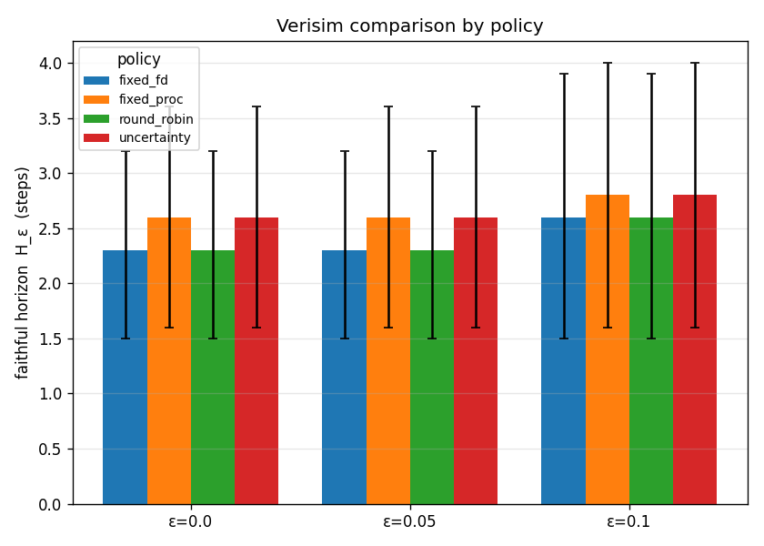
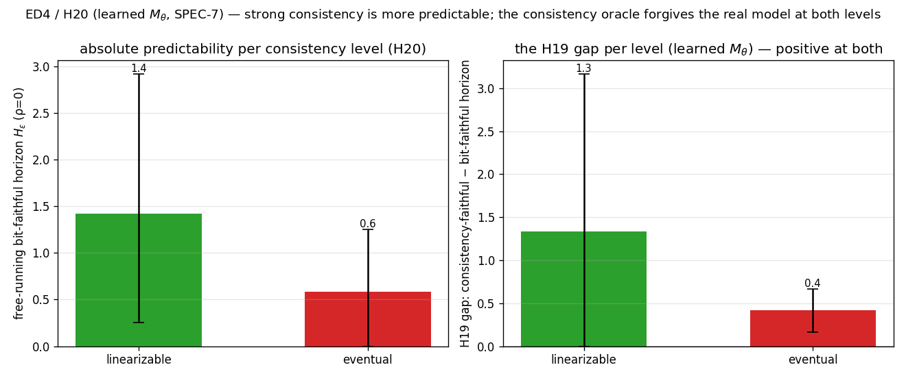
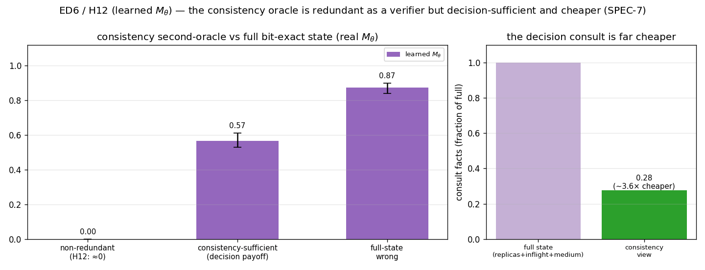
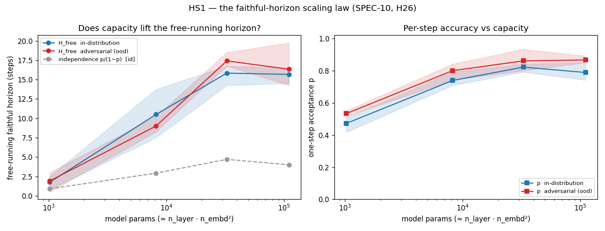
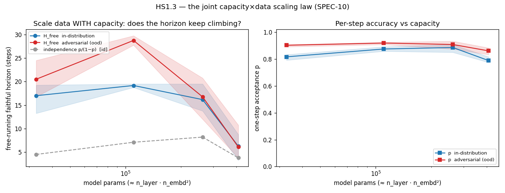
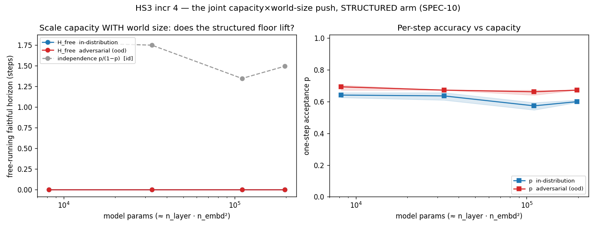

# Verisim v0 — technical report

> The v0 result, stated honestly. This is the short write-up SPEC-2 §13 (M8) calls
> for: the experiments that produce figures — E1 (the curve), E2/E3 (policy and
> operator comparisons), the §7.2 calibration diagnostic, and the E4 ablation
> (size/difficulty, the supervised-vs-+RLVR objective axis, and the delta-vs-full-state
> representation axis) — what
> they show, and what they do not. Every number here is read from a committed
> run-record CSV and is regenerable from a config + seeds (SPEC-2 §12). Figures live
> in [`../figures/`](../figures/).

## Bottom line

v0's job was to build the apparatus that can measure **how much oracle consultation
buys how much faithful horizon** (`H_ε(ρ)`), and to run the experiments on it. The
apparatus is built, tested, and reproducible. The headline scientific finding is a
**clean set of negatives** at the small, fast committed scale:

- **H1 (a favorable knee exists):** *not observed.* The `H_ε(ρ)` curve is flat and
  near the floor across the interior and only reaches the ceiling at `ρ = 1`.
- **H2 (smart beats dumb):** *refuted at this scale.* Fixed-interval consultation
  **beats** the uncertainty/drift-triggered policies at equal budget.
- **H3 (correction operator matters):** *identity, as predicted.* `hard_reset`,
  `residual`, and `projection` are statistically indistinguishable on faithful
  horizon — expected from a full-state oracle truth.
- **Why (diagnostics):** the uncertainty signal that should drive H2 is **barely
  correlated** with actual error (Pearson ≈ 0.11), and **scaling the model 4× does
  not lift** clean per-step accuracy off its ~0.1–0.2 floor — so the levers are
  calibration and training budget/difficulty, not policy cleverness or raw size.

None of these refute the *program* (SPEC.md §9 explicitly treats a refuted
hypothesis as a result, not a failure). They locate the work, and the two
diagnostics (calibration §7.2, the E4 ablation §9) make the next levers concrete:
the smart policies lose because their uncertainty signal is uncalibrated (SPEC-2
§17.2), and the clean floor does not move with model size, so the open work is
training budget / difficulty co-tuning (SPEC-2 §17.5), not parameters. The
contribution of v0 is the **measurement**, the **honest curves**, and a benchmark +
RL environment others can build on (SPEC-2 §15).

## Method (one paragraph)

A state is a serializable shell + filesystem snapshot; a deterministic reference
oracle `O(s, a)` defines the true transition (SPEC-2 §2–3). A from-scratch
decoder-only transformer `M_θ` predicts a structured **delta** under
grammar-constrained decoding (M4). The propose–verify–correct loop rolls `M_θ`
forward, consulting the oracle on a budget `ρ` and correcting with an operator `C`
(M5/M7). Faithfulness is the **normalized symmetric difference** `d(s, ŝ) ∈ [0,1]`;
the **faithful horizon** `H_ε` is the number of steps a rollout stays within `ε`
(SPEC-2 §7). Each experiment sweeps the loop and aggregates `H_ε` over seeds with
percentile bootstrap CIs.

## E1 — the `H_ε(ρ)` curve (H1)

Sweep `ρ ∈ {0, .05, .1, .2, .3, .5, 1}` × `ε ∈ {0, .05, .1}` × difficulty ∈
{low, high}, 5 seeds, `T = 24`, `fixed` policy + `hard_reset`
([`e1_curve.png`](../figures/e1_curve.png), [`e1_curve.csv`](../figures/e1_curve.csv)).

| ρ | 0 | 0.05 | 0.1 | 0.2 | 0.3 | 0.5 | 1.0 |
|---|---|------|-----|-----|-----|-----|-----|
| `H_ε` (low, ε=0) | 0.0 | 1.4 | 1.4 | 1.4 | 1.6 | 1.4 | 24.0 |
| `H_ε` (high, ε=0) | 0.2 | 1.2 | 1.2 | 1.2 | 1.2 | 1.4 | 24.0 |

The interior is flat at `H_ε ≈ 1.2–1.6` — about **5–7% of the ceiling** — then jumps
to the full `T = 24` only at `ρ = 1`. That is the *opposite* of H1's hoped-for
shape (≥80% of ceiling horizon at ≤20% budget): there is no knee, just a floor and a
cliff. The model drifts immediately at `ρ = 0` (it cannot reliably predict even step
0), so consultations buy back only the few steps until the next drift. **H1 is not
supported at this scale**; whether it holds at all is a model-capacity/difficulty
tuning question (the open M6 work, SPEC-2 §17.5), not a property of the loop.

## E2 — consultation policy (H2)

Fix `ρ = 0.2` (budget = 4 calls over `T = 24`); compare `fixed` vs.
`uncertainty_triggered` vs. `drift_triggered` at **equal budget** (the runner spends
exactly 4 calls per arm), 10 rollouts/arm
([`e2_policies.png`](../figures/e2_policies.png), [`e2_policies.csv`](../figures/e2_policies.csv)).

| policy | `H_ε` | 95% CI | oracle calls |
|--------|------|--------|--------------|
| `fixed` | **1.3** | [1.0, 1.8] | 4.0 |
| `uncertainty` | 0.2 | [0.0, 0.5] | 4.0 |
| `drift` | 0.1 | [0.0, 0.3] | 4.0 |

The dumb baseline wins — so this is not a wash, it is a **reversal**: at this scale
spending the budget where the model is *least confident* is worse than spreading it
evenly. `fixed` beats both triggered policies with **disjoint CIs** — `[1.0, 1.8]` vs.
`uncertainty`'s `[0.0, 0.5]` and `drift`'s `[0.0, 0.3]`. The reason is calibration: the triggered
policies key off the mean entropy of the constrained decode (SPEC-2 §7.2), and for a
model this small that entropy does not track actual divergence. **H2 is refuted at
this scale**, and the next lever is explicit: calibrate the uncertainty signal
(SPEC-2 §17.2) before re-running.

### Why the smart policies lose: the calibration diagnostic (§7.2)

The H2 reversal has a measurable cause. The §7.2 uncertainty-calibration diagnostic
collects per-step `(signal, divergence)` pairs — the model's decode-entropy
confidence against its *actual* error that step, teacher-forced so it is uncompounded
— and asks whether confidence predicts error
([`calibration.png`](../figures/calibration.png), [`calibration.csv`](../figures/calibration.csv),
240 pairs):

| Pearson | Spearman | mean divergence |
|---------|----------|-----------------|
| 0.11 | 0.18 | 0.16 |

Both correlations are near zero, and the reliability curve is essentially **flat**:
the model's *most confident* steps (lowest-entropy bin) carry divergence ≈ 0.14, no
better than its least confident (≈ 0.20). So the entropy signal carries almost no
information about where the model errs — which is exactly why a policy that spends the
budget on high-entropy steps cannot beat one that spreads it evenly. This turns "H2 is
refuted" into a concrete, falsifiable next step: a triggered policy can only help once
the signal it keys off is calibrated (SPEC-2 §17.2), so the diagnostic — not a new
policy — is the lever to move next.

## E3 — correction operator (H3)

Fix `fixed`/`ρ = 0.2`; compare `hard_reset` vs. `residual` vs. `projection`, 10
rollouts/arm ([`e3_operators.png`](../figures/e3_operators.png),
[`e3_operators.csv`](../figures/e3_operators.csv)).

| operator | `H_ε` | 95% CI |
|----------|------|--------|
| `hard_reset` | 1.3 | [1.0, 1.8] |
| `residual` | 1.3 | [1.0, 1.8] |
| `projection` | 1.3 | [1.0, 1.8] |

The three are **identical**, not merely indistinguishable. This is a theoretical
identity, not a measurement artifact: when the oracle returns the *full* one-step
truth, every operator snaps the coupled state to the same `s'` (SPEC-2 §6.2). The
operators differ only in the diagnostic they expose — `residual` logs the
discrepancy magnitude (the Stage-2 online-learning signal), `projection` logs the
per-correction repair cost — neither of which changes the horizon without **partial
verification** or **online learning**, both deferred. By H3's own refutation
condition (hard reset indistinguishable or better), **H3 is not supported at v0**,
and the experiment makes precise *why* and *what would change it*.

## E4 — ablation: is the H1 floor a capacity problem? (§9, §17.5)

E1 left open *why* the model drifts immediately at ρ=0: too small, or task
mis-tuned (SPEC-2 §17.5)? E4 sweeps the two buildable §9 ablation axes — **model
size** (tiny `1×32` → small `2×64` → medium `4×128`) and **difficulty/driver** —
and measures clean (ρ=0) per-step teacher-forced accuracy, 5 seeds/cell
([`e4_ablation.png`](../figures/e4_ablation.png), [`e4_ablation.csv`](../figures/e4_ablation.csv)).

| size | low (weighted) | high (adversarial) |
|------|----------------|--------------------|
| tiny `1×32` | 0.09 | 0.22 |
| small `2×64` | 0.09 | 0.15 |
| medium `4×128` | 0.14 | 0.17 |

Clean per-step accuracy stays in the **0.09–0.22** band across a 4× depth / 4× width
increase, with heavily overlapping CIs — and clean horizon stays near zero
everywhere. **Scaling the model within this range does not fix the floor.** So the H1
negative is *not* simply "too few parameters" at this training budget; the lever is
elsewhere — training iterations / dataset size and difficulty co-tuning (SPEC-2
§17.5), not raw model size. (A reproducible curiosity: the adversarial "high" driver
is sometimes *easier* to predict per-step than "low" — its destructive commands often
fail predictably and leave state unchanged, which the model reproduces exactly more
often than it does structure-building writes.)

### Objective axis: supervised vs. +RLVR (§9, §17.4)

The third E4 axis asks whether **training against the oracle** — Stage-2 RLVR, which
REINFORCE-trains the model on the oracle's faithful-horizon reward
([`src/verisim/train/rlvr.py`](../src/verisim/train/rlvr.py)) — buys clean
faithfulness over supervised pretraining alone. One Stage-1 supervised model is
branched into a Stage-2 RLVR copy and both arms are scored on the same clean (ρ=0)
metrics, 5 seeds/cell ([`objective.png`](../figures/objective.png),
[`objective.csv`](../figures/objective.csv)).

| objective | clean acc (low) | clean acc (high) | clean horizon (high) |
|-----------|-----------------|------------------|----------------------|
| supervised | 0.07 | 0.15 | 0.2 |
| +RLVR | 0.07 | 0.13 | 0.2 |

RLVR is an **honest null at this scale**: clean per-step accuracy is identical on the
`low` driver (0.07) and a hair lower on `high` (0.13 vs. 0.15, CIs `[0.08,0.18]` vs.
`[0.09,0.22]` — fully overlapping), and clean horizon is unchanged. The cause is
structural, not a bug: the faithful-horizon reward is **sparse exactly when the model
is at the H1 floor** — episodes terminate at the first unfaithful step, so a model that
usually fails step 0 sees almost no reward signal to amplify. RLVR has leverage only
once the model already sustains a non-trivial horizon, which is the difficulty
co-tuning (§17.5) this scale has not yet reached. The machinery is correct and tested
([`tests/test_rlvr.py`](../tests/test_rlvr.py): it learns from scratch on a tiny env
and does not collapse a faithful model); what it needs is a task with horizon to
extend.

### Representation axis: delta vs. full-state (§9, §10)

The last §9 axis asks whether the **prediction target** matters: predict the localized
**delta** (the primary `M_θ`) or regenerate the **full next state**? SPEC.md §6.1 argues
delta should win — it bounds the hallucination surface and localizes verification. To
measure it, a full-state head was built (the `StateGrammar` +
[`constrained_decode_state`](../src/verisim/model/decode.py) +
[`FullStateWorldModel`](../src/verisim/model/full_state.py), which constrained-decode the
*whole* next state the way the delta decoder constrains edits) and trained on identical
data to the delta model; both are scored on the same clean (ρ=0) metrics, 5 seeds/cell
([`representation.png`](../figures/representation.png),
[`representation.csv`](../figures/representation.csv)).

| representation | clean acc (low) | clean acc (high) | clean horizon (high) |
|----------------|-----------------|------------------|----------------------|
| delta | 0.07 | 0.15 | 0.2 |
| full_state | 0.00 | 0.03 | 0.0 |

This is the **first E4 axis with a clear directional result**: delta dominates full-state
at every cell (clean per-step accuracy 0.07/0.15 vs. 0.00/0.03 on low/high; clean horizon
0/0.2 vs. 0/0), confirming SPEC.md §6.1. The reason is structural and on-thesis — to score
a step, the full-state model must regenerate *every* fact of the next world correctly
(grammar-validity is free, but faithfulness of the whole tree is not), whereas the delta
model need only emit the handful of edits the action makes; the larger target surface is a
strictly lower faithfulness floor. The committed scale is tiny, so the absolute numbers are
floor-level for both arms, but the *ordering* — delta > full-state — is exactly the
prediction the project's representation choice rests on, now measured rather than asserted.

## Automating the search: an oracle-gated ratchet (§17.5)

The §17.5 co-tuning — find a config where the clean floor lifts — is a search problem,
so v0 automates it as a *keep-if-better* ratchet
([`src/verisim/auto/search.py`](../src/verisim/auto/search.py),
[`auto_search.png`](../figures/auto_search.png),
[`auto_search.csv`](../figures/auto_search.csv)), modeled on Karpathy's
[`autoresearch`](https://github.com/karpathy/autoresearch): propose a one-knob mutation,
train under a fixed budget, score one number, keep it only if it beats the running best.
The difference is the gate. `autoresearch` scores on val_bpb — a held-out-loss *proxy*;
verisim scores on **mean clean (ρ=0) per-step accuracy against the oracle's true next
state** — ground truth, the deterministic "lint" the whole project is built on. That is
verisim's single comparable scalar (its "val_bpb"), and it is a strictly stronger
"did we improve?" signal than any oracle-free domain can construct (SPEC.md §4). `H_ε`
is deliberately *not* the gate: at this scale it is ~0 everywhere (the H1 negative), too
flat to climb, so accuracy is the smooth signal — the same reasoning behind `autoresearch`
choosing val_bpb.

A first 12-trial run (`configs/auto.json`) autonomously **more than doubled the clean
floor, 0.042 → 0.094**, by finding `train_iters↑` then `lr↑`, then held through ten
rejected trials. The absolute level is still floor-level (consistent with the H1 negative
at v0 scale), but the *mechanism* provably lifts the oracle-grounded metric without a human
in the loop — the self-improving "update-from-reality" loop the program is ultimately
about, here at the outer (config-search) layer that wraps the RLVR inner loop. The
proposer is seeded coordinate hill-climbing; an LLM-agent proposer drops in behind the
same oracle gate.

## K0 — does the learner work, and where does it fail? (SPEC-2.1)

[SPEC-2.1](specs/SPEC-2.1.md) paused the roadmap to earn an *interesting* `H_ε(ρ)` knee on
the single-filesystem world, and its first phase (K0) asks the prerequisite question before
any tuning: **can the pipeline fit the transition function at all, and if the floor persists,
exactly where does it fail?** ([`k0_control.png`](../figures/k0_control.png),
[`k0_control.csv`](../figures/k0_control.csv); `verisim.experiments.k0`, `configs/k0.json`).

**The control — the learner works.** Trained on a *trivial* world (depth-1, single-segment
`mkdir`/`touch`/`write` under root — collision-free successes, so the only thing to learn is
to copy the action's one-token argument into the delta), with the new minibatch + warmup/cosine
+ val-early-stopping trainer (`train_batched`, SPEC-2.1 §6) on 768 transitions, the model reaches
**clean per-step faithfulness = 1.000 (exact), gate 0.95 → PASS**. The full pipeline
(data → tokenize → train → constrained decode → apply → divergence) can fit a deterministic
computer-state transition to *bit-exact* ground truth. So the v0 floor is **not** a broken
learner and **not** (per E4) a capacity wall.

**The diagnosis — the floor is a generalization failure, localized to argument-copying.** On
the baseline config, the model **memorizes its training transitions perfectly yet does not
generalize**: train accuracy **1.000** vs. held-out **0.083** — the textbook under-data /
under-coverage signature SPEC-2.1 §1 predicted. The per-edit-type breakdown pinpoints *where*:

| signal | value | reading |
|---|---|---|
| `create` precision/recall | **0 / 0** (69 predicted, 34 true, 0 exact) | the model emits creates but **never at the exactly-correct path/content** — exact multi-token *argument copying* into the delta is the bottleneck |
| `setresult` | 72/144 correct (~0.50) | it gets the *success* cases (empty stdout, exit 0) and misses the *failures* |
| divergence by fact type | `exit` 138, `file` 96, `dir` 53 | dominated by **mispredicted failure/collision cases** (`exit`) and wrong created-node identity (`file`/`dir`); `cwd`/`env`/`stdout` are nearly learned |
| mean bits-to-correct | 60.0 | the smooth gate (SPEC-2.1 §3) baseline the K-series and the ratchet will drive down |

A separate convergence probe (25× more training, 160 → 768 transitions) confirmed the copy
bottleneck is **not** dissolved by more steps alone: observation-class facts
(`exit`/`stdout`/`cwd`/`env`) become fully learned, but the created-node residual persists,
while depth-1 (one-token copy) reaches 1.0. So the floor's mechanism is now specific and
testable: **exact reproduction of multi-token action arguments (deep paths, content) in the
delta, plus coverage of failure/collision cases** — not generic under-training.

**What this redirects (K1/K2).** (1) Coverage-balanced data + hard-negative mining over the
path-copy distribution and the failure cases the baseline driver under-samples (K1); (2) the
`train_batched` budget that took the trivial world to 1.0 (K2); and (3) an open representation
question for K3/architecture — whether a *copy-aware* delta (referencing action arguments by
pointer rather than re-emitting path tokens) is the lever, since copying is the precise hard
spot. The gate metric moves from sparse 0/1 accuracy to **bits-to-correct** (smooth, monotone)
for the search. This is the K0 contract met: the learner is proven, and the floor is no longer
a mystery but a named, falsifiable target.

## K1+K2 — coverage data, trained properly, past the acceptance floor (SPEC-2.1)

K0 left a precise target: the floor is exact *multi-segment argument copying* into the delta,
under-covered and under-trained. K1/K2 attack it directly
([`k2_faithfulness.png`](../figures/k2_faithfulness.png),
[`k2_faithfulness.csv`](../figures/k2_faithfulness.csv); `verisim.experiments.k2`,
`verisim.data.coverage`, `configs/k2.json`).

**K1 — coverage of the transition space (the data is free).** A dependency-free coverage
report (`verisim.data.coverage`) over a broad driver mix confirms the dataset spans what the
baseline missed: **all 13 commands covered, 359 failure cells** (`mkdir:fail`, `rmdir:fail`,
`rm:fail`, `mv:fail`, …) and a **create-depth histogram spanning depths 1→8** — i.e. the
failure cases *and* the multi-segment path-copy distribution K0 flagged. The K1 gate
(documented coverage, regenerable from a manifest) is met.

**K2 — train properly, and the copy bottleneck dissolves.** Training the same small model
(2 layers × 128) on the copy distribution (the `structural` driver: collision-free multi-depth
creates, 2,560 transitions) with the new minibatch + warmup/cosine + val-early-stopping trainer
(`train_batched`, 6,000 steps) lifts clean (ρ=0) per-step faithfulness on a **held-out
non-trivial difficulty** from K0's ~0.09 to:

| metric | value | vs. gate |
|---|---|---|
| exact-match | **0.859** | **gate 0.5 → PASS** |
| acceptance @ ε=0.05 | **0.875** | clears the SPEC-3 §8 acceptance floor (~0.5) |
| graded (mean 1−d) | **0.988** | — |

This is the decisive K2 finding: **the K0 copy bottleneck is a coverage/training problem, not a
representation wall.** 25× more training at K0's tiny data did *not* move it (0.09), but
~3× the data + a real training loop takes the *same architecture* to 0.86 exact — vindicating
SPEC-2.1 §1's "under-data/under-training" diagnosis and making the K3/architecture
copy-representation lever unnecessary at this scale.

**Why this matters for the knee.** Per-step acceptance 0.875 implies an unaided (ρ=0) geometric
faithful horizon of ≈ 1/(1−0.875) ≈ 8 steps — already ~50% of a T=16 ceiling, with real room
for cheap consultation to extend it. The model now sits *inside* the K3 "competent-but-
compounding" band (0.7–0.95), which is exactly the regime where an interesting `H_ε(ρ)` knee is
expected to appear. K3 (the difficulty dial) and K4 (re-run E1) are next; the
**bits-to-correct** gate (SPEC-2.1 §3) and the tested **hard-negative mining** loop
(`mine_hard_negatives`, active learning over the oracle) are in place to drive the search.

## K3+K4 — the knee hunt: an honest negative that licenses the network world (SPEC-2.1)

With a competent model in hand (K2), K3/K4 implemented the difficulty dial and ran the loop to
look for the knee — the prime directive of SPEC-2.1
([`k4_knee.png`](../figures/k4_knee.png), [`k4_policies.png`](../figures/k4_policies.png);
`verisim.experiments.k4`, `configs/k4.json`).

**K3 — the difficulty dial.** The deferred SPEC-2 §2.4 dial is implemented as `max_depth` on the
driver (`verisim.data.drivers.path_depth`, threaded through `build_dataset`/`eval_actions`). At
the chosen sweet spot (`structural`, `max_depth=4`, rollout length `T=48`) the K2 model's
per-step acceptance is ~0.875 and the unaided (ρ=0) faithful horizon is ~10/48 — **floor well
below ceiling, so there is genuine room** for consultation to buy horizon back. The dial gate is
met.

**K4 — the curve, and the honest negative.** The competent model is a real, large win over v0:
the ρ=0 floor rose from ~0 (original v0) to **~10/48**. But the `H_ε(ρ)` curve is a **floor +
cliff, not a knee** — at ε=0.05, `H_ε` is 10.3 (ρ=0) → 11.3 (ρ=0.2) → 13.8 (ρ=0.5) → 48 (ρ=1):

| ρ | 0 | 0.1 | 0.2 | 0.3 | 0.5 | 1.0 |
|---|---|-----|-----|-----|-----|-----|
| `H_ε` (ε=0.05) | 10.3 | 10.3 | 11.3 | 12.2 | 13.8 | 48.0 |

And **smart consultation does not help** (E2 with the competent model, equal budget at ρ=0.2):
`fixed` 11.3 vs `uncertainty` 10.7 vs `drift` 10.9 — overlapping CIs, the H2 negative persisting
even now. So **C-knee (a favorable knee on the single-filesystem world) is refuted at this
scale** — the SPEC.md §9 "approximately linear, no free lunch" refutation condition.

**Why — the mechanism, now fully characterized.** Filesystem prediction errors are *discrete*:
one wrong edit spikes the set-difference divergence past ε in a single step. So `H_ε`
(first-exceedance) is governed by the position of the *first* error, which evenly-spaced resets
cannot push out — and the model's decode-entropy uncertainty does not localize *which* steps
will err, so error-targeting consultation cannot catch them either. A fixed-interval knee would
need per-step acceptance ≈0.98, which leaves no room (horizon ≈ ceiling). This is not a tuning
miss; it is a property of *this world's metric* (discrete set-difference) and *this model's
uncertainty* (uncalibrated decode entropy).

**This is the result the plan anticipated, and it is load-bearing.** Per SPEC-2.1 §10, a refuted
C-knee — *after* the learner is proven (K0) and the floor is lifted (K1/K2) — is exactly what
**licenses the network world (SPEC-5)**: a knee needs *gradual* drift (continuous quantities like
RTT/throughput that accumulate smoothly, where periodic resets keep divergence under ε) and a
*calibrated* uncertainty (the RSSM belief-variance partial observability supplies), neither of
which the fully-observable, discrete-state filesystem has. SPEC-2.1 did its job: the learner
works, the floor is gone, and the evidence now says the knee lives one world up. The paused
SPEC-5 is no longer a hopeful bet — it is an evidence-backed next step.

## NW5+NW6 — the network world's loop, and its first `H_ε(ρ)` curve (SPEC-5)

The deterministic network core (NW0–NW3) and the flat supervised `M_θ` (NW4) were already
shipped. NW5 adds the **partial-observation propose-verify-correct loop**
([`netloop/`](../src/verisim/netloop/)): a model-agnostic runner, the two baselines
(null / oracle-backed), the two-mode **partial-observation oracle** (a cheap *probe* that
reveals one host's subgraph vs. an expensive *full* consult, SPEC-5 §5.3), probe policies
`π_o` (§8.2), and correction/belief operators including the **belief filter** that snaps only
the observed subgraph (§8.3). The loop invariants mirror v0's and are separately tested
(`tests/test_net_loop.py`): ρ=1 full-consult reproduces the oracle exactly; a perfect model
never drifts at ρ=0; the budget is never exceeded; and — the property partial observability
buys that v0 could not — a one-host **probe corrects strictly less than a full consult**, so
probe-mode horizon is provably ≤ full-mode horizon at equal ρ (no v0 identity collapse).

NW6 plots the prime-directive curve — **EN1**
([`en1_curve.png`](../figures/en1_curve.png); `verisim.experiments.en1`, `configs/en1.json`).
On the flat-Markov `M_θ` the interior is **near-flat, then a cliff at ρ=1** — the *opposite*
of a favorable knee (ε=0.05):

| ρ | 0 | 0.05 | 0.1 | 0.2 | 0.3 | 0.5 | 1.0 |
|---|---|------|-----|-----|-----|-----|-----|
| `H_ε` (high, ε=0.05) | 1.0 | 1.6 | 1.6 | 1.6 | 2.4 | 3.0 | 24.0 |
| `H_ε` (low, ε=0.05)  | 0.8 | 1.4 | 1.4 | 1.4 | 1.4 | 3.4 | 24.0 |

**This is the H8 honest negative for the flat arm**, and it is the network analogue of v0's H1
floor — not a surprise but a measurement. The mechanism is the model, not (yet) the world: the
flat `M_θ` memorizes its training trajectories (teacher-forced accuracy 1.0) but generalizes
poorly off-distribution — held-out teacher-forced accuracy ~0.71 *per token*, and only **~0.2
exact-delta match** free-running, so a single wrong token breaks the whole delta and the rollout
drifts past ε in ~1 step without consultation. At ρ=0.2 the model recovers only ~7% of the
ceiling horizon — far below H8's "≥80% of ceiling at ≤20% consultation."

**What it licenses.** A flat near-floor interior on the flat-Markov baseline is exactly the
result that makes the **NW7** levers load-bearing rather than optional: the message-passing +
RSSM graph arm (§6.1–6.2, H11), and the drift mitigations v0 never had — **noise-injected
rollout training** and **self-forcing/scheduled sampling** (the GNS/m4 levers, §6.3). The EN1
machinery now exists to measure, cleanly and reproducibly, whether any of them lifts `M_θ` off
this floor. As in v0, the negative is reported first-class and the apparatus (loop invariants,
determinism, the CI-tested core) is proven independently of the model's faithfulness.

## NW7 (flat arm) — EN2 consultation policy (H9) and EN3 operators (the partial-observation payoff)

With the loop in hand, two of NW7's equal-budget comparisons run on the flat `M_θ` now (the
graph/RSSM arm, the smart information-gain probe, and the drift mitigations are the remaining
NW7 work). Both fix the budget at the EN1 interior ρ=0.3 and compare at *equal* consultation
count (the spend-down backstop makes every arm spend exactly the budget).

**EN2 — consultation policy `π_c` (H9; `en2_policies.csv`, `verisim.experiments.en2`).** Does
spending the budget on the steps the model is least sure about *earn* more horizon than
spreading it evenly? At ε=0 (high+low pooled, 7 calls each):

| policy | `H_ε` | 95% CI |
|---|---|---|
| `uncertainty` | **3.4** | [1.1, 6.0] |
| `drift` | 2.0 | [0.7, 3.9] |
| `fixed` | 1.9 | [1.1, 3.1] |

The uncertainty-triggered policy *leads*, and — unlike v0's E2/K4, where `fixed` won with
**disjoint** CIs (a clean H2/H9 negative) — here the direction has flipped to favor smart
scheduling. But the CIs **overlap**, so this is **suggestive, not conclusive**: the flat
model's decode-entropy signal is a coarse proxy, and the calibrated belief-variance signal that
H9 really wants is what the RSSM belief (NW7 graph arm) supplies. Honest read: encouraging
movement off v0's negative, awaiting the model that can confirm it.

**EN3 — correction/belief operators (§8.3; `en3_operators.csv`, `verisim.experiments.en3`).**
This is the result partial observability buys that v0 could not show. At ε=0:

| operator | mode | `H_ε` | oracle-bits / consult | `H_ε` per oracle-bit |
|---|---|---|---|---|
| `hard_reset` | full | 1.9 | 10.1 | 0.027 |
| `residual` | full | 1.9 | 10.1 | 0.027 |
| `projection` | full | 1.9 | 10.1 | 0.027 |
| `belief_filter` | **probe** | 0.9 | **2.1** | **0.063** |

The three full-consultation operators give **identical** `H_ε` — the v0 full-truth identity
(they all snap the coupled state to the same `s'`), persisting exactly as predicted. But the
probe + belief filter **breaks the identity collapse**: a one-host probe corrects only the
observed subgraph, so it earns *less* horizon per consult (0.9 vs 1.9). The honest — and, framed
as an incentive rather than a penalty, the *better* — read is the cost lens: the probe reveals
~2.1 facts where a full consult reveals ~10, so per **oracle-bit** the probe earns **~2.3× more
faithful horizon** (0.063 vs 0.027). Cheap, localized sensing is the *efficient* way to buy
horizon — which is exactly the probe-efficiency axis (§9.4) the smart information-gain `π_o`
(H10, NW7) is built to optimize, and the first network result with no v0 analogue.

## NW8 (graph arm) — EN4 graph-vs-flat, a split verdict on H11 (SPEC-5 §6.1-6.2, §12)

The NW8 message-passing + RSSM graph arm now ships ([`netmodel/graph.py`](../src/verisim/netmodel/graph.py),
[`graph_model.py`](../src/verisim/netmodel/graph_model.py), [`graph_train.py`](../src/verisim/netmodel/graph_train.py)),
and EN4 ([`experiments/en4_graph.py`](../src/verisim/experiments/en4_graph.py)) runs the H11 comparison:
the flat-Markov transformer and the graph+belief arm trained on the **same** oracle data and scored with
the **same** eval primitives EN1 uses. A small, fast smoke instance
([`figures/en4_graph_vs_flat.png`](../figures/en4_graph_vs_flat.png),
[`.csv`](../figures/en4_graph_vs_flat.csv)) gives a clean, two-sided first datum:

| arm | one-step token acc | **delta-exact** rate | `H_ε` (ρ=0), ε ∈ {0, 0.05, 0.1} |
|---|---|---|---|
| flat-Markov (NW4) | 0.673 | 0.264 | 0.000 / 0.000 / 0.000 |
| **graph + RSSM (NW8)** | **0.838** | **0.569** | 0.000 / 0.000 / 0.000 |
| graph + RSSM + noise lever (§6.3) | 0.828 | 0.556 | 0.000 / 0.000 / 0.000 |
| graph + RSSM + self-forcing lever (§6.3) | 0.803 | 0.500 | 0.000 / 0.000 / 0.000 |

The **delta-exact** column ([`netmetrics/exact.py`](../src/verisim/netmetrics/exact.py)) is the honest middle
the report previously flagged as missing: not token accuracy (which is inflated — most tokens of a delta are
easy structural scaffolding) and not horizon (which is `0` the instant any step exceeds ε), but the per-step
question a delta predictor is actually asked — *did the model freely decode the exact true edit set this step?*
It is `1` iff `bits_to_correct = 0`, computed by running each arm's own constrained decode (no teacher forcing)
and matching the assembled `NetDelta` as a multiset.

**The positive (H11, generalization axis): structure helps, and helps *more* on the honest metric.** On
never-trained eval seeds the graph arm is a **+16.5-point** better one-step token predictor than the flat arm
(0.838 vs 0.673) — and a **+30.6-point** better *delta-exact* predictor (0.569 vs 0.264), more than double the
flat arm's whole-delta exactness. The message-passing inductive bias over the host graph generalizes where the
flat serializer memorizes (the m4/GNS bet, §2.2-2.3, realized), and the gap *widens* on the stricter metric:
token accuracy understates how much structure buys, because the flat arm gets the easy scaffolding tokens right
while missing the edit that matters. This is the clearest network result yet in the graph arm's favor.

**The honest negative (horizon axis): even 57% delta-exact ≠ horizon — yet.** Neither gain converts to
free-running faithful horizon: `H_ε` is **0 for all four arms even at ε=0.1** — every arm drifts on the first
unaided step. This is exactly EN1's H8 negative and SPEC-2.1's K4 echoing in the network world, and the
delta-exact number now *quantifies* why: at 0.569 per-step exact, the probability of surviving even a few
unaided steps decays geometrically (≈0.57·0.57·… ), and first-exceedance is discrete — one wrong edit spikes the
graph divergence past ε in a single step. Per-step exactness this far below 1.0 cannot buy horizon without the
*exposure-bias* levers — and **both §6.3 levers now confirm that bound, identically**. The noise-injection lever
slightly *lowered* both metrics (0.828/0.556) and the self-forcing / scheduled-sampling lever lowered them a bit
more (0.803/0.500); neither bought any horizon. That the two levers — random-corruption and the model's own-drift
distribution — behave the *same* way is itself informative: at this scale the exposure-bias correction trades a
little one-step accuracy for off-distribution coverage that does not yet convert, a clean "needs scale/tuning"
datum, not a refutation of either lever.

**Where this routes the program (the epistemic engine, SPEC.md §10.1).** The result *localizes* the wall: it is
the **one-step→horizon conversion**, not the per-step learner (the graph arm fits to >0.9 teacher-forced accuracy,
the K0-analog check; held-out, it is delta-exact on 57% of steps). The **delta-exact metric just shipped**
([`netmetrics/exact.py`](../src/verisim/netmetrics/exact.py)) and is now an EN4 column — it converts the wall from
a qualitative claim into a number: 0.569 per-step exact is far enough below 1.0 that geometric decay kills horizon,
so the conversion levers must raise *whole-delta* exactness, not just token accuracy. **Both §6.3 exposure-bias
levers have now shipped and run** — noise-injection and self-forcing / scheduled sampling
([`graph_train.py`](../src/verisim/netmodel/graph_train.py)) — and both land the same banked negative at this
scale (above): the gap is not closed by exposure-bias correction alone here, which points the remaining budget at
**scale** and the **multi-step latent-overshooting** objective, and at *objective grounding* rather than only
input-distribution fixes. The **SPEC-8 OG1/OG2 deterministic machinery also shipped** (the oracle-grounded-SSL
target/`D`-mask factory [`netdata/grounding.py`](../src/verisim/netdata/grounding.py) and the hard-negative /
counterfactual factory [`netdata/negatives.py`](../src/verisim/netdata/negatives.py); both torch-free and
property-tested), and the **EN8/EN9 oracle-grounded-SSL runs (SPEC-8 §7) have now shipped on this same arm**
(below). A +16.5-pt token / +30.6-pt delta-exact one-step gain with a measured conversion gap is a better starting
point than the flat arm offered, and every number here is bankable under the oracle.

## EN8 (oracle-grounded SSL) — the oracle in the *bulk* of the cake, a second split verdict (SPEC-8 §7)

The EN1/K4 negative pre-registered a pivot: if consultation budget alone does not lift the curve, the lever
is *representation and objective*, so route to SPEC-8 — put the oracle's exact truth in the **self-supervised
bulk**, not only the RL cherry. OG1/OG2 shipped the deterministic data factory (the decidable/residual
partition and the exact hard-negative generator, torch-free and property-tested); **EN8 is the GPU consumer**
that ablates it on the NW8 graph+RSSM arm ([`experiments/en8.py`](../src/verisim/experiments/en8.py),
[`netmodel/grounded_train.py`](../src/verisim/netmodel/grounded_train.py)). Two pre-registered axes
([`figures/en8_grounding.png`](../figures/en8_grounding.png), [`.csv`](../figures/en8_grounding.csv)); like EN4,
a committed *smoke* instance — and like EN4, a clean two-sided result.

**H23 — the collapse axis: the oracle-anchored target removes the collapse tax (a positive).** A JEPA-style
latent predictor over the graph summary, with the prediction target either *learned* (the BYOL/JEPA EMA
encoder) or *oracle-anchored* (a fixed projection of the **true next state's** features — an external referent
with full variance by construction, §4.1), crossed with the collapse-prevention machinery (EMA target +
VICReg) on/off. The readout is representation health: embedding std and effective rank (→ 0 / → 1 under
collapse). Embedding std is the robust signal at this scale:

| target | collapse machinery | embedding std | effective rank (d=48) |
|---|---|---|---|
| learned (EMA) | **on** (the JEPA baseline) | 0.557 | 41.8 |
| learned | **off** (ablated) | **0.276** | **13.4** |
| oracle-anchored | on | 0.597 | 43.4 |
| **oracle-anchored** | **off** (ablated) | **0.528** | **25.8** |

With the machinery ablated, the naked *learned* target collapses — embedding std halves (0.557 → 0.276) and
effective rank drops 3× (41.8 → 13.4). The **oracle-anchored target does not**: with the *same* ablation it
holds std at 0.528 (≈ the EMA+VICReg baseline) and rank at 25.8 (≈ 2× the collapsed learned arm). This is H23
confirmed at smoke scale: where an external referent exists, the EMA+VICReg crutches are *substantially*
unnecessary — exactly SPEC-8's claim that the collapse tax is a workaround for a missing oracle. (Honest
nuance: the machinery still adds some health on top of the oracle target — rank 43.4 vs 25.8 — so it is a
strong substitute, not yet a total one at this size.)

**H24 — the objective axis: residual supervision is a near-tie here (the honest negative).** Under partial
observation (half the hosts observed, so the decidable/residual partition is non-degenerate), training the
decoder on the **residual** bits only — masking the oracle-decidable tokens, *verify don't learn* (§4.2) —
versus the raw-likelihood baseline gives, on the residual tokens `R` the model is actually responsible for:
raw-likelihood **0.463** vs residual **0.426** (the baseline edges it by 3.7 pts). At this well-trained smoke
scale that is essentially a tie — the H24 refutation branch: the decidable part `D` was cheap enough to learn
that masking it buys nothing *yet*. The partition is pre-registered to matter more as worlds grow (SPEC-6/7), where `D` is a larger fraction
of a much bigger next-state; EN8 banks the bound, it does not close the question. (The residual arm's *overall*
token accuracy drops to 0.11 by construction — it deliberately never learns `D`, which the oracle supplies for
free — so a full-delta free-decode is a category error for it, not a result; the fair metric is residual-token
accuracy above.)

**Where this routes the program.** EN8's split mirrors EN4's: a clean positive on the *representation*
mechanism (H23 — the oracle is a real anti-collapse referent) and an honest near-tie on the *objective*
mechanism at this scale (H24 — the partition's payoff is world-size-gated). The H23 positive says the
oracle-grounded latent arm is worth carrying up the ladder; the H24 bound says don't over-invest in residual
masking until the worlds are large enough for `D` to dominate. Every cell here is bankable under the oracle —
including, as always, the negative.

## EN9 (oracle hard-negative contrastive) — the exact referent vs. the statistical one, a third split (SPEC-8 §7)

EN8 grounded the *predictive* target on the oracle (H23/H24). EN9 grounds the *contrastive* one — the second
SPEC-8 mechanism (§4.3) and the consumer of the OG2 hard-negative factory. A contrastive predictor over the
same graph summary, with the **only** anti-collapse referent varying across three cells: *none* (naked BYOL,
regress onto the stop-grad online target), *vicreg* (the field's statistical "push apart" regularizer), or
*oracle* (InfoNCE against the OG2 exact hard negatives — counterfactual successors `O(s, a')` and
one-edit-wrong neighbors of the true successor, each labeled `≠` the truth by the oracle). Two readouts:
representation health (the collapse diagnostic) and **interventional fidelity** — does the representation map
each intervention `a'` to its true successor `O(s, a')`, scored as branch-retrieval top-1 / MRR on held-out
states (the H5 / EN6 branch-replay question)? A committed *smoke* instance
([`figures/en9_contrastive.png`](../figures/en9_contrastive.png), [`.csv`](../figures/en9_contrastive.csv)),
and like EN4/EN8 a two-sided result — the split is the finding.

| mode | embedding std | effective rank (d=48) | intervention top-1 | intervention MRR |
|---|---|---|---|---|
| none (naked) | **0.276** | 13.4 | 0.214 | 0.426 |
| vicreg | 0.499 | **39.0** | 0.282 | 0.500 |
| **oracle** | **0.699** | 31.4 | **0.519** | **0.694** |

**H25 — the collapse axis: the exact referent matches the statistical one.** The naked contrastive target
collapses (std 0.276); both VICReg (0.499) and the oracle hard-negatives (0.699) prevent it. On *raw* collapse
the oracle is at least as good — but VICReg's covariance term, which explicitly decorrelates dimensions, buys
slightly higher effective rank (39.0 vs 31.4). So H25's "match or beat at preventing collapse" lands on
*match*: the exact near-miss structure is a real anti-collapse referent, not a strictly dominant one for the
rank metric.

**H5 — the interventional axis: the oracle wins decisively (the lift).** This is where the exactness pays. Only
the oracle's *counterfactual* negatives carry information about which intervention leads where, so its
branch-retrieval fidelity nearly doubles VICReg's — top-1 **0.519 vs 0.282**, MRR 0.694 vs 0.500. The honest,
sharper reading of the split: VICReg keeps the representation full-rank but interventionally **blind** (its
0.282 top-1 is barely above the naked 0.214), while the oracle makes it faithful to the very branches the loop
will be asked to predict. A statistical regularizer can stop collapse; it structurally cannot teach
counterfactual structure it has no access to.

**Where this routes the program.** EN9 localizes *what* an exact referent buys over a statistical one: not
better collapse resistance per se, but **interventional content**. That is the H5/RQ4 lift arriving through the
SSL objective rather than the RL cherry — evidence that oracle-grounding belongs in pretraining for *change-safety*
tasks specifically. Carry the counterfactual-negative objective up the ladder (SPEC-6/7) where interventional
fidelity is the headline; do not expect it to beat VICReg on plain collapse. CIs and a scaled run remain;
every cell is bankable under the oracle.

## EN8/EN9 scale-up — the smoke verdicts, now with CIs across a 3× world sweep (SPEC-8 §7.1, SPEC-9)

The EN8/EN9 smoke figures above are single-seed (one `model_seed`, a 5-host world), so a reader can
discount them as noise. The OG5 scale harness ([`en8_scale.py`](../src/verisim/experiments/en8_scale.py),
[`en9_scale.py`](../src/verisim/experiments/en9_scale.py)) re-runs each ablation across **world size ×
seeds**, reducing every cell to the *gap the oracle buys* with a percentile bootstrap CI (the EN1
machinery). At 5/10/15 hosts × 4 seeds ([`en8_scale.csv`](../figures/en8_scale.csv),
[`en9_scale.csv`](../figures/en9_scale.csv)):

| world | H23-S collapse gap (eff-rank) | H25-S/H5 interventional lift (top-1) | H24-S residual-objective gap |
|---|---|---|---|
| 5 hosts | **+13.4** [12.7, 14.0] | **+0.100** [0.059, 0.140] | +0.069 [−0.005, 0.130] |
| 10 hosts | **+8.4** [7.8, 9.0] | **+0.354** [0.266, 0.448] | 0.000 [−0.035, 0.035] |
| 15 hosts | **+7.7** [6.7, 8.7] | **+0.094** [0.055, 0.125] | +0.006 [−0.009, 0.028] |

**Two of the three claims are now defensible against "n=1 / toy world."** The H23-S collapse gap and the
H25-S/H5 interventional lift are **disjoint from zero at every world size** with 4 seeds. H24-S stays a
**CI-bounded near-tie** — the smoke negative, now with error bars. Two honest nuances are themselves the
findings, and both are pre-registered into SPEC-9's scaling claims: the *raw* collapse gap declines with
world size (effective rank is capped by `d_model=48`, so SPEC-9 S1 tracks the normalized gap and grows
`d_model` with the world), and the interventional lift is *non-monotone* (peaks at 10 hosts — SPEC-9 S2
reads this as fixed-capacity undertraining at the largest world, to be tested on the model-size axis).
The full world × model **scaling surface** (SPEC-9 LS2) extends this up the local envelope; the envelope
itself (how large the world can be made on one 32 GB machine before `O(N²)` message passing binds — not
memory, and not the free oracle) is measured in [SPEC-9 §3](specs/SPEC-9.md).

### H24 capacity-binding frontier — refuted with a mechanism (SPEC-9 S3)

H24-S was a CI-bounded near-tie; SPEC-8 §7.2 pre-registered *why* (a capacity-allocation claim) and
predicted a frontier where masking the decidable bits `D` and training only the residual `R` would
*win* — where capacity binds against a hard `R`. The dedicated sweep
([`en8_capacity.py`](../src/verisim/experiments/en8_capacity.py),
[`en8_capacity.csv`](../figures/en8_capacity.csv); a 40-host world × `d_model` ∈ {16, 32, 64} ×
observed-fraction ∈ {0.25, 0.5, 0.75} × 4 seeds) **refutes** it, and the refutation is the result:

| observed-fraction (R-size) | d16 | d32 | d64 |
|---|---|---|---|
| 0.25 (R≈0.27) | +0.003 [−0.024, 0.032] | +0.003 [−0.016, 0.021] | +0.005 [−0.011, 0.021] |
| 0.50 (R≈0.20) | +0.016 [−0.019, 0.050] | 0.000 [−0.019, 0.019] | −0.006 [−0.025, 0.013] |
| 0.75 (R≈0.11) | −0.026 [−0.052, 0.000] | −0.026 [−0.052, −0.005] | **−0.094 [−0.130, −0.057]** |

No cell's CI is disjoint-positive — the frontier does not exist in the local envelope. Stronger: where
`D` is large (observed-fraction 0.75, `R` only ~11% of tokens) masking it is disjoint-*negative* and
worsens with capacity. **The mechanism is the finding:** masking `D` does not free capacity for `R`, it
*removes training signal* — the model is then supervised on only the R-fraction of tokens per step, which
starves the shared encoder/decoder; learning `D` is **beneficial multi-task auxiliary signal**, not wasted
capacity. So H24's "burning capacity on `D` is waste" premise does not hold at this scale. What is refuted
is precisely the **training-objective** form of the partition (mask `D` in the loss); the **inference-time**
partition — the oracle *supplies* `D`, so the model is never trusted on it — is untouched and is exactly
what the propose–verify–correct loop already does. The bankable next variant keeps `D` in the loss and
lets the oracle own `D` only at inference. This is the epistemic engine working: a pre-registered negative
returning a sharp, mechanistic, oracle-trustworthy result that redirects the program. *(The scaling surface
below adds a wrinkle this `d≤64` grid did not see: at `d_model=128` and small worlds the residual gap is
small but disjoint-**positive**, so H24 is **regime-dependent**, not flatly refuted — SPEC-9 §4 S3.)*

## The local scaling surface — H23 attenuates, H25/H5 reverses (SPEC-9 LS2)

The first scale-up (5/10/15 hosts) confirmed H23-S and H25-S/H5 with disjoint CIs. The full local
**surface** — 25/50/100/200 hosts × `d_model` ∈ {64, 128} × 3 seeds, the largest oracle-grounded sweep run
on the 32 GB M4 ([`en8_surface.csv`](../figures/en8_surface.csv),
[`en9_surface.csv`](../figures/en9_surface.csv); ~69 min + ~104 min CPU) — carries them up an 8× world
range, and the smoke wins survive *unevenly*. That unevenness is the result.

- **H23-S (collapse) — persists but attenuates (S1).** The collapse gap is disjoint-positive at **all 8
  cells**, so the oracle's anti-collapse advantage is real across the whole range and both capacities — the
  most robust of the three. But it *shrinks* with world size even normalized (raw eff-rank gap
  13.4 → 6.9 → 4.1 → **2.2** over 25 → 100 → 200 → **300** hosts at `d128` — the last is the **LS3 hero
  instance** ([`en8_ls3_hero.csv`](../figures/en8_ls3_hero.csv)), the largest oracle-grounded world proven
  on one machine, still disjoint-positive at N=300 but nearly exhausted; the scale-free `emb_std` gap holds
  at ~0.06); a larger `d_model` lifts it at fixed world but does not flatten the decline. "Real everywhere,
  diminishing" — not the scale-stable form S1 pre-registered.
- **H25-S/H5 (interventional lift) — reverses at fixed `k`, then recovers when negatives scale (S2).** The
  oracle-over-VICReg branch-retrieval lift is disjoint-positive at the smallest world + smaller capacity
  (25 hosts/`d64`: +0.106 [0.067, 0.179]); it decays with scale and **reverses** with the fixed
  `k_negatives=8` — VICReg *beats* the oracle at 100/`d128` (−0.086 [−0.113, −0.060]) and 200/`d128`
  (−0.094 [−0.111, −0.067]). The pre-registered diagnosis — a fixable **negative-count artifact** — then
  proved correct ([`en9_negatives.csv`](../figures/en9_negatives.csv); 100/`d128`, 3 seeds): scaling
  `k_negatives` 8→16→32 flips `lift_top1` −0.075 → +0.017 → **+0.032 [0.024, 0.044]** (disjoint-positive),
  with `lift_mrr` tracking it. Recovery is *modest* (not the +0.10–0.35 small-world magnitude), so the rule
  is **scale negatives with the world**; the lift is real, just starved at a fixed negative count. (This
  refuted the experiment's own stated prior — that more *one-edit* negatives wouldn't help because the
  counterfactual branch set is fixed — but they did, by sharpening the contrastive geometry, not by adding
  branches.)

This is the single most valuable thing the scaling bought, and the full arc is the lesson: a headline EN9
result that looked clean at smoke scale **reversed** under an honest CI sweep at 100–200 hosts — and then,
when the pre-registered lever was applied, **recovered**. The oracle is precisely what let us see both the
reversal and the fix. A win caught reversing and then honestly repaired is worth far more than one asserted
and never stress-tested.

## EN7 — the no-knee shape is model-invariant (H22)

The project's most general claim (SPEC.md §9, H22) is that the *loop*, not the proposer, governs the
`H_ε(ρ)` curve. EN7 ([`en7.py`](../src/verisim/experiments/en7.py),
[`en7_invariance.csv`](../figures/en7_invariance.csv)) drops four proposers into the **same** NW5 loop and
re-plots the curve (5 hosts, ε=0.05, T=24, 3 seeds × 2 difficulties, bootstrap CIs):

| proposer | ρ=0 | ρ=0.1 | ρ=0.2 | ρ=0.3 | ρ=0.5 | ρ=1.0 |
|---|---|---|---|---|---|---|
| null (empty delta) | 0.0 | 1.2 | 1.2 | 1.2 | 1.3 | 24.0 |
| flat (NW4 transformer) | 0.0 | 1.0 | 1.0 | 1.0 | 1.0 | 24.0 |
| graph (NW8 GNN+RSSM) | 0.0 | 3.2 | 3.2 | 4.3 | 4.7 | 24.0 |
| oracle-backed (perfect) | 24.0 | 24.0 | 24.0 | 24.0 | 24.0 | 24.0 |


**H22 is supported in kind.** The three *imperfect* proposers — a null predictor, the flat transformer, and
the graph+RSSM arm — share **one qualitative shape: floor + cliff, no favorable knee.** The interior is
near-flat and the curve reaches the T=24 ceiling only at ρ=1, for every architecture. What the proposer
changes is the **floor height** (graph's 3.2–4.7 > flat's 1.0 > null's ~1.2), i.e. how much unaided horizon
its per-step competence buys — *not* the shape. So the EN1/K4 "no-knee" verdict is **not** an artifact of
the flat transformer: it reproduces across materially different model classes, which is exactly H22's claim
that deterministic verification's loop behavior is a *model-agnostic primitive*. The oracle-backed proposer
(24 everywhere) is the degenerate ceiling. **Honest caveat:** this is not matched per-step competence (the
graph arm is clearly stronger), so the load-bearing evidence is the *shared shape across differing
competence*, not a magnitude comparison — what moves with the proposer is the floor, what stays is the shape.

## EN5 — online self-healing (TTT) does not lift the floor at this scale (H7, a null)

EN1–EN7 freeze the model's weights during a rollout; the oracle corrects the *state* on each consult but
the model never learns from it. EN5 ([`en5.py`](../src/verisim/experiments/en5.py),
[`en5_selfheal.csv`](../figures/en5_selfheal.csv)) tests the H7 "correction teaches online" claim: add an
in-rollout gradient step (the [`online_update`](../src/verisim/netmodel/graph_train.py) test-time-training
primitive) on each oracle-revealed `(state, action) → true-delta`, so the model adapts to the current
trajectory. Two arms through the same loop (5 hosts, ε=0.05, T=24, 3 seeds × 2 difficulties):

| arm | ρ=0 | ρ=0.1 | ρ=0.2 | ρ=0.3 | ρ=0.5 | ρ=1.0 |
|---|---|---|---|---|---|---|
| supervised (frozen) | 0.0 | 3.2 | 3.2 | 4.3 | 4.7 | 24.0 |
| +ttt (single-example) | 0.0 | 3.2 | 3.2 | 3.5 | 4.7 | 24.0 |
| +ttt-replay (replay buffer) | 0.0 | 3.2 | 3.2 | 3.5 | 4.7 | 24.0 |


**H7 is a robust null at this scale — and the pre-registered next lever was run, not just promised.** Both
self-healing arms — the minimal single-example update *and* the **replay-buffer budget** (a growing buffer
of corrections, 5 minibatch updates per consult, SPEC-3 §6) — match the frozen baseline (marginally *lower*
at ρ=0.3); neither changes *where* the first drift happens, so the first-exceedance `H_ε` is unmoved. So
the richer budget does not rescue H7: this is the **strong** form of the negative. It is *consistent*, not
surprising: EN7 showed the floor is model-invariant and EN4 localized the wall to the
**one-step→horizon conversion**, so online adaptation — in either form — cannot move the binding per-step
competence. The TTT-stability literature (SPEC-3 §6.3) predicted exactly this for in-rollout updates.
**Where this routes the floor:** self-healing-as-floor-lifter is closed at this scale; the floor's real
levers are **scale (SPEC-9) and objective grounding (SPEC-8 oracle-anchored pretraining)**, not adaptation
or correction-as-teaching. RLVR stays deferred (its reward is sparse exactly at the floor). The
`online_update` primitive ships regardless, for the host/distributed worlds where horizons are longer.

## EN6 — counterfactual grounding helps the contrastive objective, not supervision (H5)

The oracle generates **counterfactual branches for free** — the exact next state `O(s, a')` of actions
the trajectory didn't take. EN6 ([`en6.py`](../src/verisim/experiments/en6.py),
[`en6_counterfactual.csv`](../figures/en6_counterfactual.csv)) asks whether *training* the delta predictor
on them improves prediction of **interventions** at test time (the change-safety question a network-defense
simulator is asked). A rigorous **3-arm, matched-example-count** design separates the counterfactual signal
from raw volume (5 hosts, 3 eval seeds, held-out interventions):

| arm | intervention delta-exact | change-safety (reachability) |
|---|---|---|
| trajectory | 0.551 [0.472, 0.674] | 0.924 [0.904, 0.940] |
| trajectory-more (volume control) | **0.604** [0.542, 0.708] | 0.933 [0.908, 0.949] |
| +counterfactual | 0.588 [0.500, 0.653] | 0.935 [0.908, 0.956] |


**H5 is a null for the predictive model — beyond volume.** `+counterfactual` (0.588) does *not* beat the
volume control `trajectory-more` (0.604); it is marginally lower, CIs fully overlapping, and change-safety
(~0.93) is indistinguishable across all three. So the modest lift over the base trajectory is **data
volume, not counterfactual structure** — for plain next-state *supervision*, a counterfactual branch is just
another labeled transition that more trajectory data substitutes for. The `trajectory-more` control is what
makes this trustworthy: without it, the 0.551→0.588 step would look like a counterfactual win. **The
coherent contrast with EN9:** counterfactual *negatives* **did** lift the *contrastive* representation's
interventional fidelity (structure matters for the contrastive objective) — but counterfactual *examples*
do not lift plain *supervision*. So H5 is objective-dependent: grounding helps where the objective is
interventional/contrastive, not where it is reconstruction. **But objective-dependent is not the whole
story — it is also *world*-dependent (the distributed exception, ED6/SPEC-7).** The same matched-volume
supervision experiment in the distributed world *reverses* this null: there `+counterfactual` beats the
volume control decisively (intervention-exact 0.51 vs 0.25, disjoint CIs), because the distributed
*medium* (partition/crash/in-flight) is a hidden state the on-policy distribution structurally
underrepresents, so volume cannot substitute for the off-policy oracle fault branch. The network/host
null holds where on-policy supervision already covers the dynamics; the lift appears where the world has
off-policy hidden state — the held-out-intervention analogue of the H21 fault-injection result.
**Mild standalone positive:** change-safety
(~0.93) ≫ delta-exact (~0.58) across all arms — the graph arm predicts the *reachability effect* of an
intervention far better than the exact delta, which is exactly the metric the defense application cares
about. *The two-oracle axis (H12) is measured in EN10 below.*

## EN10 — the control-plane oracle is redundant for verification but cheaper + decision-sufficient (H12)

EN6 deferred the **two-oracle** axis; EN10 measures it. The data-plane oracle returns the exact next
state (the full delta); a Batfish-style **control-plane oracle**
([`netoracle/control_plane.py`](../src/verisim/netoracle/control_plane.py)) returns only the
**reachability** truth. H12 asks whether the control-plane oracle is a *non-redundant* signal — does
consulting it catch reachability errors a full-state data-plane consult misses? On held-out trajectory
transitions of the trained graph arm (5 hosts, 2 difficulties × 3 seeds,
[`en10_two_oracle.csv`](../figures/en10_two_oracle.csv)):

| metric | mean | 95% CI |
|---|---|---|
| data-plane bits-to-correct (full delta) | 14.4 | [11.8, 17.2] |
| control-plane bits-to-correct (reachability) | 0.4 | [0.20, 0.54] |
| **non-redundant rate** | **0.000** | [0.000, 0.000] |
| control-plane-sufficient rate | 0.299 | [0.22, 0.36] |
| consult-bits ratio (control / data-plane) | 0.350 | [0.20, 0.49] |


**H12 ("non-redundant") is refuted — provably.** The non-redundant rate is **0.000 [0,0]**: the
control-plane oracle *never* catches a reachability error the full-state data-plane consult misses,
exactly the pre-registered honest negative — reachability is a deterministic function of the state, so
getting the state right gets reachability right. **But the experiment reframes the control-plane oracle's
value:** its bits-to-correct is **0.4 vs 14.4** for the full delta (~38× cheaper to satisfy), a
control-plane consult costs **~35%** of a full one, and the model gets reachability **exactly right in
~30% of the steps where its full delta is wrong** (the change-safety query is far more often satisfiable
than the exact delta — echoing EN6). So the control-plane oracle is *redundant as a verification signal*
on top of the data-plane oracle, but a **cheaper, decision-relevant** consultation for the change-safety
question — which is precisely the tiered-oracle premise SPEC-7 builds on. The Batfish-style oracle ships
as a property-tested deterministic component ([`test_control_plane.py`](../tests/test_control_plane.py)).

# The host world (SPEC-6): does faithfulness compose?

The filesystem (v0) modeled one tree; the network (SPEC-5) one graph. The host world (SPEC-6) is the
first world whose state is a **bundle of coupled subsystems** — a process table, per-process fd
tables, and the embedded v0 filesystem — under controllable concurrency. The prime directive is no
longer "does the knee exist" (v0/EN1 answered that: no) but **does whole-machine faithfulness compose
from its parts** (H13), and what concurrency costs (H14). Every result below regenerates from
[`figures/reproduce.sh`](../figures/reproduce.sh); the deterministic core and the loop are
dependency-free and GPU-free, the learned arms use the CPU `[model]` extra.

**Bottom line (host).** The floor+cliff `H_ε(ρ)` shape is **world-agnostic** — it reappears in the
composed host exactly as in v0 and the network (EH1, EH7, the cross-world synthesis). The new
question, **H13 (lawful composition), is refuted**: composed faithfulness sits *below* the
independence prediction — **coupling is load-bearing**, the limitation that *is* the contribution
(it licensed the interaction-graph arm, which then helps ~6.6×). **H14 (concurrency is a measurable
dial) is confirmed** — faithful horizon falls ~8× monotonically with interleaving entropy. **H15
(stream beats batch) and H16 (counterfactual is unique) are refuted** with their mechanisms
localized (replay and plasticity for H15; data-volume for H16, reproducing the network's EN6/H5
null world-agnostically). And the open HC7 lever — **trained per-subsystem decode heads — is a
clean negative**: the head it added is *uncalibrated* where the simple bucketed entropy it was meant
to replace is *well*-calibrated.

## EH1 — the composed-host `H_ε(ρ)` curve, and the composition law (H8 again, H13)

EH1 ([`eh1.py`](../src/verisim/experiments/eh1.py)) trains the flat host `M_θ`, sweeps
`ρ × ε × difficulty × seed` through the HC5 composed loop, and reads two results off the records.


**(1) The curve is the floor+cliff shape** ([`eh1_curve.csv`](../figures/eh1_curve.csv)): at `ρ=0`
the model drifts in **0.4 steps** (high difficulty) — the honest floor — the interior is near-flat
(`H_ε≈1.2` across `ρ=0.05…0.7`), and the cliff to `H_ε=T` lands only at `ρ=1`. The composed host
**reproduces v0/EN1's no-favorable-knee result** (H8/H22): composing subsystems does not manufacture
a knee.

**(2) The composition law is `coupled`** ([`eh1_composition.csv`](../figures/eh1_composition.csv)),
the headline-new measurement. The per-step composed acceptance (**0.067** high / **0.083** low) sits
*well below* both the multiplicative/independence prediction (∏ of per-subsystem acceptances,
**0.196 / 0.248**) and the weakest-link bound (**0.417 / 0.483**):

| difficulty | composed | multiplicative (independence) | weakest-link | verdict |
|---|---|---|---|---|
| high | 0.067 | 0.196 | 0.417 | **coupled** |
| low | 0.083 | 0.248 | 0.483 | **coupled** |


The flat baseline's per-subsystem failures are **anti-correlated** — when it misses one subsystem it
tends to miss another in the *same* step — so modeling subsystems independently is the wrong bet.
**H13's honest negative is the discovery that coupling is the load-bearing structure**, and it is
exactly what licenses the factored interaction-graph arm (EH4). The limitation is the contribution.

## EH4 — factored interaction-graph vs flat serializer (H11's host analogue)

EH4 ([`eh4.py`](../src/verisim/experiments/eh4.py),
[`eh4_factored_vs_flat.csv`](../figures/eh4_factored_vs_flat.csv)) is the H13 follow-up: a masked
message-passing GNN + RSSM over the process spine's **lineage** (fork-tree) and **shared-file**
edges — folding the fd/fs subsystems onto the process spine so the coupling is *in the architecture*,
not flattened away — decoded under the *same* grammar as the flat arm. **The factored arm beats flat
~6.6× on delta-exact (0.058 → 0.388) and ~5.3× on composed acceptance (0.075 → 0.396)** — structure
helps, the host echo of the network's EN4/H11 — **yet both stay `coupled`** (the factored composed
acceptance is still below its own independence floor), so the H13 coupling is genuine, not a
flat-arm artifact.


## EH2 — *when* to consult (`π_c`): the program's first smart-consultation positive (H2/H9)

EH2 ([`eh2.py`](../src/verisim/experiments/eh2.py)) crosses both arms with `{fixed, uncertainty,
drift}` consultation at equal `ρ`. The **flat** arm reproduces the standing **H2-negative**
(uncertainty/drift *worse* than fixed — its decode entropy mis-localizes error), but the
**factored** arm's **RSSM belief variance fixes it**: uncertainty-triggered consultation earns
**~2.2× more faithful horizon than fixed (5.8 vs 2.6)**. This is the **first smart-`π_c` positive in
the program** — confirming the §8.1 conjecture that the calibrated-by-construction signal (the RSSM
posterior variance, §6.2) is the better-localized one. *When* you spend the oracle starts to matter
once the signal is calibrated.


## EH3 — composed correction operators, and the per-subsystem cost lens (H3, §8.3)

EH3 ([`eh3.py`](../src/verisim/experiments/eh3.py)) compares operators at fixed `ρ`. The three
full-consult operators (`hard_reset` / `residual` / `projection`) **coincide on `H_ε`** — v0's
full-truth identity survives composition. But the **per-subsystem `SubsystemFilter`** arms (correct
*only* the observed subsystem, the partial-observation case the host world makes real) **break that
collapse**, and the cost lens is the headline: **per-subsystem consultation earns up to ~3.7× more
faithful horizon per oracle-bit** than full (`subsystem_fd` 0.054 vs full 0.015). The honest nuance:
the *cheapest* subsystem (`fd`) wins on bits, **not** the H13-*weakest* (`proc`) — so the static
"target the weakest" heuristic loses, which is exactly what a smart `π_w` must beat.


## EH5 — *which* subsystem to verify (`π_w`), and the decode-heads negative (HC7, §8.2)

EH5 ([`eh5.py`](../src/verisim/experiments/eh5.py)) exposes the factored arm's **per-subsystem decode
entropy** (each token's entropy bucketed into the op's subsystem, §5.4) and feeds an
`UncertaintySubsystem` policy that verifies the least-certain subsystem. At equal `ρ` it matches the
best raw horizon and beats round-robin per-bit — a **modest but real edge for adaptive targeting** —
though the cheapest-fixed (`fd`) still wins pure bit-efficiency (EH3's cost-vs-consequence tension
persists; raw-horizon CIs overlap at smoke scale).



**EH5-heads — the open HC7 lever, resolved with a negative.** The entropy bucket is *post-hoc* (it
reads the ambiguity of a constrained decode) and *sparse* (a subsystem whose ops do not appear this
step gets entropy 0, invisible to `π_w` even if the model is quietly wrong about it). The natural
upgrade was a **trained per-subsystem head** that predicts which subsystem the decoder will get wrong
*directly*, regressed against the decoder's own per-subsystem teacher-forced error (the free oracle
supplies the target). EH5-heads ([`eh5_heads.py`](../src/verisim/experiments/eh5_heads.py)) trains a
*single* heads-enabled arm that exposes **both** signals on the **identical** proposer, so the
comparison is confound-free. On the §9.4 calibration diagnostic — does each signal predict held-out
per-subsystem error? — the result is decisive and the *opposite* of the conjecture:

| π_w signal | Pearson(signal, per-subsystem error) | Spearman | verdict |
|---|---|---|---|
| bucketed decode entropy | **+0.34** | **+0.57** | well-calibrated |
| trained per-subsystem head | −0.09 | −0.02 | **uncalibrated** |


The head is essentially uncorrelated with held-out error (robustly across noise levels
`{0, 0.3, 0.6}`), so in the equal-`ρ` `π_w` comparison the entropy-driven `uncertainty` arm earns
the most faithful horizon while the **head-driven arm spends the most bits for the least horizon**.
**Mechanism:** the head's CE target collapses to ~0 on the (overfit) training distribution, so it
learns nothing about the deploy-time divergence that the entropy — measured *on the actual
constrained decode* — tracks directly. This is the **per-subsystem echo of v0's H2 negative** (a
learned uncertainty proxy underperforms a decode-coupled one) and **closes the open HC7 item with a
reproducible negative** rather than leaving it as vague future work. The next lever is a head trained
on the deploy-time (drift / self-forced) divergence target, or scale — not this head.

## H14 — concurrency is a measurable dial, not a binary wall (CONFIRMED)

EH-H14 ([`eh_h14.py`](../src/verisim/experiments/eh_h14.py),
[`hostdata/scheduler.py`](../src/verisim/hostdata/scheduler.py)) interleaves a multi-thread workload
(shared files → fs order-sensitivity; interleaved forks → proc order-sensitivity) with a
chaos-seeded scheduler, trains the factored arm on the recorded (sequential) regime, and sweeps
free-running `H_ε` across the chaos dial. **Faithful horizon degrades monotonically with interleaving
entropy — `H_ε` falls ~8× from the recorded regime (12.5 steps) to chaos (1.5), and the low-entropy
end recovers it.** Concurrency (HW-1) is a **continuum the chaos seed sweeps**, not a binary
"deterministic or not" — the first quantification of its cost.


Two scale follow-ups sharpen it. **EH-H14-scale** ([`eh_h14_scale.py`](../src/verisim/experiments/eh_h14_scale.py))
shows the collapse **steepens with thread count** (~2.5× at 2 threads → ~12× at 8). **EH-H13-scale**
([`eh_h13_scale.py`](../src/verisim/experiments/eh_h13_scale.py),
[`eh_h13_scale.csv`](../figures/eh_h13_scale.csv)) shows **concurrency *manufactures* coupling**: the
independence gap (composed below the multiplicative prediction) widens from 0.076 at 2 threads to
0.167 at 8 — interleaving is itself a coupling source, tying H13 and H14 together.

## EH7 — the floor+cliff shape is model-invariant in the hardest world (H22)

EH7 ([`eh7.py`](../src/verisim/experiments/eh7.py)) drops four proposers (null / flat / factored /
oracle-backed) into the **same** HC5 loop. They **share the floor+cliff `H_ε(ρ)` shape**: the
proposer sets the floor *height* (factored 2.3 > flat 0.4 > null 0.0 at `ρ=0`, the EH4 ordering)
while the loop sets the *shape* (flat interior, cliff to `H_ε=T` only at `ρ=1`). The program's
deepest claim — **deterministic verification as a model-agnostic primitive** — holds in the hardest
(coupled, concurrent) world too.


The **cross-world synthesis** ([`synthesis.py`](../src/verisim/experiments/synthesis.py)) overlays
all four worlds' normalized `H_ε(ρ)` onto **one floor+cliff curve** — the thesis in a single figure:
the shape is both model- and world-agnostic. The fourth world (SPEC-7, the distributed cluster) makes
it the strongest version: it is the only world whose bit-exact global oracle is *intractable* (§5,
NP-complete consistency checking), so its curve is read against a **tiered, cost-bounded** oracle (the
ED1 `panel == curve` rows at the bit-exact tier) — the floor+cliff is therefore not an artifact of
having a cheap exact oracle to spend.


## EH-stream (H15) and EH6 (H16) — two refutations with their mechanisms localized

**H15 (the experience stream beats the batch) is refuted at smoke scale, and the controlled arms make
the negative the more valuable result.** EH-stream ([`eh_stream.py`](../src/verisim/experiments/eh_stream.py))
runs stream-vs-batch at equal compute: the stream loses (one-step exact 0.47 vs 0.54, free-running
`H_ε` 1.7 vs 4.0). But **experience replay is decisively load-bearing** — it rescues the stream from
collapse (0.47 vs the no-replay 0.10) — and the **plasticity probe localizes HW-4**: the no-replay
stream's ability to fit a fresh batch decays to **0.77 vs 0.95** for the batch/replay arms. The
precise negative the continual-learning field needs: the Era-of-Experience promise does not survive
contact with this oracle here, and we can point at *why*.


**H16 (the host oracle uniquely trains counterfactual fidelity) is refuted beyond volume,
world-agnostically.** EH6-counterfactual ([`eh6_counterfactual.py`](../src/verisim/experiments/eh6_counterfactual.py))
trains on free oracle counterfactual branches (re-run a process tree with one syscall changed). It
*does* beat the base trajectory on held-out intervention-exactness (0.46 vs 0.34) but **loses to a
matched-volume control (0.59)** — so the lift is data *volume*, not counterfactual *structure*: for
plain next-state supervision a counterfactual is just another labeled transition. This bounds how
much counterfactual augmentation buys and **reproduces the network world's identical EN6/H5 null**,
making the H16 null a property of the oracle-grounded method, not a host quirk.


## Privilege-faithfulness — getting *failures* right (the defender's need, §3.2/§9.4)

A defender's trust in a simulator hinges on it predicting *permission-denied* outcomes, not just
successes. EH8 ([`eh8_privilege.py`](../src/verisim/experiments/eh8_privilege.py),
[`eh8_privilege.csv`](../figures/eh8_privilege.csv)) grades it first-class and finds a **denial gap**:
overall privilege-faithfulness is high for both arms (flat 0.91, factored 0.94), but **denied-recall
— catching the syscalls that *should* fail — is near-zero for the flat arm (0.000) and only 0.29 for
the factored arm**, because denials are rare and the loss is dominated by the common allowed case.

| arm | privilege-faithfulness | setuid-faithfulness | denied-recall |
|---|---|---|---|
| flat | 0.91 | 0.34 | **0.000** |
| factored | 0.94 | 0.53 | **0.286** |

EH9 ([`eh9_denial_weighted.py`](../src/verisim/experiments/eh9_denial_weighted.py),
[`eh9_denial_weighted.csv`](../figures/eh9_denial_weighted.csv)) closes the gap by **oversampling the
denial class**: at 4× the factored arm reaches **denied-recall 1.00** while *raising* overall
privilege-faithfulness (0.996) and keeping allowed-specificity ≥0.995 — the rare-but-critical class
is learnable when the data factory weights it. The fix is data, not architecture.


Finally, EH6-two-oracle ([`eh6_two_oracle.py`](../src/verisim/experiments/eh6_two_oracle.py),
[`eh6_two_oracle.csv`](../figures/eh6_two_oracle.csv)) measures a cheap symbolic **privilege
second-oracle** (the host analogue of the network's EN10/H12): it is **redundant for verification**
(non-redundant rate 0.000 — it never catches an error the full-state consult misses) **but
decision-sufficient and far cheaper** — it answers the privilege question correctly in **95%** of the
steps where the full delta is wrong, at **~31%** of the consult bits. The same tiered-oracle premise
the network found, now in the host: the cheap oracle's value is *cost and decision-relevance*, not
non-redundancy.

# Distributed world (SPEC-7): the tiered oracle, where the bit-exact global oracle is *intractable*

The fourth world is the layer *above* the host: replicated services across machines — per-(object,
node) replicas, a causal event log, in-flight replication messages, and a partition/crash/clock
**medium** — under faults. It is the first world where the bit-exact global oracle, while still
*definable* (a deterministic discrete-event simulator, `apply == oracle` pinned by goldens), is too
**expensive to spend every step** at scale (W7: no affordable global snapshot of a live cluster). So
the SPEC-7 payload is not the oracle but the **tiered oracle** — a menu of verifiers of increasing
price and power (**metamorphic** ¢1 → **cycle** ¢2 → **symbolic** ¢4 → **bit-exact** ¢16) — and the
question changes from *"how little oracle can we get away with"* (the `ρ` axis of every prior world)
to *"which price of truth do we buy, and when"* (the new tier axis, `π_w`). Every number below is
bit-exact and oracle-grounded, regenerates from config + seeds, and is reported with its honest
negative. Two error classes recur and are the load-bearing distinction of the whole world: a
**`gross`** error corrupts a durable replica (immediately bit- *and* consistency-visible, catchable
by the cheapest tier) while a **`subtle`** error corrupts an in-flight message (bit-visible but
**consistency-invisible** until delivery, catchable only by bit-exact). The in-flight medium is the
distributed world's hidden state, and almost every result turns on it.

## ED1 / H8 + H17 — the prime directive, and the tiered oracle is a *conditional* lever

ED1 ([`ed1.py`](../src/verisim/experiments/ed1.py), [`ed1_dist.csv`](../figures/ed1_dist.csv)) plots
the distributed `H_ε(ρ)` curve and the first tiered-oracle measurement. The curve is the **same
floor→cliff** as every prior world — `H_ε` 0.25 free-running (ρ=0) → 40 fully consulted (ρ=1), no
interior knee — so **H8's no-knee negative holds in the fourth world too** (the cross-world synthesis
figure below normalizes all four curves onto one shape).


The H17 panel reports **oracle-dollars per faithful step** by tier × error class, and the answer is
sharper than "cheap wins" — it **depends where the model's errors fall**:

| error class | metamorphic ($/faithful-step) | symbolic | bit-exact |
|---|---|---|---|
| **gross** (durable replica) | **$9.35** | $16.98 | $16.00 |
| **subtle** (in-flight) | $848.00 | $688.00 | **$16.00** |

For `gross` errors the cheapest metamorphic tier buys faithful horizon at **$9.35/step vs bit-exact's
$16** (tiering wins); for `subtle` errors the cheap tiers miss the drift entirely (`H_ε` ≈ 0.25, so
the few dollars they spend buy almost no horizon — $848/step) and **only full bit-exact truth is
efficient**. The learned `M_θ` (ED1-learned, [`ed1_learned.csv`](../figures/ed1_learned.csv)) makes
this the **honest inverse**: its LL(1)-constrained decoder removes the `gross` (out-of-vocab) class
*by construction*, so a real model lives entirely in the `subtle` regime — metamorphic $624/step,
symbolic $411/step, only **bit_exact efficient at $16**, and the cheapest-refutation `escalate` policy
reaches full horizon but pays **more** ($21.61) because a real model's errors need the bit-exact
correction anyway. **A cheap tier helps exactly when a model makes cheaply-catchable errors; a
grammar-constrained learned model, by design, does not. The tiered oracle's value is model-dependent
— reported, not assumed.**

## ED2 / H17 + H18 — the equal-*dollar*-budget frontier confirms it, in the form the spec poses

ED1 asked "which tier is cheaper per faithful step?"; ED2
([`ed2.py`](../src/verisim/experiments/ed2.py), [`ed2.csv`](../figures/ed2.csv)) asks the question the
hypothesis is really about — *at an equal oracle-dollar budget, does a cheap or cheapest-refutation
tier policy buy more faithful horizon than spending the same dollars on bit-exact truth?* — by
sweeping `ρ` and comparing policies along their faithful-horizon-vs-dollar Pareto envelope at a
matched budget, reading the **H18 competitive ratio** at the sub-linear quarter budget `B/4 = $160`.


| error class @ `B/4` | metamorphic | bit-exact | H18 ratio (winner / ceiling) |
|---|---|---|---|
| **gross** | **H = 14.2** | 4.2 | **0.36** (tiering wins) |
| **subtle** | 1.5 (floor) | **4.2** | 0.11 (bit-exact wins; `escalate` *loses*) |

For `gross` errors the metamorphic tier reaches **H = 14.2 vs bit-exact's 4.2** at ¼ the cost (ratio
0.36 of the full-truth ceiling — H17 holds); for `subtle` errors the cheap tiers sit flat at the floor
(1.5) and even `escalate` loses to single-tier bit-exact — **H17's honest negative, in budget form.**
The learned arm (ED2-learned, [`ed2_learned.csv`](../figures/ed2_learned.csv)) again puts a real model
entirely in the `subtle` regime: at `B/4 = $128` only bit-exact buys horizon (H = 2.0 vs the cheap
tiers' ≤ 0.75), `escalate` *loses* (and at every ρ spends strictly more — $691 vs $512 to reach the
H = 32 ceiling), and the **H18 ratio is just 0.06**. A sub-linear budget buys little horizon however
the tiers are sliced, for a grammar-constrained model.

## ED2-smart / H9 — entropy-gated consultation is *worse* than fixed, carried into the fourth world

The missing *when* axis (`π_c`): at a fixed interior budget, does spending consults on the steps the
flat `M_θ` is least sure about (its constrained-decode entropy) beat spreading them evenly? ED2-smart
([`ed2_smart.py`](../src/verisim/experiments/ed2_smart.py), [`ed2_smart.csv`](../figures/ed2_smart.csv))
finds it does **not — it is strictly worse than `fixed` (lift 0.08–0.12× at every budget, `smart_wins`
= 0).** Faithful horizon is a *prefix* property: `fixed` consults at step 0 to protect the prefix while
the entropy signal spends late and lets the model derail early. The flat decode-entropy is a
decode-time artifact, not a calibrated belief — the standing H2/H9 negative, carried in and *sharper
than a tie*. This localizes the smart-`π_c` lever to the (deferred) structured `M_θ`'s RSSM belief
variance — the host EH2 lesson, where a calibrated belief beat fixed ~2.2× where flat entropy could
not.


## ED3 — the distributed world breaks v0's correction-operator identity, on the in-flight medium

v0 proved an *identity*: a full-truth consult makes `hard_reset` / `residual` / `projection`
behaviorally identical on `H_ε` (they all snap to the same truth). ED3
([`ed3.py`](../src/verisim/experiments/ed3.py), [`ed3.csv`](../figures/ed3.csv)) shows the distributed
world **breaks it, mode-dependently**, with a *partial* operator — `ReplicasOnlyCorrection` snaps the
durable replicas to truth but **trusts the model's predicted in-flight**:

| error class | full operators (hard_reset / residual / projection) | replicas_only | gap |
|---|---|---|---|
| **gross** (replica write) | H = 7.25 | 7.25 | **0** (identity holds) |
| **subtle** (in-flight) | H = 6.25 | **1.75** | **4.5** (identity broken) |

For `gross` errors all four operators recover the same horizon (identity holds); for `subtle` errors
the partial operator **collapses to H = 1.75** because it cannot see the in-flight medium it trusted —
the same hidden state H17/H19 turn on.


## ED4 / H21 — fault-injected training beats fault-free at equal volume (the DST data-factory lesson)

ED4-fault ([`ed4_fault.py`](../src/verisim/experiments/ed4_fault.py),
[`ed4_fault.csv`](../figures/ed4_fault.csv)) trains two equal-volume `M_θ` — one fault-free
(`fault_prob=0`), one fault-injected — then sweeps the eval workload's fault-intensity **free-running**
(ρ=0, so it exposes the *model*, not the loop). At zero eval-fault the two coincide; as faults
intensify the **fault-injected model holds ~3× more free-run horizon (0.375 vs 0.125 steps)** — *even
though the fault-free model is the better clean predictor* (teacher-forced accuracy **0.60 vs 0.49**).
The fault-free model never saw a partition/crash/heal, so under fault it derails immediately. **Fault
injection buys robustness that factual data cannot — DST as a *data factory*, not just a test
harness** (H21 confirmed), with a bonus proxy/truth-divergence instance: higher clean accuracy, lower
compounding horizon.


## ED4 / H20 — the H19 gap is a *weak-consistency* phenomenon: it tracks the in-flight medium

ED4-consistency ([`ed4_consistency.py`](../src/verisim/experiments/ed4_consistency.py),
[`ed4_consistency.csv`](../figures/ed4_consistency.csv)) adds a strong end to the `CONSISTENCY_MODELS`
dial — **`linearizable`** (synchronous all-replica writes, CP write-rejection under partition, so no
replica is ever stale and there is **no in-flight medium**) — and sweeps the declared model. The
result resolves H20 *through* H19:

| consistency model | in-flight rate | subtle-error gap (cons_h − bit_h) | gross gap (control) |
|---|---|---|---|
| **eventual** | 3.21 / step | **+10.5** (cons 13.0 vs bit 2.5) | 0 |
| **linearizable** | 0 | **0** | 0 |

The consistency-vs-bit gap is **exclusively a weak-consistency phenomenon** — it needs the
consistency-invisible in-flight medium, which strong consistency structurally removes. Strong
consistency buys the model no forgiveness because there is no hidden state to forgive.


That synthetic sweep can only report the *gap*: at equal noise the *absolute* free-running horizon
is confounded by delta composition (a `put` is one local write + N async messages under `eventual`
but N synchronous writes under `linearizable`, so "equal noise" is not equal difficulty). The
**absolute-predictability** form of H20 needs a *learned* model trained on each level's own dynamics,
so each is asked to predict the world it saw. ED4-consistency-learned
([`ed4_consistency_learned.py`](../src/verisim/experiments/ed4_consistency_learned.py),
[`ed4_consistency_learned.csv`](../figures/ed4_consistency_learned.csv)) trains one flat `M_θ` per
level (same init seed; only the world differs) and measures its free-running (ρ=0) horizon.

| consistency model | free-running bit `H_ε` [95% CI] | H19 gap (cons_h − bit_h) [95% CI] |
|---|---|---|
| **linearizable** (strong) | **1.42** [0.25, 2.92] | +1.33 [0.00, 3.17] |
| **eventual** (weak) | **0.58** [0.00, 1.25] | +0.42 [0.17, 0.67] |

**H20 confirmed in direction:** the learned model free-runs **~2.4× further under `linearizable`**
than under `eventual` — strong consistency *is* more predictable, because there is less hidden state
to track. Honest caveat: the absolute horizons are small (a weak flat free-runner, consistent with
ED1-learned's low ρ=0 floor), so the CIs overlap — the lift is directional, not disjoint; the clean
separation awaits a stronger free-runner (the structured GNN/RSSM arm, still deferred). **And the
honest difference from the synthetic arm:** the H19 gap on the *real* model is **positive at both
levels** (not the synthetic's clean *eventual-only* gap), because a real model's errors land on
consistency-invisible **bookkeeping** — clocks, the causal log, the partition structure — present at
both levels, not only the in-flight medium the dialed synthetic error targets. So the consistency
oracle forgives *more* of a real model's errors than the "weak-consistency-only" reading predicts:
the synthetic arm's clean attribution to the in-flight medium is a property of the dialed error
distribution, not of every model.



## ED5 / H19 + H18 — consistency-faithful horizon *outlasts* bit-faithful, and the loop is learning-augmented

ED5 ([`ed5.py`](../src/verisim/experiments/ed5.py), [`ed5.csv`](../figures/ed5.csv)) is the §9.1
consistency-faithfulness metric's first loop consumer. **H19 confirmed mode-dependently**: free-running,
the consistency-faithful horizon **outlasts** the bit-faithful one for `subtle` (in-flight) errors —
**H = 13.1 vs 1.5, gap +11.6 (disjoint CI)** — because the corrupted in-flight message is bit-visible
but consistency-invisible until `advance` delivers it and writes a replica; for `gross` (durable)
errors the two coincide (gap 0.75, the control). So W7's "no affordable global state" *does* buy the
model forgiveness — but only where the error hides in the consistency-invisible medium.

**H18 splits.** The competitive ratio `H_ε(ρ)/ceiling` fit across `ρ × prediction error` confirms the
learning-augmented signature in the *error* axis — at a fixed quarter budget the ratio **degrades
gracefully with prediction error** (1.00 for a perfect model down to 0.05 at full noise, recovering
the trivial bound) — but reproduces the **floor→cliff / no-knee** negative in the *budget* axis (the
ratio sits near the floor across the interior, the cliff only at ρ→1). **Learning-augmented in the
error axis; no free lunch in the budget axis.**


## ED6 / H5 — the distributed world is where counterfactual replay finally pays

The deterministic DES is *total*, so from any visited cluster state it returns the true next state of
an **alternative fault** the trajectory never took — a free counterfactual branch (re-run from
`(seed, t)` with one fault flipped). ED6 ([`ed6.py`](../src/verisim/experiments/ed6.py),
[`ed6.csv`](../figures/ed6.csv)) trains three matched-count arms of the same flat `M_θ` and scores
**held-out fault interventions**:

| arm | intervention-exact | medium-recall (predicts the split-brain) |
|---|---|---|
| trajectory (base) | 0.06 | 0.05 |
| trajectory-more (5× on-policy, volume control) | 0.25 | 0.22 |
| **+counterfactual** (free oracle fault branches) | **0.51** | **0.56** |

`+counterfactual` beats **both** the base **and** the matched-volume control on **both** metrics, with
disjoint CIs — the **honest inverse** of the network (EN6) and host (EH6/H16) supervision *null*, where
counterfactual data did not beat volume. The mechanism is the distributed **medium**: a hidden state
the light-fault on-policy distribution structurally underrepresents, so on-policy *volume* buys little
(0.06 → 0.25) while off-policy oracle **fault branches** buy a lot (0.25 → 0.51) — the held-out
analogue of the H21 data-factory result. *Honest caveat:* the branches are fault-heavier than the
on-policy control, so the lift conflates counterfactual *branching* with the fault *coverage* it
carries — but EN6/EH6 found null under the identical design, so the distributed positive is the result;
the disentanglement is future work (tied to H21).


## ED6 two-oracle / H12 — the consistency oracle is redundant for verification but cheaper + decision-sufficient

The distributed analogue of the network's control-plane oracle (EN10) and the host's privilege oracle
(EH6): the cheap **consistency oracle** (the §9.1 split-brain decision — is each object converged or
split?) as a second oracle against the full **bit-exact** one. ED6-two-oracle
([`ed6_two_oracle.py`](../src/verisim/experiments/ed6_two_oracle.py),
[`ed6_two_oracle.csv`](../figures/ed6_two_oracle.csv)), teacher-forced over the fault-heavy
`adversarial` workload on the synthetic proposer:

| error class | non-redundant rate | consistency-sufficient rate | consult-fact ratio |
|---|---|---|---|
| **gross** (durable) | 0.00 | 0.00 | 0.28 |
| **subtle** (in-flight) | 0.00 | **1.00** | 0.28 |

**Non-redundant rate 0 by construction** — the consistency view is a pure function of the replica
state, so a bit-exact-correct prediction is always consistency-correct (the cheap oracle catches
*nothing* the full one misses: *redundant for verification*). But **consistency-sufficient 1.00 for
`subtle` vs 0.00 for `gross`** (disjoint, the per-step form of ED5's H19 horizon gap) at a **consult
ratio of 0.28 (~3.6× cheaper)** — redundant for verification, but a cheaper, decision-sufficient
consult for the question an SRE actually asks.

The **learned-`M_θ` re-pointing** (ED6-two-oracle-learned,
[`ed6_two_oracle_learned.py`](../src/verisim/experiments/ed6_two_oracle_learned.py),
[`ed6_two_oracle_learned.csv`](../figures/ed6_two_oracle_learned.csv)) lands the verdict on the *real*
error distribution: trained flat `M_θ`, teacher-forced on the fault-heavy eval, the consistency oracle
is decision-sufficient on **0.57 [0.53, 0.61]** of the model's bit-wrong steps — *between* the synthetic
`gross` (0.00) and `subtle` (1.00) poles because a real error distribution is a **mixture**
(predominantly the consistency-invisible in-flight class) — at the same ~3.6× cheaper consult, **even as
the full prediction is wrong 87% of the time.** The clearest single statement of the program's
tiered-oracle thesis: the *same* model, same constrained decoder, **loses as a verifier** (ED2-learned's
cheap tiers refute nothing) yet is **decision-sufficient on the majority of errors as a decision
oracle** — the cheap oracle's value depends on *which question you ask it*.




## ED7 / Tier-B — the analytic oracle is faithful to a real distributed execution (the distributed W1 retirement)

Every distributed result above is measured against **Tier-A**: a *single-threaded analytic
discrete-event simulator* that computes the next cluster state in closed form. That proves the loop
works against a *model* of a distributed system; it does not prove the model is faithful to a real
one — SPEC-3 wall **W1**, the same objection the host world answered by running a real `/bin/sh`
(SPEC-11). **Tier-B** ([`distoracle/system.py`](../src/verisim/distoracle/system.py)) answers it for
the distributed world. `SystemDistOracle` runs the replicated-KV protocol as a real distributed
system: autonomous **node actors**, each holding *only its own replicas and an inbox*, exchanging real
replication messages with **no global-state access** (the cluster state is emergent, never stored —
W7 made operational). It is made deterministic and replayable the way madsim / turmoil /
FoundationDB's simulator are: a **seeded scheduler** picks the message-delivery order as a pure
function of `(state, action)` — and crucially picks a *seed-shuffled* order, **not** Tier-A's fixed
sorted-by-`msg_id` order. So agreement is not a tautology: it certifies the property the analytic DES
quietly assumes, that the eventual-consistency convergence is **delivery-order-independent** (LWW by
`(version, value)` is a commutative join).

ED7 ([`ed7.py`](../src/verisim/experiments/ed7.py), [`ed7.csv`](../figures/ed7.csv)) reports the
Tier-A↔Tier-B differential on the **observable-cluster channel** (replicas + id-independent in-flight
+ partition/down/clock + result; the causal log and id counters excluded as bookkeeping, exactly as
the host differential excludes `last`). The finding is unambiguous: across the **exhaustive grammar
battery** (252 transitions) and **all three workload drivers** including the fault-heavy `adversarial`
one (600 transitions), agreement is **bit-exact 1.000 with residual 0** — every command family agrees
totally; the prime-directive `H_ε(ρ)` curve run with Tier-B substituted for Tier-A is **oracle-invariant**
(max gap 0.000 at every ρ); and the harness has **teeth**: a deliberately-broken *arrival-order* actor
(which adopts deliveries by arrival, ignoring the LWW version compare, so its convergence is
order-**dependent**) is **caught** by the differential as the `delivery_order` boundary (the SY3 analog —
the harness detects a faithfulness break, not just rubber-stamps an identical reimplementation). A
disclosed reality attestation re-runs the battery with each actor on a **real OS thread** + real
`queue.Queue` inbox (the strongest reality claim, the host `SandboxOracle` echo) and reports its 1.000
agreement. *Honest scope:* Tier-B is an **in-repo, dependency-free** realization of the DST principle,
not a wrapped external binary; the actor runtime is genuinely independent of Tier-A's analytic code path
and runs under shuffled order, but wrapping an external real-binary runtime (madsim/Shadow/Antithesis)
over the same differential remains future work.


## ED8 / transactions — the OCC commit/abort frontier tracks the occupancy law

The deterministic core grows a **multi-key transaction** layer (DS0 increment 2,
[`dist/txn.py`](../src/verisim/dist/txn.py)): `begin`/`tget`/`tput`/`commit`/`abort` under
**optimistic concurrency control** (OCC, first-committer-wins). A coordinator buffers a
transaction's reads (pinning the version of each key it read) and writes; `commit` validates the
read-set and either applies every buffered write atomically (an MVCC bump + replication through the
same in-flight medium as `put`) or aborts on a `conflict`. OCC is chosen over lock-based 2PL by
design (DD-D3): it is *deterministic and deadlock-free* — no lock table, no acquisition order, no
victim selection — so it is the discipline the deterministic core pins first, and it is the
substrate the serializable/snapshot consistency models will build on.

ED8 ([`ed8.py`](../src/verisim/experiments/ed8.py), [`ed8.csv`](../figures/ed8.csv)) verifies the
semantics are *exactly* right, not merely plausible. `K` concurrent transactions each read-then-write
one of `M` objects and all commit in order; under first-committer-wins, for each object exactly the
first committer succeeds and the rest abort, so the committed count equals the number of distinct
objects touched — whose expectation is the **balls-in-bins occupancy law** `M·(1−(1−1/M)^K)/K`. The
measured commit rate sits on that closed-form curve across the whole contention sweep (max gap
**0.03** at `K=8`, within sampling noise): at `M=1` (one hot object) exactly **1/8** of each batch
commits and the rest abort; the aborts melt away as objects multiply and read-sets stop colliding.
And the transaction layer **composes with Tier-B** — the autonomous-actor system oracle reproduces
Tier-A's observable cluster on *every* scenario (it delivers the committed writes' replication on
`advance`), so transactions inherit the ED7 W1 retirement for free.


## ED9 / isolation levels — the write-skew anomaly, and the price of serializability

Transactions admit two **isolation levels** (DS0 increment 3, the `txn_isolation` dial), and the
difference is the textbook one. Both are OCC (deterministic, deadlock-free); they differ only in
*which set* `commit` validates: **serializable** validates the **read-set** (every read key's version
must be unchanged — OCC backward validation), **snapshot** validates only **write-write** conflicts
(the write-set, first-committer-wins). ED9 ([`ed9.py`](../src/verisim/experiments/ed9.py),
[`ed9.csv`](../figures/ed9.csv)) exhibits the consequence on the canonical **write-skew** scenario:
two transactions both read `{x, y}`, then `A` writes `x` and `B` writes `y`. Under **snapshot** their
write-sets `{x}`/`{y}` are disjoint, so both commit — a pair of outcomes no serial schedule produces,
silently breaking the cross-object invariant they each checked (anomaly rate **1.0**). Under
**serializable**, `A`'s commit invalidates `B`'s pinned read of `x`, so `B` aborts and the anomaly
cannot occur (rate **0.0**).

That guarantee is not free, and ED9 measures its price: under a read-heavy contended workload (each
of `K` transactions reads two keys, writes one), serializable's read-set validation aborts strictly
more than snapshot's write-set-only validation — **0.70 vs 0.55**, disjoint CIs. The extra aborts are
exactly what buys serializability; an application that can tolerate write skew (or has no
cross-object invariants) keeps the throughput snapshot leaves on the table. Both levels compose with
Tier-B — the autonomous-actor system oracle reproduces Tier-A on every scenario, so isolation, like
transactions and the consistency models before them, inherits the W1 reality check unchanged.


## ED10 / Elle — the write-skew anomaly, recovered black-box from the history

ED9 caught write skew the way an omniscient observer would: by counting which transactions the
oracle let commit. ED10 asks the operationally harder question a real defender faces — can a checker
that sees **only the client-visible history**, with no oracle and no cluster state, recover the same
verdict? **Elle** ([`distoracle/elle.py`](../src/verisim/distoracle/elle.py)) does. It is the
distributed analogue of Jepsen's Elle (Kingsbury & Alvaro, VLDB 2020) and the stronger-consistency,
over-a-history sibling of the per-step `cycle` oracle tier (which is the eventual-consistency form,
the DS3-deferred piece now shipped). From each committed transaction's read/installed MVCC versions
it reconstructs Adya's **Direct Serialization Graph** (`ww`/`wr`/`rw` edges) and reports a violation
iff the graph has a cycle, classified by Adya's G-hierarchy (`G0`/`G1c`/`G2`).

ED10 ([`ed10.py`](../src/verisim/experiments/ed10.py), [`ed10.csv`](../figures/ed10.csv)) reports
two numbers. **The write-skew anomaly, recovered black-box:** Elle's G2-anti-dependency-cycle rate
(`A →rw B →rw A`) is **1.0 under `snapshot`, 0.0 under `serializable`** — identical to ED9's
oracle-side anomaly rate, and Elle agrees with the oracle on *every* scenario (`elle_matches_oracle`
= true). A reference-free checker recovers exactly the anomaly the expensive bit-exact oracle sees,
because the anomaly is *defined* by the history's dependency structure, not by anything only the
oracle can see. **Elle certifies the serializable level:** under a read-heavy contended workload it
flags **0.60 [0.30, 0.90]** of `snapshot` histories non-serializable (the G2 cycles that level
admits) and **0.0** of `serializable` histories — the guarantee the oracle enforces, certified
independently of the oracle. This is the H17 story read from the other side: where ED2-learned found
the cheap tiers refute *nothing* for a grammar-constrained learned model, Elle shows a cheap,
reference-free tier that refutes *exactly the right thing* for the question it is built to answer —
the tiered oracle's value is, once again, a function of *which question you ask it*. *Honest scope:*
ED10 still supplies the store's MVCC version order to Elle; recovering the version order from
observed values alone (Elle's list-append recoverability) is ED11, below.


## ED11 / Elle's version oracle — serializability from values alone, and the split-brain fork

ED10 was black-box about *reads and writes* but still let the store hand Elle the integer MVCC
version each transaction read and installed. That is the one cooperation Jepsen's Elle removes, and
the reason it works against a true black box. Over a **list-append** register — every write appends a
globally-unique value, every read returns the whole list — the per-key version order is **recoverable
from the read values themselves** (Kingsbury & Alvaro 2020, the "version oracle"): a read returning
`[x, y, z]` is direct testimony that the append of `x` preceded `y` preceded `z`, with no question put
to the store. [`recover_versions`](../src/verisim/distoracle/elle.py) merges each key's read-lists
(every one a *prefix* of the single growing append log) into one total order, then
`check_serializable_appends` assigns each value its recovered version and reuses the *unchanged* DSG/
cycle machinery.

ED11 ([`ed11.py`](../src/verisim/experiments/ed11.py), [`ed11.csv`](../figures/ed11.csv)) reports two
findings. **The version oracle is sound:** recovering versions from values alone reproduces the
store's *exact* version history on every scenario (`recovery_sound` = true), so the G2 write-skew rate
is ED10's — **1.0 under `snapshot`, 0.0 under `serializable`** — recovered with *zero* store
cooperation. **The split-brain fork only value-recovery can represent:** when a partition lets two
sides extend one key divergently (a later read sees `[a, b]`, another `[a, c]`, neither a prefix of
the other) the version oracle reports an **`incompatible-order`** anomaly at rate **1.0** (clean
control **0.0**) — the black-box signature of split-brain, the §9.1 consistency anomaly caught
reference-free from the client history alone, which ED10's single-integer-sequence mode is
*structurally unable* to express. Two further recovery anomalies surface before any cycle search:
`dirty-read` (Adya G1a, a read of an uncommitted value) and `duplicate-write`. The same DSG machinery,
a strictly stronger front-end: Elle now checks the cluster the way an operator must — from the
outside, trusting nothing it is handed.


## ED12 / partial observation — the probe-faithful horizon, and the crash/partition indistinguishability

Every metric above compared the *full* cluster state. But W7 says there is no consistent global
snapshot, and no real observer ever has one: a client, an SRE, or a monitoring probe sees only the
part of the cluster it can *reach*. [`observe(state, vantage)`](../src/verisim/dist/observe.py) makes
that epistemic limit deterministic — it projects a `DistributedState` onto the `Observation` an
observer connected to a set of `vantage` nodes can obtain: replicas on **reachable** (up +
co-partitioned) nodes only, **never the in-flight replication medium**, and every other node labelled
`unreachable` *with no reason attached*. [`observable_divergence`](../src/verisim/distmetrics/observe.py)
is the §5.4 **probe (cheap, localized)** oracle mode: identical to the bit-exact `divergence` when the
vantage reaches the whole cluster, in-flight-forgiving under partition.

ED12 ([`ed12.py`](../src/verisim/experiments/ed12.py), [`ed12.csv`](../figures/ed12.csv)) reports two
findings, dependency-free. **The probe-faithful horizon outlasts the bit-faithful one, for in-flight
errors.** Free-running, the observable horizon outlasts the bit horizon for `subtle` (in-flight)
errors — **H=14.0 vs 5.0, gap +9.0 (disjoint CI [4.0, 16.1])** — because no probe, at any vantage,
can read a corrupted message-in-transit until `advance` delivers it and writes a replica; for `gross`
(durable-replica) errors the probe sees the corruption immediately and the two coincide (the control).
This is the partial-observation form of ED5/H19, read through *physical observability* rather than the
consistency-view abstraction, and it is **structurally guaranteed**: a bit-faithful step is
necessarily observably faithful, so `H_ε^bit ≤ H_ε^observable` on every rollout (verified, not just
asserted). The three projections nest — `H_ε^bit ≤ H_ε^observable ≤ H_ε^consistency` — bytes strictest,
the probe dropping the unseeable medium, the consistency view additionally dropping node placement.
**Crash and partition are indistinguishable from one vantage.** A `down` node and a partitioned-away
node project to the *same* `unreachable` fact — the failure-detector limit behind FLP. Across the
battery a single external vantage sees the crashed and partitioned worlds as byte-identical
(indistinguishable rate **1.0** — one probe cannot localize the fault), while a paired vantage that
reaches the node's side exposes the live isolated replica in the partition case but nothing in the
crash case (rate **0.0**). One probe cannot tell a crash from a partition; a quorum can — the
operational reason distributed failure detection needs more than one observer. The probe is the
deterministic substrate the (deferred) RSSM belief (§6.2) must roll forward under partition: the
belief's task is to predict the full state from the observable one, undefined until "observable" is.


**The learned arm (ED12-learned).** ED12 proved the structural claim on the *synthetic* tunable-noise
proposer; ED12-learned ([`ed12_learned.py`](../src/verisim/experiments/ed12_learned.py),
[`ed12_learned.csv`](../figures/ed12_learned.csv)) re-points it onto the *real* flat DS4 `M_θ`
(trained exactly as ED2-learned) — what ED1-learned is to ED1. Free-running, the structural
`bit ≤ observable` dominance holds on every rollout, but the flat free-runner's absolute horizons are
small (bit 0.50, observable 0.50, consistency 0.62 — directional, the low floor inherited from
ED1-learned). The clean signal is the **teacher-forced per-step accuracy**, free of the derailing the
free-running horizon conflates: the model predicts each delta from the *true* current state, and its
correct-rate rises across the projections — **bit 0.15 ≤ observable 0.20 ≤ consistency 0.37**. A
bit-correct step is correct under both other views (so the bit rate lower-bounds them); the gaps are
exactly which of the real model's per-step errors each projection forgives — the **probe** forgives
the errors hidden in the unobservable in-flight medium (+5 pts), and **consistency** additionally
forgives node placement (+22 pts total). The partial-observation analogue of ED6-two-oracle's
teacher-forced decision-sufficiency, on the same model: a defender watching the cluster is right about
its *observable consistency behavior* far more often than about its exact bytes.


## ED13 / causal consistency — the effect-before-cause anomaly, forbidden without losing concurrency

The consistency curriculum (§3.4) had two ends: `eventual` (the weak default, an in-flight medium and
stale reads) and `linearizable` (the strong end -- synchronous, CP-under-partition, no in-flight
medium). ED13 fills the **middle** with **`causal`** -- `eventual`'s async, available-under-partition
replication plus one guarantee: *if write `B` causally depends on write `A`, no replica ever observes
`B` before `A`*. It is a **delivery-order refinement**, not a new write path: each replication
`Message` carries a `deps` slice of the writing node's version vector (the `(object, version)` it had
observed for other objects), and `advance` defers a message until the destination has applied those
dependencies. The field is empty under `eventual` / `linearizable` and omitted from the canonical form
when empty, so the increment is **purely additive** -- every prior golden, hash, tokenization, and the
Tier-A↔Tier-B differential is byte-for-byte unchanged.

ED13 ([`ed13.py`](../src/verisim/experiments/ed13.py), [`ed13.csv`](../figures/ed13.csv)) routes the
*effect* to an observer while its *cause* is still partitioned away -- the only way to manufacture
out-of-causal-order delivery in a group-partition model, since disjoint groups are transitive at any
single instant. **The anomaly is forbidden.** Under `eventual` the observer reads `y=b, x=nil` -- an
effect before its cause (anomaly rate **1.0**); under `causal` the `y` message carries `deps={x@1}`,
unmet at the observer, so it is held (rate **0.0**). **Causal does not over-synchronize, and stays
live.** Causal holds the *dependent* message (held rate **1.0**) but never the *independent* one
(written before its writer observed `x`, so it carries no deps -- held rate **0.0**): only
causally-linked writes are ordered, concurrent writes keep their concurrency. And after a `heal` +
`advance` every scenario reaches the **identical** durable cluster state under `eventual` and `causal`
(rate **1.0**, causal's in-flight drained to 0) -- the held message is delivered once its cause arrives,
so causal is a delivery-*order* refinement, not a different outcome. The only serialization that differs
is the transient `last_result` count (causal's final `advance` delivers one extra, previously-deferred
message), which is not part of the converged state.

**Faithful to a real execution (the causal Tier-B, DS0 increment 6).** ED13 also reports the W1
retirement extended to `causal`: the autonomous-actor **system oracle** (Tier-B) reproduces causal
delivery **bit-for-bit** under the seed-shuffled scheduler. This is a *stronger* test than `eventual`'s
-- the shuffle may try a message before its cause, so a correct actor must hold it. Tier-B's `_advance`
therefore runs delivery to a **fixed point**: it repeatedly delivers any message whose `deps` are
satisfied at the destination actor (read from the actor's *own* replicas -- the no-global-state
guarantee), until a pass delivers nothing. The fixed point yields exactly the causally-ready closure
*independent of the shuffle*, so it reproduces Tier-A's sorted-order result (msg ids are topologically
ordered). Both oracles attach deps via the *shared* `causal_deps` helper and the differential's
observable channel now includes `deps`, so a mis-computed dependency would be caught. Tier-A and Tier-B
agree on every step across a 1080+-step driver battery (all three drivers), the held-message anomaly is
reproduced exactly, and the broken-arrival negative control is still caught -- a causal `M_θ` would be
graded against a genuine message-passing execution, not only the analytic DES.


## ED14 / quorum consensus — the availability frontier, and split-brain prevention

The consistency curriculum closes its CP corner with **`quorum`**, the Raft-subset consensus model —
the realistic middle real systems (Raft, Paxos) occupy. A `quorum` write commits **synchronously to a
reachable majority** of an object's replicas and is **rejected** (`unavailable`) only when a majority
is *not* reachable; the unreachable minority catches up asynchronously. This is strictly more available
than `linearizable` (which the prior increments implemented as *all*-replica synchrony) while remaining
divergence-free — and ED14 ([`ed14.py`](../src/verisim/experiments/ed14.py),
[`ed14.csv`](../figures/ed14.csv)) measures both halves on a 5-node cluster (majority = 3).

**The availability frontier.** Partition the cluster into a ``k``-node side and a ``5-k``-node side and
issue a write from the ``k``-side coordinator. **eventual** commits at every ``k`` (it never
coordinates); **quorum** commits iff ``k >= 3`` (a step exactly at the majority threshold); and
**linearizable** commits at no ``k < 5`` at all — under *any* partition it goes dark, because it needs
every replica. So quorum stays available on the majority side precisely where linearizable cannot — the
operational reason consensus protocols commit on quorums rather than the whole replica set.

**Split-brain prevention.** Under the same partition, have *both* sides write the same key, then ask
whether the object **forks** (two replicas hold the same version with different values — the divergent
committed write ED11's version oracle catches black-box). **eventual** forks every time (rate **1.0** —
both sides commit, the object diverges); **quorum** and **linearizable** never fork (**0.0**). But only
**quorum** is in the available-*and*-fork-free corner of the availability×safety plane: linearizable buys
safety with total unavailability, eventual buys availability with divergence, quorum gets both (on the
majority side). The ``quorum`` value is purely additive (no new state), so every prior golden and hash
is unchanged, and the autonomous-actor **Tier-B reproduces the quorum decision bit-for-bit** (the W1
retirement) — the availability/safety behavior is a property of a real message-passing execution.


## ED15 / concurrency control — optimistic (OCC) vs pessimistic (2PL), the cost of aborting

The transaction layer had one concurrency-control discipline, OCC, chosen (DD-D3) because the *blocking*
form of two-phase locking injects nondeterminism (lock-acquisition order, deadlock detection, victim
selection — all need a scheduler). The `concurrency_control` dial adds the alternative the core *can*
pin: **`2pl`**, strict two-phase locking with **deterministic wound-wait**. `tget`/`tput` acquire
shared/exclusive locks held to commit; a conflict is resolved by wound-wait — the **older** transaction
(lexicographically smaller id, a deterministic proxy for start order) preempts the younger, and a
younger requester aborts rather than waiting. Because the older always wins and no one blocks, it is
deadlock-free and deterministic *without a scheduler*. The lock table is purely additive
(`DistributedState.locks`, omitted from the canonical form under the `occ` default), so every prior
golden and hash is unchanged.

Both mechanisms reach the *same* serializable guarantee by opposite routes — OCC validates the read-set
late, 2PL locks it early — so ED15 ([`ed15.py`](../src/verisim/experiments/ed15.py),
[`ed15.csv`](../figures/ed15.csv)) measures *when each pays for a conflict*. **Both forbid write skew**
(the ED9 anomaly: rate 0.0). But their **wasted work** differs: under OCC an aborted transaction failed
at commit, having completed *all* **3.0** of its data operations (maximal waste); under 2PL it failed
fast at the conflicting lock-acquisition, at **2.0** operations — the classic optimistic/pessimistic
tradeoff, made measurable (the optimist wastes work under contention; the pessimist pays upfront).
Transaction bookkeeping — including the lock table and wound-wait — is coordinator-local, so **Tier-B
reproduces 2PL bit-for-bit** by delegating to the same `txn_step` (the W1 retirement covers it for
free). *Fixed in the build:* the transaction commit's replication handled only `eventual`/`linearizable`,
so a `quorum` txn commit (incr 7) silently fell through to eventual-style async; the commit now
replicates under the same discipline as a plain `put` across all four consistency models.


## What the distributed world adds, and what remains

The fourth world generalizes the program's three load-bearing findings — the floor→cliff `H_ε(ρ)`
(H8), the model-dependence of the tiered oracle (H17), and the proxy/truth divergence (a per-step-more-
accurate fault-free model that free-runs *shorter*, ED4/H21) — into the first world whose full oracle
is unaffordable, and adds two findings unique to it: the **consistency-vs-bit horizon gap** that tracks
the in-flight medium (H19/H20), and the **counterfactual-replay positive** (H5) that the network and
host worlds could not produce, because only here is the intervened-on variable (the fault medium)
genuinely off-policy. The distributed world is **packaged for reuse** on all four DoD §4 surfaces — the
`verifiers`-spec RL env ([`distrl/`](../src/verisim/distrl/)), the Inspect faithfulness benchmark
([`disteval/`](../src/verisim/disteval/)), the LLM-callable cluster simulator
([`distsim/`](../src/verisim/distsim/)), and the verified-contribution protocol
([`distcontrib/`](../src/verisim/distcontrib/)). The **Tier-B system oracle now ships** (ED7 above): an
in-repo autonomous-actor DST runtime that reproduces Tier-A bit-for-bit under shuffled delivery order,
retiring W1 for the distributed world. The deterministic core also grows a **multi-key OCC
transaction** layer with two **isolation levels** — `serializable` and `snapshot` (ED8/ED9 above) —
and a black-box **Elle-style serializability checker** that recovers the write-skew anomaly from the
observable history with no oracle and certifies the serializable level reference-free (ED10 above).
**Partial observation now ships** (ED12 above): `observe(state, vantage)` is the §5.4 probe oracle
mode made a deterministic object — the substrate the structured `M_θ`'s RSSM belief must roll forward
under partition — and it surfaces two findings unique to a world no observer fully sees (the
probe-faithful horizon outlasting the bit-faithful one, and the crash/partition indistinguishability).
**The replication-consistency curriculum is now four-ended** (ED13/ED14 above): `causal` and `quorum`
fill the span between `eventual` and `linearizable` — `causal` adds happens-before delivery ordering
(a purely additive `deps` version-vector slice), `quorum` adds majority-commit consensus (an enum value
+ a reachability check, available on the majority side and divergence-free). Each leaves every prior
golden and the Tier-B differential untouched and is validated bit-for-bit against the autonomous-actor
execution — the distributed world now spans the CAP design space from AP (`eventual`) to CP
(`linearizable`), with the realistic consensus middle (`quorum`) measured. **The transaction layer is
now two-disciplined** (ED15 above): OCC and **2PL** (deterministic wound-wait) reach serializability by
opposite routes and differ only in *when* they pay for a conflict (OCC wastes work late, 2PL fails fast).
**Open (the honest deferrals):** a wrapped **external**-binary real-DST runtime
(madsim/Shadow/Antithesis-class, which need external sandboxes), the structured GNN/RSSM `M_θ` arm
(where the smart-`π_c` lever the ED2-smart null localizes can be re-tested, now that partial
observation is defined), the smart-`π_w` (which-tier) scheduler, full Raft leader-election + log-matching
(the `quorum` model captures the consensus availability/safety without the leader machinery), and the
embedded SPEC-6 host / SPEC-5 net inside each node.

# Scale (SPEC-10): the floor+cliff was largely an under-resourcing artifact (H26)

Every curve above has the floor+cliff shape, and the report's own *Threats to validity* names the
confound: the committed models are tiny and undertrained, so the floor *might* be a capacity artifact.
HS1 ([`horizon_scaling.py`](../src/verisim/experiments/horizon_scaling.py)) measures that confound
directly for the headline metric. Holding the network world fixed, it sweeps **model capacity** across
108× of parameters (a flat `M_θ`, `train_batched` on a 960-transition coverage set the free oracle
makes cheap, 3 seeds), and at each size records one-step acceptance `p` and free-running faithful
horizon `H_free = H_ε(ρ=0)` — on the in-distribution driver and on the harder adversarial one.



| scale | params | `p` (id / ood) | **`H_free`** id [95% CI] | `H_free` ood | η (id) |
|---|---|---|---|---|---|
| xs | 1,024 | 0.47 / 0.53 | **1.75** [0.75, 2.50] | 1.92 | 1.86 |
| s | 8,192 | 0.74 / 0.80 | **10.50** [7.50, 13.75] | 9.00 | 3.60 |
| m | 32,768 | 0.82 / 0.86 | **15.83** [14.25, 16.75] | 17.42 | 3.45 |
| l | 110,592 | 0.79 / 0.87 | **15.67** [14.50, 16.50] | 16.33 | 4.22 |

**H26 is supported, with a sharp nuance.** Free-running horizon **scales ~9× with capacity** —
`H_free` 1.75 → 15.83 steps — with **disjoint CIs** between the small and mid models (xs [0.75, 2.50]
vs m [14.25, 16.75]), so the lift is real. It then **saturates** (l does not beat m), and the lift
**transfers to the harder adversarial regime** (ood `H_free` 16–17, even slightly above id). And **η =
`H_free`/`H_indep` stays above 1 throughout**: the model free-runs *longer* than the i.i.d.
independence prediction `p/(1-p)`, because per-step success during an in-distribution rollout exceeds
the conservative held-out `p` — so no compounding penalty appears at this scale; the binding fact is
simply that horizon scales. **The floor+cliff that defined v0/EN1/EH1 was, in substantial part, an
under-resourced-model artifact** — the prior curves used tiny arms on ~120-transition data; modest
capacity on the oracle's free coverage set lifts the `ρ=0` floor by nearly an order of magnitude.

Honest caveats: this measures the **`ρ=0` floor height**, not a favorable *consultation* knee (still
open — the interior and the `ρ=1` cliff are not re-measured); the scaling **saturates early** (a
one-time ~9× lift on this world, not an open-ended power law); single-machine CPU caps the range at
~10⁵ params; and η > 1 is partly an artifact of measuring `p` on a harder set than the rollout visits,
so `H_free` itself — unambiguous — is the load-bearing number. The result relocates the program's open
question from "can the model free-run at all" (yes, ~16 steps) to "does a favorable consultation knee
exist once the floor is high," and it is exactly the kind of scale measurement the oracle makes exact.

## The resourced frontier (HS1.1): horizon is non-monotone, and the one-step proxy goes blind

HS1 left two confounds — `l` was undertrained (its `p` dipped below `m`'s), and the 960-transition
data was a fixed ceiling a bigger model overfits regardless of capacity (the Chinchilla confound). So
"saturates at `m`" was not clean. HS1.1 ([`horizon_scaling_xl.json`](../configs/horizon_scaling_xl.json))
removes both and pushes ~4× further: a **4,800-transition** shared coverage set, **train steps scaled
with capacity** so every cell converges, and two new points — `xl` (262k) and `xxl` (410k), ~400× the
smallest model.


| scale | params | `p` (id / ood) | **`H_free`** id [95% CI] | `H_free` ood | η (ood) |
|---|---|---|---|---|---|
| xs | 1,024 | 0.73 / 0.82 | 6.83 [1.00, 12.25] | 7.08 | 1.07 |
| s | 8,192 | 0.85 / 0.92 | 14.25 [11.75, 16.50] | 18.42 | 1.52 |
| m | 32,768 | 0.82 / 0.90 | 17.00 [13.25, 19.25] | 20.50 | 2.24 |
| **l** | 110,592 | 0.81 / 0.89 | **17.17** [15.00, 19.75] | **28.42** | 3.51 |
| xl | 262,144 | 0.86 / 0.90 | 13.92 [7.50, 19.50] | 12.17 | **0.97** |
| xxl | 409,600 | 0.83 / 0.88 | 9.58 [1.75, 14.00] | 10.42 | 1.26 |

Three sharper results. **(1) The floor is under-resourcing in *data and compute*, not just capacity.**
At fixed *tiny* capacity, `xs` lifts from the original `H_free` **1.75 → 6.83** (`p` 0.47 → 0.73) on an
adequate coverage set alone — the floor the whole program was built on is not even a property of the
smallest model. **(2) Faithful horizon is *non-monotone* in capacity.** It rises to a compute-optimal
**peak at `l` (17 id / 28 ood)** then *declines* through `xl` to `xxl` (9.6 id) — the exact,
oracle-measured analogue of the Chinchilla compute-optimal frontier, but for long-horizon
*faithfulness*, not test loss. **(3) The one-step proxy goes blind exactly where it matters.** Across
the top of the axis `p` — the metric a standard world-model paper reports — stays **flat and high** (id
0.81–0.86, near-max at `xl`), while the *exact* horizon **falls ~45%** and ood η **crosses below 1**
(`l` 3.51 → `xl` 0.97): the free-running model becomes worse than its own i.i.d. prediction. **A
bigger, per-step-more-accurate model is *less faithful over the horizon*, and the one-step metric
cannot see it** — the quantitative case for the oracle, and for "verification is a primitive, not a
patch."

Honest caveats: the `xl`/`xxl` decline is confounded between genuine capacity-induced compounding and
**fixed-data overfitting** (high id `p` with collapsing ood/horizon is the overfit signature; the seed
variance explodes at the top). Separating "capacity saturates" from "data-starved" is the next
experiment — a **data cross-axis at fixed large capacity** (HS1.2): if feeding the model recovers the
horizon, the decline is starvation, not a wall. The load-bearing facts — the floor lifts ~4× from
resourcing alone, the horizon is non-monotone, and `p` and `H_free` diverge at the top — hold either
way.

## The data cross-axis (HS1.2): the decline is data starvation, not a capacity wall

HS1.2 ([`horizon_data_scaling.py`](../src/verisim/experiments/horizon_data_scaling.py)) settles the
confound the only clean way: **hold capacity fixed at `xl`** (262k params, the cell where the §4.2
decline first bites and ood η first crosses below 1) and **sweep the shared coverage set** 1,200 →
9,600 transitions, 3 seeds each.


| n_train | `p` (id / ood) | **`H_free`** id [95% CI] | `H_free` ood | η (ood) |
|---|---|---|---|---|
| 1,200 | 0.71 / 0.74 | 7.67 [6.25, 10.00] | 6.08 | 2.19 |
| 2,400 | 0.78 / 0.80 | 13.00 [10.75, 17.00] | 12.42 | 3.37 |
| 4,800 | 0.86 / 0.90 | 13.92 [7.50, 19.50] | 12.17 | **0.97** |
| 9,600 | 0.88 / 0.89 | **16.17** [12.50, 19.50] | **17.33** | **1.90** |

**Verdict: data starvation — the wall is not real at this capacity.** At fixed `xl`, free-running
horizon **rises monotonically with data** (id 7.67 → 16.17; ood 6.08 → 17.33), and the diagnostic ood
η **recovers from below 1 (0.97 at 4,800) back to 1.90 at 9,600** — feeding the big model 2× the data
lifts it from *worse than its own i.i.d. prediction* to comfortably above it, back to the `l` peak. So
the non-monotone-in-capacity curve of §4.2 is a **compute-optimal frontier** (a fixed-data bottleneck,
the Chinchilla regime), not a fundamental compounding wall: once capacity is adequate the lever is
*data*. And the throughline holds twice over — across 4,800 → 9,600 the one-step `p` is essentially
**flat** (0.86 → 0.88) while `H_free` climbs **~42%**, so the data fix is visible only in the exact
horizon, not the proxy: **only the free exact oracle could diagnose the starvation or confirm its
repair.** (Honest: seed variance is high and the CIs overlap between adjacent data points — the
verdict is the monotone trend in the means and the η-recovery, not any single pairwise gap; and a true
capacity wall could still appear far beyond `xl`, unmeasurable on one machine.)

## The joint capacity×data push (HS1.3): the compute-optimal frontier

HS1.2 implies the Chinchilla prescription — scale data *with* capacity. HS1.3
([`horizon_joint_scaling.py`](../src/verisim/experiments/horizon_joint_scaling.py)) runs it as a
**compute-optimal ladder** (each larger model fed a proportionally larger coverage set, each cell
adequately trained) and asks whether `H_free` keeps climbing past HS1.1's fixed-data `l` peak.



| cell | params | data | `p` (id / ood) | **`H_free`** id [95% CI] | `H_free` ood | η (ood) |
|---|---|---|---|---|---|---|
| m@4.8k | 32,768 | 4,800 | 0.82 / 0.90 | 17.00 [13.25, 19.25] | 20.50 | 2.24 |
| **l@9.6k** | 110,592 | 9,600 | 0.88 / 0.92 | **19.17** [18.75, 19.50] | **28.75** [27.75, 29.75] | 2.51 |
| xl@16k | 262,144 | 16,000 | 0.89 / 0.91 | 16.17 [13.75, 19.50] | 16.75 | 1.60 |
| xxl@24k | 409,600 | 24,000 | 0.79 / 0.86 | 6.25 [3.25, 8.75] | 6.08 | **0.97** |

**Verdict: joint scaling lifts the peak to a program-best — but the climb does not continue past `l`.**
(1) *The positive:* `l@9.6k` reaches `H_free` **19.17 id / 28.75 ood** — the **highest free-running
horizon anywhere in the program**, with strikingly tight, disjoint CIs — cleanly above HS1.1's
`l@4.8k` (17.2 / 28.4), so feeding the compute-optimal model more data buys a real, stable gain. (2)
*The frontier:* with data scaled proportionally, `xl@16k` only *matches* `l` and `xxl@24k` **collapses**
(6.25 id, ood η back to 0.97) — there is a **compute-optimal sweet spot around `l`** (110k params, ~10k
transitions), not an open power law. Honest caveat: `xxl`'s collapse is confounded with
**undertraining** (its `p` drops to 0.79, a seed collapses) — at 6,500 steps a 410k-param model is not
converged, so HS1.3 shows returns vanish past `l` *at the compute tried*, not a proven fundamental
wall. Net across HS1 → HS1.1 → HS1.2 → HS1.3: the headline floor+cliff dissolves into a **resourcing
story with a measurable compute-optimal frontier** (best ~19 id / ~29 ood at `l@9.6k`); at no point
does a compounding wall bind that is not also an under-resourcing artifact — and the oracle makes that
exact.

## Universality (HS2): the capacity lift survives a harder world, which re-lowers the floor

Everything above was the **network** world. Is "capacity buys free-running horizon" a property of the
oracle loop, or of one easy world? HS1's own caveat named the test — *world difficulty* — and HS2
([`horizon_host_scaling.py`](../src/verisim/experiments/horizon_host_scaling.py)) runs it: the
**identical** capacity axis (same `H_free`/`p`/`η` grid, same seed-reduction, the HS1 harness reused
verbatim) on the harder **host** world (SPEC-6: the composed process/fd/filesystem/exit bundle).


| scale | params | `p` (id / ood) | **`H_free`** id [95% CI] | `H_free` ood | η (id) | η (ood) |
|---|---|---|---|---|---|---|
| xs | 1,024 | 0.11 / 0.11 | **1.00** [0.75, 1.25] | 0.75 | 8.56 | 6.33 |
| s | 8,192 | 0.21 / 0.26 | **2.42** [1.25, 3.25] | 1.50 | 8.65 | 4.41 |
| m | 32,768 | 0.30 / 0.44 | **2.92** [1.25, 4.00] | 1.33 | 6.37 | 1.75 |
| **l** | 110,592 | 0.49 / 0.52 | **5.08** [3.50, 8.25] | 2.92 | 5.30 | 2.70 |

**The verdict survives the world swap.** (1) **The lift is universal:** `H_free` scales **monotonically**
with capacity on the host world too (id 1.00 → 5.08, a ~5× lift over 108× params, with **disjoint CIs**
xs [0.75, 1.25] vs l [3.50, 8.25]; ood 0.75 → 2.92) — so HS1's headline is a property of the oracle
loop, not of the easy network world. (2) **The harder world re-lowers the floor ~3–5× and re-opens the
headroom — exactly HS1's §4.1 prediction.** Every host `H_free` sits far below its network twin (host
`l` 5.08 vs network `l` 15.7; host `m` 2.92 vs network `m` 15.8), and the host curve **has not saturated
by `l`** (the network saturated by `m`) — `l` is still best and still climbing, so the harder dynamics
push the compute-optimal peak rightward. (3) **The per-step problem is genuinely harder, and `η` mirrors
the network.** The host one-step `p` runs 0.11 → 0.49 (vs network's 0.47 → 0.79); `η` stays > 1
throughout (the rollout self-stabilizes, free-running longer than its conservative held-out `p` predicts)
but **declines toward 1 with capacity** here (id 8.56 → 5.30) — the mirror of the network's rising `η` —
because `p` climbs steeply from its low base, so the independence prediction rises to meet `H_free`.

Honest caveats: seed variance is high (the `l` id CI spans [3.50, 8.25]) — the load-bearing facts are
the *monotone trend* and the *disjoint xs-vs-l gap*, not any adjacent pair; `η > 1` is partly the same
held-out-`p` artifact HS1 flagged, so `H_free` is the unambiguous number; and this is the `ρ=0` floor on
the *capacity* axis only — the host data/joint cross-axes (HS1.2/1.3 analogues) are the open follow-up,
and the lower host floor means there is more of it to lift. Net: **capacity-buys-horizon is universal in
kind**, and **world difficulty — not a fixed compounding wall — sets the floor height**, the SPEC-10
throughline carried off its origin world.

## The structured arm (HS3): the capacity lift is *proposer-dependent* — it does not reproduce

HS1–HS2 swept the **flat** transformer. Is "capacity buys horizon" a property of the oracle loop, or of
that one proposer? HS3 ([`horizon_graph_scaling.py`](../src/verisim/experiments/horizon_graph_scaling.py))
re-runs the **identical** axis with the **GNN+RSSM graph arm** — the NW8 proposer that *beats* the flat
arm ~6.6× on one-step delta-exact (EN4/H11) — as the proposer.


| scale | params | `p` (id / ood) | **`H_free`** id | `H_free` ood | `H_indep` id | η (id) |
|---|---|---|---|---|---|---|
| xs | 1,024 | 0.64 / 0.64 | **0.00** | 0.00 | 1.75 | 0.00 |
| s | 8,192 | 0.66 / 0.67 | 0.67 [0, 2] | 0.89 | 1.93 | 0.35 |
| m | 32,768 | 0.67 / 0.67 | **0.00** | 0.00 | 2.01 | 0.00 |
| l | 110,592 | 0.66 / 0.64 | **0.00** | 0.00 | 1.92 | 0.00 |

**The lift does not reproduce for the structured arm.** (1) For the graph arm, capacity buys **neither**
per-step accuracy **nor** horizon: `p` is **flat** (0.64 → 0.66, vs the flat arm's 0.47 → 0.82 climb;
the lone `s` `H_free`=0.67 is a single-seed blip, CI [0, 2]) and `H_free` is **≈ 0 at every capacity**
(η ≈ 0) — the floor+cliff in its purest, capacity-invariant form. **So HS1's lift was the *flat arm's
specific p-vs-capacity climb* crossing the self-stabilization threshold, not a universal loop property.**
(2) The graph arm makes **near-but-not-exact** predictions: an ε-sweep on the trained `m` arm gives
`H_free` = 0 up to ε=0.1 and only **4–6 steps at the loose ε=0.2** — its errors are small-magnitude but
*ubiquitous*, so a single step exceeds ε≤0.1 immediately, where the flat arm's rollout self-stabilized
*exactly*. The oracle exposes this same-loop, opposite-behavior split that one-step delta-exact (where the
graph arm wins) cannot see.

Honest caveats — this is a confounded negative, stated plainly: the committed graph trainer plateaus at
`p` ≈ 0.66 (below the flat arm's 0.82 under `train_batched`; more iters 1.5k → 5k barely move it), so part
of the `H_free`=0 gap is the graph arm not reaching the flat arm's per-step operating point — an
architecture×optimizer interaction, not a proven architectural ceiling. And the graph arm's **flat** `p`
(it ceilings already at `xs`, above the flat `xs`'s 0.47) says it is **data-limited, not capacity-limited**
— the inductive bias is data-efficient but early-saturating, so its lever is *data* (the HS1.2 reading), the
graph data cross-axis being the HS3-increment-2 follow-up. The load-bearing fact: across 108× capacity the
structured arm's exact free-running horizon **never leaves the floor**, so capacity-buys-horizon is **not**
automatic across model classes — sharpening HS1 and consistent with EN7/H22 (the loop governs the shape; the
proposer's competence sets whether it escapes the floor).

## The graph data cross-axis (HS3 incr 2): the structured floor is *not* data starvation — a genuine ceiling

HS3 left its own confound: the graph arm's **flat `p`** is the signature of a *data*-limited model, so —
exactly as HS1.2 was for the flat arm — the clean test holds graph capacity fixed and sweeps the coverage
set. HS3 incr 2 ([`horizon_graph_data_scaling.py`](../src/verisim/experiments/horizon_graph_data_scaling.py))
does that at fixed `m`, 960 → 9,600 transitions.


| n_train | `p` (id / ood) | **`H_free`** id [95% CI] | `H_free` ood | `H_indep` id | η (id) |
|---|---|---|---|---|---|
| 960 | 0.65 / 0.64 | **0.00** [0, 0] | 0.00 | 1.87 | 0.00 |
| 2,400 | 0.65 / 0.72 | 1.00 [0, 3] | 1.11 | 1.87 | 0.52 |
| 4,800 | 0.59 / 0.69 | **0.00** [0, 0] | 0.00 | 1.46 | 0.00 |
| 9,600 | 0.60 / 0.70 | 0.11 [0, 0.33] | 0.22 | 1.49 | 0.07 |

**The structured floor is not data starvation.** (1) A **10× data increase does not lift `H_free`** (≈0
throughout; the 2,400 cell's 1.00 is a single-seed blip, CI [0, 3]) — the *opposite* of the flat arm, whose
HS1.2 floor recovered with data (7.7 → 16.2). (2) **`p` does not rise with data either** (flat ~0.60–0.72,
even dipping id) — so the bottleneck is not the coverage set; the §4.6 capacity-flatness and this
data-flatness are the same phenomenon on two axes. (3) **η < 1 throughout (0.00–0.52)** — the tell that
splits the two proposers: the flat arm's η stayed **> 1** (its rollout self-stabilizes, free-running *longer*
than its i.i.d. prediction), but the graph arm free-runs **shorter** than `p/(1-p)` — its near-but-not-exact
errors **compound**, the genuine compounding wall H26's honest-negative branch predicted, which the flat arm
escaped on this same world.

**Net across HS3:** the structured arm's exact free-running floor moves with **neither capacity nor data**,
while the flat arm's moved with both — so "the floor+cliff is a resourcing story" is itself
**proposer-dependent**: under-resourcing for the flat arm, a genuine compounding ceiling for the structured
one. Honest caveat: the committed graph trainer plateaus at `p` ≈ 0.6 and `p` does not climb with data, so
the binding constraint is plausibly the trainer/representation on this world, not data per se — "neither lever
lifts it" is shown for this committed graph recipe, not proven for every possible graph optimizer.

## The graph world-size cross-axis (HS3 incr 3): the structured ceiling is *world-size-invariant*

Increments 1–2 swept capacity and data at the 5-host world. The last axis is the one the graph arm
exists *for*: **world size** — its inductive bias over network structure has *more* to exploit as the
world grows, so a bigger world is where the structured arm could finally pull off the floor. HS3 incr 3
([`horizon_graph_world_scaling.py`](../src/verisim/experiments/horizon_graph_world_scaling.py)) holds
graph capacity fixed at `m` and sweeps `n_hosts` over SPEC-9's `O(N²)` axis.


| n_hosts | `p` (id / ood) | **`H_free`** id [95% CI] | `H_free` ood | `H_indep` id | η (id) |
|---|---|---|---|---|---|
| 5 | 0.66 / 0.67 | **0.00** [0, 0] | 0.00 | 1.91 | 0.00 |
| 10 | 0.63 / 0.67 | **0.00** [0, 0] | 0.00 | 1.67 | 0.00 |
| 20 | 0.58 / 0.67 | **0.00** [0, 0] | 0.00 | 1.40 | 0.00 |
| 40 | 0.59 / 0.67 | **0.00** [0, 0] | 0.00 | 1.43 | 0.00 |

**The structured ceiling is world-size-invariant.** Across an **8× world-size range** (5 → 40 hosts)
`H_free` is **0 at every world size** (tight zero CIs, 3 seeds), η = 0 throughout — and the graph arm's
per-step `p` **degrades** as the world grows (id 0.66 → 0.59; the bigger world is harder per step,
faster than the inductive bias compensates). The structural bias the graph arm exists for does **not**
rescue its floor at scale. **This completes the HS3 sweep: the structured arm's exact free-running floor
is pinned at 0 across *all three* axes — capacity (§31), data (§32), and world size — so the genuine
compounding ceiling is not an artifact of any single axis.** Where the flat arm's floor dissolved into a
resourcing story on every axis (HS1/HS1.2/HS2), the structured arm's floor moves on *none* of them.
Honest caveat: the committed graph trainer plateaus at `p` ≈ 0.6 and `p` falls with world size, so the
binding constraint is plausibly the trainer/representation — "world size doesn't lift it" is for this
committed graph recipe, at the strict tolerance ε ≤ 0.1 (the arm sustains 4–6 steps at ε = 0.2).

**The joint push, for completeness (HS3 incr 4).** The flat arm's HS1.3 taught that scaling two levers
*together* (a compute-optimal ladder) can lift the horizon *above* either marginal — so the structured
joint ladder (a bigger graph arm in a bigger world, capacity *and* world size scaled together) is the
pre-registered final test, not redundant.
[`horizon_graph_joint_scaling.py`](../src/verisim/experiments/horizon_graph_joint_scaling.py) runs it
(s@5h → m@10h → l@20h → xl@40h, 24× params while the world grows 8×):



`H_free` is **0 at every rung** (η = 0; `p` flat ~0.6). The contrast is the point: HS1.3's *flat* joint
ladder climbed to the **program-best** 19.2 / 28.75 steps, while the *structured* joint ladder never
leaves 0. So the structured ceiling survives even the joint scaling that lifted the flat arm to its peak
— **across capacity, data, world size, *and* their product, the structured floor is pinned at 0.** A
genuine wall, the strongest form of the HS3 verdict (same honest caveat: the graph trainer plateaus at
`p` ≈ 0.6; strict ε ≤ 0.1).

**Resolving that caveat (HS3-T).** Every HS3 result above carried the same qualifier — *the graph trainer
plateaus at `p` ≈ 0.66, below the flat arm's 0.82, so maybe the structured floor is just under-training.*
That hypothesis is concrete and testable, because the flat arm reached 0.82 with `train_batched`'s
**warmup+cosine** schedule while the graph trainer used a **flat LR**. HS3-T
([`horizon_graph_schedule.py`](../src/verisim/experiments/horizon_graph_schedule.py)) gives the graph arm
the flat arm's own schedule (an opt-in `warmup_frac`, default-off so every committed result is
byte-identical, regression-pinned) and compares.


The schedule lifts the graph arm's `p` by only ~2 points (**0.66 → 0.68**, CIs nearly touching) — nowhere
near the flat arm's 0.82 — and `H_free` stays **0 for both arms**. So the plateau is the graph arm's
**representation on this world, not the flat LR**: the exact recipe that fixed the flat arm does not fix
the graph arm, and the structured ceiling survives the trainer fix. The load-bearing under-training caveat
is refuted against the flat arm's own winning recipe (the residual, much smaller: a fundamentally
different graph optimizer or architecture is untested).

**The capstone, in one figure** ([`horizon_synthesis.py`](../src/verisim/experiments/horizon_synthesis.py)
— a figures-from-records overlay of the two committed capacity sweeps; re-runs nothing):


Sweeping the *same* capacity axis, the flat transformer's `H_free` lifts ~9× (1.75 → 15.8) while the
structured graph arm — which *beats* it on one-step delta-exact (EN4) — stays pinned at ≈ 0. **"Is the
floor+cliff a resourcing artifact?" has no single answer: it depends on the proposer** (under-resourcing
for the flat arm, a genuine compounding ceiling for the structured one). A per-step *winner* that is the
long-horizon *loser*, and vice versa — exactly the proxy/truth divergence the exact free oracle exists to
expose.

## Threats to validity

- **Scale.** The committed model is ~tiny and trains for a few hundred iterations on
  a CPU-sized dataset. The negatives are consistent with "too small/undertrained to
  be interesting," not "the mechanism is wrong" — and E4 sharpens this: more *size*
  alone does not help, so the suspect is training budget / data / difficulty, not
  parameter count. The deterministic core (M0–M3) and loop invariants (M5) are
  separately tested, so the apparatus is sound.
- **Reference oracle, not a real OS.** v0's oracle is a model of POSIX, not POSIX
  (SPEC.md §2.1). H4 (mechanism survives a real sandbox) is Phase 1.
- **Difficulty by driver only.** The §2.4 depth/breadth dial is not yet a knob; v0
  difficulty is carried by the driver mix, which may not stress long-range
  dependencies enough to make the interior informative.
- **Distributed: a toy semantics, and Tier-B is in-repo not an external binary.** The
  SPEC-7 results run against the Tier-A reference DES (a fully-replicated KV under
  async-replication LWW + a partition/crash/clock medium). Tier-B (ED7) now validates
  that DES bit-for-bit against an independent autonomous-actor execution under shuffled
  delivery order — but Tier-B is itself an *in-repo, dependency-free* DST runtime, not a
  wrapped external real-binary runtime (madsim/Shadow/Antithesis, still deferred — they
  need external sandboxes), so it tests implementation- and order-independence, not yet
  fidelity to a third-party production KV. The consistency semantics pinned
  so far are the two ends (`eventual`, `linearizable`); the intermediate models
  (serializable/snapshot/causal), consensus, and transactions are not yet pinned, so
  the H19/H20 gap is measured at the extremes, not across the full hierarchy. And the
  ED5/ED1/ED2/ED3 synthetic-proposer arms use a tunable-noise model whose error *mode*
  is dialed (`gross`/`subtle`); the learned-`M_θ` arms (ED1/ED2-learned, ED6,
  ED6-two-oracle-learned) confirm the direction on a *real* error distribution, which
  is the load-bearing evidence where the two agree.

## Reproduce

Everything regenerates from configs + seeds (SPEC-2 §12). With the `[dev,model,viz]`
extras installed:

```bash
bash figures/reproduce.sh          # E1 + E2 + E3 records and all figures
# or individually:
python -m verisim.experiments.e1 --config configs/e1.json --out runs/e1/records.jsonl
python figures/plot_e1.py --records runs/e1/records.jsonl
python -m verisim.experiments.e2 --config configs/e2.json --out runs/e2/records.jsonl
python figures/plot_comparison.py --records runs/e2/records.jsonl --key policy \
    --out figures/e2_policies.png --csv figures/e2_policies.csv
python -m verisim.experiments.e3 --config configs/e3.json --out runs/e3/records.jsonl
python figures/plot_comparison.py --records runs/e3/records.jsonl --key operator \
    --out figures/e3_operators.png --csv figures/e3_operators.csv
python -m verisim.experiments.calibration --config configs/calibration.json \
    --out runs/calibration/pairs.jsonl
python figures/plot_calibration.py --pairs runs/calibration/pairs.jsonl
python -m verisim.experiments.e4 --config configs/e4.json --out runs/e4/records.jsonl
python figures/plot_e4.py --records runs/e4/records.jsonl
python -m verisim.experiments.objective --config configs/objective.json \
    --out runs/objective/records.jsonl
python figures/plot_objective.py --records runs/objective/records.jsonl
python -m verisim.experiments.representation --config configs/representation.json \
    --out runs/representation/records.jsonl
python figures/plot_representation.py --records runs/representation/records.jsonl
# SPEC-5 network world (NW6 prime-directive curve; NW7 EN2/EN3 comparisons):
python -m verisim.experiments.en1 --config configs/en1.json --out runs/en1/records.jsonl
python figures/plot_en1.py --records runs/en1/records.jsonl \
    --out figures/en1_curve.png --csv figures/en1_curve.csv
python -m verisim.experiments.en2 --config configs/en2.json --out runs/en2/records.jsonl
python figures/plot_comparison.py --records runs/en2/records.jsonl --key policy \
    --out figures/en2_policies.png --csv figures/en2_policies.csv
python -m verisim.experiments.en3 --config configs/en3.json --out runs/en3/records.jsonl
python figures/plot_comparison.py --records runs/en3/records.jsonl --key operator \
    --out figures/en3_operators.png --csv figures/en3_operators.csv
# NW8 graph arm — EN4 graph-vs-flat (H11); writes the CSV + figure directly:
python -m verisim.experiments.en4_graph --graph-iters 1500 \
    --out figures/en4_graph_vs_flat.csv
# SPEC-8 EN8 — oracle-grounded-SSL ablation (H23/H24); writes the CSV + figure directly:
python -m verisim.experiments.en8 --out figures/en8_grounding.csv
# SPEC-8 EN9 — oracle hard-negative contrastive (H25/H5); writes the CSV + figure directly:
python -m verisim.experiments.en9 --out figures/en9_contrastive.csv
# SPEC-6 host world (EH1 composed curve + H13 composition law; needs the [model] extra):
python -m verisim.experiments.eh1 --config configs/eh1.json --out runs/eh1/records.jsonl
python figures/plot_eh1.py --records runs/eh1/records.jsonl
# SPEC-6 EH5-heads — trained per-subsystem head vs bucketed-entropy π_w + §9.4 calibration:
python -m verisim.experiments.eh5_heads --config configs/eh5_heads.json \
    --out runs/eh5_heads/records.jsonl
python figures/plot_comparison.py --records runs/eh5_heads/records.jsonl --key policy \
    --out figures/eh5_heads.png --csv figures/eh5_heads.csv
# SPEC-10 HS1 — the faithful-horizon scaling law (H26; local CPU sweep, ~20 min, writes CSV + figure):
python -m verisim.experiments.horizon_scaling --config configs/horizon_scaling.json \
    --out figures/horizon_scaling.csv --plot figures/horizon_scaling.png
# SPEC-10 HS1.1 — the resourced frontier (xl/xxl, non-monotone horizon; ~2.5 h CPU):
python -m verisim.experiments.horizon_scaling --config configs/horizon_scaling_xl.json \
    --out figures/horizon_scaling_xl.csv --plot figures/horizon_scaling_xl.png
# SPEC-10 HS1.2 — the data cross-axis at fixed xl (starvation vs wall; ~3 h CPU):
python -m verisim.experiments.horizon_data_scaling --config configs/horizon_data_scaling.json \
    --out figures/horizon_data_scaling.csv --plot figures/horizon_data_scaling.png
# SPEC-10 HS1.3 — the joint capacity×data push (compute-optimal ladder; ~3 h CPU):
python -m verisim.experiments.horizon_joint_scaling --config configs/horizon_joint_scaling.json \
    --out figures/horizon_joint_scaling.csv --plot figures/horizon_joint_scaling.png
# SPEC-10 HS2 — the scaling law re-run on the HOST world (universality; ~1 h CPU):
python -m verisim.experiments.horizon_host_scaling --config configs/horizon_host_scaling.json \
    --out figures/horizon_host_scaling.csv --plot figures/horizon_host_scaling.png
# SPEC-10 HS3 — the scaling law with the STRUCTURED graph arm (proposer-dependence; ~10 min CPU):
python -m verisim.experiments.horizon_graph_scaling --config configs/horizon_graph_scaling.json \
    --out figures/horizon_graph_scaling.csv --plot figures/horizon_graph_scaling.png
# SPEC-10 HS3 incr 2 — the data cross-axis for the graph arm (starvation vs ceiling; ~5 min CPU):
python -m verisim.experiments.horizon_graph_data_scaling --config configs/horizon_graph_data_scaling.json \
    --out figures/horizon_graph_data_scaling.csv --plot figures/horizon_graph_data_scaling.png
# SPEC-10 HS3 incr 3 — the world-size cross-axis for the graph arm (ceiling vs world size; ~10 min CPU):
python -m verisim.experiments.horizon_graph_world_scaling --config configs/horizon_graph_world_scaling.json \
    --out figures/horizon_graph_world_scaling.csv --plot figures/horizon_graph_world_scaling.png
# SPEC-10 HS3 incr 4 — the joint capacity×world-size push, structured arm (~10 min CPU):
python -m verisim.experiments.horizon_graph_joint_scaling --config configs/horizon_graph_joint_scaling.json \
    --out figures/horizon_graph_joint_scaling.csv --plot figures/horizon_graph_joint_scaling.png
# SPEC-10 HS3-T — the trainer diagnostic (flat-LR vs warmup+cosine graph arm; ~6 min CPU):
python -m verisim.experiments.horizon_graph_schedule --config configs/horizon_graph_schedule.json \
    --out figures/horizon_graph_schedule.csv --plot figures/horizon_graph_schedule.png
# SPEC-10 HS-synth — the proposer-dependence capstone (figures-from-records; instant, re-runs nothing):
python -m verisim.experiments.horizon_synthesis \
    --out figures/horizon_synthesis.csv --plot figures/horizon_synthesis.png
# SPEC-7 distributed world (the tiered oracle). ED1/ED2/ED2-smart/ED3/ED4/ED5/ED6 + the two-oracle
# slice. The synthetic-proposer arms are dependency-free; the *-learned arms + ED6 need [model].
python -m verisim.experiments.ed1 --config configs/ed1_dist.json \
    --out figures/ed1_dist.csv --plot figures/ed1_dist.png          # H8 + H17 (synthetic)
python -m verisim.experiments.ed1_learned --config configs/ed1_learned.json \
    --out figures/ed1_learned.csv --plot figures/ed1_learned.png    # H17 on the real M_θ
python -m verisim.experiments.ed2 --config configs/ed2.json \
    --out figures/ed2.csv --plot figures/ed2.png                    # H17 + H18 equal-dollar
python -m verisim.experiments.ed2_learned --config configs/ed2_learned.json \
    --out figures/ed2_learned.csv --plot figures/ed2_learned.png    # H17/H18 on the real M_θ
python -m verisim.experiments.ed2_smart --config configs/ed2_smart.json \
    --out figures/ed2_smart.csv --plot figures/ed2_smart.png        # H9 (smart-when null)
python -m verisim.experiments.ed3 --config configs/ed3.json \
    --out figures/ed3.csv --plot figures/ed3.png                    # the operator-identity break
python -m verisim.experiments.ed4_fault --config configs/ed4_fault.json \
    --out figures/ed4_fault.csv --plot figures/ed4_fault.png        # H21 (DST data factory)
python -m verisim.experiments.ed4_consistency --config configs/ed4_consistency.json \
    --out figures/ed4_consistency.csv --plot figures/ed4_consistency.png  # H20 (consistency level)
python -m verisim.experiments.ed4_consistency_learned --config configs/ed4_consistency_learned.json \
    --out figures/ed4_consistency_learned.csv --plot figures/ed4_consistency_learned.png  # H20 absolute (real M_θ)
python -m verisim.experiments.ed5 --config configs/ed5.json \
    --out figures/ed5.csv --plot figures/ed5.png                    # H19 + H18
python -m verisim.experiments.ed6 --config configs/ed6.json \
    --out figures/ed6.csv --plot figures/ed6.png                    # H5 (counterfactual lift)
python -m verisim.experiments.ed6_two_oracle --config configs/ed6_two_oracle.json \
    --out figures/ed6_two_oracle.csv --plot figures/ed6_two_oracle.png    # H12 (synthetic)
python -m verisim.experiments.ed6_two_oracle_learned --config configs/ed6_two_oracle_learned.json \
    --out figures/ed6_two_oracle_learned.csv --plot figures/ed6_two_oracle_learned.png  # H12 real M_θ
python -m verisim.experiments.ed7 --config configs/ed7.json \
    --out figures/ed7.csv --plot figures/ed7.png    # Tier-B system oracle (the distributed W1 retirement)
python -m verisim.experiments.ed8 --config configs/ed8.json \
    --out figures/ed8.csv --plot figures/ed8.png    # OCC transaction commit/abort frontier (DS0 incr 2)
python -m verisim.experiments.ed9 --config configs/ed9.json \
    --out figures/ed9.csv --plot figures/ed9.png    # txn isolation: write-skew + price of serializability
python -m verisim.experiments.ed10 --config configs/ed10.json \
    --out figures/ed10.csv --plot figures/ed10.png  # Elle: write-skew recovered black-box (DS3 incr 2)
python -m verisim.experiments.ed12 --config configs/ed12.json \
    --out figures/ed12.csv --plot figures/ed12.png  # partial observation: probe horizon + FLP (DS3 incr 4)
python -m verisim.experiments.ed12_learned --config configs/ed12_learned.json \
    --out figures/ed12_learned.csv --plot figures/ed12_learned.png  # partial-obs projections on the real M_θ (torch)
python -m verisim.experiments.ed13 --config configs/ed13.json \
    --out figures/ed13.csv --plot figures/ed13.png  # causal consistency: effect-before-cause anomaly (DS0 incr 5)
python -m verisim.experiments.ed14 --config configs/ed14.json \
    --out figures/ed14.csv --plot figures/ed14.png  # quorum consensus: availability frontier + split-brain (DS0 incr 7)
python -m verisim.experiments.ed15 --config configs/ed15.json \
    --out figures/ed15.csv --plot figures/ed15.png  # concurrency control: OCC vs 2PL, the cost of aborting (DS0 incr 8)
```

The run-records are git-ignored (regenerable); the figures and their CSVs are
committed next to the plotting scripts, so a reader can check the numbers against the
figures without rerunning anything.

## What v0 ships for others

Per SPEC-2 §15, the env + metric are packaged for reuse:

- **Faithfulness benchmark** ([`verisim.eval`](../src/verisim/eval/)) — a
  dependency-free benchmark that scores any model implementing the loop `Model`
  protocol (`score_model`, `DEFAULT_SUITE`), plus single-step ground-truth labels and
  a divergence grader for question-answer frameworks. An `inspect_ai` task adapter
  ships behind the optional `[eval]` extra.
- **Oracle-as-reward RL environment** ([`verisim.rl`](../src/verisim/rl/)) — a
  `verifiers`-spec environment (`WorldModelEnv`, `load_environment`) whose reward is
  the oracle's faithfulness verdict, so the episode return equals the faithful
  horizon. This is the public expression of "train a world model against a verifiable
  oracle reward" (SPEC.md §6.3).

The host world (SPEC-6) extends the same packaging to a *whole machine* — the missing
metrology SPEC-6 §1.4 argues the computer-use field lacks (OSWorld/TheAgentCompany grade
the agent, never a simulator of the host's predicted next state):

- **Composed-host faithfulness benchmark** ([`verisim.hosteval`](../src/verisim/hosteval/))
  — the host analogue of `verisim.eval`: `score_host_model` grades any `HostModel`
  through the HC5 composed loop (composed `H_ε`, oracle calls); `host_step_labels` /
  `grade_host_prediction` are the single-step QA form with a composed-divergence grader;
  and `host_faithfulness_task` packages it as an `inspect_ai` task behind the `[eval]`
  extra. Dependency-free core.
- **Oracle-as-reward host RL environment** ([`verisim.hostrl`](../src/verisim/hostrl/))
  — the `verifiers`-spec env whose episode return equals the *composed* `H_ε`, no learned
  reward model in the loop.
- **LLM-callable whole-machine simulator** ([`verisim.hostsim`](../src/verisim/hostsim/))
  — `HostSimulator.imagine` (oracle-free plan rollout) + `verify` (a `PlanReport` with the
  plan-level faithful horizon and task-oracle `Goal` agreement); propose-verify-correct
  lifted from the syscall level to the plan level (SPEC-6 §7).
- **Decentralized verified-contribution protocol** ([`verisim.contrib`](../src/verisim/contrib/))
  — the concrete form of the open/decentralized intent (SPEC-6 §16): a contributed host
  transition or trajectory is accepted iff re-running the deterministic oracle reproduces
  it bit-for-bit (`verify_transition` / `verify_trajectory`), with chaining checks against
  spliced transitions and a `content_address` integrity hash. What TOPLOC verifies
  *heuristically* (INTELLECT-2, §2.9), the oracle verifies *exactly* — verification is free
  and certain, so contributed data is trustless by construction.
